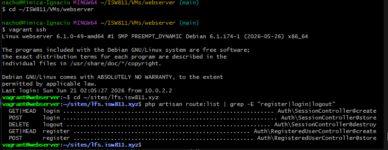
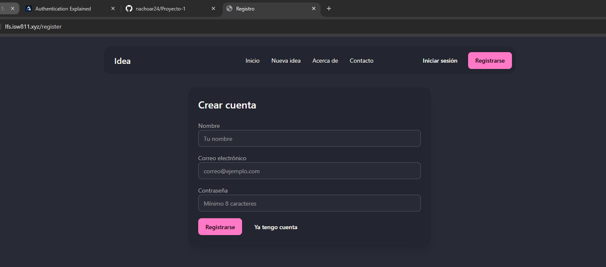
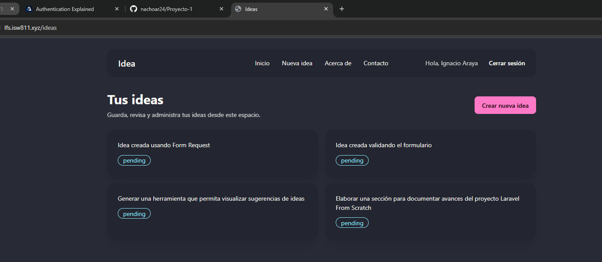
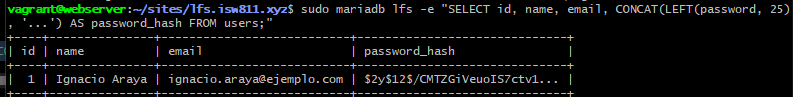
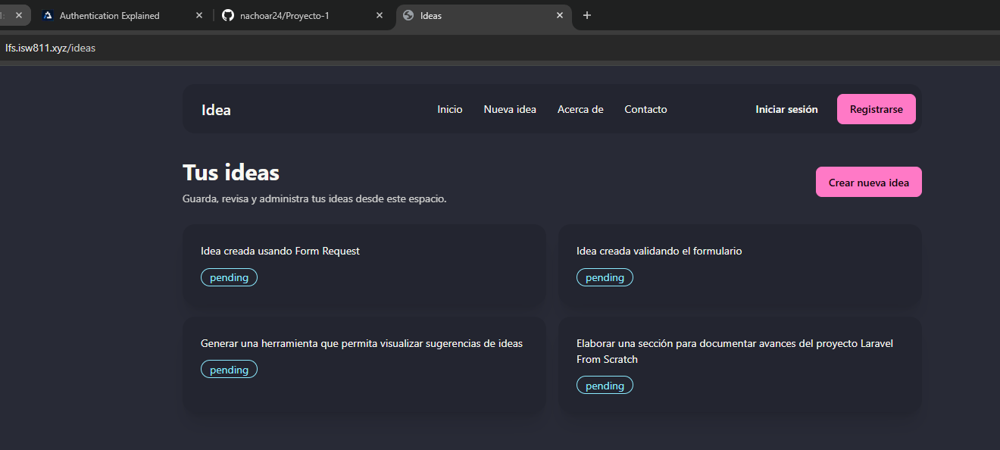
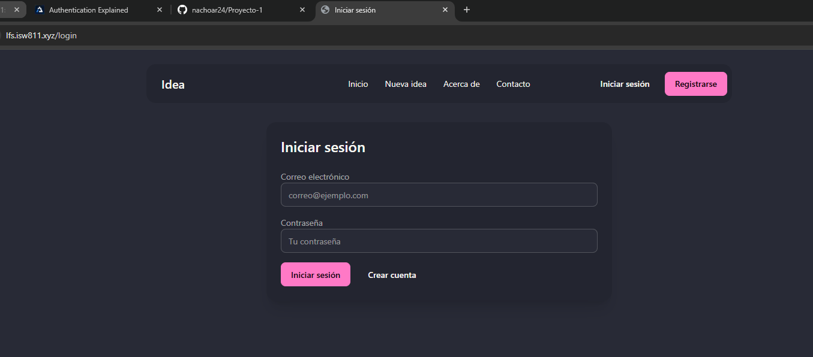
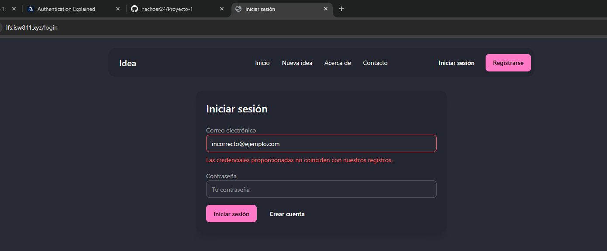
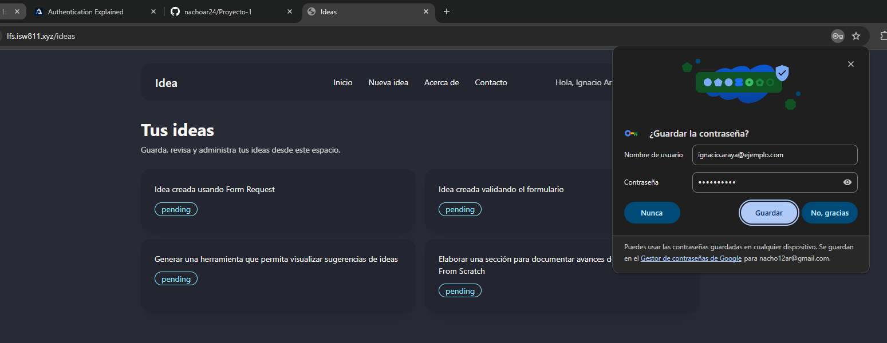

[<- Regresar](../entregable01.md)

# Episodio 14: Authentication Explained

## Módulo 2: Authentication / Authorization

## Resumen

En este episodio se inició el trabajo con autenticación en Laravel. El objetivo principal fue agregar registro de usuarios, inicio de sesión, cierre de sesión y navegación condicional dependiendo de si el usuario está autenticado o no.

Hasta este punto, el proyecto ya contaba con CRUD completo de ideas, rutas REST, controladores, validación, Form Request Classes, base de datos, Eloquent y una interfaz mejorada con DaisyUI. En este episodio se mantuvieron todas esas funcionalidades y se agregó una nueva capa: autenticación de usuarios.

Se crearon dos controladores dentro de la carpeta `Auth`: uno para registrar usuarios y otro para manejar sesiones. También se crearon las vistas `register` y `login`, y se actualizó la navegación para mostrar opciones diferentes usando las directivas Blade `@guest` y `@auth`.

---

## Comandos utilizados

Para crear los controladores se ingresó a la máquina virtual:

```bash
cd ~/ISW811/VMs/webserver
vagrant ssh
```

Dentro de Debian se ejecutó:

```bash
cd ~/sites/lfs.isw811.xyz
php artisan make:controller Auth/RegisteredUserController
php artisan make:controller Auth/SessionController
```

Para limpiar caché, revisar rutas y confirmar migraciones se utilizaron:

```bash
php artisan optimize:clear
php artisan view:clear
php artisan route:list
php artisan migrate
```

Para revisar y guardar el avance en Git se utilizaron comandos como:

```bash
git status
git add .
git commit -m "14 Authentication Explained"
```

---

## Archivos modificados o creados

Los archivos principales trabajados durante este episodio fueron:

* `routes/web.php`
* `app/Http/Controllers/Auth/RegisteredUserController.php`
* `app/Http/Controllers/Auth/SessionController.php`
* `resources/views/auth/register.blade.php`
* `resources/views/auth/login.blade.php`
* `resources/views/components/nav.blade.php`
* `docs/authentication-authorization/14-authentication-explained.md`

---

## Rutas de autenticación

Se agregaron rutas para registro, login y logout:

```php
Route::get('/register', [RegisteredUserController::class, 'create']);

Route::post('/register', [RegisteredUserController::class, 'store']);

Route::get('/login', [SessionController::class, 'create']);

Route::post('/login', [SessionController::class, 'store']);

Route::delete('/logout', [SessionController::class, 'destroy']);
```

Estas rutas permiten mostrar formularios, procesar datos y cerrar sesión.

---

## Controlador de registro

Se creó el controlador:

```text
app/Http/Controllers/Auth/RegisteredUserController.php
```

Este controlador tiene dos acciones principales:

```text
create - Muestra el formulario de registro.
store  - Valida los datos, crea el usuario, inicia sesión y redirige.
```

La acción `store` valida los campos `name`, `email` y `password`.

```php
$validated = $request->validate([
    'name' => ['required', 'string', 'max:255'],
    'email' => ['required', 'email', 'max:255', 'unique:users,email'],
    'password' => ['required', 'min:8'],
]);
```

Luego crea el usuario usando Eloquent:

```php
$user = User::create([
    'name' => $validated['name'],
    'email' => $validated['email'],
    'password' => Hash::make($validated['password']),
]);
```

El uso de `Hash::make()` permite guardar la contraseña de forma segura, evitando almacenarla en texto plano.

Después de crear el usuario, se inicia sesión automáticamente:

```php
Auth::login($user);

$request->session()->regenerate();

return redirect('/ideas');
```

---

## Controlador de sesión

Se creó el controlador:

```text
app/Http/Controllers/Auth/SessionController.php
```

Este controlador maneja el inicio y cierre de sesión.

La acción `create` muestra el formulario de login:

```php
public function create()
{
    return view('auth.login');
}
```

La acción `store` valida el correo y la contraseña, intenta autenticar al usuario y redirige si el login es exitoso.

```php
if (! Auth::attempt($validated)) {
    return back()
        ->withErrors([
            'email' => 'Las credenciales proporcionadas no coinciden con nuestros registros.',
        ])
        ->onlyInput('email');
}

$request->session()->regenerate();

return redirect('/ideas');
```

La acción `destroy` cierra la sesión del usuario:

```php
Auth::logout();

$request->session()->invalidate();

$request->session()->regenerateToken();

return redirect('/ideas');
```

---

## Vistas de registro y login

Se creó la vista de registro:

```text
resources/views/auth/register.blade.php
```

Esta vista contiene campos para:

```text
Nombre
Correo electrónico
Contraseña
```

También se creó la vista de login:

```text
resources/views/auth/login.blade.php
```

Esta vista contiene campos para:

```text
Correo electrónico
Contraseña
```

Ambas vistas utilizan DaisyUI para mantener consistencia visual con el resto del proyecto y el componente `<x-forms.error>` para mostrar errores de validación.

---

## Navegación condicional

El componente de navegación fue actualizado para mostrar enlaces diferentes dependiendo del estado de autenticación.

Si el usuario no ha iniciado sesión, se muestran las opciones:

```blade
@guest
    <a href="/login" class="btn btn-ghost">
        Iniciar sesión
    </a>

    <a href="/register" class="btn btn-primary">
        Registrarse
    </a>
@endguest
```

Si el usuario inició sesión, se muestra un saludo y el botón de cierre de sesión:

```blade
@auth
    <span>
        Hola, {{ auth()->user()->name }}
    </span>

    <form method="POST" action="/logout">
        @csrf
        @method('DELETE')

        <button type="submit">
            Cerrar sesión
        </button>
    </form>
@endauth
```

---

## Hash de contraseñas

Uno de los puntos más importantes del episodio fue comprender que las contraseñas no deben guardarse en texto plano.

Por eso se utilizó:

```php
Hash::make($validated['password'])
```

Esto genera un hash de la contraseña antes de guardarla en la tabla `users`.

---

## Evidencia

Como evidencia de este episodio se agregaron capturas donde se observan las rutas de autenticación, el formulario de registro, el registro exitoso, la tabla de usuarios con contraseña hasheada, el cierre de sesión, el formulario de login, un error de login y el login exitoso.

















---

## Problemas encontrados y solución

No se presentaron errores graves durante este episodio. El punto más importante fue recordar que los formularios `POST` y `DELETE` necesitan protección CSRF.

También fue importante utilizar `@method('DELETE')` en el formulario de logout, ya que los navegadores solamente soportan `GET` y `POST` de forma nativa.

Otro punto importante fue usar `Hash::make()` para guardar contraseñas de forma segura y evitar almacenarlas en texto plano.

---

## Comentarios personales

Este episodio permitió iniciar el módulo de autenticación y comprender cómo Laravel puede registrar usuarios, iniciar sesión, cerrar sesión y modificar la interfaz dependiendo del estado de autenticación.

La aplicación continúa evolucionando de forma acumulativa, ya que mantiene todas las funcionalidades anteriores del sistema de ideas y ahora agrega cuentas de usuario y manejo de sesión.
