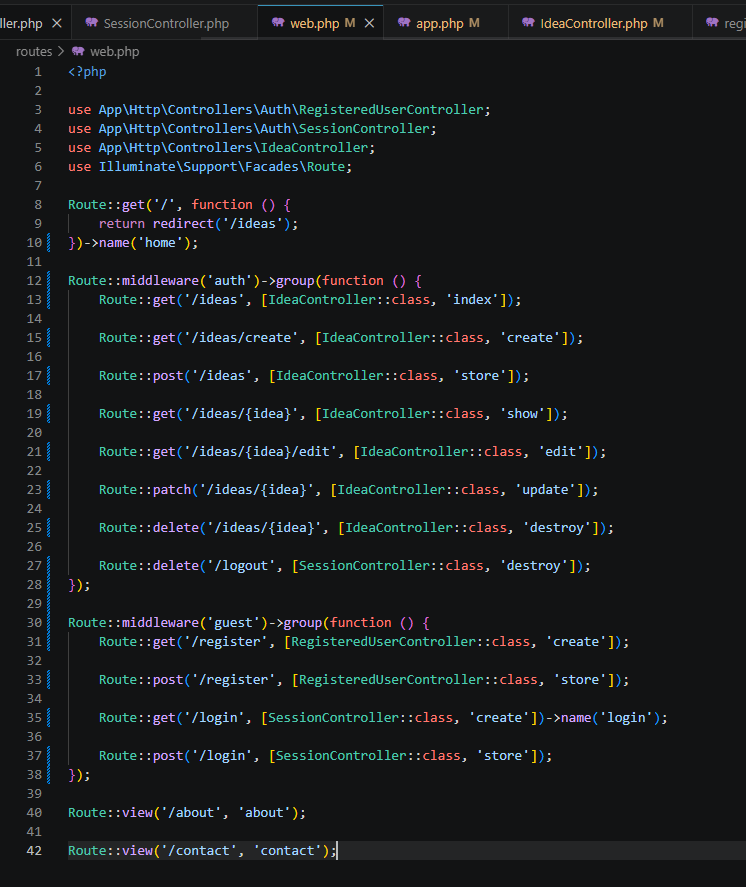
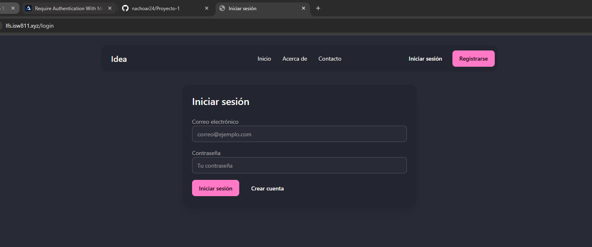
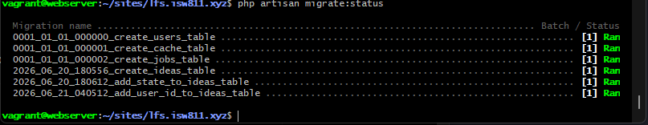
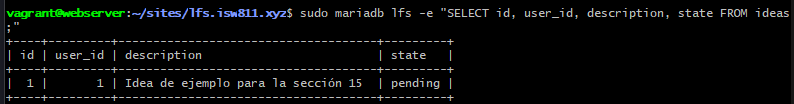
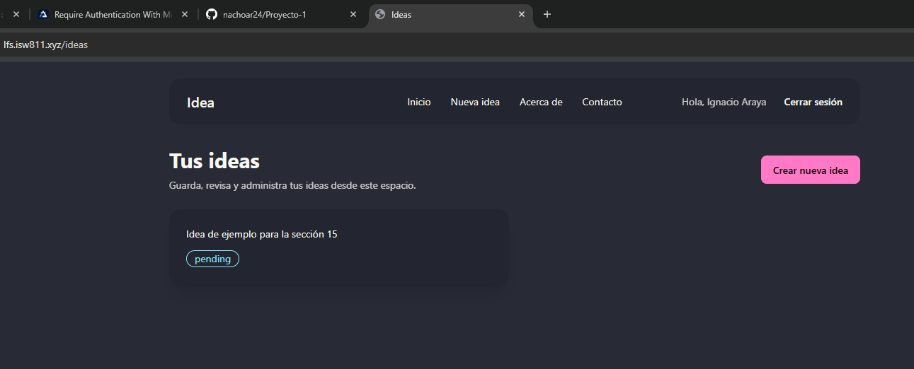

[<- Regresar](../entregable01.md)

# Episodio 15: Require Authentication With Middleware

## Módulo 2: Authentication / Authorization

## Resumen

En este episodio se trabajó el uso de middleware de autenticación en Laravel. El objetivo principal fue proteger las rutas de ideas para que solamente puedan ser utilizadas por usuarios autenticados.

Hasta este punto, el proyecto ya contaba con CRUD de ideas, controladores, rutas REST, validación, Form Request Classes, autenticación básica, login, registro, logout, base de datos, Eloquent y una interfaz mejorada con DaisyUI. En este episodio se mantuvieron esas funcionalidades y se agregó una relación inicial entre usuarios e ideas mediante la columna `user_id`.

También se configuraron rutas con middleware `auth` y `guest`. Las rutas de ideas ahora requieren que el usuario haya iniciado sesión, mientras que las rutas de login y registro están disponibles solamente para invitados.

---

## Comandos utilizados

Para crear la migración se ingresó a la máquina virtual:

```bash
cd ~/ISW811/VMs/webserver
vagrant ssh
```

Dentro de Debian se ejecutó:

```bash
cd ~/sites/lfs.isw811.xyz
php artisan make:migration add_user_id_to_ideas_table --table=ideas
```

Para limpiar caché, recrear la base de datos y revisar rutas se utilizaron:

```bash
php artisan optimize:clear
php artisan migrate:fresh
php artisan view:clear
php artisan route:list
```

Para revisar el estado de las migraciones se utilizó:

```bash
php artisan migrate:status
```

Para consultar la tabla de ideas se utilizó:

```bash
sudo mariadb lfs -e "SELECT id, user_id, description, state FROM ideas;"
```

Para revisar y guardar el avance en Git se utilizaron comandos como:

```bash
git status
git add .
git commit -m "15 Require Authentication With Middleware"
```

---

## Archivos modificados o creados

Los archivos principales trabajados durante este episodio fueron:

* `routes/web.php`
* `bootstrap/app.php`
* `app/Http/Controllers/IdeaController.php`
* `resources/views/components/nav.blade.php`
* `database/migrations/xxxx_xx_xx_xxxxxx_add_user_id_to_ideas_table.php`
* `docs/authentication-authorization/15-require-authentication-with-middleware.md`

---

## Agregar `user_id` a las ideas

Se creó una migración para agregar una relación entre la tabla `ideas` y la tabla `users`.

```php
Schema::table('ideas', function (Blueprint $table) {
    $table->foreignIdFor(User::class)
        ->after('id')
        ->constrained()
        ->cascadeOnDelete();
});
```

Esto crea una columna `user_id` en la tabla `ideas`.

La opción `constrained()` crea la llave foránea hacia la tabla `users`, y `cascadeOnDelete()` permite que las ideas de un usuario también se eliminen si ese usuario es eliminado.

---

## Ejecutar migraciones desde cero

Como se agregó una relación obligatoria entre ideas y usuarios, se ejecutó:

```bash
php artisan migrate:fresh
```

Este comando eliminó las tablas existentes y las volvió a crear desde cero con la nueva estructura.

Esto es aceptable en este punto del proyecto porque los datos existentes son de prueba y la aplicación sigue en desarrollo.

---

## Middleware `auth`

Las rutas de ideas fueron protegidas con middleware `auth`.

```php
Route::middleware('auth')->group(function () {
    Route::get('/ideas', [IdeaController::class, 'index']);

    Route::get('/ideas/create', [IdeaController::class, 'create']);

    Route::post('/ideas', [IdeaController::class, 'store']);

    Route::get('/ideas/{idea}', [IdeaController::class, 'show']);

    Route::get('/ideas/{idea}/edit', [IdeaController::class, 'edit']);

    Route::patch('/ideas/{idea}', [IdeaController::class, 'update']);

    Route::delete('/ideas/{idea}', [IdeaController::class, 'destroy']);

    Route::delete('/logout', [SessionController::class, 'destroy']);
});
```

Con esto, si un usuario invitado intenta ingresar a `/ideas/create`, Laravel lo redirige al formulario de login.

---

## Middleware `guest`

Las rutas de login y registro se agruparon con middleware `guest`.

```php
Route::middleware('guest')->group(function () {
    Route::get('/register', [RegisteredUserController::class, 'create']);

    Route::post('/register', [RegisteredUserController::class, 'store']);

    Route::get('/login', [SessionController::class, 'create'])->name('login');

    Route::post('/login', [SessionController::class, 'store']);
});
```

Esto evita que un usuario autenticado pueda ingresar nuevamente al login o al registro.

---

## Redirecciones de middleware

También se configuraron redirecciones en el archivo:

```text
bootstrap/app.php
```

La configuración agregada fue:

```php
->withMiddleware(function (Middleware $middleware): void {
    $middleware->redirectGuestsTo('/login');
    $middleware->redirectUsersTo('/ideas');
})
```

Esto permite controlar a dónde se envían los invitados y los usuarios autenticados según el middleware aplicado.

---

## Asignar ideas al usuario autenticado

En el controlador `IdeaController`, al crear una idea se asigna el `user_id` del usuario autenticado.

```php
Idea::create([
    'user_id' => auth()->id(),
    'description' => $validated['description'],
    'state' => 'pending',
]);
```

Como la ruta `POST /ideas` está protegida por middleware `auth`, siempre existe un usuario autenticado al momento de crear la idea.

---

## Filtrar ideas por usuario

En la acción `index`, las ideas se filtran para mostrar únicamente las ideas del usuario autenticado.

```php
$ideas = Idea::query()
    ->where('user_id', auth()->id())
    ->latest()
    ->get();
```

Esto evita que un usuario vea ideas pertenecientes a otros usuarios en el listado.

---

## Protección adicional de ideas individuales

También se agregó una validación simple para evitar que un usuario acceda directamente a ideas que no le pertenecen.

```php
private function authorizeCurrentUserIdea(Idea $idea): void
{
    abort_unless($idea->user_id === auth()->id(), 403);
}
```

Este método se utiliza en las acciones `show`, `edit`, `update` y `destroy`.

---

## Navegación según autenticación

La navegación fue ajustada para mostrar el enlace de nueva idea solamente a usuarios autenticados.

```blade
@auth
    <li>
        <a href="/ideas/create">Nueva idea</a>
    </li>
@endauth
```

También se mantiene la lógica de `@guest` y `@auth` para mostrar login, registro, saludo y logout según corresponda.

---

## Evidencia

Como evidencia de este episodio se agregaron capturas donde se observa la configuración de rutas con middleware, la redirección al login, el estado de migraciones, la tabla de ideas con `user_id`, el listado autenticado y la redirección de rutas guest.












---

## Problemas encontrados y solución

Al agregar la columna `user_id`, una idea ya no puede guardarse sin estar asociada a un usuario. Por eso fue necesario actualizar la acción `store` para incluir el ID del usuario autenticado.

También fue necesario proteger las rutas de ideas con middleware `auth`, ya que no tiene sentido crear, editar o eliminar ideas sin haber iniciado sesión.

Otro punto importante fue nombrar la ruta de login con `->name('login')`, porque Laravel utiliza ese nombre para redirigir a los invitados cuando intentan entrar a una ruta protegida.

---

## Comentarios personales

Este episodio permitió comprender cómo Laravel utiliza middleware para proteger rutas según el estado de autenticación del usuario.

La aplicación continúa evolucionando de forma acumulativa: ahora no solo permite administrar ideas, sino que cada idea queda asociada a un usuario autenticado, y el listado muestra únicamente las ideas propias del usuario.
