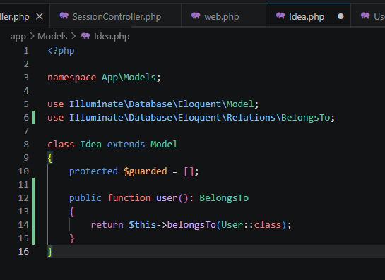
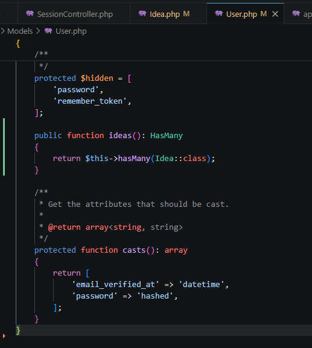
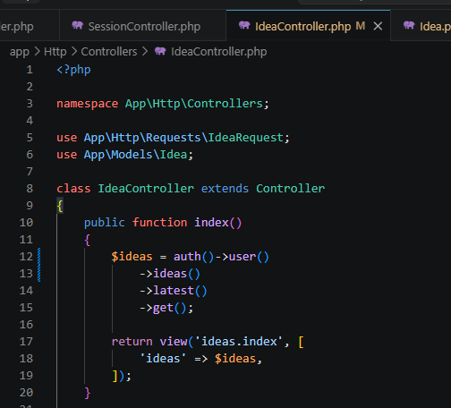
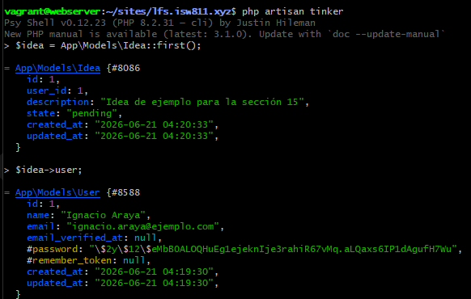
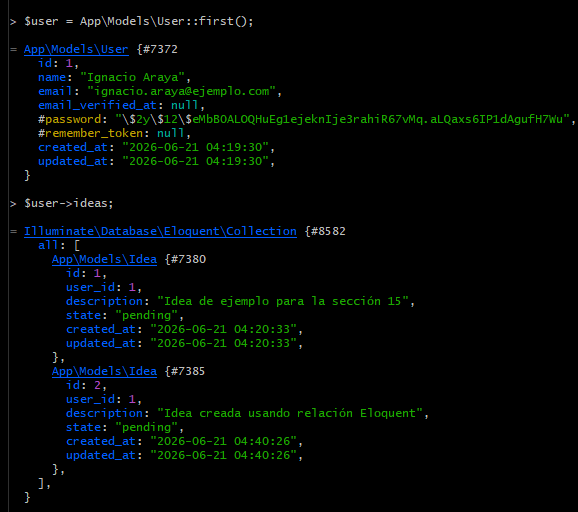
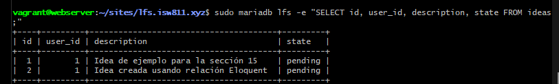

[<- Regresar](../entregable01.md)

# Episodio 16: Eloquent Relationships

## Módulo 2: Authentication / Authorization

## Resumen

En este episodio se trabajó con relaciones de Eloquent en Laravel. El objetivo principal fue representar la relación entre usuarios e ideas directamente en los modelos.

Hasta este punto, el proyecto ya contaba con CRUD de ideas, autenticación, registro, login, logout, middleware, validación, Form Request Classes, base de datos, migraciones, Eloquent y una interfaz mejorada con DaisyUI. En el episodio anterior se agregó la columna `user_id` para asociar cada idea con un usuario autenticado. En este episodio se aprovechó esa relación mediante métodos de Eloquent.

La relación implementada fue:

* Una idea pertenece a un usuario.
* Un usuario puede tener muchas ideas.

---

## Comandos utilizados

Para limpiar caché y revisar rutas se utilizaron los siguientes comandos dentro de la máquina virtual:

```bash
cd ~/ISW811/VMs/webserver
vagrant ssh
```

Dentro de Debian:

```bash
cd ~/sites/lfs.isw811.xyz
php artisan optimize:clear
php artisan view:clear
php artisan route:list
```

Para probar las relaciones con Tinker se utilizó:

```bash
php artisan tinker
```

Dentro de Tinker se probaron comandos como:

```php
$idea = App\Models\Idea::first();
$idea->user;
```

y:

```php
$user = App\Models\User::first();
$user->ideas;
```

Para verificar los registros en base de datos se utilizó:

```bash
sudo mariadb lfs -e "SELECT id, user_id, description, state FROM ideas;"
```

Para revisar y guardar el avance en Git se utilizaron comandos como:

```bash
git status
git add .
git commit -m "16 Eloquent Relationships"
```

---

## Archivos modificados

Los archivos principales trabajados durante este episodio fueron:

* `app/Models/Idea.php`
* `app/Models/User.php`
* `app/Http/Controllers/IdeaController.php`
* `docs/authentication-authorization/16-eloquent-relationships.md`

---

## Relación: una idea pertenece a un usuario

En el modelo `Idea` se agregó el método `user`.

```php
public function user(): BelongsTo
{
    return $this->belongsTo(User::class);
}
```

Este método indica que cada idea pertenece a un usuario.

Gracias a esta relación, desde una idea se puede obtener el usuario asociado:

```php
$idea = App\Models\Idea::first();

$idea->user;
```

Aunque el método se define como `user()`, al acceder al registro relacionado se usa como propiedad:

```php
$idea->user
```

Laravel se encarga de ejecutar la consulta necesaria para obtener el usuario.

---

## Relación inversa: un usuario tiene muchas ideas

En el modelo `User` se agregó el método `ideas`.

```php
public function ideas(): HasMany
{
    return $this->hasMany(Idea::class);
}
```

Este método indica que un usuario puede tener muchas ideas.

Gracias a esta relación, desde un usuario se pueden obtener sus ideas:

```php
$user = App\Models\User::first();

$user->ideas;
```

Esto devuelve una colección de ideas pertenecientes a ese usuario.

---

## Uso de relaciones como propiedad y como método

En Laravel, una relación puede usarse como propiedad o como método.

Cuando se usa como propiedad, Laravel obtiene los registros relacionados:

```php
$user->ideas
```

Cuando se usa como método, Laravel permite construir consultas sobre esa relación:

```php
$user->ideas()
    ->latest()
    ->get();
```

En este proyecto se usó la relación como método para ordenar y obtener las ideas del usuario autenticado.

---

## Refactor del listado de ideas

Antes, el controlador filtraba las ideas manualmente usando `user_id`.

Después del cambio, se utilizó la relación `ideas()` del usuario autenticado.

```php
$ideas = auth()->user()
    ->ideas()
    ->latest()
    ->get();
```

Esto hace que el código sea más expresivo, porque se lee como: obtener las ideas del usuario autenticado.

---

## Crear ideas mediante la relación

También se actualizó la acción `store` para crear ideas desde la relación del usuario autenticado.

```php
auth()->user()->ideas()->create([
    'description' => $validated['description'],
    'state' => 'pending',
]);
```

Con esto ya no es necesario asignar manualmente el campo `user_id`, porque Laravel lo agrega automáticamente al crear la idea desde la relación.

---

## Mantener protección de ideas individuales

En el episodio anterior se agregó una validación para evitar que un usuario acceda a ideas que no le pertenecen. Esa protección se mantuvo.

```php
private function authorizeCurrentUserIdea(Idea $idea): void
{
    abort_unless($idea->user_id === auth()->id(), 403);
}
```

Esto se utiliza en las acciones `show`, `edit`, `update` y `destroy`.

De esta forma, el proyecto mantiene la funcionalidad acumulada y no pierde la protección agregada en el episodio anterior.

---

## Evidencia

Como evidencia de este episodio se agregaron capturas donde se observan las relaciones en los modelos, el controlador usando las relaciones, pruebas con Tinker y una idea creada desde la relación del usuario autenticado.













---

## Problemas encontrados y solución

No fue necesario cambiar la estructura de la base de datos en este episodio, ya que la columna `user_id` había sido agregada anteriormente.

El principal cambio fue mover la lógica de asociación hacia relaciones de Eloquent. Esto permitió reemplazar consultas manuales por métodos más expresivos como `ideas()` y `user()`.

También fue importante mantener la protección existente para evitar que un usuario acceda a ideas que no le pertenecen.

---

## Comentarios personales

Este episodio permitió comprender cómo Eloquent representa relaciones entre tablas mediante métodos en los modelos.

La aplicación continúa evolucionando de forma acumulativa, ya que mantiene autenticación, middleware, validación, CRUD y asociación de ideas con usuarios, pero ahora el código es más claro al utilizar relaciones como `belongsTo` y `hasMany`.
