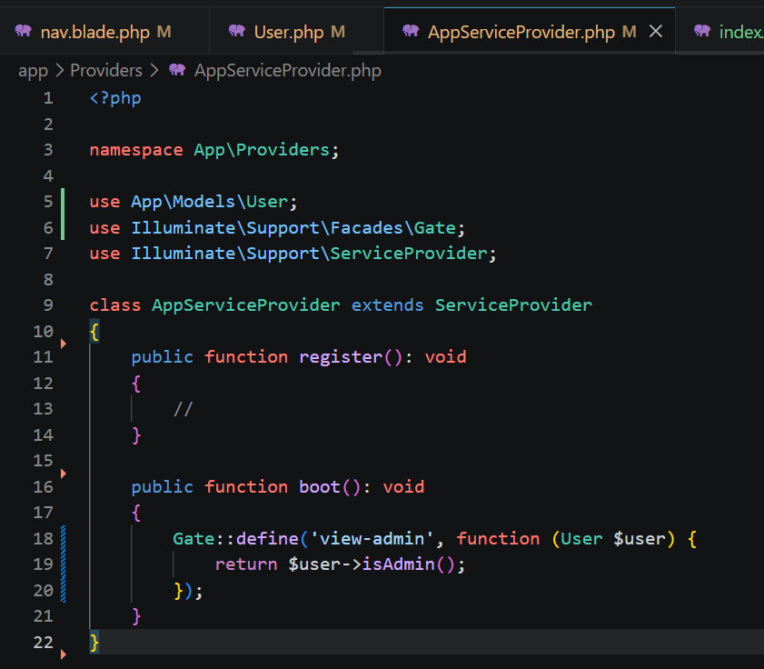
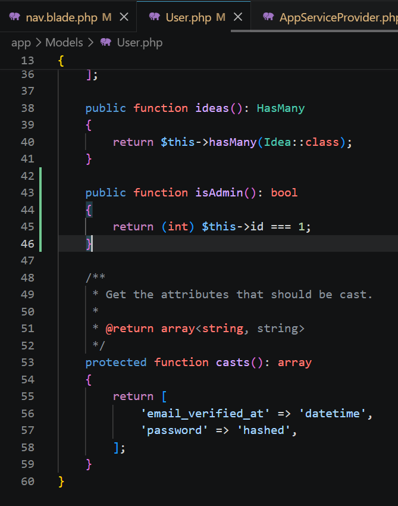
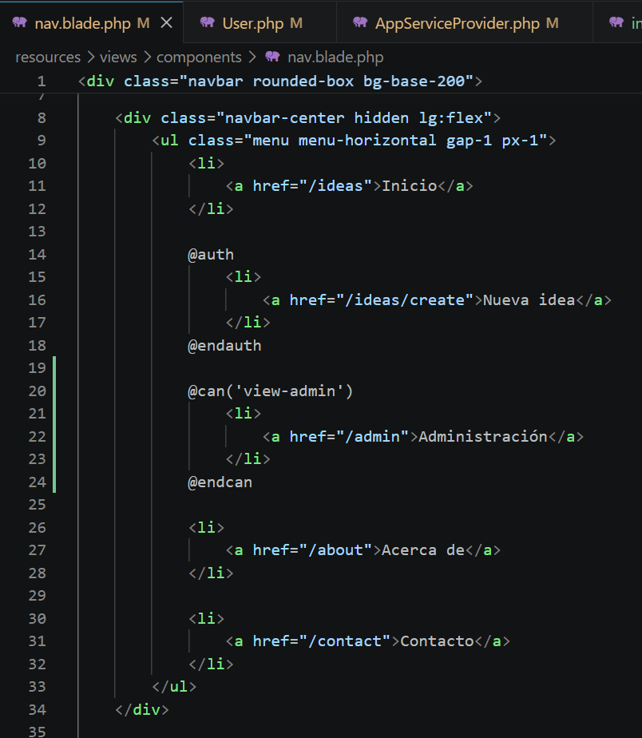
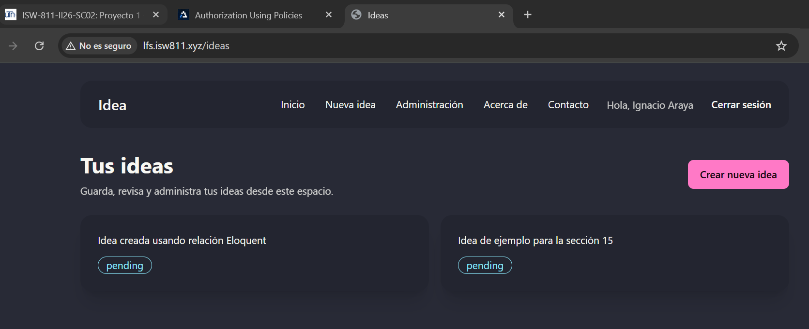
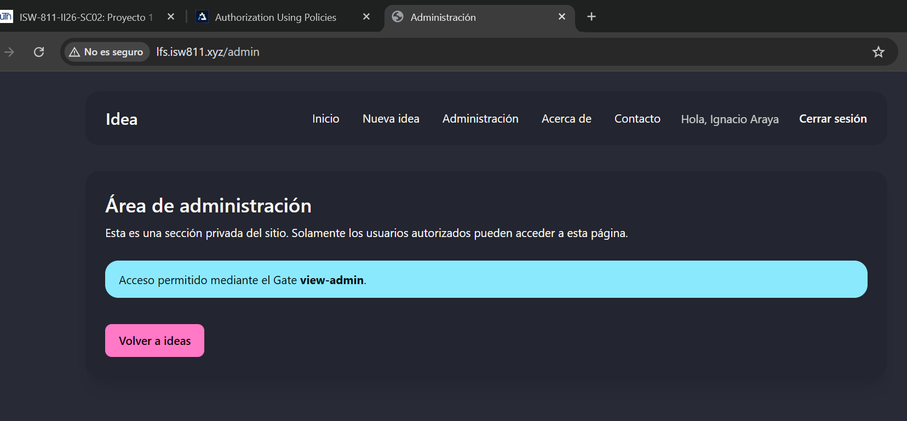
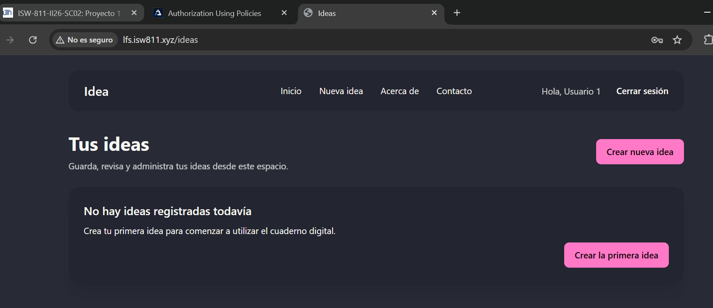
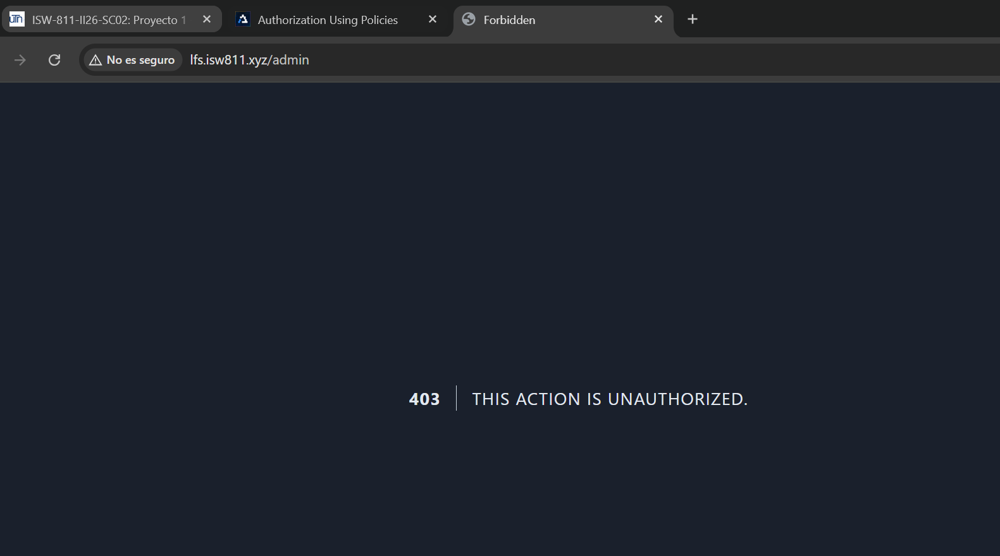

[<- Regresar](../entregable02.md)

# Episodio 17: Authorization Using Gates

## Módulo 2: Authentication / Authorization

## Resumen

En este episodio se implementó autorización utilizando Gates en Laravel.

Hasta este punto, el proyecto ya contaba con autenticación, registro, inicio de sesión, cierre de sesión, middleware `auth`, middleware `guest`, CRUD de ideas y relaciones entre usuarios e ideas. En este episodio se agregó una regla de autorización para controlar el acceso a una sección privada de administración.

Se creó un Gate llamado `view-admin`, se agregó una ruta `/admin`, se protegió esa ruta mediante autorización y se utilizó la directiva Blade `@can` para mostrar u ocultar el enlace de administración en la barra de navegación.

---

## Comandos utilizados

Para limpiar caché y revisar las rutas se utilizaron los siguientes comandos dentro de la máquina virtual:

```bash
cd ~/ISW811/VMs/webserver
vagrant ssh
```

Dentro de Debian:

```bash
cd ~/sites/lfs.isw811.xyz
php artisan optimize:clear
php artisan view:clear
php artisan route:list | grep admin
```

Para revisar usuarios en la base de datos se utilizó:

```bash
sudo mariadb lfs -e "SELECT id, name, email FROM users;"
```

Para guardar el avance en Git se utilizaron comandos como:

```bash
git status
git add .
git commit -m "17 Authorization Using Gates"
```

---

## Archivos modificados o creados

Los archivos principales trabajados durante este episodio fueron:

* `app/Providers/AppServiceProvider.php`
* `app/Models/User.php`
* `routes/web.php`
* `resources/views/components/nav.blade.php`
* `resources/views/admin/index.blade.php`
* `docs/authentication-authorization/17-authorization-using-gates.md`

---

## Creación del método `isAdmin`

En el modelo `User` se agregó un método auxiliar llamado `isAdmin`.

```php
public function isAdmin(): bool
{
    return (int) $this->id === 1;
}
```

Este método devuelve `true` si el usuario autenticado tiene el ID número 1.

Para este ejercicio se decidió mantener una lógica simple, donde el primer usuario registrado funciona como administrador del sistema.

---

## Definición del Gate

En el archivo `AppServiceProvider` se agregó el Gate `view-admin`.

```php
Gate::define('view-admin', function (User $user) {
    return $user->isAdmin();
});
```

Este Gate determina si el usuario puede acceder al área de administración.

Si el método `isAdmin()` devuelve `true`, el usuario tiene permiso. Si devuelve `false`, el usuario no está autorizado.

---

## Ruta protegida de administración

Se agregó una ruta `/admin` dentro del grupo de rutas protegidas por middleware `auth`.

```php
Route::get('/admin', function () {
    return view('admin.index');
})->can('view-admin');
```

La llamada a `can('view-admin')` hace que Laravel ejecute el Gate antes de permitir el acceso a la ruta.

Si el usuario no está autorizado, Laravel devuelve un error `403 Forbidden`.

---

## Vista de administración

Se creó la vista:

```text
resources/views/admin/index.blade.php
```

Esta vista representa una sección privada del sitio.

```blade
<x-layout title="Administración">
    <section class="card bg-base-200 shadow-xl">
        <div class="card-body">
            <h1 class="card-title text-2xl">Área de administración</h1>

            <p>
                Esta es una sección privada del sitio. Solamente los usuarios autorizados
                pueden acceder a esta página.
            </p>
        </div>
    </section>
</x-layout>
```

---

## Uso de `@can` en Blade

En el componente de navegación se utilizó la directiva `@can`.

```blade
@can('view-admin')
    <li>
        <a href="/admin">Administración</a>
    </li>
@endcan
```

Esto permite mostrar el enlace de administración solamente a usuarios autorizados.

Es importante mencionar que ocultar el enlace no es suficiente para proteger la aplicación. Por eso también se protegió la ruta `/admin` con `can('view-admin')`.

---

## Diferencia entre autenticación y autorización

La autenticación responde a la pregunta:

```text
¿Quién es el usuario?
```

La autorización responde a la pregunta:

```text
¿Qué puede hacer este usuario?
```

En este episodio, el usuario primero debe estar autenticado para ingresar al sistema. Luego, Laravel verifica si además está autorizado para acceder al área de administración.

---

## Evidencia

Como evidencia de este episodio se agregaron capturas donde se observa la definición del Gate, el método `isAdmin`, la directiva `@can`, el enlace de administración visible para el administrador, la página de administración y el bloqueo de acceso para un usuario no autorizado.















---

## Problemas encontrados y solución

Un punto importante fue comprender que ocultar un enlace en la interfaz no protege realmente la ruta. Aunque el enlace de administración no se muestre, un usuario podría intentar ingresar manualmente a `/admin`.

Para resolver esto, se aplicó autorización directamente en la ruta mediante:

```php
->can('view-admin')
```

De esta forma, Laravel valida el Gate antes de permitir el acceso.

---

## Comentarios personales

Este episodio permitió entender la diferencia entre autenticación y autorización. También mostró cómo Gates permite definir reglas simples de acceso dentro de Laravel.

La aplicación continúa evolucionando de forma acumulativa, ya que mantiene las funcionalidades anteriores y ahora agrega una regla de autorización para proteger secciones sensibles del sistema.
