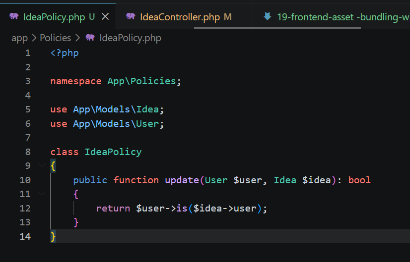
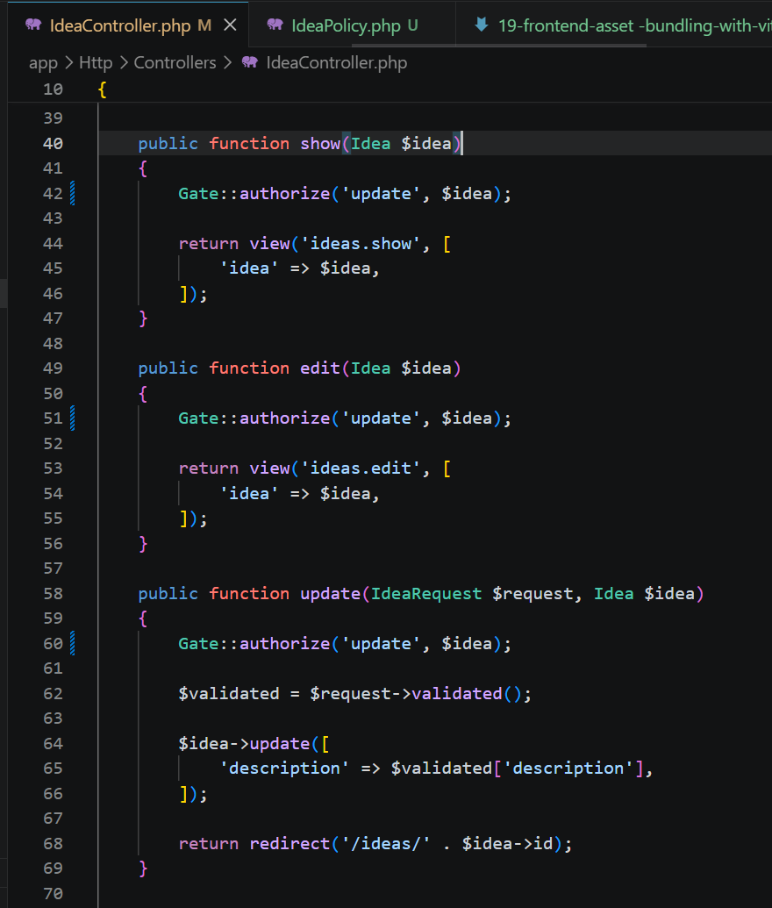
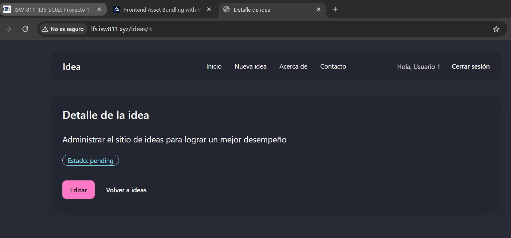
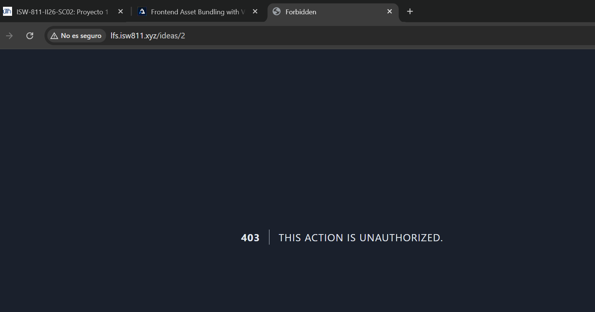

[<- Regresar](../entregable02.md)

# Episodio 18: Authorization Using Policies

## Módulo 2: Authentication / Authorization

## Resumen

En este episodio se implementó autorización utilizando Policies en Laravel.

En el episodio anterior se trabajó con Gates para proteger una sección general de administración. En este episodio se utilizó una Policy asociada directamente al modelo `Idea`, con el objetivo de controlar si un usuario puede acceder, editar, actualizar o eliminar una idea específica.

La aplicación ya contaba con autenticación, middleware, relaciones entre usuarios e ideas, y una validación manual para evitar que un usuario accediera a ideas ajenas. En este episodio esa autorización se reorganizó utilizando una clase `IdeaPolicy`.

---

## Comandos utilizados

Para crear la Policy se utilizó el siguiente comando dentro de la máquina virtual:

```bash
cd ~/ISW811/VMs/webserver
vagrant ssh
```

Dentro de Debian:

```bash
cd ~/sites/lfs.isw811.xyz
php artisan make:policy IdeaPolicy --model=Idea
```

Para limpiar caché y verificar rutas se utilizaron:

```bash
php artisan optimize:clear
php artisan view:clear
php artisan route:list
```

Para revisar ideas y usuarios en la base de datos se utilizó:

```bash
sudo mariadb lfs -e "SELECT ideas.id, ideas.user_id, users.name, ideas.description FROM ideas JOIN users ON users.id = ideas.user_id;"
```

Para guardar el avance en Git se utilizaron comandos como:

```bash
git status
git add .
git commit -m "18 Authorization Using Policies"
```

---

## Archivos modificados o creados

Los archivos principales trabajados durante este episodio fueron:

* `app/Policies/IdeaPolicy.php`
* `app/Http/Controllers/IdeaController.php`
* `docs/authentication-authorization/18-authorization-using-policies.md`

---

## Creación de la Policy

Se creó una Policy asociada al modelo `Idea`.

```bash
php artisan make:policy IdeaPolicy --model=Idea
```

Esto generó el archivo:

```text
app/Policies/IdeaPolicy.php
```

Las Policies permiten organizar reglas de autorización relacionadas directamente con un modelo.

---

## Regla de autorización

En `IdeaPolicy` se agregó el método `update`.

```php
public function update(User $user, Idea $idea): bool
{
    return $user->is($idea->user);
}
```

Esta regla valida si el usuario autenticado es el mismo usuario dueño de la idea.

Si el usuario autenticado creó la idea, la autorización pasa. Si la idea pertenece a otro usuario, Laravel deniega el acceso.

---

## Uso de la Policy en el controlador

En `IdeaController` se utilizó la Policy mediante el facade `Gate`.

```php
Gate::authorize('update', $idea);
```

Esta autorización se aplicó en las acciones:

* `show`
* `edit`
* `update`
* `destroy`

Por ejemplo:

```php
public function show(Idea $idea)
{
    Gate::authorize('update', $idea);

    return view('ideas.show', [
        'idea' => $idea,
    ]);
}
```

Esto evita que un usuario pueda acceder manualmente a una idea que no le pertenece.

---

## Diferencia entre Gates y Policies

Los Gates permiten definir reglas de autorización generales. En el episodio anterior se utilizó un Gate para controlar el acceso al área de administración.

Las Policies se utilizan cuando las reglas están relacionadas con un modelo específico. En este caso, la Policy está asociada al modelo `Idea`.

La diferencia principal es que el Gate `view-admin` controla una sección general del sitio, mientras que `IdeaPolicy` controla acciones sobre registros específicos de ideas.

---

## Protección de acciones sensibles

Aunque el listado de ideas ya muestra únicamente las ideas del usuario autenticado, un usuario podría intentar modificar manualmente la URL para acceder a una idea ajena.

Por ejemplo:

```text
/ideas/1
```

Por esa razón, se protegieron también las acciones individuales `show`, `edit`, `update` y `destroy`.

Esto refuerza la seguridad del sistema, ya que no depende solamente de ocultar enlaces o filtrar listados.

---

## Evidencia

Como evidencia de este episodio se agregaron capturas donde se observa la Policy creada, el controlador usando autorización, el acceso permitido a una idea propia y el acceso denegado a una idea ajena.









---

## Problemas encontrados y solución

El punto principal fue comprender que filtrar el listado de ideas por usuario no es suficiente. Aunque un usuario solo vea sus ideas en el listado, todavía podría intentar ingresar manualmente a una URL de una idea ajena.

Para resolverlo, se creó `IdeaPolicy` y se aplicó autorización en las acciones sensibles del controlador usando:

```php
Gate::authorize('update', $idea);
```

---

## Comentarios personales

Este episodio permitió entender cuándo utilizar Policies en lugar de Gates. Las Policies ayudan a organizar mejor las reglas de autorización cuando están relacionadas con un modelo específico.

La aplicación continúa evolucionando de forma acumulativa, ya que conserva los Gates del episodio anterior y ahora agrega Policies para proteger acciones sobre ideas individuales.
