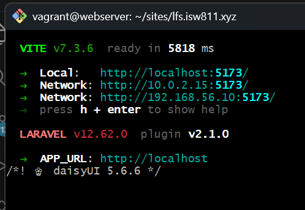
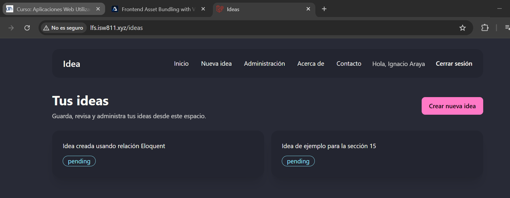
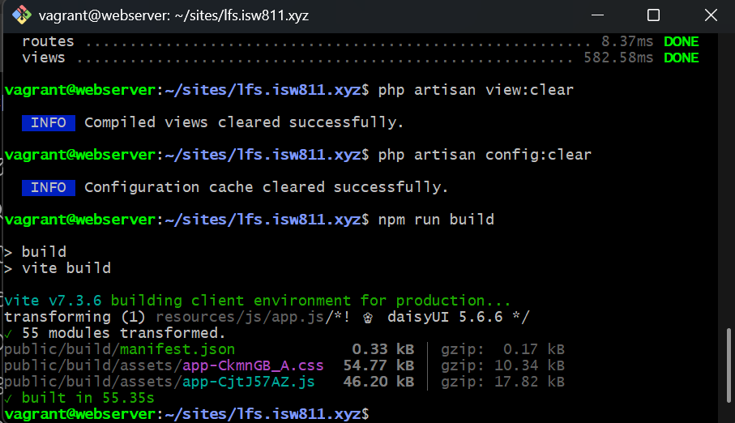
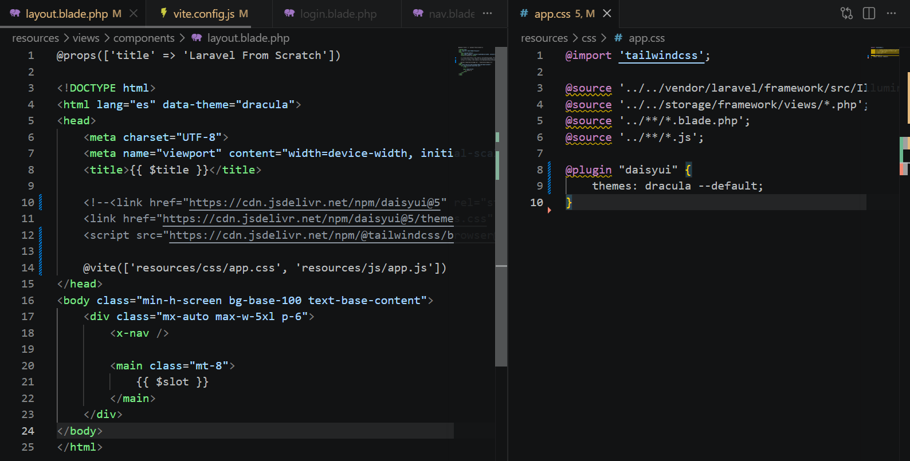

[<- Regresar](../entregable02.md)

# Episodio 19: Frontend Asset Bundling with Vite

## Módulo 3: Digging Deeper

## Resumen

En este episodio se trabajó la compilación de assets frontend utilizando Vite en Laravel.

Hasta este punto, el proyecto utilizaba TailwindCSS y DaisyUI mediante CDN directamente en el layout principal. En este episodio se reemplazó ese enfoque por una configuración local con Vite, permitiendo compilar y empaquetar los archivos CSS y JavaScript del proyecto.

Se eliminó la dependencia visual de los enlaces CDN y se utilizó la directiva `@vite` para cargar los archivos `resources/css/app.css` y `resources/js/app.js`.

---

## Comandos utilizados

Para instalar las dependencias frontend se utilizó:

```bash
npm install
```

Para instalar DaisyUI localmente se utilizó:

```bash
npm install -D daisyui@latest
```

Para ejecutar el servidor de desarrollo de Vite se utilizó:

```bash
npm run dev
```

Para generar los assets compilados para producción se utilizó:

```bash
npm run build
```

Para revisar el estado de Git se utilizó:

```bash
git status
```

---

## Archivos modificados o creados

Los archivos principales trabajados durante este episodio fueron:

* `package.json`
* `package-lock.json`
* `resources/css/app.css`
* `resources/js/app.js`
* `resources/views/components/layout.blade.php`
* `docs/digging-deeper/19-frontend-asset-bundling-with-vite.md`

---

## Eliminación de CDN

Antes de este episodio, el proyecto cargaba DaisyUI y TailwindCSS desde CDN dentro del layout principal.

Ese enfoque fue reemplazado por la directiva `@vite`.

```blade
@vite(['resources/css/app.css', 'resources/js/app.js'])
```

Esto permite que Laravel cargue los assets compilados por Vite.

---

## Configuración de CSS

En el archivo:

```text
resources/css/app.css
```

se configuró TailwindCSS y DaisyUI.

```css
@import 'tailwindcss';

@source '../../vendor/laravel/framework/src/Illuminate/Pagination/resources/views/*.blade.php';
@source '../../storage/framework/views/*.php';
@source '../**/*.blade.php';
@source '../**/*.js';

@plugin "daisyui" {
    themes: dracula --default;
}
```

Con esta configuración, Tailwind puede detectar las clases utilizadas en las vistas Blade y archivos JavaScript, mientras que DaisyUI queda disponible como plugin local.

---

## Configuración de JavaScript

En el archivo:

```text
resources/js/app.js
```

se mantuvo la importación de `bootstrap` y se agregó un mensaje simple de prueba.

```js
import './bootstrap';

console.log('Vite cargado correctamente');
```

Esto confirma que el archivo JavaScript también es procesado mediante Vite.

---

## Uso de Vite en desarrollo

Durante el desarrollo se ejecutó:

```bash
npm run dev
```

Este comando inicia el servidor de desarrollo de Vite. Mientras está activo, los cambios realizados en archivos CSS, JavaScript o Blade se reflejan rápidamente durante el desarrollo.

---

## Build de producción

Para generar los assets optimizados se ejecutó:

```bash
npm run build
```

Este comando crea los archivos compilados dentro de:

```text
public/build/
```

Estos archivos representan la versión optimizada de los assets frontend para producción.

---

## Evidencia

Como evidencia de este episodio se agregaron capturas donde se observa Vite ejecutándose, la página funcionando con estilos compilados localmente, el build de producción y el código utilizando `@vite` junto con DaisyUI en `app.css`.









---

## Problemas encontrados y solución

Al eliminar los enlaces CDN del layout, la interfaz queda sin estilos si Vite no está corriendo o si los assets no han sido compilados.

La solución fue instalar DaisyUI localmente, configurar `resources/css/app.css`, cargar los archivos mediante `@vite` y ejecutar `npm run dev` durante el desarrollo.

También se ejecutó `npm run build` para confirmar que los assets podían compilarse correctamente para producción.

---

## Comentarios personales

Este episodio permitió comprender la diferencia entre cargar estilos desde CDN y compilar assets localmente con Vite.

La aplicación continúa evolucionando de forma acumulativa, ya que mantiene autenticación, autorización, CRUD de ideas, componentes Blade y estilos con DaisyUI, pero ahora los assets frontend se manejan de forma más profesional mediante Vite.
