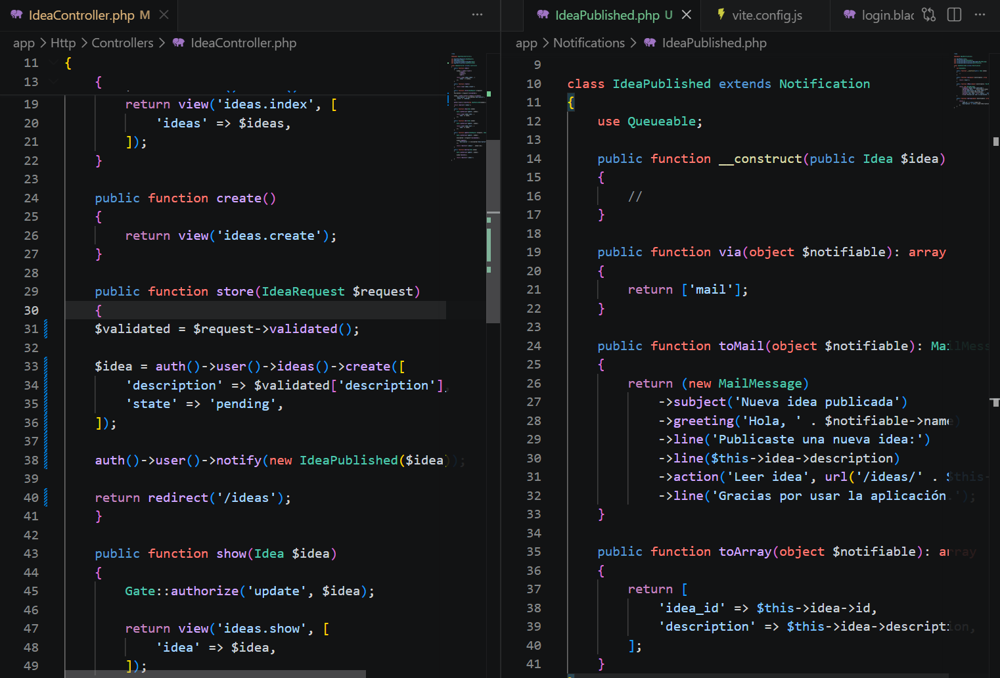
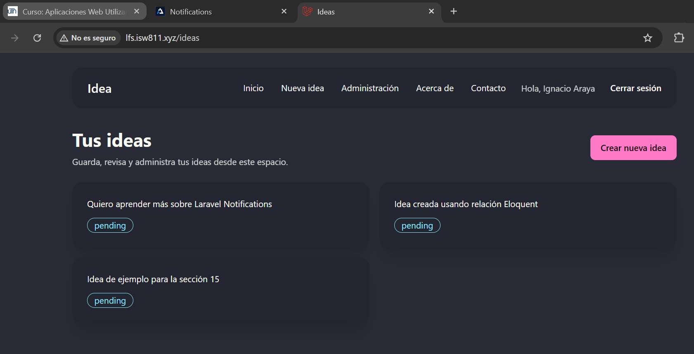
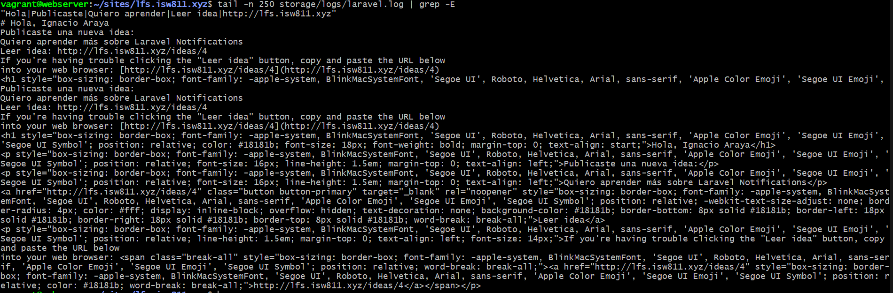

[<- Regresar](../entregable02.md)

# Episodio 20: Notifications

## Módulo 3: Digging Deeper

## Resumen

En este episodio se implementó el uso de notificaciones en Laravel.

La aplicación fue actualizada para enviar una notificación por correo cada vez que un usuario crea una nueva idea. Para esto se utilizó el sistema de Notifications de Laravel, aprovechando que el modelo `User` ya incluye el trait `Notifiable`.

La notificación creada fue `IdeaPublished`, la cual recibe la idea recién creada y genera un mensaje de correo con un enlace para leerla.

---

## Comandos utilizados

Para crear la tabla de notificaciones se utilizaron los siguientes comandos dentro de la máquina virtual:

```bash
cd ~/ISW811/VMs/webserver
vagrant ssh
```

Dentro de Debian:

```bash
cd ~/sites/lfs.isw811.xyz
php artisan make:notifications-table
php artisan migrate
```

Para crear la notificación se utilizó:

```bash
php artisan make:notification IdeaPublished
```

Para verificar la configuración de correo se utilizó:

```bash
grep -E '^MAIL_' .env
```

Para limpiar caché de configuración se utilizó:

```bash
php artisan config:clear
php artisan optimize:clear
```

Para revisar el correo generado en modo local se utilizó:

```bash
tail -n 120 storage/logs/laravel.log
```

---

## Archivos modificados o creados

Los archivos principales trabajados durante este episodio fueron:

* `app/Notifications/IdeaPublished.php`
* `app/Http/Controllers/IdeaController.php`
* `database/migrations/*_create_notifications_table.php`
* `docs/digging-deeper/20-notifications.md`

---

## Creación de la tabla de notificaciones

Laravel permite almacenar notificaciones en base de datos. Para preparar esa estructura se creó la tabla `notifications`.

```bash
php artisan make:notifications-table
php artisan migrate
```

Aunque en este episodio se utilizó principalmente el canal de correo, esta tabla deja lista la aplicación para utilizar notificaciones almacenadas en base de datos en el futuro.

---

## Creación de la notificación

Se creó la clase `IdeaPublished`.

```bash
php artisan make:notification IdeaPublished
```

Esta clase se encarga de construir el mensaje que recibirá el usuario cuando publique una nueva idea.

La notificación utiliza el canal `mail`.

```php
public function via(object $notifiable): array
{
    return ['mail'];
}
```

---

## Contenido del correo

La notificación recibe una instancia del modelo `Idea` y utiliza esa información para construir el correo.

```php
public function __construct(public Idea $idea)
{
    //
}
```

Dentro del método `toMail`, se definió el asunto, saludo, descripción de la idea y enlace para leerla.

```php
return (new MailMessage)
    ->subject('Nueva idea publicada')
    ->greeting('Hola, ' . $notifiable->name)
    ->line('Publicaste una nueva idea:')
    ->line($this->idea->description)
    ->action('Leer idea', url('/ideas/' . $this->idea->id))
    ->line('Gracias por usar la aplicación.');
```

---

## Envío de la notificación desde el controlador

En el método `store` de `IdeaController`, primero se crea la idea y luego se notifica al usuario autenticado.

```php
$idea = auth()->user()->ideas()->create([
    'description' => $validated['description'],
    'state' => 'pending',
]);

auth()->user()->notify(new IdeaPublished($idea));
```

Esto permite que la notificación se envíe automáticamente cada vez que un usuario guarda una nueva idea desde el formulario.

---

## Verificación local del correo

Para el ambiente local se utilizó el driver de correo `log`.

```text
MAIL_MAILER=log
```

Con esta configuración, Laravel no envía el correo a un servidor real, sino que lo escribe dentro del archivo de logs.

El correo generado fue revisado en:

```text
storage/logs/laravel.log
```

utilizando:

```bash
tail -n 120 storage/logs/laravel.log
```

---

## Evidencia

Como evidencia de este episodio se agregaron capturas donde se observa el código de la notificación, la creación de una idea desde la aplicación y el correo generado en el archivo de logs.







---

## Problemas encontrados y solución

El punto principal fue configurar el envío de correos de forma adecuada para el ambiente local.

Como no se requiere enviar correos reales durante el desarrollo, se utilizó `MAIL_MAILER=log`. Esto permitió verificar el contenido del correo directamente en `storage/logs/laravel.log`.

También se limpió la caché de configuración para asegurar que Laravel tomara la configuración actualizada del archivo `.env`.

---

## Comentarios personales

Este episodio permitió entender cómo Laravel facilita el envío de notificaciones mediante clases dedicadas.

La implementación es útil porque separa la lógica del correo del controlador. El controlador solamente crea la idea y llama a la notificación, mientras que la clase `IdeaPublished` se encarga de definir el contenido del mensaje.
