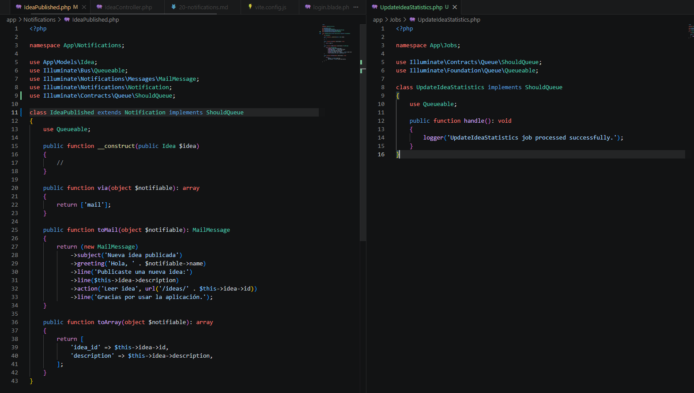
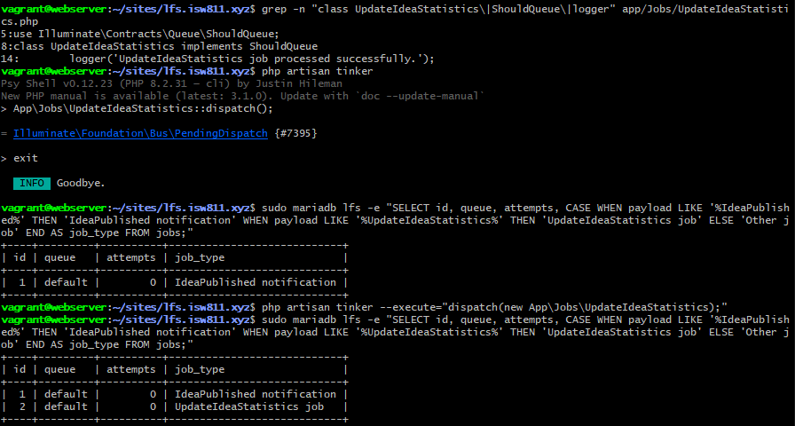
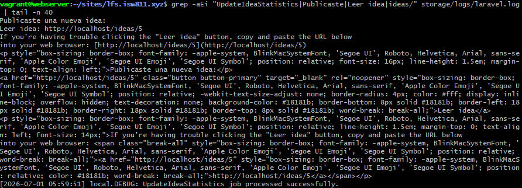

[<- Regresar](../entregable02.md)

# Episodio 21: When to Queue it Up

## Módulo 3: Digging Deeper

## Resumen

En este episodio se trabajó el uso de queues en Laravel.

El objetivo principal fue comprender que ciertas tareas no deberían ejecutarse directamente durante la petición principal del usuario. Un ejemplo común es el envío de correos. Si una aplicación necesita enviar uno o varios correos, hacer que el usuario espere durante todo ese proceso puede afectar la experiencia de uso.

Para resolver esto, Laravel permite colocar tareas en una cola. Luego, un worker procesa esos trabajos en segundo plano.

---

## Conceptos principales

Durante el episodio se repasaron tres conceptos importantes:

* Queue: es la cola donde se almacenan los trabajos pendientes.
* Job: es la tarea específica que debe ejecutarse.
* Worker: es el proceso encargado de tomar trabajos de la cola y ejecutarlos.

La idea principal es que la aplicación puede responder rápidamente al usuario, mientras que el trabajo pesado se procesa después en segundo plano.

---

## Configuración de la cola

Se verificó que la conexión de queues utilizara base de datos.

```text
QUEUE_CONNECTION=database
```

También se revisó que existiera la tabla `jobs`, ya que Laravel la utiliza para almacenar los trabajos pendientes cuando se usa la conexión `database`.

```bash
sudo mariadb lfs -e "SHOW TABLES LIKE 'jobs';"
```

---

## Notificación enviada a la cola

La notificación `IdeaPublished`, creada en el episodio anterior, fue modificada para implementar la interfaz `ShouldQueue`.

```php
use Illuminate\Contracts\Queue\ShouldQueue;
```

Luego la clase fue actualizada de la siguiente forma:

```php
class IdeaPublished extends Notification implements ShouldQueue
```

Con este cambio, cuando se ejecuta la notificación:

```php
auth()->user()->notify(new IdeaPublished($idea));
```

Laravel no envía el correo inmediatamente. En su lugar, lo coloca como un trabajo pendiente en la cola.

---

## Creación de un Job

Se creó un Job de ejemplo llamado `UpdateIdeaStatistics`.

```bash
php artisan make:job UpdateIdeaStatistics
```

Este Job fue configurado para implementar `ShouldQueue` y escribir un mensaje en el log cuando fuera procesado.

```php
public function handle(): void
{
    logger('UpdateIdeaStatistics job processed successfully.');
}
```

Esto permitió comprobar que los jobs se almacenan en la cola y luego son procesados por un worker.

---

## Despacho manual del Job

Para probar el Job se utilizó Tinker.

```bash
php artisan tinker
```

Dentro de Tinker se ejecutó:

```php
App\Jobs\UpdateIdeaStatistics::dispatch();
```

Esto agregó el Job a la cola.

---

## Revisión de jobs pendientes

Los trabajos pendientes se revisaron directamente en la tabla `jobs`.

```bash
sudo mariadb lfs -e "SELECT id, queue, attempts, LEFT(payload, 120) AS payload_preview FROM jobs;"
```

Esto permitió confirmar que tanto la notificación en cola como el Job de ejemplo estaban pendientes de ser procesados.

---

## Procesamiento con queue worker

Para procesar los trabajos se utilizó:

```bash
php artisan queue:work --once
```

Este comando inicia un worker, procesa un trabajo pendiente y luego se detiene.

Después de procesar los jobs, se verificó que la tabla `jobs` quedara vacía y que el log mostrara el mensaje del Job procesado.

```bash
tail -n 80 storage/logs/laravel.log
```

---

## Evidencia

Como evidencia de este episodio se agregaron capturas donde se observa el código preparado para queues, los jobs pendientes en base de datos y el worker procesando los trabajos.







---

## Problemas encontrados y solución

El punto más importante fue entender que poner un trabajo en la cola no significa que se ejecute automáticamente.

Primero, Laravel guarda el trabajo en la tabla `jobs`. Luego, es necesario ejecutar un worker para procesarlo.

```bash
php artisan queue:work
```

Para la prueba local se utilizó `queue:work --once`, ya que permite procesar un job y detener el worker después.

---

## Comentarios personales

Este episodio permitió comprender por qué las queues son importantes en aplicaciones web.

El envío de correos y otras tareas que pueden tardar más tiempo se pueden ejecutar en segundo plano, mejorando el tiempo de respuesta para el usuario. También quedó claro que el worker es una pieza esencial, porque sin un worker activo los trabajos permanecen pendientes en la cola.
