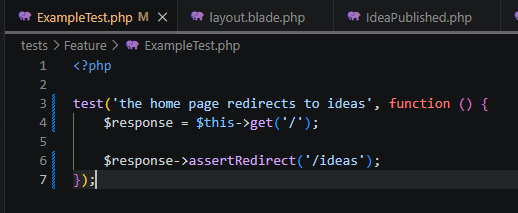
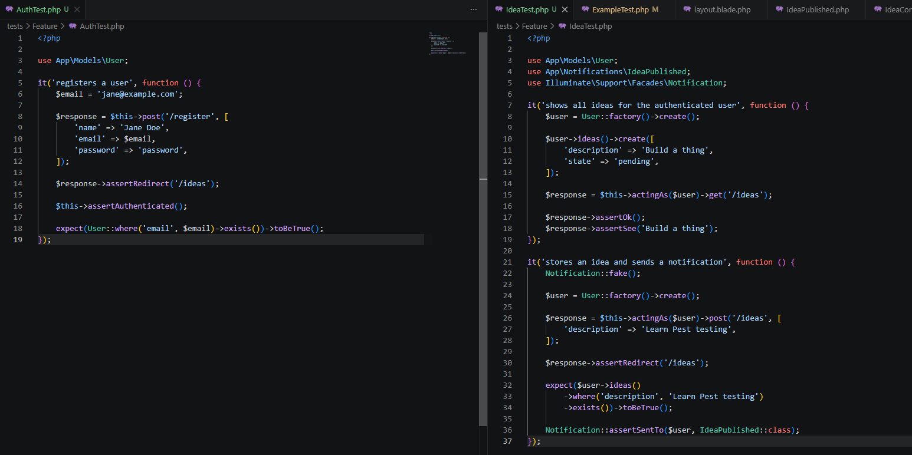
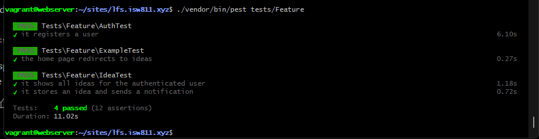

[<- Regresar](../entregable02.md)

# Episodio 22: How to Get Started Testing Your Code

## Módulo 3: Digging Deeper

## Resumen

En este episodio se trabajó una introducción a las pruebas automatizadas utilizando Pest PHP.

El objetivo principal fue comprender cómo las pruebas ayudan a validar el comportamiento de la aplicación sin tener que repetir manualmente los mismos pasos en el navegador. En el episodio se muestra cómo Pest permite probar rutas, formularios, redirecciones y resultados esperados dentro de una aplicación Laravel.

Durante la implementación del capítulo se instaló Pest en el proyecto y se crearon pruebas automatizadas para validar el flujo de registro de usuarios, la redirección de la página principal, el listado de ideas y la creación de ideas con notificación.

---

## Adaptación realizada

En el episodio original se trabaja con pruebas de navegador utilizando Pest Browser Testing. Sin embargo, al intentar instalar el plugin de browser testing en la máquina virtual, Composer indicó que la versión actual del plugin requiere PHP 8.3 o superior.

La máquina virtual del proyecto utiliza PHP 8.2.31, por lo que no se instaló el plugin de browser testing para evitar romper el ambiente del proyecto.

Como adaptación, se implementaron pruebas tipo Feature con Pest 3. Estas pruebas no abren un navegador real, pero permiten validar de forma automatizada los flujos principales de Laravel mediante peticiones HTTP, autenticación, base de datos y notificaciones.

---

## Comandos utilizados

Para entrar a la máquina virtual se utilizó:

```bash
cd ~/ISW811/VMs/webserver
vagrant ssh
```

Dentro de Debian se ingresó al proyecto:

```bash
cd ~/sites/lfs.isw811.xyz
```

Para verificar Pest se intentó inicialmente:

```bash
./vendor/bin/pest --version
```

Como Pest no estaba instalado todavía, se instaló con Composer:

```bash
composer require pestphp/pest:^3.0 pestphp/pest-plugin-laravel:^3.0 --dev --with-all-dependencies
```

Luego se inicializó Pest:

```bash
./vendor/bin/pest --init
```

Para ejecutar las pruebas se utilizó:

```bash
./vendor/bin/pest tests/Feature
```

Durante la ejecución inicial apareció un error relacionado con SQLite:

```text
could not find driver
```

Para solucionarlo se instaló el driver de SQLite para PHP:

```bash
sudo apt update
sudo apt install -y php8.2-sqlite3
```

Luego se verificó que PHP reconociera SQLite:

```bash
php -m | grep -Ei "sqlite|pdo"
```

Finalmente se volvieron a ejecutar las pruebas:

```bash
./vendor/bin/pest tests/Feature
```

---

## Archivos modificados o creados

Los archivos principales trabajados durante este episodio fueron:

* `composer.json`
* `composer.lock`
* `tests/Pest.php`
* `tests/Feature/ExampleTest.php`
* `tests/Feature/AuthTest.php`
* `tests/Feature/IdeaTest.php`
* `docs/digging-deeper/22-how-to-get-started-testing-your-code.md`

---

## Configuración de Pest

Se configuró el archivo:

```text
tests/Pest.php
```

para que los tests dentro de `Feature` utilicen el `TestCase` de Laravel y refresquen la base de datos durante las pruebas.

```php
<?php

use Illuminate\Foundation\Testing\RefreshDatabase;

pest()->extend(Tests\TestCase::class)
    ->use(RefreshDatabase::class)
    ->in('Feature');
```

Esto permite que las pruebas tengan acceso a funcionalidades propias de Laravel, como autenticación, factories, peticiones HTTP, base de datos y assertions.

---

## Corrección del test de ejemplo

El test de ejemplo creado por Pest esperaba que la ruta `/` respondiera con estado `200`.

Sin embargo, en este proyecto la ruta principal redirige hacia `/ideas`.

Por esa razón, el test fue adaptado para validar la redirección correcta.

```php
<?php

test('the home page redirects to ideas', function () {
    $response = $this->get('/');

    $response->assertRedirect('/ideas');
});
```

Con esto, la prueba refleja correctamente el comportamiento real de la aplicación.

---

## Test de registro de usuario

Se creó el archivo:

```text
tests/Feature/AuthTest.php
```

Este test valida que un usuario pueda registrarse correctamente desde la aplicación.

```php
<?php

use App\Models\User;

it('registers a user', function () {
    $email = 'jane@example.com';

    $response = $this->post('/register', [
        'name' => 'Jane Doe',
        'email' => $email,
        'password' => 'password',
    ]);

    $response->assertRedirect('/ideas');

    $this->assertAuthenticated();

    expect(User::where('email', $email)->exists())->toBeTrue();
});
```

La prueba realiza una petición `POST` hacia `/register`, valida que la respuesta redirija a `/ideas`, confirma que el usuario quedó autenticado y verifica que el correo exista en la base de datos.

---

## Test de listado de ideas

Se creó el archivo:

```text
tests/Feature/IdeaTest.php
```

El primer test valida que un usuario autenticado pueda ver sus ideas en la página `/ideas`.

```php
<?php

use App\Models\User;
use App\Notifications\IdeaPublished;
use Illuminate\Support\Facades\Notification;

it('shows all ideas for the authenticated user', function () {
    $user = User::factory()->create();

    $user->ideas()->create([
        'description' => 'Build a thing',
        'state' => 'pending',
    ]);

    $response = $this->actingAs($user)->get('/ideas');

    $response->assertOk();
    $response->assertSee('Build a thing');
});
```

Este test crea un usuario, crea una idea asociada a ese usuario, autentica al usuario y luego valida que la descripción de la idea aparezca en la respuesta.

---

## Test de creación de idea y notificación

En el mismo archivo `IdeaTest.php` se agregó una prueba para validar que una idea pueda ser creada y que se dispare la notificación correspondiente.

```php
it('stores an idea and sends a notification', function () {
    Notification::fake();

    $user = User::factory()->create();

    $response = $this->actingAs($user)->post('/ideas', [
        'description' => 'Learn Pest testing',
    ]);

    $response->assertRedirect('/ideas');

    expect($user->ideas()
        ->where('description', 'Learn Pest testing')
        ->exists())->toBeTrue();

    Notification::assertSentTo($user, IdeaPublished::class);
});
```

Se utilizó `Notification::fake()` para evitar enviar una notificación real durante la prueba. Luego se valida que la notificación `IdeaPublished` haya sido enviada al usuario.

---

## Ejecución de pruebas

Las pruebas se ejecutaron con:

```bash
./vendor/bin/pest tests/Feature
```

El resultado final fue exitoso, confirmando que los flujos probados funcionan correctamente.

---

## Evidencia

Como evidencia de este episodio se agregaron capturas donde se observa la configuración de Pest, los tests creados y la ejecución exitosa de las pruebas.







---

## Problemas encontrados y solución

El primer problema encontrado fue que Pest no estaba instalado en el proyecto. Al ejecutar:

```bash
./vendor/bin/pest --version
```

la terminal indicó que el archivo no existía. Para resolverlo, se instaló Pest 3 junto con el plugin de Laravel.

El segundo punto fue que el plugin actual de browser testing de Pest requiere PHP 8.3 o superior, mientras que la máquina virtual utiliza PHP 8.2.31. Por esta razón, no se instaló ese plugin y se adaptó el ejercicio a Feature Tests con Pest 3.

El tercer problema fue que las pruebas intentaban usar SQLite en memoria, pero la VM no tenía instalado el driver de SQLite para PHP. Se solucionó instalando `php8.2-sqlite3`.

---

## Comentarios personales

Este episodio permitió comprender cómo comenzar a probar una aplicación Laravel usando Pest.

Aunque no se pudo utilizar el plugin de browser testing por la versión de PHP disponible en la máquina virtual, las pruebas tipo Feature permitieron validar flujos importantes de la aplicación, como registro de usuarios, redirecciones, listado de ideas, creación de ideas y envío de notificaciones.

Esto demuestra cómo las pruebas automatizadas ayudan a detectar errores rápidamente y dan más confianza al seguir desarrollando nuevas funcionalidades.
