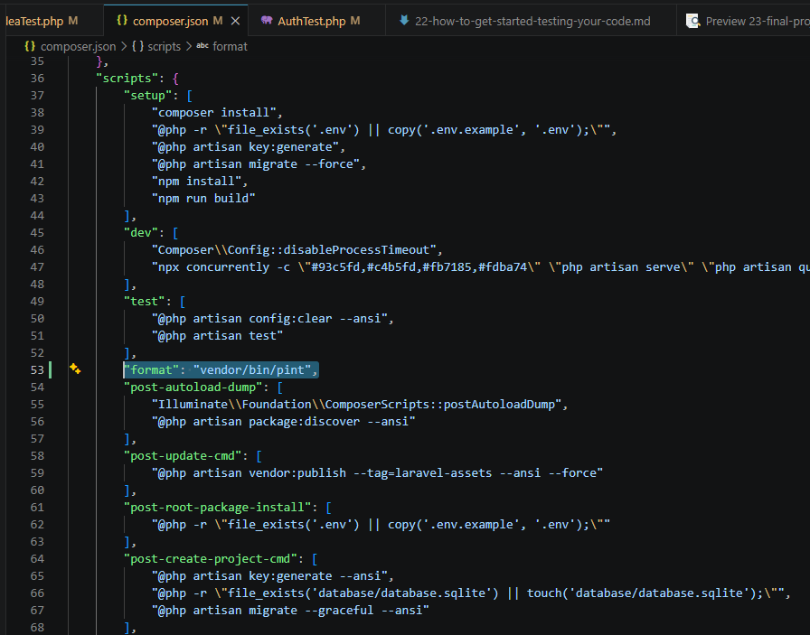
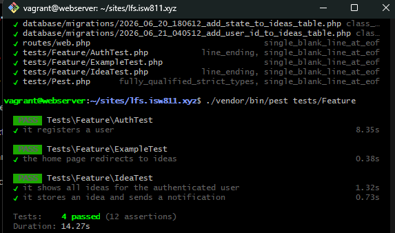
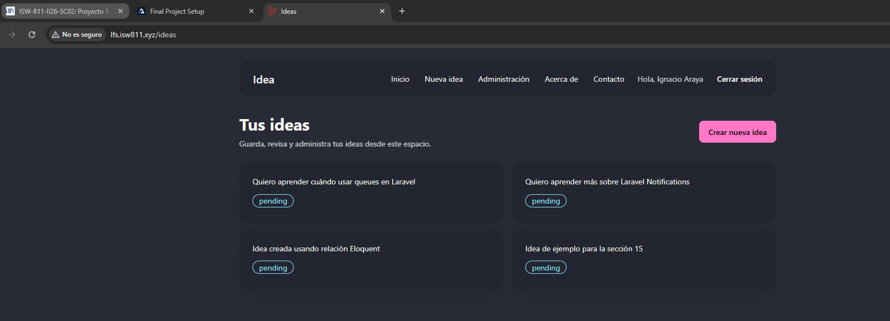

[<- Regresar](../entregable02.md)

# Episodio 23: Final Project Setup

## Módulo 4: Final Project

## Resumen

En este episodio se inició la sección del proyecto final de Laravel From Scratch.

El objetivo del capítulo fue preparar la base del proyecto final, revisar el flujo general de trabajo y dejar configuradas herramientas de apoyo para continuar construyendo la aplicación. En el video se muestra la creación de una nueva aplicación Laravel, la inicialización de Git, la publicación en GitHub, el despliegue con Laravel Forge y la preparación de herramientas de desarrollo como Pint, Rector, CodeRabbit y Laravel Boost.

En esta implementación se realizó una adaptación al contexto del curso. En lugar de crear una nueva aplicación Laravel desde cero, se continuó utilizando el proyecto acumulativo existente, ya que este proyecto ya contiene autenticación, autorización, ideas, notificaciones, queues, pruebas con Pest, Vite y DaisyUI.

---

## Adaptación realizada

El proyecto ya existía en la ruta:

```text
~/ISW811/VMs/webserver/sites/lfs.isw811.xyz
```

También ya estaba conectado al repositorio de GitHub utilizado para el curso.

Por esa razón, no se creó una nueva aplicación Laravel ni un nuevo repositorio. En su lugar, este capítulo se utilizó para preparar formalmente el inicio del proyecto final dentro del mismo código base.

La carpeta de documentación para esta nueva sección es:

```text
docs/final-project/
```

Y el archivo de este capítulo es:

```text
docs/final-project/23-final-project-setup.md
```

---

## Objetivo del proyecto final

El proyecto final se basa en una aplicación para administrar ideas.

La aplicación permitirá continuar evolucionando funcionalidades como:

* autenticación de usuarios
* autorización
* flash messaging
* notificaciones
* manejo de ideas
* estados de ideas
* filtrado
* pruebas automatizadas
* componentes visuales
* mejoras de interfaz

Esto permite construir una aplicación sencilla de entender, pero con suficientes funcionalidades para practicar conceptos reales de Laravel.

---

## Tooling del proyecto

Como parte de la preparación del proyecto final, se agregó un script de formato en `composer.json`.

```json
"format": "vendor/bin/pint"
```

Este script permite ejecutar Laravel Pint de forma más cómoda con Composer.

```bash
composer run format
```

Pint ayuda a mantener un estilo consistente en el código PHP del proyecto.

---

## Verificación con pruebas

Después de preparar el tooling, se ejecutaron las pruebas del proyecto con Pest.

```bash
./vendor/bin/pest tests/Feature
```

Esto permitió confirmar que los flujos principales probados en el capítulo anterior seguían funcionando correctamente después del setup inicial del proyecto final.

---

## Baseline del proyecto final

También se revisó la aplicación en el navegador desde:

```text
http://lfs.isw811.xyz/ideas
```

Esta revisión sirvió como punto de partida visual para el proyecto final. La aplicación mantiene las funcionalidades construidas previamente y queda lista para comenzar las siguientes etapas del desarrollo.

---

## Evidencia

Como evidencia de este episodio se agregaron capturas donde se observa el tooling configurado, las pruebas ejecutándose correctamente y el estado inicial de la aplicación para el proyecto final.







---

## Problemas encontrados y solución

El episodio original crea una aplicación nueva y muestra un despliegue con Laravel Forge. En este caso no se repitió ese proceso porque el proyecto del curso ya existía, ya estaba versionado con Git y ya contaba con un dominio local configurado mediante Vagrant.

La solución fue adaptar el capítulo como una etapa de preparación del proyecto final dentro del mismo repositorio, manteniendo continuidad con todo lo desarrollado en los episodios anteriores.

---

## Comentarios personales

Este capítulo funcionó como transición entre los fundamentos vistos anteriormente y el proyecto final.

La preparación del proyecto permitió confirmar que el ambiente local, Git, Pest, Vite, DaisyUI y la estructura de documentación están listos para continuar con los siguientes episodios del proyecto final.
