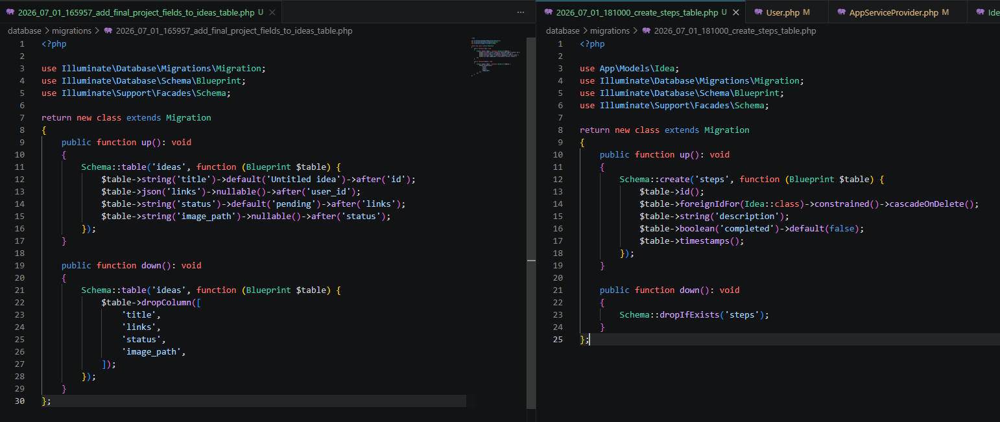
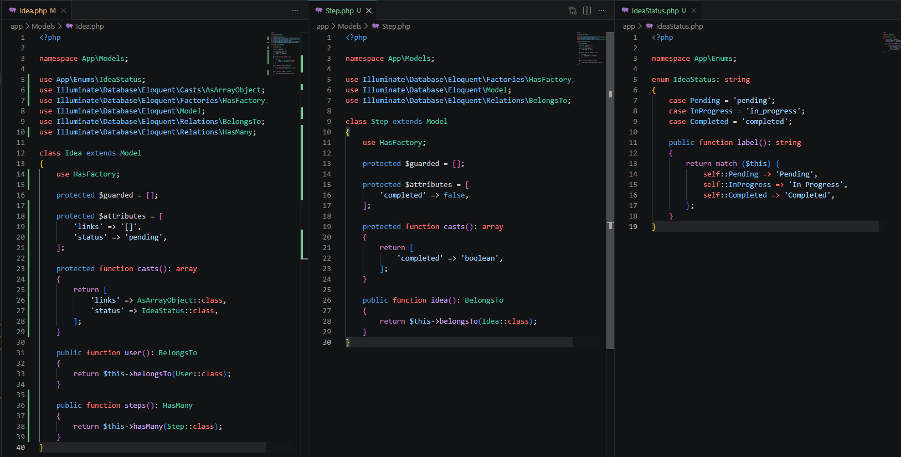
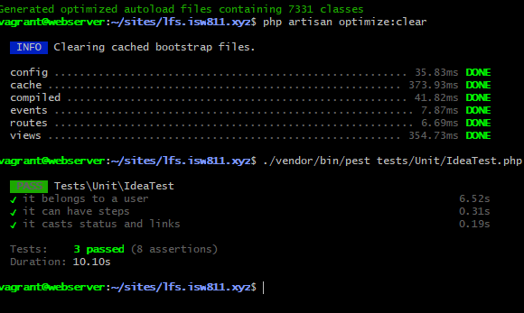

[<- Regresar](../entregable02.md)

# Episodio 24: Design Your Model Layer

## Módulo 4: Final Project

## Resumen

En este episodio se trabajó la capa de modelo del proyecto final.

Antes de construir la interfaz, se preparó la estructura principal de dominio y base de datos. El objetivo fue definir correctamente qué información necesita una idea, cómo se relaciona con un usuario y cómo puede tener pasos asociados.

El episodio original crea el modelo `Idea` desde cero junto con factory, request, migration, policy y controller. En esta implementación se realizó una adaptación porque el proyecto ya contaba con un modelo `Idea`, controlador, política, migración inicial y funcionalidades previas.

---

## Adaptación realizada

El proyecto ya tenía una tabla `ideas` y un modelo `Idea` creados en capítulos anteriores.

Por esa razón, en lugar de crear la tabla desde cero, se agregó una nueva migración para ampliar la tabla existente con campos del proyecto final:

* `title`
* `links`
* `status`
* `image_path`

También se creó el modelo `Step`, su migración y su factory para representar pasos o tareas asociadas a una idea.

El campo anterior `state` se mantuvo temporalmente para no romper las funcionalidades construidas previamente. Para el proyecto final se introdujo el nuevo campo `status`.

---

## Comandos utilizados

Para entrar a la máquina virtual se utilizó:

```bash
cd ~/ISW811/VMs/webserver
vagrant ssh
```

Dentro de Debian se ingresó al proyecto:

```bash
cd ~/sites/lfs.isw811.xyz
```

Para crear el enum de estados se utilizó:

```bash
php artisan make:enum IdeaStatus
```

Para crear la migración que amplía la tabla `ideas` se utilizó:

```bash
php artisan make:migration add_final_project_fields_to_ideas_table --table=ideas
```

Para crear el modelo `Step`, su migración y factory se utilizó:

```bash
php artisan make:model Step -mf
```

Para ejecutar migraciones se utilizó:

```bash
php artisan migrate
```

Para ejecutar las pruebas del modelo se utilizó:

```bash
./vendor/bin/pest tests/Unit/IdeaTest.php
```

---

## Archivos modificados o creados

Los archivos principales trabajados durante este episodio fueron:

* `app/Enums/IdeaStatus.php`
* `app/Models/Idea.php`
* `app/Models/Step.php`
* `app/Providers/AppServiceProvider.php`
* `database/factories/IdeaFactory.php`
* `database/factories/StepFactory.php`
* `database/migrations/*_add_final_project_fields_to_ideas_table.php`
* `database/migrations/*_create_steps_table.php`
* `tests/Pest.php`
* `tests/Unit/IdeaTest.php`
* `docs/final-project/24-design-your-model-layer.md`

---

## Campos agregados a ideas

La tabla `ideas` fue ampliada para soportar la estructura del proyecto final.

```php
$table->string('title')->default('Untitled idea');
$table->json('links')->nullable();
$table->string('status')->default('pending');
$table->string('image_path')->nullable();
```

Estos campos permiten que una idea tenga un título, enlaces asociados, estado y una imagen destacada.

---

## Tabla de steps

Se creó una tabla `steps` para representar pasos o tareas relacionadas con una idea.

```php
$table->foreignIdFor(Idea::class)->constrained()->cascadeOnDelete();
$table->string('description');
$table->boolean('completed')->default(false);
$table->timestamps();
```

Cada step pertenece a una idea, y si la idea se elimina, sus steps también se eliminan.

---

## Enum de estado

Se creó el enum `IdeaStatus` para evitar repetir strings como `pending`, `in_progress` o `completed` en varias partes del código.

```php
enum IdeaStatus: string
{
    case Pending = 'pending';
    case InProgress = 'in_progress';
    case Completed = 'completed';

    public function label(): string
    {
        return match ($this) {
            self::Pending => 'Pending',
            self::InProgress => 'In Progress',
            self::Completed => 'Completed',
        };
    }
}
```

Esto permite manejar los estados de una idea de una forma más ordenada.

---

## Casts del modelo Idea

En el modelo `Idea` se agregaron casts para convertir automáticamente los campos `links` y `status`.

```php
protected function casts(): array
{
    return [
        'links' => AsArrayObject::class,
        'status' => IdeaStatus::class,
    ];
}
```

Con esto, `links` puede manejarse como una estructura tipo array y `status` como una instancia del enum `IdeaStatus`.

---

## Relaciones del modelo

Se definieron las relaciones principales del dominio.

Una idea pertenece a un usuario:

```php
public function user(): BelongsTo
{
    return $this->belongsTo(User::class);
}
```

Una idea puede tener muchos steps:

```php
public function steps(): HasMany
{
    return $this->hasMany(Step::class);
}
```

Y un step pertenece a una idea:

```php
public function idea(): BelongsTo
{
    return $this->belongsTo(Idea::class);
}
```

---

## Configuración de Eloquent

En `AppServiceProvider` se agregaron configuraciones para trabajar con modelos de forma más estricta.

```php
Model::unguard();

Model::shouldBeStrict(! app()->isProduction());

if (method_exists(Model::class, 'automaticallyEagerLoadRelationships')) {
    Model::automaticallyEagerLoadRelationships();
}
```

Esto ayuda a detectar errores relacionados con atributos inexistentes, lazy loading y otros posibles problemas durante el desarrollo.

---

## Factories

Se actualizó `IdeaFactory` para generar datos falsos del modelo `Idea`.

```php
return [
    'user_id' => User::factory(),
    'title' => fake()->sentence(3),
    'description' => fake()->paragraph(),
    'links' => [
        'https://laravel.com',
    ],
    'status' => IdeaStatus::Pending,
    'state' => 'pending',
    'image_path' => null,
];
```

También se creó `StepFactory`.

```php
return [
    'idea_id' => Idea::factory(),
    'description' => fake()->sentence(),
    'completed' => false,
];
```

---

## Pruebas del modelo

Se creó el archivo:

```text
tests/Unit/IdeaTest.php
```

Las pruebas verifican que una idea pertenezca a un usuario, que pueda tener steps y que los campos `status` y `links` se conviertan correctamente mediante casts.

```php
it('belongs to a user', function () {
    $idea = Idea::factory()->create();

    $idea->load('user');

    expect($idea->user)->toBeInstanceOf(User::class);
});
```

```php
it('can have steps', function () {
    $idea = Idea::factory()->create();

    $idea->steps()->create([
        'description' => 'Do the thing',
    ]);

    $idea->refresh()->load('steps');

    expect($idea->steps)->toHaveCount(1);
});
```

```php
it('casts status and links', function () {
    $idea = Idea::factory()->create([
        'status' => IdeaStatus::InProgress,
        'links' => [
            'https://laravel.com',
        ],
    ]);

    $idea->refresh();

    expect($idea->status)->toBe(IdeaStatus::InProgress);
});
```

---

## Evidencia

Como evidencia de este episodio se agregaron capturas donde se observan las migraciones del modelo final, las relaciones y casts del modelo, y las pruebas ejecutándose correctamente.







---

## Problemas encontrados y solución

El episodio original parte de una aplicación nueva, pero este proyecto ya tenía una tabla `ideas` creada en capítulos anteriores.

Para no romper el avance acumulado, se creó una migración adicional que agrega los campos necesarios para el proyecto final. También se mantuvo temporalmente el campo `state` para conservar compatibilidad con el CRUD existente.

Otro punto importante fue que los tests del modelo necesitan bootstrapping de Laravel y acceso a base de datos. Por eso se actualizó `tests/Pest.php` para incluir también la carpeta `Unit` con `RefreshDatabase`.

---

## Comentarios personales

Este capítulo permitió ordenar la base del proyecto final antes de comenzar con la interfaz.

La aplicación ahora cuenta con una capa de modelo más completa: ideas con estado, links, imagen, relación con usuario y steps asociados. Además, las pruebas ayudan a confirmar que estas relaciones funcionan correctamente antes de continuar con el diseño visual.
