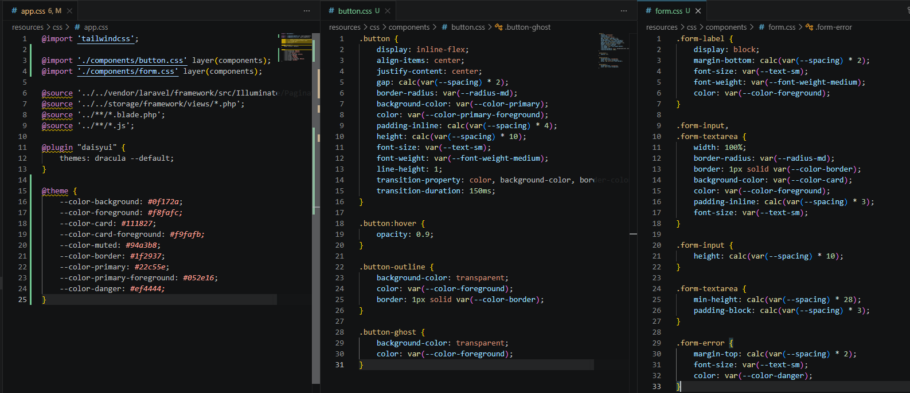
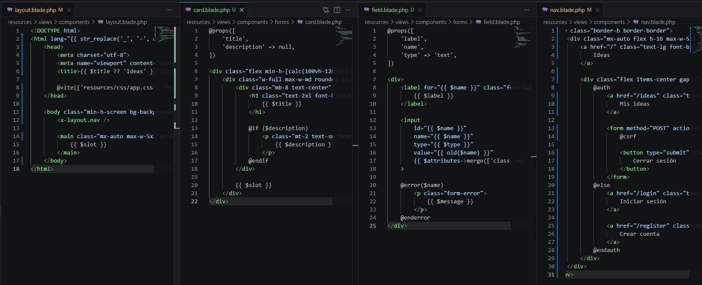
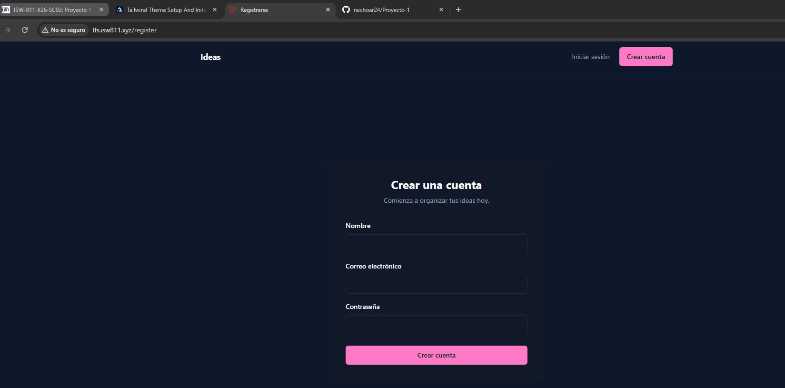

[<- Regresar](../entregable02.md)

# Episodio 25: Tailwind Theme Setup And Initial UI

## Módulo 4: Final Project

## Resumen

En este episodio se trabajó la configuración inicial del tema visual del proyecto final y la primera estructura de interfaz.

El objetivo principal fue preparar Tailwind CSS con variables de tema, crear componentes CSS reutilizables para botones y formularios, definir un layout base, extraer la navegación a un componente Blade y crear las primeras vistas de autenticación.

En esta implementación se mantuvo el proyecto en español, por lo que los textos visibles del sitio fueron adaptados a español.

---

## Adaptación realizada

El episodio original trabaja la interfaz inicial de una aplicación nueva. En este proyecto ya existían rutas, controladores y vistas de autenticación creadas en capítulos anteriores.

Por esa razón, no se reconstruyó toda la autenticación desde cero. En su lugar, se adaptaron las vistas existentes para usar una nueva estructura visual basada en componentes Blade y clases reutilizables.

También se mantuvo la lógica existente de registro, login y logout, realizando únicamente ajustes necesarios para que coincidiera con la nueva navegación.

---

## Comandos utilizados

Para entrar a la máquina virtual se utilizó:

```bash
cd ~/ISW811/VMs/webserver
vagrant ssh
```

Dentro de Debian se ingresó al proyecto:

```bash
cd ~/sites/lfs.isw811.xyz
```

Para levantar Vite se utilizó:

```bash
npm run dev -- --host 0.0.0.0
```

Para limpiar la caché de vistas después de mover componentes Blade se utilizó:

```bash
php artisan view:clear
php artisan optimize:clear
```

Para verificar que el proyecto siguiera funcionando se ejecutaron las pruebas:

```bash
./vendor/bin/pest tests/Feature
```

---

## Archivos modificados o creados

Los archivos principales trabajados durante este episodio fueron:

* `resources/css/app.css`
* `resources/css/components/button.css`
* `resources/css/components/form.css`
* `resources/views/components/layout.blade.php`
* `resources/views/components/layout/nav.blade.php`
* `resources/views/components/forms/card.blade.php`
* `resources/views/components/forms/field.blade.php`
* `resources/views/auth/register.blade.php`
* `resources/views/auth/login.blade.php`
* `routes/web.php`
* `docs/final-project/25-tailwind-theme-setup-and-initial-ui.md`

---

## Configuración de tema con Tailwind

Se actualizó el archivo `resources/css/app.css` para definir variables de tema.

```css
@theme {
    --color-background: #0f172a;
    --color-foreground: #f8fafc;
    --color-card: #111827;
    --color-card-foreground: #f9fafb;
    --color-muted: #94a3b8;
    --color-border: #1f2937;
    --color-primary: #22c55e;
    --color-primary-foreground: #052e16;
    --color-danger: #ef4444;
}
```

Estas variables permiten utilizar clases como `bg-background`, `text-foreground`, `bg-card`, `text-muted` y `bg-primary`.

---

## Componentes CSS

Se crearon componentes CSS para reutilizar estilos comunes.

El archivo `resources/css/components/button.css` define estilos para botones:

```css
.button {
    display: inline-flex;
    align-items: center;
    justify-content: center;
    border-radius: var(--radius-md);
    background-color: var(--color-primary);
    color: var(--color-primary-foreground);
}
```

También se agregó una variante de botón outline:

```css
.button-outline {
    background-color: transparent;
    color: var(--color-foreground);
    border: 1px solid var(--color-border);
}
```

El archivo `resources/css/components/form.css` define estilos base para labels, inputs, textareas y errores de validación.

```css
.form-label {
    display: block;
    font-size: var(--text-sm);
    font-weight: var(--font-weight-medium);
}
```

```css
.form-input,
.form-textarea {
    width: 100%;
    border-radius: var(--radius-md);
    border: 1px solid var(--color-border);
    background-color: var(--color-card);
    color: var(--color-foreground);
}
```

---

## Layout base

Se creó el componente principal:

```text
resources/views/components/layout.blade.php
```

Este componente define la estructura HTML base, carga los assets con Vite y renderiza la navegación.

```blade
<x-layout.nav />

<main class="mx-auto max-w-5xl px-4 py-10">
    {{ $slot }}
</main>
```

Con esto, las vistas pueden reutilizar una estructura común mediante:

```blade
<x-layout title="Registrarse">
    ...
</x-layout>
```

---

## Navegación

Se creó el componente:

```text
resources/views/components/layout/nav.blade.php
```

Este componente muestra enlaces diferentes dependiendo del estado de autenticación del usuario.

Cuando el usuario está autenticado, se muestran las opciones:

* Mis ideas
* Cerrar sesión

Cuando el usuario no está autenticado, se muestran:

* Iniciar sesión
* Registrarse

La navegación fue adaptada completamente a español.

---

## Componentes de formularios

Se creó el componente:

```text
resources/views/components/forms/card.blade.php
```

Este componente permite mostrar formularios centrados dentro de una tarjeta.

También se creó:

```text
resources/views/components/forms/field.blade.php
```

Este componente permite reutilizar la estructura de un campo de formulario con label, input, valor anterior y errores de validación.

```blade
<x-forms.field
    label="Correo electrónico"
    name="email"
    type="email"
    required
/>
```

Esto permite evitar repetir el mismo HTML en las vistas de registro e inicio de sesión.

---

## Vista de registro

Se actualizó la vista:

```text
resources/views/auth/register.blade.php
```

La pantalla de registro ahora utiliza el layout principal y los componentes de formulario.

```blade
<x-forms.card
    title="Crear una cuenta"
    description="Comienza a organizar tus ideas hoy."
>
```

El formulario incluye los campos:

* Nombre
* Correo electrónico
* Contraseña

Y el botón:

```text
Crear cuenta
```

---

## Vista de inicio de sesión

Se actualizó la vista:

```text
resources/views/auth/login.blade.php
```

La pantalla de login también utiliza el layout principal y los componentes reutilizables.

```blade
<x-forms.card
    title="Iniciar sesión"
    description="Bienvenido de vuelta."
>
```

El formulario incluye los campos:

* Correo electrónico
* Contraseña

Y el botón:

```text
Iniciar sesión
```

---

## Ajuste de logout

La navegación utiliza un formulario con método `POST` para cerrar sesión.

```blade
<form method="POST" action="/logout">
```

Por esa razón, la ruta de logout fue ajustada para coincidir con este comportamiento:

```php
Route::post('/logout', [SessionController::class, 'destroy'])
    ->name('logout');
```

---

## Evidencia

Como evidencia de este episodio se agregaron capturas donde se observa la configuración de tema y componentes CSS, el código del layout y formularios, y la interfaz inicial funcionando en el navegador.







---

## Problemas encontrados y solución

Durante la prueba en navegador apareció un error indicando que Laravel no podía localizar el componente `layout.nav`.

El problema se debía a que el archivo de navegación existía como:

```text
resources/views/components/nav.blade.php
```

pero el layout estaba llamando al componente como:

```blade
<x-layout.nav />
```

Laravel esperaba encontrar el archivo en:

```text
resources/views/components/layout/nav.blade.php
```

La solución fue crear la carpeta `layout` dentro de `components` y mover el archivo `nav.blade.php` a esa ubicación.

Después de mover el archivo se limpió la caché de vistas con:

```bash
php artisan view:clear
php artisan optimize:clear
```

Con esto la vista cargó correctamente.

---

## Comentarios personales

Este capítulo permitió establecer la primera base visual del proyecto final.

La aplicación ahora cuenta con un tema oscuro, colores definidos mediante Tailwind, componentes reutilizables para botones y formularios, un layout base, una navegación en español y pantallas iniciales de registro e inicio de sesión con una apariencia más consistente.
