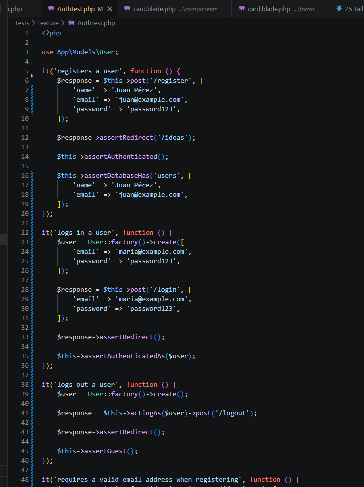
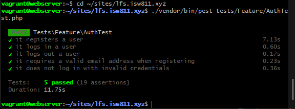

[<- Regresar](../entregable02.md)

# Episodio 26: Browser Testing Registration Forms With Pest

## Módulo 4: Final Project

## Resumen

En este episodio se trabajaron pruebas automatizadas para los formularios de autenticación del proyecto final.

El objetivo principal fue validar que los flujos de registro, inicio de sesión, cierre de sesión y errores de validación funcionen correctamente. Estos flujos son críticos porque, si un usuario no puede registrarse o iniciar sesión, la aplicación deja de cumplir una de sus funciones principales.

En el episodio original se utilizan pruebas de navegador con Pest Browser Testing. En esta implementación se realizó una adaptación utilizando Pest Feature Tests, debido a la versión de PHP disponible en la máquina virtual.

---

## Adaptación realizada

El episodio original utiliza Pest Browser Testing para interactuar con formularios reales en el navegador mediante funciones como `visit()`, `fill()` y `click()`.

Sin embargo, el ambiente del proyecto utiliza PHP 8.2.31 y Pest 3.8.6. La versión actual del plugin de browser testing de Pest requiere una versión más reciente de PHP, por lo que no se instaló para evitar romper el ambiente del proyecto.

Como adaptación, se implementaron pruebas automatizadas con Pest Feature Tests. Estas pruebas no abren un navegador real, pero validan los mismos flujos funcionales mediante peticiones HTTP, autenticación, sesiones, redirecciones, base de datos y errores de validación.

---

## Comandos utilizados

Para entrar a la máquina virtual se utilizó:

```bash
cd ~/ISW811/VMs/webserver
vagrant ssh
```

Dentro de Debian se ingresó al proyecto:

```bash
cd ~/sites/lfs.isw811.xyz
```

Para ejecutar las pruebas del capítulo se utilizó:

```bash
./vendor/bin/pest tests/Feature/AuthTest.php
```

También se ejecutaron todas las pruebas de Feature para confirmar que no se rompieran funcionalidades anteriores:

```bash
./vendor/bin/pest tests/Feature
```

---

## Archivos modificados o creados

Los archivos principales trabajados durante este episodio fueron:

* `tests/Feature/AuthTest.php`
* `resources/views/auth/register.blade.php`
* `resources/views/auth/login.blade.php`
* `resources/views/components/layout/nav.blade.php`
* `docs/final-project/26-browser-testing-registration-forms-with-pest.md`

---

## Atributos data-test

Aunque no se instaló Pest Browser Testing, se agregaron atributos `data-test` a los botones principales de autenticación como preparación para pruebas de navegador futuras.

En la vista de registro se agregó:

```blade
data-test="register-button"
```

En la vista de inicio de sesión se agregó:

```blade
data-test="login-button"
```

En el botón de cierre de sesión se agregó:

```blade
data-test="logout-button"
```

Estos atributos permiten seleccionar elementos de forma más estable en pruebas automatizadas, sin depender directamente del texto visible del botón.

---

## Prueba de registro

Se agregó una prueba para confirmar que un usuario pueda registrarse correctamente.

```php
it('registers a user', function () {
    $response = $this->post('/register', [
        'name' => 'Juan Pérez',
        'email' => 'juan@example.com',
        'password' => 'password123',
    ]);

    $response->assertRedirect('/ideas');

    $this->assertAuthenticated();

    $this->assertDatabaseHas('users', [
        'name' => 'Juan Pérez',
        'email' => 'juan@example.com',
    ]);
});
```

Esta prueba valida que el usuario sea redirigido correctamente, que quede autenticado y que el registro exista en la base de datos.

---

## Prueba de inicio de sesión

Se agregó una prueba para validar que un usuario existente pueda iniciar sesión.

```php
it('logs in a user', function () {
    $user = User::factory()->create([
        'email' => 'maria@example.com',
        'password' => 'password123',
    ]);

    $response = $this->post('/login', [
        'email' => 'maria@example.com',
        'password' => 'password123',
    ]);

    $response->assertRedirect();

    $this->assertAuthenticatedAs($user);
});
```

Esta prueba crea un usuario de prueba y confirma que las credenciales correctas permiten autenticarlo.

---

## Prueba de cierre de sesión

También se agregó una prueba para validar que un usuario autenticado pueda cerrar sesión.

```php
it('logs out a user', function () {
    $user = User::factory()->create();

    $response = $this->actingAs($user)->post('/logout');

    $response->assertRedirect();

    $this->assertGuest();
});
```

Esto confirma que la ruta de logout elimina la sesión autenticada del usuario.

---

## Prueba de validación en registro

Se agregó una prueba para validar que el formulario de registro rechace un correo inválido.

```php
it('requires a valid email address when registering', function () {
    $response = $this->from('/register')->post('/register', [
        'name' => 'Juan Pérez',
        'email' => 'correo-no-valido',
        'password' => 'password123',
    ]);

    $response->assertRedirect('/register');
    $response->assertSessionHasErrors('email');

    $this->assertGuest();
});
```

Esta prueba representa un caso negativo, donde el usuario envía información inválida y la aplicación debe rechazarla.

---

## Prueba de credenciales inválidas

Se agregó una prueba para confirmar que no sea posible iniciar sesión con una contraseña incorrecta.

```php
it('does not log in with invalid credentials', function () {
    User::factory()->create([
        'email' => 'ana@example.com',
        'password' => 'password123',
    ]);

    $response = $this->from('/login')->post('/login', [
        'email' => 'ana@example.com',
        'password' => 'clave-incorrecta',
    ]);

    $response->assertRedirect('/login');
    $response->assertSessionHasErrors();

    $this->assertGuest();
});
```

Esto valida que la aplicación mantenga al usuario como invitado cuando las credenciales no son correctas.

---

## Evidencia

Como evidencia de este episodio se agregaron capturas donde se observa el código de las pruebas de autenticación y la ejecución exitosa de los tests.





---

## Problemas encontrados y solución

El principal punto encontrado fue que el episodio original utiliza Pest Browser Testing, pero el ambiente local del proyecto no cumple con los requisitos actuales del plugin de browser testing.

Para evitar atrasos y posibles problemas con la máquina virtual, se decidió no actualizar PHP ni migrar Pest a una versión mayor. En su lugar, se validaron los mismos flujos funcionales mediante Pest Feature Tests.

Esta adaptación permitió cubrir registro, login, logout, validaciones y credenciales inválidas sin modificar la configuración base del ambiente.

---

## Comentarios personales

Este capítulo permitió reforzar la importancia de probar los formularios de autenticación.

Aunque no se ejecutaron pruebas de navegador reales, las pruebas automatizadas implementadas validan los flujos principales del sistema y ayudan a detectar errores en rutas, controladores, autenticación, sesión, validaciones y persistencia en base de datos.
