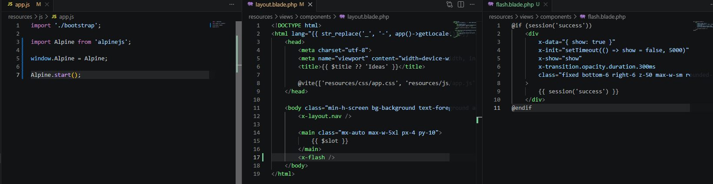
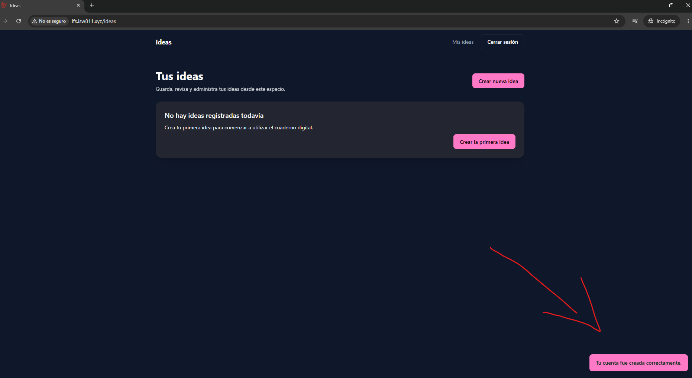

[<- Regresar](../entregable02.md)

# Episodio 27: Flash Messaging and Interactivity with AlpineJS

## Módulo 4: Final Project

## Resumen

En este episodio se trabajó la implementación de mensajes flash y una primera capa de interactividad utilizando AlpineJS.

El objetivo principal fue mostrar mensajes temporales al usuario después de acciones importantes, como registrarse, iniciar sesión o cerrar sesión. Estos mensajes permiten dar retroalimentación visual inmediata sobre el resultado de una acción.

Además, se agregó AlpineJS al proyecto para controlar el comportamiento interactivo del mensaje flash, haciendo que aparezca cuando existe un mensaje en la sesión y desaparezca automáticamente después de unos segundos.

---

## Comandos utilizados

Para entrar a la máquina virtual se utilizó:

```bash
cd ~/ISW811/VMs/webserver
vagrant ssh
```

Dentro de Debian se ingresó al proyecto:

```bash
cd ~/sites/lfs.isw811.xyz
```

Para instalar AlpineJS se utilizó:

```bash
npm install alpinejs
```

Para levantar Vite durante la prueba visual se utilizó:

```bash
npm run dev -- --host 0.0.0.0
```

Para ejecutar las pruebas de autenticación se utilizó:

```bash
./vendor/bin/pest tests/Feature/AuthTest.php
```

También se ejecutaron todas las pruebas Feature para confirmar que el proyecto siguiera funcionando correctamente:

```bash
./vendor/bin/pest tests/Feature
```

---

## Archivos modificados o creados

Los archivos principales trabajados durante este episodio fueron:

* `package.json`
* `package-lock.json`
* `resources/js/app.js`
* `resources/views/components/flash.blade.php`
* `resources/views/components/layout.blade.php`
* `app/Http/Controllers/Auth/RegisteredUserController.php`
* `app/Http/Controllers/Auth/SessionController.php`
* `tests/Feature/AuthTest.php`
* `docs/final-project/27-flash-messaging-and-interactivity-with-alpinejs.md`

---

## Instalación de AlpineJS

Se instaló AlpineJS para agregar interactividad ligera al proyecto sin introducir frameworks más complejos.

```bash
npm install alpinejs
```

Luego se configuró en:

```text
resources/js/app.js
```

```js
import './bootstrap';

import Alpine from 'alpinejs';

window.Alpine = Alpine;

Alpine.start();
```

Esto permite utilizar directivas como `x-data`, `x-show`, `x-init` y `x-transition` dentro de las vistas Blade.

---

## Componente de flash message

Se creó el componente:

```text
resources/views/components/flash.blade.php
```

Este componente revisa si existe un mensaje `success` en la sesión y lo muestra en la parte inferior derecha de la pantalla.

```blade
@if (session('success'))
    <div
        x-data="{ show: true }"
        x-init="setTimeout(() => show = false, 5000)"
        x-show="show"
        x-transition.opacity.duration.300ms
        class="fixed bottom-6 right-6 z-50 max-w-sm rounded-lg border border-primary/30 bg-primary px-4 py-3 text-sm font-medium text-primary-foreground shadow-lg"
    >
        {{ session('success') }}
    </div>
@endif
```

El mensaje se muestra inicialmente y luego desaparece automáticamente después de unos segundos gracias a AlpineJS.

---

## Inclusión del flash en el layout

El componente de flash se agregó al layout principal:

```text
resources/views/components/layout.blade.php
```

```blade
<x-flash />
```

Esto permite que cualquier vista que use el layout principal pueda mostrar mensajes flash sin repetir código.

---

## Mensajes flash en controladores

Se actualizaron los mensajes de autenticación para que la aplicación muestre retroalimentación en español.

Después de crear una cuenta:

```php
return redirect('/ideas')->with('success', 'Tu cuenta fue creada correctamente.');
```

Después de iniciar sesión:

```php
return redirect()->intended('/ideas')->with('success', 'Has iniciado sesión correctamente.');
```

Después de cerrar sesión:

```php
return redirect('/login')->with('success', 'Has cerrado sesión correctamente.');
```

---

## Pruebas actualizadas

Se actualizaron las pruebas de autenticación para validar que los mensajes flash se guarden correctamente en la sesión.

En el registro se agregó:

```php
$response->assertSessionHas('success', 'Tu cuenta fue creada correctamente.');
```

En el inicio de sesión se agregó:

```php
$response->assertSessionHas('success', 'Has iniciado sesión correctamente.');
```

En el cierre de sesión se agregó:

```php
$response->assertSessionHas('success', 'Has cerrado sesión correctamente.');
```

Esto confirma que los controladores no solo redirigen correctamente, sino que también envían el mensaje esperado a la sesión.

---

## Prueba visual

Se probó la funcionalidad desde el navegador registrando un usuario nuevo.

Después del registro, la aplicación redirigió a `/ideas` y mostró el mensaje:

```text
Tu cuenta fue creada correctamente.
```

El mensaje apareció en la parte inferior derecha de la pantalla y desapareció automáticamente después de unos segundos.

---

## Evidencia

Como evidencia de este episodio se agregaron capturas donde se observa la configuración de AlpineJS, el componente de flash message y el mensaje funcionando en el navegador.





---

## Problemas encontrados y solución

No se presentaron errores críticos durante este capítulo.

El punto principal fue integrar AlpineJS correctamente dentro de `resources/js/app.js` y asegurarse de que Vite estuviera corriendo para que los cambios de JavaScript y CSS se aplicaran en el navegador.

También se verificó que los mensajes flash estuvieran en español para mantener consistencia con el resto del proyecto.

---

## Comentarios personales

Este capítulo permitió mejorar la experiencia del usuario al agregar retroalimentación visual después de acciones importantes.

AlpineJS permitió agregar interactividad de forma sencilla, sin cambiar la estructura principal de Laravel ni introducir un framework más pesado. El componente de flash message quedó reutilizable para futuras acciones del proyecto.
