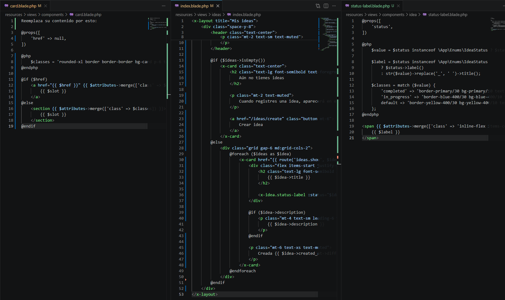
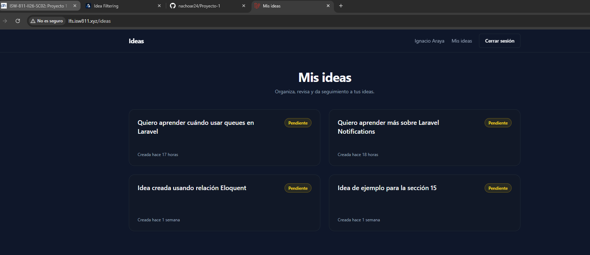

[<- Regresar](../entregable02.md)

# Episodio 28: Idea Cards

## Módulo 4: Final Project

## Resumen

En este episodio se trabajó la visualización inicial de las ideas del usuario mediante tarjetas.

El objetivo principal fue construir una vista más clara para mostrar las ideas registradas en la aplicación. Cada idea ahora se presenta como una card que incluye título, estado, descripción y fecha de creación relativa.

También se extrajeron componentes Blade reutilizables para mantener el código más limpio y facilitar futuras mejoras en la interfaz.

---

## Comandos utilizados

Para entrar a la máquina virtual se utilizó:

```bash
cd ~/ISW811/VMs/webserver
vagrant ssh
```

Dentro de Debian se ingresó al proyecto:

```bash
cd ~/sites/lfs.isw811.xyz
```

Para crear ideas de prueba se utilizó Tinker:

```bash
php artisan tinker
```

Para levantar Vite durante la prueba visual se utilizó:

```bash
npm run dev -- --host 0.0.0.0
```

Para limpiar caché de vistas y configuración se utilizó:

```bash
php artisan view:clear
php artisan optimize:clear
```

Para ejecutar pruebas se utilizó:

```bash
./vendor/bin/pest tests/Feature/IdeaTest.php
./vendor/bin/pest tests/Feature
```

---

## Archivos modificados o creados

Los archivos principales trabajados durante este episodio fueron:

* `routes/web.php`
* `app/Http/Controllers/IdeaController.php`
* `app/Enums/IdeaStatus.php`
* `app/Providers/AppServiceProvider.php`
* `resources/views/ideas/index.blade.php`
* `resources/views/components/card.blade.php`
* `resources/views/components/idea/status-label.blade.php`
* `resources/views/components/layout.blade.php`
* `resources/views/components/layout/nav.blade.php`
* `tests/Feature/IdeaTest.php`
* `docs/final-project/28-idea-cards.md`

---

## Rutas nombradas de ideas

Se actualizaron las rutas de ideas para agregar nombres.

```php
Route::get('/ideas', [IdeaController::class, 'index'])
    ->name('ideas.index');

Route::get('/ideas/{idea}', [IdeaController::class, 'show'])
    ->name('ideas.show');
```

Esto permite generar URLs de forma más clara desde las vistas Blade.

Por ejemplo, las tarjetas de ideas pueden apuntar al detalle de cada idea usando:

```blade
route('ideas.show', $idea)
```

---

## Consulta de ideas del usuario autenticado

En `IdeaController` se actualizó el método `index` para cargar las ideas pertenecientes al usuario autenticado.

```php
public function index()
{
    return view('ideas.index', [
        'ideas' => auth()->user()
            ->ideas()
            ->latest()
            ->get(),
    ]);
}
```

De esta forma, cada usuario ve únicamente sus propias ideas.

---

## Labels del estado en español

Se actualizó el enum `IdeaStatus` para mostrar los estados en español.

```php
public function label(): string
{
    return match ($this) {
        self::Pending => 'Pendiente',
        self::InProgress => 'En progreso',
        self::Completed => 'Completada',
    };
}
```

Esto permite mantener los valores internos en inglés, como `pending`, `in_progress` y `completed`, pero mostrar textos amigables en español dentro de la interfaz.

---

## Componente card

Se actualizó el componente:

```text
resources/views/components/card.blade.php
```

Este componente permite renderizar una tarjeta normal o una tarjeta como enlace, dependiendo de si recibe la propiedad `href`.

```blade
@props([
    'href' => null,
])

@php
    $classes = 'rounded-2xl border border-border bg-card p-6 text-sm text-muted shadow-sm transition duration-200 hover:-translate-y-0.5 hover:border-primary/60 hover:shadow-lg';
@endphp

@if ($href)
    <a href="{{ $href }}" {{ $attributes->merge(['class' => $classes . ' block']) }}>
        {{ $slot }}
    </a>
@else
    <section {{ $attributes->merge(['class' => $classes]) }}>
        {{ $slot }}
    </section>
@endif
```

Esto facilita reutilizar el diseño de tarjetas en diferentes partes del proyecto.

---

## Componente de estado

Se creó el componente:

```text
resources/views/components/idea/status-label.blade.php
```

Este componente recibe el estado de una idea y muestra una etiqueta visual con color diferente según el valor.

```blade
<x-idea.status-label :status="$idea->status" />
```

Los estados se muestran así:

* Pendiente
* En progreso
* Completada

Cada estado utiliza estilos distintos para que sea más fácil identificar el avance de cada idea.

---

## Vista de cards de ideas

Se actualizó la vista:

```text
resources/views/ideas/index.blade.php
```

La vista ahora muestra un encabezado y luego una grilla de tarjetas.

```blade
<div class="grid gap-6 md:grid-cols-2">
    @foreach ($ideas as $idea)
        <x-card href="{{ route('ideas.show', $idea) }}" class="min-h-40">
            ...
        </x-card>
    @endforeach
</div>
```

Cada card muestra:

* título de la idea
* estado
* descripción
* fecha de creación relativa

---

## Compatibilidad con ideas antiguas

Algunas ideas fueron creadas antes de agregar el campo `title`, por lo que tenían el título por defecto `Untitled idea`.

Para evitar que la interfaz se viera incorrecta, se agregó una adaptación temporal en la vista. Si una idea antigua tiene `title` igual a `Untitled idea`, se utiliza la descripción como título visible.

```blade
@php
    $usesLegacyDescriptionAsTitle = $idea->title === 'Untitled idea' && filled($idea->description);

    $title = $usesLegacyDescriptionAsTitle
        ? $idea->description
        : $idea->title;

    $description = $usesLegacyDescriptionAsTitle
        ? null
        : $idea->description;
@endphp
```

Esto permite que las ideas anteriores se vean correctamente sin tener que modificar manualmente los registros existentes.

---

## Fechas relativas en español

Se configuró Carbon para mostrar fechas relativas en español.

En `AppServiceProvider` se agregó:

```php
Carbon::setLocale('es');
```

Además, en la vista de ideas se utilizó:

```blade
Creada {{ $idea->created_at->locale('es')->diffForHumans() }}
```

Con esto, las fechas se muestran como:

```text
Creada hace 1 semana
Creada hace 17 horas
```

---

## Ajustes visuales

También se realizaron ajustes visuales para mejorar la presentación del capítulo:

* Se amplió el ancho máximo del layout.
* Se mejoró el espaciado de las cards.
* Se agregó el nombre del usuario autenticado en la navegación.
* Se mantuvieron los textos visibles del sitio en español.
* Se mejoró la apariencia de las tarjetas con bordes, sombra y efecto hover.

---

## Evidencia

Como evidencia de este episodio se agregaron capturas donde se observa el código de los componentes y la vista de ideas funcionando en el navegador.





---

## Problemas encontrados y solución

Durante la prueba visual apareció texto accidental en la página que decía:

```text
Reemplaza su contenido por esto:
```

Esto ocurrió porque ese texto quedó copiado dentro de la vista Blade. La solución fue reemplazar completamente el contenido de `resources/views/ideas/index.blade.php` por la estructura correcta.

También se observó que varias ideas aparecían con el título `Untitled idea`. Esto ocurrió porque eran registros antiguos creados antes de agregar el campo `title`. Se solucionó temporalmente mostrando la descripción como título cuando el registro conserva ese valor por defecto.

Finalmente, las fechas aparecían en inglés usando `diffForHumans()`. Para solucionarlo se configuró Carbon en español y se aplicó `locale('es')` en la fecha mostrada en las cards.

---

## Comentarios personales

Este capítulo permitió avanzar en la interfaz principal del proyecto final.

La pantalla de ideas ahora tiene una estructura más clara y visualmente organizada. Además, el uso de componentes Blade permite mantener el código más limpio y reutilizable para futuros capítulos, donde se agregarán filtros, detalles, estados y más funcionalidades sobre las ideas.
