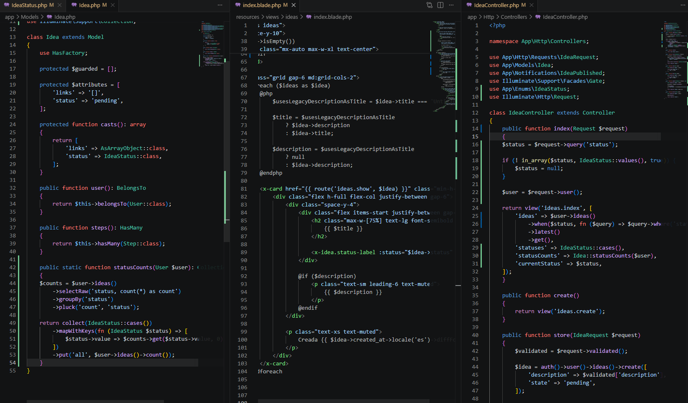
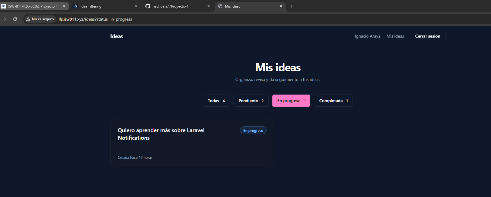

[<- Regresar](../entregable02.md)

# Episodio 29: Idea Filtering

## Módulo 4: Final Project

## Resumen

En este episodio se agregó la funcionalidad de filtrado de ideas por estado.

Ahora la pantalla principal de ideas permite visualizar todas las ideas o filtrar únicamente las ideas que se encuentran en estado pendiente, en progreso o completada.

También se agregaron conteos por cada estado para que el usuario pueda ver cuántas ideas tiene en cada categoría.

---

## Comandos utilizados

Para entrar a la máquina virtual se utilizó:

```bash
cd ~/ISW811/VMs/webserver
vagrant ssh
```

Dentro de Debian se ingresó al proyecto:

```bash
cd ~/sites/lfs.isw811.xyz
```

Para abrir Tinker y ajustar ideas de prueba se utilizó:

```bash
php artisan tinker
```

Para levantar Vite durante la prueba visual se utilizó:

```bash
npm run dev -- --host 0.0.0.0
```

Para limpiar caché de vistas y configuración se utilizó:

```bash
php artisan view:clear
php artisan optimize:clear
```

Para ejecutar pruebas se utilizó:

```bash
./vendor/bin/pest tests/Feature/IdeaTest.php
./vendor/bin/pest tests/Feature
```

---

## Archivos modificados o creados

Los archivos principales trabajados durante este episodio fueron:

* `app/Enums/IdeaStatus.php`
* `app/Models/Idea.php`
* `app/Http/Controllers/IdeaController.php`
* `resources/views/ideas/index.blade.php`
* `tests/Feature/IdeaTest.php`
* `docs/final-project/29-idea-filtering.md`

También se agregaron las siguientes capturas como evidencia:

* `docs/img/29-idea-filtering-code.png`
* `docs/img/29-idea-filtering-browser.png`

---

## Valores disponibles en el enum

En `IdeaStatus` se agregó un método estático llamado `values`.

```php
public static function values(): array
{
    return array_map(
        fn (self $status) => $status->value,
        self::cases()
    );
}
```

Este método permite obtener únicamente los valores internos del enum.

Por ejemplo:

```text
pending
in_progress
completed
```

Esto se utiliza para validar que el filtro recibido por la URL sea válido.

---

## Filtro por estado en el controlador

En `IdeaController` se actualizó el método `index`.

```php
public function index(Request $request)
{
    $status = $request->query('status');

    if (! in_array($status, IdeaStatus::values(), true)) {
        $status = null;
    }

    $user = $request->user();

    return view('ideas.index', [
        'ideas' => $user->ideas()
            ->when($status, fn ($query) => $query->where('status', $status))
            ->latest()
            ->get(),
        'statuses' => IdeaStatus::cases(),
        'statusCounts' => Idea::statusCounts($user),
        'currentStatus' => $status,
    ]);
}
```

El filtro funciona mediante el parámetro `status` en la URL.

Por ejemplo:

```text
/ideas?status=pending
/ideas?status=in_progress
/ideas?status=completed
```

Si no se envía ningún estado, se muestran todas las ideas.

Si se envía un estado inválido, como:

```text
/ideas?status=basura
```

el filtro se ignora y también se muestran todas las ideas.

---

## Uso de `when()` en Eloquent

Para aplicar el filtro solo cuando existe un estado válido, se utilizó el método `when`.

```php
$user->ideas()
    ->when($status, fn ($query) => $query->where('status', $status))
    ->latest()
    ->get();
```

Esto evita escribir condicionales más largos y mantiene la consulta limpia.

Si `$status` tiene un valor válido, se aplica el `where`.

Si `$status` es `null`, la consulta se ejecuta sin filtro.

---

## Conteos por estado

En el modelo `Idea` se agregó el método `statusCounts`.

```php
public static function statusCounts(User $user): Collection
{
    $counts = $user->ideas()
        ->selectRaw('status, count(*) as count')
        ->groupBy('status')
        ->pluck('count', 'status');

    return collect(IdeaStatus::cases())
        ->mapWithKeys(fn (IdeaStatus $status) => [
            $status->value => $counts->get($status->value, 0),
        ])
        ->put('all', $user->ideas()->count());
}
```

Este método calcula cuántas ideas tiene el usuario autenticado en cada estado.

También agrega el conteo general de todas las ideas usando la llave `all`.

Esto permite mostrar números en los filtros, por ejemplo:

```text
Todas 4
Pendiente 2
En progreso 1
Completada 1
```

---

## Filtros visuales en la vista

En la vista `resources/views/ideas/index.blade.php` se agregaron botones de filtro.

```blade
<a
    href="{{ route('ideas.index') }}"
    class="button {{ $currentStatus ? 'button-outline' : '' }}"
>
    Todas
    <span class="pl-1 text-xs">
        {{ $statusCounts->get('all', 0) }}
    </span>
</a>
```

También se recorren los estados disponibles del enum:

```blade
@foreach ($statuses as $status)
    <a
        href="{{ route('ideas.index', ['status' => $status->value]) }}"
        class="button {{ $currentStatus === $status->value ? '' : 'button-outline' }}"
    >
        {{ $status->label() }}

        <span class="pl-1 text-xs">
            {{ $statusCounts->get($status->value, 0) }}
        </span>
    </a>
@endforeach
```

De esta forma se evita duplicar manualmente cada filtro y la vista queda conectada directamente con los estados definidos en el enum.

---

## Estado activo del filtro

La vista también marca visualmente cuál filtro está activo.

Cuando no hay filtro, el botón activo es:

```text
Todas
```

Cuando la URL contiene un estado, por ejemplo:

```text
/ideas?status=in_progress
```

el botón activo pasa a ser:

```text
En progreso
```

---

## Mensaje cuando no hay resultados

Se actualizó el mensaje de la pantalla vacía para diferenciar entre dos casos.

Si el usuario no tiene ideas, se muestra:

```text
Aún no tienes ideas
```

Si el usuario aplicó un filtro pero no hay ideas para ese estado, se muestra:

```text
No hay ideas para este filtro
```

Además, se agregó un botón para volver a ver todas las ideas.

---

## Pruebas agregadas

Se agregaron pruebas en `tests/Feature/IdeaTest.php`.

La primera prueba verifica que las ideas se puedan filtrar por estado.

```php
it('filters ideas by status', function () {
    $user = User::factory()->create();

    Idea::factory()->for($user)->create([
        'title' => 'Idea pendiente',
        'status' => IdeaStatus::Pending,
    ]);

    Idea::factory()->for($user)->create([
        'title' => 'Idea completada',
        'status' => IdeaStatus::Completed,
    ]);

    $response = $this->actingAs($user)->get(route('ideas.index', [
        'status' => IdeaStatus::Completed->value,
    ]));

    $response->assertOk();
    $response->assertSee('Idea completada');
    $response->assertDontSee('Idea pendiente');
});
```

La segunda prueba verifica que un filtro inválido se ignore correctamente.

```php
it('ignores invalid status filters', function () {
    $user = User::factory()->create();

    Idea::factory()->for($user)->create([
        'title' => 'Idea pendiente',
        'status' => IdeaStatus::Pending,
    ]);

    Idea::factory()->for($user)->create([
        'title' => 'Idea completada',
        'status' => IdeaStatus::Completed,
    ]);

    $response = $this->actingAs($user)->get('/ideas?status=basura');

    $response->assertOk();
    $response->assertSee('Idea pendiente');
    $response->assertSee('Idea completada');
});
```

---

## Prueba manual en navegador

Se probaron las siguientes rutas:

```text
http://lfs.isw811.xyz/ideas
http://lfs.isw811.xyz/ideas?status=pending
http://lfs.isw811.xyz/ideas?status=in_progress
http://lfs.isw811.xyz/ideas?status=completed
http://lfs.isw811.xyz/ideas?status=basura
```

El filtro inválido se ignoró correctamente y la página volvió a mostrar todas las ideas.

---

## Evidencia

Como evidencia de este episodio se agregaron capturas del código y del navegador con el filtro funcionando.





---

## Problemas encontrados y solución

Durante la creación de datos de prueba, inicialmente se actualizaron ideas de otro usuario porque se utilizó:

```php
App\Models\User::latest()->first()
```

Esto tomó un usuario diferente al que estaba autenticado en el navegador.

La solución fue buscar directamente el usuario correcto por correo:

```php
$user = App\Models\User::where('email', 'ignacio.araya@ejemplo.com')->first();
```

Después se actualizaron los estados de sus ideas para poder probar correctamente los filtros en el navegador.

---

## Comentarios personales

Este capítulo fue importante porque agregó una forma más práctica de navegar las ideas.

Ahora el usuario puede enfocarse en ideas pendientes, en progreso o completadas sin tener que revisar toda la lista. Además, los conteos por estado hacen que la interfaz sea más informativa y útil.
