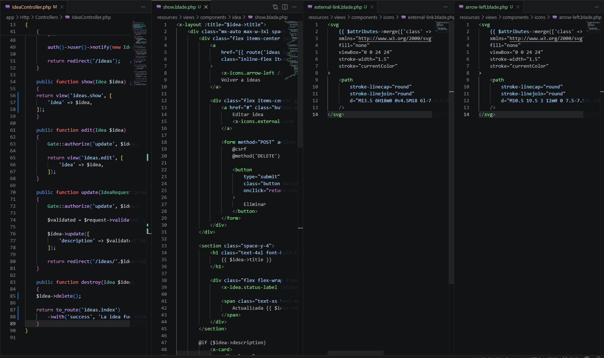
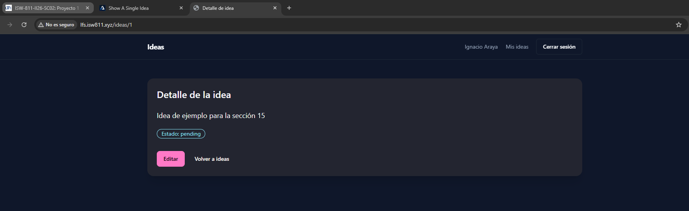

[<- Regresar](../entregable03.md)

# Episodio 30: Show A Single Idea

## Módulo 4: Final Project

## Resumen

En este episodio se implementó la vista individual de una idea.

Antes de este capítulo, las tarjetas de ideas ya permitían hacer clic sobre una idea, pero todavía no existía una vista dedicada para mostrar el detalle del registro seleccionado.

Ahora, al seleccionar una idea desde la pantalla principal, la aplicación muestra una página individual con información más completa, incluyendo título, estado, fecha de actualización, descripción y enlaces relacionados.

También se agregaron acciones visuales para volver al listado de ideas, editar la idea y eliminarla.

---

## Comandos utilizados

Para crear el archivo de documentación se utilizó:

```bash
cd ~/ISW811/VMs/webserver/sites/lfs.isw811.xyz
touch docs/final-project/30-show-a-single-idea.md
```

Para entrar a la máquina virtual se utilizó:

```bash
cd ~/ISW811/VMs/webserver
vagrant ssh
```

Dentro de Debian se ingresó al proyecto:

```bash
cd ~/sites/lfs.isw811.xyz
```

Para levantar Vite durante la prueba visual se utilizó:

```bash
npm run dev -- --host 0.0.0.0
```

Para ejecutar pruebas se utilizó:

```bash
./vendor/bin/pest tests/Feature
```

---

## Archivos modificados o creados

Los archivos principales trabajados durante este episodio fueron:

* `app/Http/Controllers/IdeaController.php`
* `resources/views/ideas/show.blade.php`
* `resources/views/components/icons/arrow-left.blade.php`
* `resources/views/components/icons/external-link.blade.php`
* `docs/final-project/30-show-a-single-idea.md`

También se agregaron las siguientes capturas como evidencia:

* `docs/img/30-show-idea-code.png`
* `docs/img/30-show-idea-browser.png`

---

## Ruta de detalle de idea

La aplicación ya contaba con una ruta para mostrar una idea individual.

```php
Route::get('/ideas/{idea}', [IdeaController::class, 'show'])
    ->name('ideas.show');
```

Esta ruta permite abrir una idea específica mediante una URL como:

```text
/ideas/1
```

Además, las tarjetas de ideas utilizan esta ruta para redirigir al detalle de cada idea.

---

## Método `show` del controlador

En `IdeaController` se actualizó el método `show` para devolver la vista individual de una idea.

```php
public function show(Idea $idea)
{
    return view('ideas.show', [
        'idea' => $idea,
    ]);
}
```

Laravel utiliza Route Model Binding para recibir automáticamente la instancia de `Idea` correspondiente al identificador presente en la URL.

---

## Acción de eliminación

También se agregó la lógica básica para eliminar una idea desde la página individual.

```php
public function destroy(Idea $idea)
{
    $idea->delete();

    return to_route('ideas.index')
        ->with('success', 'La idea fue eliminada correctamente.');
}
```

Después de eliminar una idea, el usuario es redirigido nuevamente al listado principal.

La autorización de esta acción se trabajará con mayor profundidad en episodios posteriores del entregable.

---

## Componentes de íconos

Se creó una carpeta para íconos reutilizables:

```text
resources/views/components/icons/
```

Dentro de esta carpeta se agregaron componentes Blade con SVG.

El componente de flecha hacia atrás se creó en:

```text
resources/views/components/icons/arrow-left.blade.php
```

Este ícono se utiliza en el enlace para volver al listado de ideas.

También se creó el componente:

```text
resources/views/components/icons/external-link.blade.php
```

Este ícono se utiliza para representar enlaces externos o acciones relacionadas.

El uso de íconos como componentes Blade permite reutilizarlos fácilmente y aplicar estilos mediante clases de TailwindCSS.

---

## Vista individual de idea

Se creó la vista:

```text
resources/views/ideas/show.blade.php
```

Esta vista utiliza el layout principal del proyecto y muestra la información de una idea específica.

```blade
<x-layout :title="$idea->title">
    <div class="mx-auto max-w-3xl space-y-8">
        ...
    </div>
</x-layout>
```

La página incluye:

* enlace para volver al listado de ideas
* botón visual para editar la idea
* botón para eliminar la idea
* título de la idea
* estado de la idea
* fecha de actualización relativa
* descripción
* enlaces relacionados

---

## Estado y fecha de actualización

La vista muestra el estado actual de la idea utilizando el componente creado en capítulos anteriores.

```blade
<x-idea.status-label :status="$idea->status" />
```

También se muestra la fecha de actualización en formato relativo y en español.

```blade
Actualizada {{ $idea->updated_at->locale('es')->diffForHumans() }}
```

Esto permite mostrar textos como:

```text
Actualizada hace 2 horas
```

---

## Descripción de la idea

La descripción se muestra dentro del componente reutilizable `x-card`.

```blade
@if ($idea->description)
    <x-card>
        <div class="max-w-none text-sm leading-7 text-muted">
            {{ $idea->description }}
        </div>
    </x-card>
@endif
```

Esto mantiene consistencia visual con las tarjetas utilizadas en el listado principal de ideas.

---

## Enlaces relacionados

La vista también muestra los enlaces asociados a una idea, cuando existen.

```blade
@if (filled($idea->links))
    <section class="space-y-3">
        <h2 class="text-lg font-semibold text-foreground">
            Enlaces relacionados
        </h2>

        <div class="space-y-2">
            @foreach ($idea->links as $link)
                <x-card
                    href="{{ $link }}"
                    target="_blank"
                    rel="noopener noreferrer"
                    class="flex items-center justify-between gap-4 font-semibold text-primary"
                >
                    <span class="truncate">
                        {{ $link }}
                    </span>

                    <x-icons.external-link class="shrink-0" />
                </x-card>
            @endforeach
        </div>
    </section>
@endif
```

Cada enlace se muestra como una tarjeta clickeable y se abre en una nueva pestaña.

---

## Prueba manual en navegador

Se probó la pantalla principal de ideas:

```text
http://lfs.isw811.xyz/ideas
```

Luego se hizo clic en una tarjeta para abrir una idea individual.

La página de detalle mostró correctamente:

* botón para volver a ideas
* botón de editar idea
* botón de eliminar
* título de la idea
* estado
* fecha de actualización
* descripción
* enlaces relacionados

---

## Evidencia

Como evidencia de este episodio se agregaron capturas del código y del navegador con la vista individual funcionando.





---

## Problemas encontrados y solución

Durante este episodio no se presentaron problemas importantes.

La funcionalidad principal se implementó creando la vista `show.blade.php`, conectándola con el método `show` del controlador y reutilizando componentes Blade ya existentes como `x-layout`, `x-card` y `x-idea.status-label`.

---

## Comentarios personales

Este capítulo fue importante porque permitió completar el flujo básico entre el listado de ideas y la vista individual de cada registro.

Ahora el usuario puede seleccionar una idea y revisar su información con mayor detalle. Esta pantalla servirá como base para próximas funcionalidades, como modales, formularios de edición, pasos accionables, imágenes destacadas y autorización avanzada.
