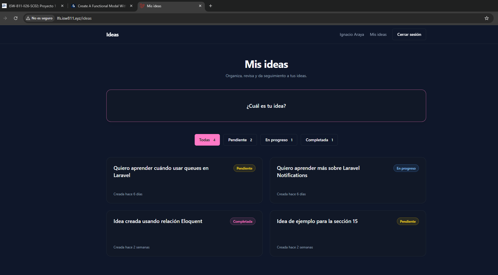
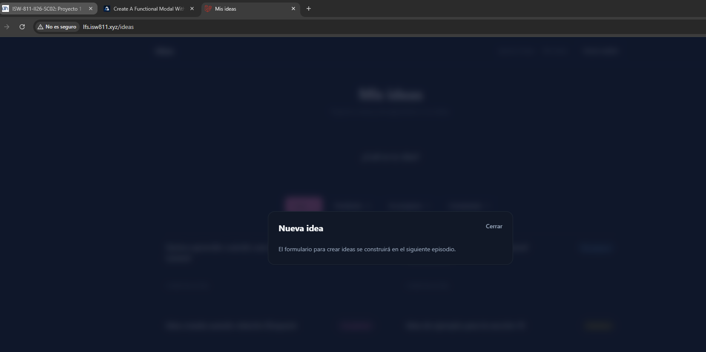

[<- Regresar](../entregable03.md)

# Episodio 31: Create A Functional Modal With AlpineJS

## Módulo 4: Final Project

## Resumen

En este episodio se implementó un modal funcional utilizando AlpineJS.

El objetivo principal fue agregar una tarjeta interactiva en la pantalla principal de ideas. Al hacer clic sobre el recuadro **“¿Cuál es tu idea?”**, se dispara un evento del navegador llamado `open-modal`, el cual es escuchado por un componente reutilizable de modal.

El modal creado en este episodio todavía no contiene el formulario definitivo para crear ideas. Su propósito es dejar lista la estructura interactiva que será utilizada en el siguiente capítulo para construir el formulario real.

---

## Comandos utilizados

Para crear el archivo de documentación se utilizó:

```bash
cd ~/ISW811/VMs/webserver/sites/lfs.isw811.xyz
touch docs/final-project/31-create-a-functional-modal-with-alpinejs.md
```

Para entrar a la máquina virtual se utilizó:

```bash
cd ~/ISW811/VMs/webserver
vagrant ssh
```

Dentro de Debian se ingresó al proyecto:

```bash
cd ~/sites/lfs.isw811.xyz
```

Para levantar Vite durante la prueba visual se utilizó:

```bash
npm run dev -- --host 0.0.0.0
```

Para limpiar caché de Laravel se utilizó:

```bash
php artisan view:clear
php artisan optimize:clear
```

Para ejecutar pruebas se utilizó:

```bash
./vendor/bin/pest tests/Feature
```

---

## Archivos modificados o creados

Los archivos principales trabajados durante este episodio fueron:

* `resources/views/ideas/index.blade.php`
* `resources/views/components/modal.blade.php`
* `resources/views/components/card.blade.php`
* `resources/css/app.css`
* `vite.config.js`
* `docs/final-project/31-create-a-functional-modal-with-alpinejs.md`

También se agregaron las siguientes capturas como evidencia:

* `docs/img/31-functional-modal-trigger.png`
* `docs/img/31-functional-modal-open.png`

---

## Tarjeta para abrir el modal

En la vista principal de ideas se agregó una nueva tarjeta interactiva.

```blade
<x-card
    as="button"
    onclick="window.dispatchEvent(new CustomEvent('open-modal', { detail: 'create-idea' }))"
    class="flex h-28 w-full items-center justify-center text-center"
>
    <span class="text-lg font-semibold text-foreground">
        ¿Cuál es tu idea?
    </span>
</x-card>
```

Esta tarjeta funciona como botón y dispara un evento global del navegador llamado `open-modal`.

El detalle del evento contiene el nombre del modal que se desea abrir:

```text
create-idea
```

Esto permite que el componente modal pueda identificar si debe mostrarse o no.

---

## Actualización del componente card

Se actualizó el componente reutilizable `x-card` para soportar diferentes tipos de elemento HTML.

Ahora el componente puede renderizarse como:

* `section`
* `a`
* `button`

Esto permite reutilizar el mismo estilo visual de tarjeta en diferentes contextos.

```blade
@props([
    'href' => null,
    'as' => null,
])

@php
    $tag = $as ?? ($href ? 'a' : 'section');

    $classes = 'rounded-2xl border border-border bg-card p-6 text-sm text-muted shadow-sm transition duration-200 hover:-translate-y-0.5 hover:border-primary/60 hover:shadow-lg';
@endphp
```

Cuando se utiliza como botón, se renderiza con `type="button"` para evitar comportamientos no deseados dentro de formularios.

```blade
@elseif ($tag === 'button')
    <button type="button" {{ $attributes->merge(['class' => $classes . ' block']) }}>
        {{ $slot }}
    </button>
@endif
```

---

## Componente reutilizable de modal

Se creó el componente:

```text
resources/views/components/modal.blade.php
```

Este componente recibe dos propiedades principales:

```blade
@props([
    'name',
    'title',
])
```

La propiedad `name` permite identificar el modal.

La propiedad `title` define el título visible dentro del modal.

---

## Funcionamiento con AlpineJS

El modal utiliza AlpineJS para controlar su estado interno.

```blade
x-data="{ show: false, modalName: @js($name) }"
```

La variable `show` controla si el modal está visible o no.

El modal escucha el evento `open-modal` desde la ventana del navegador.

```blade
x-on:open-modal.window="if ($event.detail === modalName) show = true"
```

Cuando el detalle del evento coincide con el nombre del modal, AlpineJS cambia `show` a `true` y el modal se muestra.

---

## Cierre del modal

El modal puede cerrarse de varias formas:

* usando el botón **Cerrar**
* presionando la tecla `Esc`
* haciendo clic sobre el fondo del modal

Para cerrar con `Esc` se utilizó:

```blade
x-on:keydown.escape.window="show = false"
```

Para cerrar al hacer clic en el fondo se utilizó:

```blade
x-on:click.self="show = false"
```

El botón de cierre utiliza:

```blade
x-on:click="show = false"
```

---

## Transiciones visuales

Se agregaron transiciones con AlpineJS para que el modal aparezca y desaparezca de forma más suave.

```blade
x-transition:enter="duration-200 ease-out"
x-transition:enter-start="opacity-0"
x-transition:enter-end="opacity-100"
x-transition:leave="duration-150 ease-in"
x-transition:leave-start="opacity-100"
x-transition:leave-end="opacity-0"
```

Esto mejora la experiencia visual al abrir y cerrar el modal.

---

## Prevención de parpadeo con `x-cloak`

Para evitar que el modal aparezca por un instante antes de que AlpineJS cargue, se agregó la regla `x-cloak` en `resources/css/app.css`.

```css
[x-cloak] {
    display: none !important;
}
```

Esto mantiene oculto el modal hasta que AlpineJS esté listo.

---

## Ajuste en Vite por CORS

Durante la prueba del modal se detectó que AlpineJS no estaba cargando correctamente porque el navegador bloqueaba `resources/js/app.js` por una política CORS.

El error ocurría porque Vite estaba enviando un origen distinto al origen real de la aplicación.

Para solucionarlo, se actualizó `vite.config.js`, eliminando la propiedad `origin` y agregando `cors: true`.

```js
server: {
    host: '0.0.0.0',
    port: 5173,
    strictPort: true,
    cors: true,
    hmr: {
        host: 'lfs.isw811.xyz',
        port: 5173,
    },
    watch: {
        usePolling: true,
    },
},
```

Después de reiniciar Vite, AlpineJS cargó correctamente y el modal comenzó a funcionar.

---

## Modal agregado en la vista de ideas

Al final de la vista `resources/views/ideas/index.blade.php` se agregó el componente modal.

```blade
<x-modal name="create-idea" title="Nueva idea">
    <p class="text-sm leading-6 text-muted">
        El formulario para crear ideas se construirá en el siguiente episodio.
    </p>
</x-modal>
```

Este modal queda preparado para recibir el formulario de creación de ideas en el siguiente capítulo.

---

## Prueba manual en navegador

Se probó la vista principal:

```text
http://lfs.isw811.xyz/ideas
```

En la página se verificó que apareciera el recuadro:

```text
¿Cuál es tu idea?
```

Luego se hizo clic sobre el recuadro y se abrió correctamente el modal con el título:

```text
Nueva idea
```

También se verificó que el modal pudiera cerrarse mediante:

* botón **Cerrar**
* tecla `Esc`
* clic fuera del contenido del modal

---

## Evidencia

Como evidencia de este episodio se agregaron capturas del navegador antes y después de abrir el modal.





---

## Problemas encontrados y solución

Durante la implementación, el modal no abría al hacer clic en la tarjeta **“¿Cuál es tu idea?”**.

Al revisar la consola del navegador se encontraron errores CORS relacionados con Vite:

```text
Access to script at 'http://lfs.isw811.xyz:5173/resources/js/app.js' from origin 'http://lfs.isw811.xyz' has been blocked by CORS policy.
```

Esto impedía que `resources/js/app.js` cargara correctamente y, por lo tanto, AlpineJS no estaba disponible en la página.

La solución fue actualizar `vite.config.js`, removiendo la configuración de `origin` y agregando `cors: true`.

Después de reiniciar Vite y refrescar el navegador, AlpineJS cargó correctamente y el modal funcionó como se esperaba.

---

## Comentarios personales

Este capítulo fue importante porque agregó una base reutilizable para modales dentro del proyecto.

El componente `x-modal` permitirá construir formularios más avanzados en los siguientes episodios, especialmente para crear y editar ideas. Además, se reforzó el uso de AlpineJS para manejar eventos del navegador, estados internos, transiciones y comportamiento interactivo sin necesidad de escribir JavaScript complejo.
