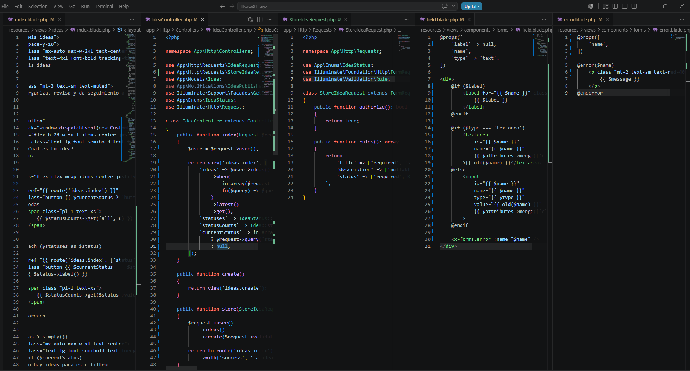
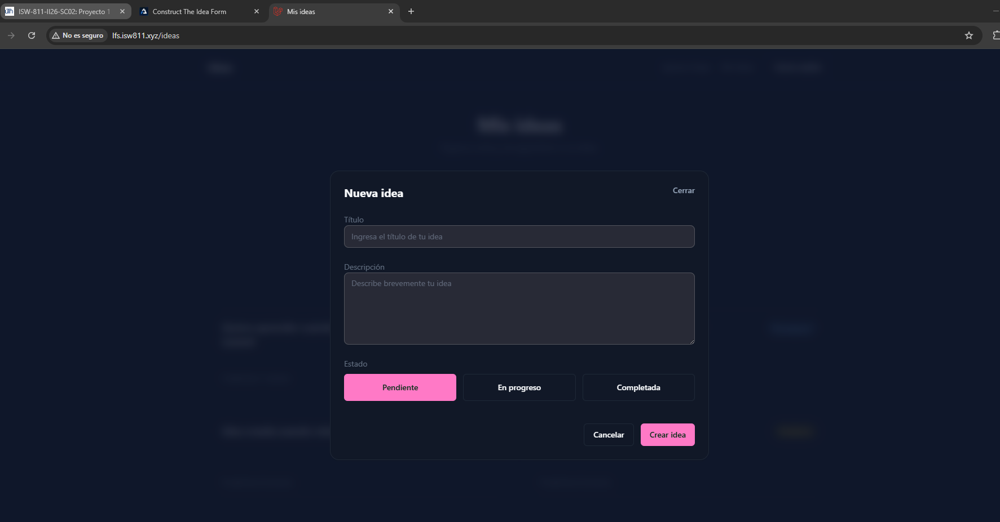

[<- Regresar](../entregable03.md)

# Episodio 32: Construct The Idea Form

## Módulo 4: Final Project

## Resumen

En este episodio se construyó el formulario para crear ideas dentro del modal implementado en el capítulo anterior.

Antes de este episodio, el modal solamente mostraba un mensaje temporal indicando que el formulario se construiría más adelante. Ahora el modal contiene un formulario funcional que permite registrar una nueva idea con título, descripción y estado.

También se agregó validación mediante un Form Request, soporte para campos tipo `textarea`, mensajes de error reutilizables y lógica en el controlador para guardar la idea asociada al usuario autenticado.

---

## Comandos utilizados

Para crear el archivo de documentación se utilizó:

```bash
cd ~/ISW811/VMs/webserver/sites/lfs.isw811.xyz
touch docs/final-project/32-construct-the-idea-form.md
```

Para entrar a la máquina virtual se utilizó:

```bash
cd ~/ISW811/VMs/webserver
vagrant ssh
```

Dentro de Debian se ingresó al proyecto:

```bash
cd ~/sites/lfs.isw811.xyz
```

Para crear el Form Request, en caso de no existir, se utilizó:

```bash
php artisan make:request StoreIdeaRequest
```

Para levantar Vite durante la prueba visual se utilizó:

```bash
npm run dev -- --host 0.0.0.0
```

Para ejecutar pruebas se utilizó:

```bash
./vendor/bin/pest tests/Feature
```

---

## Archivos modificados o creados

Los archivos principales trabajados durante este episodio fueron:

* `routes/web.php`
* `app/Http/Controllers/IdeaController.php`
* `app/Http/Requests/StoreIdeaRequest.php`
* `app/Models/Idea.php`
* `resources/views/ideas/index.blade.php`
* `resources/views/components/modal.blade.php`
* `resources/views/components/forms/field.blade.php`
* `resources/views/components/forms/error.blade.php`
* `docs/final-project/32-construct-the-idea-form.md`

También se agregaron las siguientes capturas como evidencia:

* `docs/img/32-idea-form-code.png`
* `docs/img/32-idea-form-browser.png`

---

## Ruta para crear ideas

El formulario utiliza la ruta `ideas.store`, la cual recibe una solicitud `POST` hacia `/ideas`.

```php
Route::post('/ideas', [IdeaController::class, 'store'])
    ->name('ideas.store');
```

Esta ruta se encuentra protegida dentro del grupo de middleware `auth`, por lo que solamente usuarios autenticados pueden crear ideas.

---

## Formulario dentro del modal

En la vista principal de ideas se reemplazó el texto temporal del modal por un formulario funcional.

```blade
<x-modal name="create-idea" title="Nueva idea">
    <form
        method="POST"
        action="{{ route('ideas.store') }}"
        x-data="{ status: @js(old('status', \App\Enums\IdeaStatus::Pending->value)) }"
        class="space-y-6"
    >
        @csrf

        ...
    </form>
</x-modal>
```

El formulario envía los datos mediante método `POST` y utiliza protección CSRF.

Además, usa AlpineJS para manejar el estado seleccionado de la idea antes de enviar el formulario.

---

## Campo de título

El campo de título es obligatorio.

```blade
<x-forms.field
    label="Título"
    name="title"
    placeholder="Ingresa el título de tu idea"
    required
    autofocus
/>
```

Este campo es el dato principal para crear una idea.

Si el usuario intenta enviar el formulario sin título, el navegador impide el envío gracias al atributo `required`.

---

## Campo de descripción

Se agregó soporte para descripción mediante un campo tipo `textarea`.

```blade
<x-forms.field
    label="Descripción"
    name="description"
    type="textarea"
    placeholder="Describe brevemente tu idea"
/>
```

La descripción es opcional y permite ampliar la información de la idea.

---

## Actualización del componente field

El componente `x-forms.field` fue actualizado para soportar tanto inputs normales como textareas.

```blade
@if ($type === 'textarea')
    <textarea
        id="{{ $name }}"
        name="{{ $name }}"
        {{ $attributes->merge(['class' => 'textarea min-h-32 w-full']) }}
    >{{ old($name) }}</textarea>
@else
    <input
        id="{{ $name }}"
        name="{{ $name }}"
        type="{{ $type }}"
        value="{{ old($name) }}"
        {{ $attributes->merge(['class' => 'input w-full']) }}
    >
@endif
```

Esto permite reutilizar el mismo componente para distintos tipos de campos en el proyecto.

---

## Componente de error

Se creó el componente:

```text
resources/views/components/forms/error.blade.php
```

Este componente permite mostrar mensajes de validación de forma reutilizable.

```blade
@props([
    'name',
])

@error($name)
    <p class="mt-2 text-sm text-red-400">
        {{ $message }}
    </p>
@enderror
```

Luego, el componente `field` utiliza este componente para mostrar errores automáticamente debajo del campo correspondiente.

```blade
<x-forms.error :name="$name" />
```

---

## Selector visual de estado

El formulario incluye un selector visual para el estado de la idea.

Los estados se generan a partir del enum `IdeaStatus`.

```blade
@foreach (\App\Enums\IdeaStatus::cases() as $status)
    <button
        type="button"
        x-on:click="status = @js($status->value)"
        x-bind:class="{ 'button-outline': status !== @js($status->value) }"
        class="button h-12"
    >
        {{ $status->label() }}
    </button>
@endforeach
```

Esto permite seleccionar entre:

* Pendiente
* En progreso
* Completada

El estado seleccionado se guarda en AlpineJS y se envía mediante un input oculto.

```blade
<input
    id="status"
    name="status"
    type="hidden"
    x-bind:value="status"
>
```

---

## Botones del formulario

El formulario incluye dos acciones principales:

* Cancelar
* Crear idea

```blade
<footer class="flex items-center justify-end gap-3 pt-4">
    <button
        type="button"
        class="button button-outline"
        x-on:click="$dispatch('close-modal')"
    >
        Cancelar
    </button>

    <button type="submit" class="button">
        Crear idea
    </button>
</footer>
```

El botón **Cancelar** dispara el evento `close-modal`, mientras que el botón **Crear idea** envía el formulario al servidor.

---

## Cierre del modal desde el formulario

El componente modal fue actualizado para escuchar el evento `close-modal`.

```blade
x-on:close-modal.window="show = false"
```

Gracias a esto, el botón **Cancelar** puede cerrar el modal sin recargar la página.

---

## Ajuste visual del modal

Se amplió el modal para que el formulario tenga más espacio.

```blade
<x-card class="relative max-h-[85vh] w-full max-w-2xl overflow-y-auto shadow-2xl">
```

Esto permite que el contenido del formulario se vea mejor y que el modal pueda hacer scroll si su contenido crece.

---

## Form Request para crear ideas

Se creó o actualizó el archivo:

```text
app/Http/Requests/StoreIdeaRequest.php
```

Este Form Request autoriza la solicitud y define las reglas de validación.

```php
public function authorize(): bool
{
    return true;
}

public function rules(): array
{
    return [
        'title' => ['required', 'string', 'max:255'],
        'description' => ['nullable', 'string'],
        'status' => ['required', Rule::in(IdeaStatus::values())],
    ];
}
```

El título es obligatorio, la descripción es opcional y el estado debe pertenecer a los valores permitidos del enum `IdeaStatus`.

---

## Método store del controlador

En `IdeaController` se implementó el método `store`.

```php
public function store(StoreIdeaRequest $request)
{
    $request->user()
        ->ideas()
        ->create($request->validated());

    return to_route('ideas.index')
        ->with('success', 'La idea fue creada correctamente.');
}
```

La idea se crea a partir del usuario autenticado, usando la relación `ideas()`.

Esto permite asociar automáticamente la nueva idea al usuario que la creó.

---

## Ordenamiento de ideas

La lista de ideas continúa utilizando `latest()` para mostrar las ideas más recientes primero.

```php
$user->ideas()
    ->latest()
    ->get();
```

Esto permite que una idea recién creada aparezca en la parte superior del listado.

---

## Modelo Idea

El modelo `Idea` mantiene asignación masiva habilitada mediante:

```php
protected $guarded = [];
```

También conserva valores por defecto para `links` y `status`.

```php
protected $attributes = [
    'links' => '[]',
    'status' => 'pending',
];
```

El campo `status` se castea al enum `IdeaStatus`.

```php
protected function casts(): array
{
    return [
        'links' => AsArrayObject::class,
        'status' => IdeaStatus::class,
    ];
}
```

Esto permite trabajar con estados de forma más segura y organizada.

---

## Prueba manual en navegador

Se probó la vista principal:

```text
http://lfs.isw811.xyz/ideas
```

Luego se realizó el siguiente flujo:

1. Clic en **¿Cuál es tu idea?**
2. Se abrió el modal **Nueva idea**.
3. Se completó el campo **Título**.
4. Se completó opcionalmente la **Descripción**.
5. Se seleccionó un estado.
6. Se hizo clic en **Crear idea**.
7. La aplicación redirigió al listado de ideas.
8. Se mostró el mensaje flash de éxito.
9. La nueva idea apareció en el listado.

---

## Evidencia

Como evidencia de este episodio se agregaron capturas del código y del formulario funcionando en el navegador.





---

## Problemas encontrados y solución

Durante este episodio no se presentaron errores críticos.

Se revisó el modelo `Idea` para confirmar que los campos pudieran guardarse correctamente. El modelo utiliza `protected $guarded = [];`, por lo que no fue necesario agregar un arreglo `$fillable`.

También se verificó que el campo `status` estuviera casteado al enum `IdeaStatus`, permitiendo guardar y leer el estado de forma consistente.

---

## Comentarios personales

Este capítulo fue importante porque convirtió el modal creado anteriormente en una funcionalidad real para el usuario.

Ahora la aplicación permite crear ideas directamente desde la pantalla principal, sin necesidad de navegar a otra página. Además, se reforzó el uso de componentes Blade reutilizables, validación con Form Request y AlpineJS para manejar interactividad en formularios.
