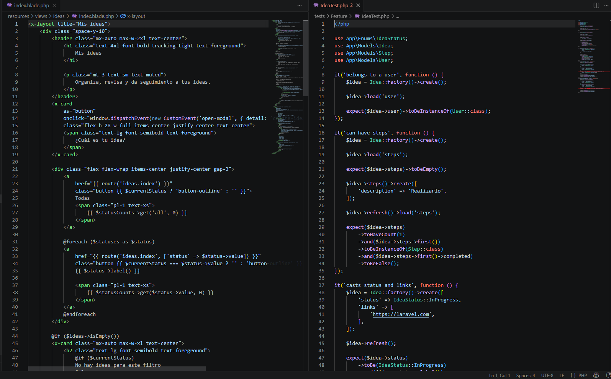
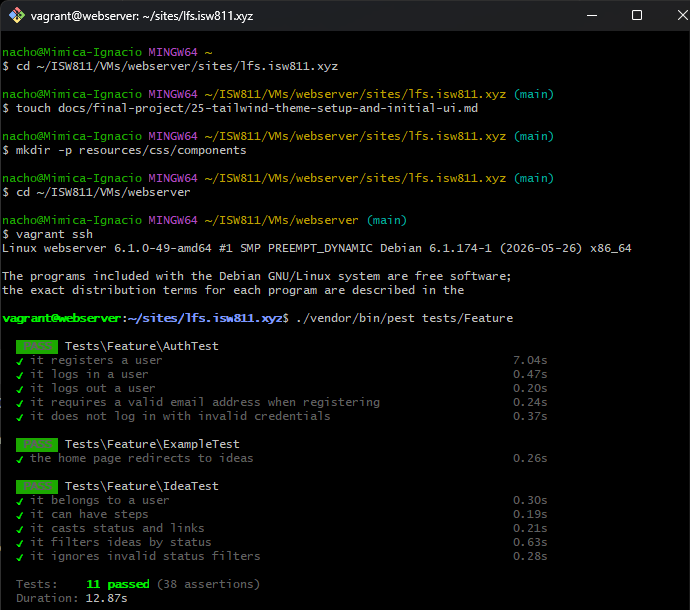

[<- Regresar](../entregable03.md)

# Episodio 33: Test The Create Idea Form

## Módulo 4: Final Project

## Resumen

En este episodio se trabajó en la automatización del formulario para crear ideas.

Hasta este punto, el modal de creación de ideas ya funcionaba visualmente y permitía crear registros desde la pantalla principal. Sin embargo, esa funcionalidad todavía dependía de pruebas manuales en el navegador.

Para reducir el riesgo de que el formulario se rompa sin darnos cuenta, se agregaron pruebas automatizadas que validan el flujo principal de creación de ideas.

También se agregaron atributos `data-test` en elementos importantes del formulario para facilitar pruebas automatizadas más estables en el futuro.

---

## Comandos utilizados

Para crear el archivo de documentación se utilizó:

```bash
cd ~/ISW811/VMs/webserver/sites/lfs.isw811.xyz
touch docs/final-project/33-test-the-create-idea-form.md
```

Para entrar a la máquina virtual se utilizó:

```bash
cd ~/ISW811/VMs/webserver
vagrant ssh
```

Dentro de Debian se ingresó al proyecto:

```bash
cd ~/sites/lfs.isw811.xyz
```

Para ejecutar solamente las pruebas de ideas se utilizó:

```bash
./vendor/bin/pest tests/Feature/IdeaTest.php
```

Para ejecutar todas las pruebas Feature se utilizó:

```bash
./vendor/bin/pest tests/Feature
```

---

## Archivos modificados o creados

Los archivos principales trabajados durante este episodio fueron:

* `resources/views/ideas/index.blade.php`
* `tests/Feature/IdeaTest.php`
* `docs/final-project/33-test-the-create-idea-form.md`

También se agregaron las siguientes capturas como evidencia:

* `docs/img/33-create-idea-test-code.png`
* `docs/img/33-create-idea-test-passing.png`

---

## Atributo data-test para abrir el modal

En la vista principal de ideas se agregó un atributo `data-test` al recuadro que abre el modal de creación.

```blade
<x-card
    as="button"
    data-test="create-idea-button"
    onclick="window.dispatchEvent(new CustomEvent('open-modal', { detail: 'create-idea' }))"
    class="flex h-28 w-full items-center justify-center text-center"
>
    <span class="text-lg font-semibold text-foreground">
        ¿Cuál es tu idea?
    </span>
</x-card>
```

Este atributo permite identificar el botón de forma más confiable dentro de pruebas automatizadas.

En vez de depender del texto visible, se puede seleccionar el elemento usando:

```text
create-idea-button
```

---

## Atributo data-test para el formulario

También se agregó un atributo `data-test` al formulario de creación de ideas.

```blade
<form
    method="POST"
    action="{{ route('ideas.store') }}"
    x-data="{ status: @js(old('status', \App\Enums\IdeaStatus::Pending->value)) }"
    data-test="create-idea-form"
    class="space-y-6"
>
```

Esto permite ubicar el formulario de forma directa en pruebas futuras.

---

## Atributos data-test para los estados

Los botones de estado también recibieron atributos `data-test`.

```blade
@foreach (\App\Enums\IdeaStatus::cases() as $status)
    <button
        type="button"
        data-test="status-button-{{ $status->value }}"
        x-on:click="status = @js($status->value)"
        x-bind:class="{ 'button-outline': status !== @js($status->value) }"
        class="button h-12"
    >
        {{ $status->label() }}
    </button>
@endforeach
```

Esto genera selectores como:

```text
status-button-pending
status-button-in_progress
status-button-completed
```

De esta forma, cada estado puede seleccionarse programáticamente sin depender del texto visible del botón.

---

## Atributos data-test para los botones del formulario

Se agregaron atributos a los botones principales del formulario.

```blade
<footer class="flex items-center justify-end gap-3 pt-4">
    <button
        type="button"
        data-test="cancel-create-idea-button"
        class="button button-outline"
        x-on:click="$dispatch('close-modal')"
    >
        Cancelar
    </button>

    <button
        type="submit"
        data-test="submit-create-idea-button"
        class="button"
    >
        Crear idea
    </button>
</footer>
```

Con esto quedan identificadas las acciones principales:

* cancelar creación
* enviar formulario de creación

---

## Adaptación de pruebas

El episodio original trabaja la automatización desde una prueba tipo browser.

En este proyecto se mantuvo la adaptación utilizada desde capítulos anteriores, usando **Pest Feature Tests** debido a la compatibilidad del ambiente de desarrollo.

Aunque no se ejecutó una prueba browser real, se validó el comportamiento más importante del formulario:

* usuario autenticado crea una idea
* la idea queda asociada al usuario correcto
* el título es obligatorio
* el estado debe ser válido
* la aplicación redirige correctamente
* se muestra mensaje flash de éxito

---

## Prueba de creación de idea

Se agregó una prueba para confirmar que un usuario autenticado pueda crear una idea correctamente.

```php
it('creates a new idea', function () {
    $user = User::factory()->create();

    $title = 'Comprar una propiedad';
    $description = 'Analizar opciones de inversión inmobiliaria.';

    $response = $this
        ->actingAs($user)
        ->post(route('ideas.store'), [
            'title' => $title,
            'description' => $description,
            'status' => IdeaStatus::Completed->value,
        ]);

    $response
        ->assertRedirect(route('ideas.index'))
        ->assertSessionHas('success', 'La idea fue creada correctamente.');

    $this->assertDatabaseHas('ideas', [
        'user_id' => $user->id,
        'title' => $title,
        'description' => $description,
        'status' => IdeaStatus::Completed->value,
    ]);

    expect($user->ideas()->count())->toBe(1);

    $idea = $user->ideas()->first();

    expect($idea)
        ->not->toBeNull()
        ->and($idea->title)->toBe($title)
        ->and($idea->description)->toBe($description)
        ->and($idea->status)->toBe(IdeaStatus::Completed);
});
```

Esta prueba confirma que los datos enviados por el formulario se guardan correctamente en la base de datos.

También valida que la idea creada pertenece al usuario autenticado.

---

## Prueba de título obligatorio

Se agregó una prueba para confirmar que no se pueda crear una idea sin título.

```php
it('requires a title when creating an idea', function () {
    $user = User::factory()->create();

    $response = $this
        ->actingAs($user)
        ->post(route('ideas.store'), [
            'title' => '',
            'description' => 'Descripción sin título.',
            'status' => IdeaStatus::Pending->value,
        ]);

    $response->assertSessionHasErrors('title');

    expect($user->ideas()->count())->toBe(0);
});
```

Esta prueba asegura que la regla de validación del campo `title` funciona correctamente.

---

## Prueba de estado válido

Se agregó una prueba para confirmar que el estado enviado debe pertenecer a los valores permitidos del enum `IdeaStatus`.

```php
it('requires a valid status when creating an idea', function () {
    $user = User::factory()->create();

    $response = $this
        ->actingAs($user)
        ->post(route('ideas.store'), [
            'title' => 'Idea con estado inválido',
            'description' => 'Esta idea no debe guardarse.',
            'status' => 'invalid-status',
        ]);

    $response->assertSessionHasErrors('status');

    expect($user->ideas()->count())->toBe(0);
});
```

Esta prueba evita que se guarden ideas con estados no soportados por la aplicación.

---

## Validaciones cubiertas

Las pruebas automatizadas cubren las reglas principales del formulario de creación:

```php
'title' => ['required', 'string', 'max:255'],
'description' => ['nullable', 'string'],
'status' => ['required', Rule::in(IdeaStatus::values())],
```

Esto permite tener mayor seguridad sobre el funcionamiento del endpoint `ideas.store`.

---

## Prueba manual complementaria

Además de las pruebas automatizadas, se mantuvo una revisión visual del formulario desde:

```text
http://lfs.isw811.xyz/ideas
```

Se confirmó que el modal sigue abriendo correctamente desde el recuadro:

```text
¿Cuál es tu idea?
```

También se verificó que el formulario visual conserva sus campos y botones principales.

---

## Evidencia

Como evidencia de este episodio se agregaron capturas del código y de las pruebas ejecutadas correctamente.





---

## Problemas encontrados y solución

Durante este episodio no se presentaron problemas críticos.

Se decidió mantener el enfoque de pruebas Feature con Pest, ya utilizado en capítulos anteriores, para asegurar compatibilidad con el ambiente del proyecto.

Aunque el episodio original se enfoca en pruebas browser, las pruebas implementadas validan directamente el comportamiento más importante del formulario: la creación real de una idea, sus validaciones y su asociación con el usuario autenticado.

---

## Comentarios personales

Este capítulo fue importante porque permitió dejar protegida la funcionalidad de creación de ideas mediante pruebas automatizadas.

Ahora, si en capítulos posteriores se modifica el formulario, el controlador, el Form Request o el modelo, las pruebas ayudarán a detectar rápidamente si la creación de ideas deja de funcionar correctamente.

También se agregaron atributos `data-test`, los cuales dejan preparada la interfaz para posibles pruebas browser más completas en el futuro.
