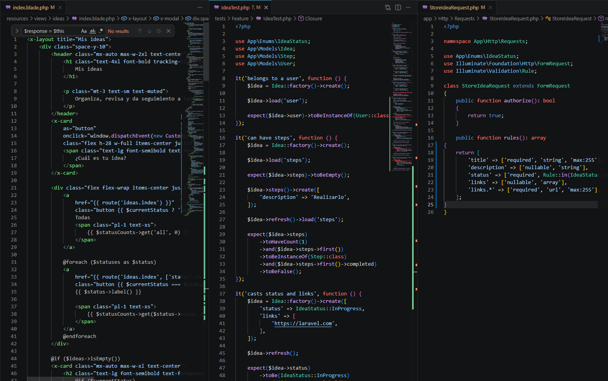
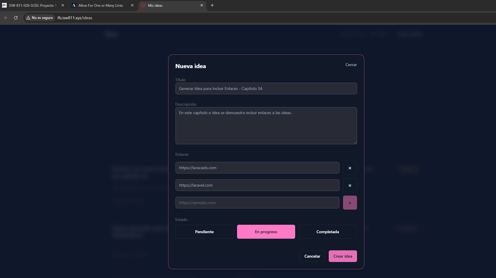
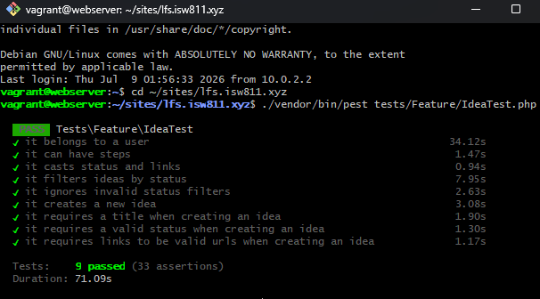

[<- Regresar](../entregable03.md)

# Episodio 34: Allow For One or Many Links

## Módulo 4: Final Project

## Resumen

En este episodio se agregó soporte para asociar uno o varios enlaces a una idea.

Antes de este capítulo, el formulario de creación permitía registrar título, descripción y estado, pero no existía una forma de agregar enlaces relacionados. Ahora el usuario puede escribir un enlace, presionar el botón `+`, agregarlo a una lista, repetir el proceso varias veces y eliminar enlaces antes de enviar el formulario.

Los enlaces se envían al servidor como un arreglo usando la sintaxis `links[]`, se validan como URLs y se guardan en el campo `links` del modelo `Idea`.

---

## Comandos utilizados

Para crear el archivo de documentación se utilizó:

```bash
cd ~/ISW811/VMs/webserver/sites/lfs.isw811.xyz
touch docs/final-project/34-allow-for-one-or-many-links.md
```

Para entrar a la máquina virtual se utilizó:

```bash
cd ~/ISW811/VMs/webserver
vagrant ssh
```

Dentro de Debian se ingresó al proyecto:

```bash
cd ~/sites/lfs.isw811.xyz
```

Para levantar Vite durante la prueba visual se utilizó:

```bash
npm run dev -- --host 0.0.0.0
```

Para ejecutar las pruebas del archivo de ideas se utilizó:

```bash
./vendor/bin/pest tests/Feature/IdeaTest.php
```

Para ejecutar todas las pruebas Feature se utilizó:

```bash
./vendor/bin/pest tests/Feature
```

---

## Archivos modificados o creados

Los archivos principales trabajados durante este episodio fueron:

* `resources/views/ideas/index.blade.php`
* `app/Http/Requests/StoreIdeaRequest.php`
* `tests/Feature/IdeaTest.php`
* `docs/final-project/34-allow-for-one-or-many-links.md`

También se agregaron las siguientes capturas como evidencia:

* `docs/img/34-links-form-code.png`
* `docs/img/34-one-or-many-links-browser.png`
* `docs/img/34-links-tests-passing.png`

---

## Estado inicial del formulario

El formulario de creación de ideas ya existía dentro del modal `create-idea`.

En este capítulo se amplió el `x-data` del formulario para manejar dos nuevos valores con AlpineJS:

```blade
<form
    method="POST"
    action="{{ route('ideas.store') }}"
    x-data="{
        status: @js(old('status', \App\Enums\IdeaStatus::Pending->value)),
        newLink: '',
        links: @js(old('links', [])),
    }"
    data-test="create-idea-form"
    class="space-y-6"
>
```

La variable `newLink` almacena temporalmente el enlace que el usuario está escribiendo.

La variable `links` mantiene la lista de enlaces agregados antes de enviar el formulario.

---

## Fieldset de enlaces

Se agregó un `fieldset` para agrupar los campos relacionados con enlaces.

```blade
<fieldset class="space-y-3">
    <legend class="label">
        Enlaces
    </legend>

    ...
</fieldset>
```

El uso de `fieldset` permite organizar mejor el formulario, ya que la sección puede contener múltiples inputs relacionados entre sí.

---

## Input para nuevo enlace

Se agregó un campo de tipo `url` para que el navegador también pueda aplicar validación básica de URL.

```blade
<input
    id="new_link"
    type="url"
    x-model.trim="newLink"
    x-on:keydown.enter.prevent="if (newLink.trim()) { links.push(newLink.trim()); newLink = '' }"
    placeholder="https://ejemplo.com"
    autocomplete="url"
    spellcheck="false"
    data-test="new-link-input"
    class="input flex-1"
>
```

Este campo no tiene atributo `name`, porque no se envía directamente al servidor. Su función es capturar temporalmente el enlace antes de agregarlo al arreglo `links`.

---

## Botón para agregar enlaces

Junto al input se agregó un botón `+`.

```blade
<button
    type="button"
    class="button h-12 w-12 shrink-0 px-0 text-lg disabled:cursor-not-allowed disabled:opacity-50"
    x-bind:disabled="!newLink.trim()"
    x-on:click="if (newLink.trim()) { links.push(newLink.trim()); newLink = '' }"
    data-test="submit-new-link-button"
    aria-label="Agregar enlace"
>
    +
</button>
```

Cuando el usuario hace clic en este botón, AlpineJS agrega el valor de `newLink` al arreglo `links` y luego limpia el campo.

Además, el botón se deshabilita cuando el campo está vacío.

---

## Agregar enlaces con Enter

También se permitió agregar un enlace presionando la tecla `Enter`.

```blade
x-on:keydown.enter.prevent="if (newLink.trim()) { links.push(newLink.trim()); newLink = '' }"
```

Esto evita que el formulario se envíe accidentalmente cuando el usuario presiona `Enter` dentro del campo de enlace.

---

## Lista de enlaces agregados

Los enlaces agregados se muestran dinámicamente usando `x-for`.

```blade
<template x-for="(link, index) in links" :key="link">
    <div class="flex items-center gap-3">
        <label class="sr-only" :for="`link-${index}`">
            Enlace agregado
        </label>

        <input
            type="url"
            name="links[]"
            x-model="links[index]"
            :id="`link-${index}`"
            class="input flex-1"
            readonly
        >

        <button
            type="button"
            class="button button-outline h-12 w-12 shrink-0 px-0 text-lg"
            x-on:click="links.splice(index, 1)"
            aria-label="Eliminar enlace"
        >
            ×
        </button>
    </div>
</template>
```

Cada enlace agregado se renderiza como un input con el nombre:

```text
links[]
```

Esta sintaxis permite que Laravel reciba todos los enlaces como un arreglo.

---

## Eliminación de enlaces

Cada enlace agregado tiene un botón `×` para eliminarlo de la lista.

```blade
x-on:click="links.splice(index, 1)"
```

Con `splice`, AlpineJS elimina el enlace correspondiente del arreglo `links`.

De esta forma, el usuario puede corregir la lista antes de enviar el formulario.

---

## Validación de enlaces

Se actualizó el archivo:

```text
app/Http/Requests/StoreIdeaRequest.php
```

En las reglas de validación se agregaron las reglas para `links` y `links.*`.

```php
public function rules(): array
{
    return [
        'title' => ['required', 'string', 'max:255'],
        'description' => ['nullable', 'string'],
        'status' => ['required', Rule::in(IdeaStatus::values())],
        'links' => ['nullable', 'array'],
        'links.*' => ['required', 'url', 'max:255'],
    ];
}
```

La regla `links` indica que el campo puede ser nulo, pero si existe debe ser un arreglo.

La regla `links.*` valida cada elemento individual del arreglo, asegurando que cada enlace sea una URL válida.

---

## Guardado de enlaces

No fue necesario modificar el método `store` del controlador.

```php
public function store(StoreIdeaRequest $request)
{
    $request->user()
        ->ideas()
        ->create($request->validated());

    return to_route('ideas.index')
        ->with('success', 'La idea fue creada correctamente.');
}
```

Como los enlaces ya forman parte de los datos validados, Laravel los guarda automáticamente junto con la idea.

---

## Modelo Idea

El modelo `Idea` ya estaba preparado para trabajar con enlaces.

```php
protected $attributes = [
    'links' => '[]',
    'status' => 'pending',
];
```

También cuenta con el cast correspondiente:

```php
protected function casts(): array
{
    return [
        'links' => AsArrayObject::class,
        'status' => IdeaStatus::class,
    ];
}
```

Esto permite que el campo `links` se comporte como una estructura tipo arreglo dentro de Laravel.

---

## Actualización de pruebas

Se actualizó la prueba de creación de ideas para incluir varios enlaces.

```php
$links = [
    'https://laracasts.com',
    'https://laravel.com',
];

$response = $this
    ->actingAs($user)
    ->post(route('ideas.store'), [
        'title' => $title,
        'description' => $description,
        'status' => IdeaStatus::Completed->value,
        'links' => $links,
    ]);
```

Luego se validó que los enlaces fueran guardados correctamente.

```php
expect($idea->links->getArrayCopy())->toBe($links);
```

Como el modelo utiliza `AsArrayObject::class`, se usa `getArrayCopy()` para comparar el valor contra el arreglo original.

---

## Prueba de URLs inválidas

También se agregó una prueba para evitar guardar enlaces inválidos.

```php
it('requires links to be valid urls when creating an idea', function () {
    $user = User::factory()->create();

    $response = $this
        ->actingAs($user)
        ->post(route('ideas.store'), [
            'title' => 'Idea con enlace inválido',
            'description' => 'Esta idea no debe guardarse con un enlace inválido.',
            'status' => IdeaStatus::Pending->value,
            'links' => [
                'not-a-valid-url',
            ],
        ]);

    $response->assertSessionHasErrors('links.0');

    expect($user->ideas()->count())->toBe(0);
});
```

Esta prueba confirma que el sistema rechaza enlaces que no cumplen el formato de URL.

---

## Data-test agregados

Se agregaron atributos `data-test` para facilitar automatización futura.

```blade
data-test="new-link-input"
```

```blade
data-test="submit-new-link-button"
```

Estos atributos permiten seleccionar los elementos de forma más estable en pruebas automatizadas.

---

## Prueba manual en navegador

Se probó la vista principal:

```text
http://lfs.isw811.xyz/ideas
```

Luego se realizó el siguiente flujo:

1. Clic en **¿Cuál es tu idea?**
2. Se abrió el modal **Nueva idea**.
3. Se escribió un título.
4. Se agregó una descripción.
5. En la sección **Enlaces**, se escribió una URL.
6. Se presionó el botón `+`.
7. Se agregó una segunda URL.
8. Se verificó que ambos enlaces aparecieran en la lista.
9. Se eliminó un enlace usando el botón `×`.
10. Se volvió a agregar otro enlace.
11. Se creó la idea.
12. Se confirmó que la idea se guardó correctamente.

También se revisó la vista individual de la idea para confirmar que los enlaces relacionados se mostraran correctamente.

---

## Evidencia

Como evidencia de este episodio se agregaron capturas del código, del modal con varios enlaces y de las pruebas pasando.







---

## Problemas encontrados y solución

Durante este episodio no se presentaron errores críticos.

Se revisó el modelo `Idea` para confirmar que ya soportaba el campo `links` mediante `AsArrayObject::class`, por lo que no fue necesario modificar el modelo.

También se ajustaron las pruebas para comparar correctamente el contenido de `links`, usando `getArrayCopy()` debido al cast aplicado en el modelo.

---

## Comentarios personales

Este capítulo fue importante porque permitió enriquecer las ideas con recursos externos.

Ahora una idea no se limita solamente a título, descripción y estado, sino que también puede tener enlaces relacionados. Esto será útil para guardar referencias, documentación, páginas externas o cualquier recurso asociado a la idea.

Además, se reforzó el uso de AlpineJS para manejar interactividad dinámica dentro de un formulario tradicional de Laravel.
