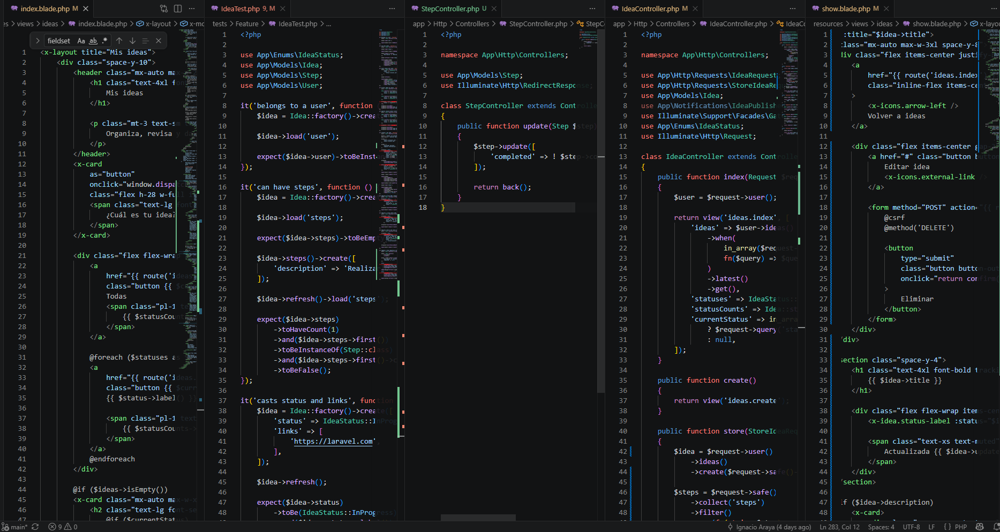
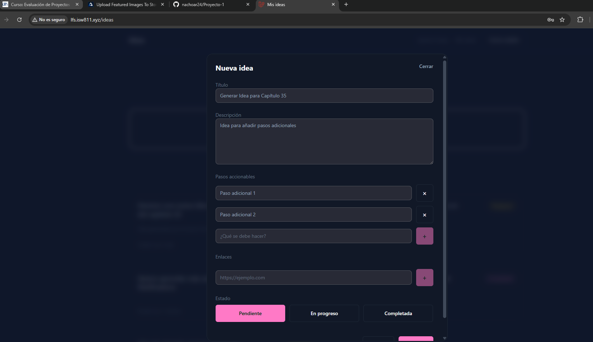
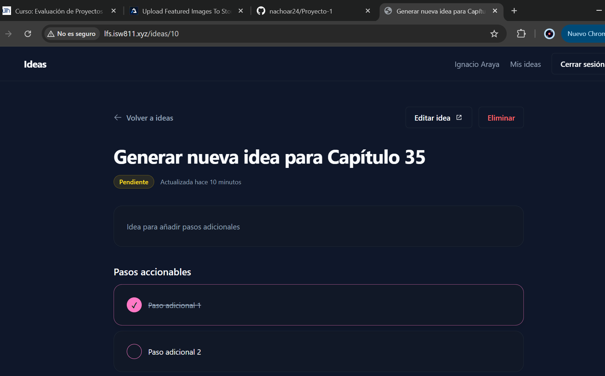
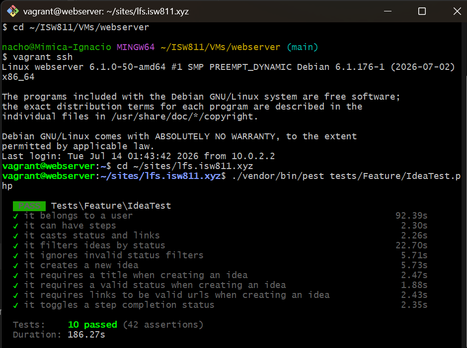

[<- Regresar](../entregable03.md)

# Episodio 35: Actionable Steps

## Módulo 4: Final Project

## Resumen

En este episodio se agregó soporte para pasos accionables dentro de una idea.

Antes de este capítulo, una idea podía tener título, descripción, estado y enlaces relacionados. Ahora también puede tener una lista de pasos que ayudan a convertir la idea en acciones concretas.

Cada paso se guarda en la tabla `steps`, relacionado con la idea correspondiente. Además, en la vista individual de la idea se muestran los pasos accionables y se permite marcar cada uno como completado o pendiente.

---

## Comandos utilizados

Para crear el archivo de documentación se utilizó:

```bash
cd ~/ISW811/VMs/webserver/sites/lfs.isw811.xyz
touch docs/final-project/35-actionable-steps.md
```

Para entrar a la máquina virtual se utilizó:

```bash
cd ~/ISW811/VMs/webserver
vagrant ssh
```

Dentro de Debian se ingresó al proyecto:

```bash
cd ~/sites/lfs.isw811.xyz
```

Para crear el controlador de pasos se utilizó:

```bash
php artisan make:controller StepController
```

Para levantar Vite durante la prueba visual se utilizó:

```bash
npm run dev -- --host 0.0.0.0
```

Para ejecutar las pruebas del archivo de ideas se utilizó:

```bash
./vendor/bin/pest tests/Feature/IdeaTest.php
```

Para ejecutar todas las pruebas Feature se utilizó:

```bash
./vendor/bin/pest tests/Feature
```

---

## Archivos modificados o creados

Los archivos principales trabajados durante este episodio fueron:

* `routes/web.php`
* `app/Http/Controllers/IdeaController.php`
* `app/Http/Controllers/StepController.php`
* `app/Http/Requests/StoreIdeaRequest.php`
* `resources/views/ideas/index.blade.php`
* `resources/views/ideas/show.blade.php`
* `tests/Feature/IdeaTest.php`
* `docs/final-project/35-actionable-steps.md`

También se agregaron las siguientes capturas como evidencia:

* `docs/img/35-actionable-steps-code.png`
* `docs/img/35-actionable-steps-form.png`
* `docs/img/35-actionable-steps-show.png`
* `docs/img/35-actionable-steps-tests-passing.png`

---

## Formulario con pasos accionables

En el formulario de creación de ideas se agregaron dos nuevos valores dentro de AlpineJS:

```blade
newStep: '',
steps: @js(old('steps', [])),
```

El formulario quedó preparado para manejar una lista dinámica de pasos antes de enviar la información al servidor.

```blade
<form
    method="POST"
    action="{{ route('ideas.store', [], false) }}"
    x-data="{
        status: @js(old('status', \App\Enums\IdeaStatus::Pending->value)),
        newStep: '',
        steps: @js(old('steps', [])),
        newLink: '',
        links: @js(old('links', [])),
    }"
    data-test="create-idea-form"
    class="space-y-6"
>
    @csrf
```

La variable `newStep` almacena temporalmente el paso que el usuario escribe.

La variable `steps` mantiene el arreglo de pasos agregados antes de enviar el formulario.

---

## Fieldset de pasos accionables

Se agregó un `fieldset` para agrupar los campos relacionados con pasos.

```blade
<fieldset class="space-y-3">
    <legend class="label">
        Pasos accionables
    </legend>

    ...
</fieldset>
```

Esto permite separar visual y semánticamente los pasos accionables del resto de campos del formulario.

---

## Agregar pasos con AlpineJS

Se agregó un input para escribir un nuevo paso y un botón `+` para agregarlo al arreglo `steps`.

```blade
<input
    id="new_step"
    type="text"
    x-model.trim="newStep"
    x-on:keydown.enter.prevent="if (newStep.trim()) { steps.push(newStep.trim()); newStep = '' }"
    placeholder="¿Qué se debe hacer?"
    autocomplete="off"
    spellcheck="false"
    data-test="new-step-input"
    class="input flex-1"
>
```

El botón para agregar pasos utiliza AlpineJS para insertar el valor en el arreglo.

```blade
<button
    type="button"
    class="button h-12 w-12 shrink-0 px-0 text-lg disabled:cursor-not-allowed disabled:opacity-50"
    x-bind:disabled="!newStep.trim()"
    x-on:click="if (newStep.trim()) { steps.push(newStep.trim()); newStep = '' }"
    data-test="submit-new-step-button"
    aria-label="Agregar paso"
>
    +
</button>
```

Después de agregar un paso, el campo se limpia automáticamente.

---

## Lista de pasos agregados

Los pasos agregados se muestran dinámicamente usando `x-for`.

```blade
<template x-for="(step, index) in steps" :key="`step-${index}-${step}`">
    <div class="flex items-center gap-3">
        <label class="sr-only" :for="`step-${index}`">
            Paso accionable agregado
        </label>

        <input
            type="text"
            name="steps[]"
            x-model="steps[index]"
            :id="`step-${index}`"
            class="input flex-1"
            readonly
        >

        <button
            type="button"
            class="button button-outline h-12 w-12 shrink-0 px-0 text-lg"
            x-on:click="steps.splice(index, 1)"
            data-test="remove-step-button"
            aria-label="Eliminar paso"
        >
            ×
        </button>
    </div>
</template>
```

Cada paso se envía al servidor usando el nombre:

```text
steps[]
```

Esto permite que Laravel reciba los pasos como un arreglo.

---

## Eliminación de pasos antes de enviar

Cada paso agregado tiene un botón `×` para eliminarlo antes de crear la idea.

```blade
x-on:click="steps.splice(index, 1)"
```

Con esto el usuario puede corregir la lista de pasos antes de enviar el formulario.

---

## Validación de pasos

Se actualizó el archivo:

```text
app/Http/Requests/StoreIdeaRequest.php
```

Se agregaron las reglas para validar `steps` y cada elemento del arreglo.

```php
public function rules(): array
{
    return [
        'title' => ['required', 'string', 'max:255'],
        'description' => ['nullable', 'string'],
        'status' => ['required', Rule::in(IdeaStatus::values())],
        'steps' => ['nullable', 'array'],
        'steps.*' => ['required', 'string', 'max:255'],
        'links' => ['nullable', 'array'],
        'links.*' => ['required', 'url', 'max:255'],
    ];
}
```

El campo `steps` puede ser nulo, pero si se envía debe ser un arreglo.

Cada elemento dentro de `steps` debe ser texto y no debe superar los 255 caracteres.

---

## Guardado de pasos relacionados

Se actualizó el método `store` en `IdeaController`.

El punto importante es que `steps` no pertenece a la tabla `ideas`, sino a la tabla `steps`. Por eso primero se crea la idea y luego se crean los pasos relacionados.

```php
public function store(StoreIdeaRequest $request)
{
    $idea = $request->user()
        ->ideas()
        ->create($request->safe()->except('steps'));

    $steps = $request->safe()
        ->collect('steps')
        ->filter()
        ->map(fn (string $step) => [
            'description' => $step,
        ])
        ->values();

    if ($steps->isNotEmpty()) {
        $idea->steps()->createMany($steps->all());
    }

    return to_route('ideas.index')
        ->with('success', 'La idea fue creada correctamente.');
}
```

Se utilizó `safe()->except('steps')` para crear la idea sin intentar guardar `steps` directamente en la tabla `ideas`.

Luego se utilizó la relación:

```php
$idea->steps()->createMany(...)
```

para insertar los pasos en la tabla relacionada.

---

## Carga de pasos en la vista individual

Se actualizó el método `show` para cargar los pasos de la idea.

```php
public function show(Idea $idea)
{
    $idea->load('steps');

    return view('ideas.show', [
        'idea' => $idea,
    ]);
}
```

Esto permite mostrar los pasos accionables en la página individual de la idea.

---

## Controlador de pasos

Se creó el controlador:

```text
app/Http/Controllers/StepController.php
```

Este controlador contiene el método `update`, encargado de alternar el estado `completed` de un paso.

```php
<?php

namespace App\Http\Controllers;

use App\Models\Step;
use Illuminate\Http\RedirectResponse;

class StepController extends Controller
{
    public function update(Step $step): RedirectResponse
    {
        $step->update([
            'completed' => ! $step->completed,
        ]);

        return back();
    }
}
```

La autorización específica se trabajará en un capítulo posterior.

---

## Ruta para actualizar pasos

Se agregó una ruta `PATCH` para actualizar el estado de un paso.

```php
Route::patch('/steps/{step}', [StepController::class, 'update'])
    ->name('steps.update');
```

Esta ruta permite marcar un paso como completado o volverlo a dejar como pendiente.

---

## Mostrar pasos en la vista individual

En la vista:

```text
resources/views/ideas/show.blade.php
```

se agregó una sección para mostrar los pasos accionables.

```blade
@if ($idea->steps->isNotEmpty())
    <section class="space-y-3">
        <h2 class="text-lg font-semibold text-foreground">
            Pasos accionables
        </h2>

        <div class="space-y-2">
            @foreach ($idea->steps as $step)
                <x-card>
                    <form
                        method="POST"
                        action="{{ route('steps.update', $step) }}"
                        class="flex items-center gap-3"
                    >
                        @csrf
                        @method('PATCH')

                        <button
                            type="submit"
                            role="checkbox"
                            aria-checked="{{ $step->completed ? 'true' : 'false' }}"
                            class="flex size-7 shrink-0 items-center justify-center rounded-full border border-primary text-sm font-bold transition {{ $step->completed ? 'bg-primary text-primary-foreground' : 'text-transparent' }}"
                        >
                            ✓
                        </button>

                        <span class="text-sm leading-6 {{ $step->completed ? 'text-muted line-through' : 'text-foreground' }}">
                            {{ $step->description }}
                        </span>
                    </form>
                </x-card>
            @endforeach
        </div>
    </section>
@endif
```

Cada paso se muestra dentro de una tarjeta y tiene un botón visual tipo checkbox.

---

## Alternar pasos completados

Cuando el usuario hace clic sobre el botón de un paso, se envía una solicitud `PATCH` a la ruta `steps.update`.

Si el paso estaba pendiente, pasa a completado.

Si el paso estaba completado, vuelve a pendiente.

Visualmente, los pasos completados se muestran con texto tachado y color atenuado.

```blade
{{ $step->completed ? 'text-muted line-through' : 'text-foreground' }}
```

---

## Pruebas automatizadas

Se actualizó `tests/Feature/IdeaTest.php` para validar que una idea pueda crearse con pasos.

```php
$steps = [
    'Investigar opciones',
    'Comparar alternativas',
];
```

Los pasos se enviaron junto con la creación de la idea.

```php
$response = $this
    ->actingAs($user)
    ->post(route('ideas.store'), [
        'title' => $title,
        'description' => $description,
        'status' => IdeaStatus::Completed->value,
        'links' => $links,
        'steps' => $steps,
    ]);
```

Luego se validó que los pasos fueran creados correctamente.

```php
$idea->load('steps');

expect($idea->steps)
    ->toHaveCount(2)
    ->and($idea->steps->pluck('description')->all())
    ->toBe($steps)
    ->and($idea->steps->pluck('completed')->all())
    ->toBe([false, false]);
```

---

## Prueba para alternar estado de un paso

También se agregó una prueba para confirmar que un paso pueda alternar su estado `completed`.

```php
it('toggles a step completion status', function () {
    $user = User::factory()->create();

    $idea = Idea::factory()
        ->for($user)
        ->create();

    $step = $idea->steps()->create([
        'description' => 'Investigar opciones',
        'completed' => false,
    ]);

    $this
        ->actingAs($user)
        ->from(route('ideas.show', $idea))
        ->patch(route('steps.update', $step))
        ->assertRedirect(route('ideas.show', $idea));

    expect($step->refresh()->completed)->toBeTrue();

    $this
        ->actingAs($user)
        ->from(route('ideas.show', $idea))
        ->patch(route('steps.update', $step))
        ->assertRedirect(route('ideas.show', $idea));

    expect($step->refresh()->completed)->toBeFalse();
});
```

Esta prueba confirma que el botón de la vista individual puede cambiar el estado del paso.

---

## Problema encontrado con CSRF

Durante la implementación apareció un error `419 Page Expired` al enviar el formulario.

El problema estaba en la vista `resources/views/ideas/index.blade.php`: el `@csrf` había quedado dentro de la etiqueta de apertura del formulario, por lo que Laravel no generaba correctamente el input oculto `_token`.

El formulario fue corregido dejando el cierre `>` antes de `@csrf`.

```blade
<form
    method="POST"
    action="{{ route('ideas.store', [], false) }}"
    ...
>
    @csrf
```

También se corrigió el `action` del formulario para usar una ruta relativa:

```blade
action="{{ route('ideas.store', [], false) }}"
```

Esto evitó conflictos con `APP_URL` y el dominio usado en el navegador.

---

## Prueba manual en navegador

Se probó la vista principal:

```text
http://lfs.isw811.xyz/ideas
```

Luego se realizó el siguiente flujo:

1. Clic en **¿Cuál es tu idea?**
2. Se escribió un título.
3. Se agregó una descripción.
4. Se seleccionó el estado **En progreso**.
5. Se agregaron varios pasos accionables.
6. Se agregaron enlaces relacionados.
7. Se creó la idea.
8. Se abrió la vista individual de la idea.
9. Se verificó la sección **Pasos accionables**.
10. Se marcó un paso como completado.
11. Se confirmó que el paso cambiara visualmente.

---

## Evidencia

Como evidencia de este episodio se agregaron capturas del código, del formulario, de la vista individual y de las pruebas pasando.









---

## Comentarios personales

Este capítulo fue importante porque permitió convertir una idea en una lista de acciones concretas.

Ahora las ideas no solo almacenan información general, sino también pasos que pueden completarse progresivamente. Esto mejora el seguimiento de cada idea y prepara la aplicación para funcionalidades más avanzadas en los próximos capítulos, como edición, autorización y acciones dedicadas.
