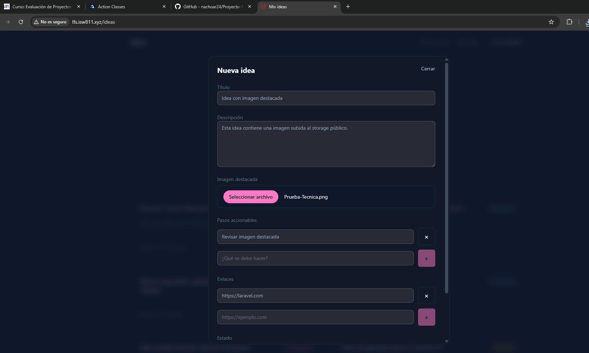
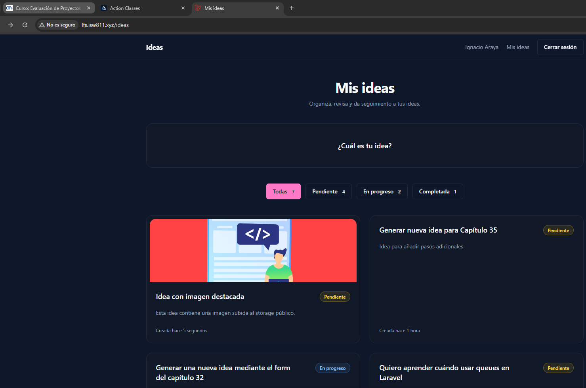
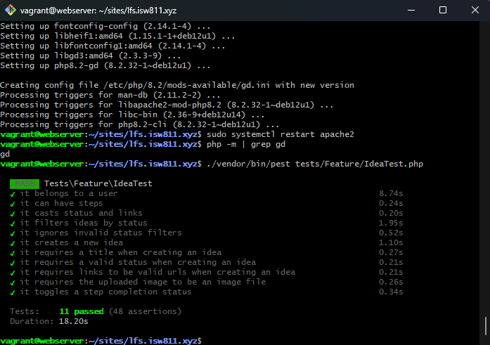

[<- Regresar](../entregable03.md)

# Episodio 36: Upload Featured Images To Storage

## Módulo 4: Final Project

## Resumen

En este episodio se agregó soporte para subir una imagen destacada al crear una idea.

Antes de este capítulo, una idea podía tener título, descripción, estado, enlaces relacionados y pasos accionables. Ahora también puede tener una imagen destacada, la cual se carga desde el formulario, se guarda en el storage público de Laravel y se asocia a la idea mediante el campo `image_path`.

También se configuró el enlace simbólico de storage para que las imágenes guardadas puedan visualizarse desde el navegador.

---

## Comandos utilizados

Para crear el archivo de documentación se utilizó:

```bash
cd ~/ISW811/VMs/webserver/sites/lfs.isw811.xyz
touch docs/final-project/36-upload-featured-images-to-storage.md
```

Para entrar a la máquina virtual se utilizó:

```bash
cd ~/ISW811/VMs/webserver
vagrant ssh
```

Dentro de Debian se ingresó al proyecto:

```bash
cd ~/sites/lfs.isw811.xyz
```

Para crear el enlace simbólico de storage se utilizó:

```bash
php artisan storage:link
```

Para compilar los assets con Vite en modo build se utilizó:

```bash
rm -f public/hot
npm run build
php artisan optimize:clear
php artisan view:clear
```

Para ejecutar las pruebas del archivo de ideas se utilizó:

```bash
./vendor/bin/pest tests/Feature/IdeaTest.php
```

También se ejecutaron todas las pruebas Feature:

```bash
./vendor/bin/pest tests/Feature
```

Durante las pruebas fue necesario instalar la extensión GD de PHP, ya que Laravel la utiliza para generar imágenes falsas con `UploadedFile::fake()->image()`.

```bash
sudo apt update
sudo apt install -y php8.2-gd
sudo systemctl restart apache2
```

Para verificar que GD quedó instalado se utilizó:

```bash
php -m | grep gd
```

---

## Archivos modificados

Los archivos principales trabajados durante este episodio fueron:

- `resources/views/ideas/index.blade.php`
- `resources/views/ideas/show.blade.php`
- `app/Http/Requests/StoreIdeaRequest.php`
- `app/Http/Controllers/IdeaController.php`
- `tests/Feature/IdeaTest.php`
- `docs/final-project/36-upload-featured-images-to-storage.md`

También se agregaron las siguientes capturas como evidencia:

- `docs/img/36-featured-image-form.png`
- `docs/img/36-featured-image-index.png`
- `docs/img/36-featured-image-tests-passing.png`

---

## Campo de imagen en el formulario

Se actualizó el formulario de creación de ideas para permitir la carga de archivos.

El primer cambio importante fue agregar el atributo `enctype="multipart/form-data"` al formulario.

```blade
<form
    method="POST"
    action="{{ route('ideas.store', [], false) }}"
    enctype="multipart/form-data"
    x-data="{
        status: @js(old('status', \App\Enums\IdeaStatus::Pending->value)),
        newStep: '',
        steps: @js(old('steps', [])),
        newLink: '',
        links: @js(old('links', [])),
    }"
    data-test="create-idea-form"
    class="space-y-6"
>
    @csrf
```

Este atributo es necesario para que el navegador pueda enviar archivos al servidor.

Sin `multipart/form-data`, el archivo seleccionado en el input no se enviaría correctamente a Laravel.

---

## Input para imagen destacada

Después del campo de descripción se agregó un nuevo input de tipo `file`.

```blade
<div class="space-y-2">
    <label for="image" class="label">
        Imagen destacada
    </label>

    <input
        id="image"
        name="image"
        type="file"
        accept="image/*"
        data-test="featured-image-input"
        class="block w-full rounded-xl border border-border bg-background px-4 py-3 text-sm text-foreground file:mr-4 file:rounded-full file:border-0 file:bg-primary file:px-4 file:py-2 file:text-sm file:font-semibold file:text-primary-foreground"
    >

    <x-forms.error name="image" />
</div>
```

El atributo `accept="image/*"` indica que el input está pensado para recibir imágenes.

También se agregó el componente de error para mostrar mensajes de validación relacionados con el campo `image`.

---

## Validación de la imagen

Se actualizó el archivo:

```text
app/Http/Requests/StoreIdeaRequest.php
```

Dentro del método `rules()` se agregó la validación para la imagen.

```php
'image' => ['nullable', 'image', 'max:5120'],
```

La regla `nullable` permite crear una idea sin imagen destacada.

La regla `image` valida que el archivo enviado sea realmente una imagen.

La regla `max:5120` limita el tamaño máximo del archivo a 5 MB.

El método completo quedó preparado para validar título, descripción, estado, imagen, pasos accionables y enlaces.

```php
public function rules(): array
{
    return [
        'title' => ['required', 'string', 'max:255'],
        'description' => ['nullable', 'string'],
        'status' => ['required', Rule::in(IdeaStatus::values())],
        'image' => ['nullable', 'image', 'max:5120'],
        'steps' => ['nullable', 'array'],
        'steps.*' => ['required', 'string', 'max:255'],
        'links' => ['nullable', 'array'],
        'links.*' => ['required', 'url', 'max:255'],
    ];
}
```

---

## Guardado de la imagen

Se actualizó el método `store` en:

```text
app/Http/Controllers/IdeaController.php
```

El formulario ahora envía un campo `image`, pero ese campo no pertenece directamente a la tabla `ideas`. Por eso se excluyó al momento de crear la idea.

```php
$idea = $request->user()
    ->ideas()
    ->create($request->safe()->except('steps', 'image'));
```

Luego, si el request trae una imagen, se guarda en el disco público dentro de la carpeta `ideas`.

```php
if ($request->hasFile('image')) {
    $idea->update([
        'image_path' => $request->file('image')->store('ideas', 'public'),
    ]);
}
```

Laravel genera automáticamente un nombre único para el archivo subido.

La ruta generada se guarda en el campo `image_path` de la idea.

Un ejemplo de ruta guardada sería:

```text
ideas/nombre-generado.png
```

---

## Método `store` actualizado

El método `store` quedó encargado de crear la idea, crear los pasos accionables y guardar la imagen destacada.

```php
public function store(StoreIdeaRequest $request)
{
    $idea = $request->user()
        ->ideas()
        ->create($request->safe()->except('steps', 'image'));

    $steps = $request->safe()
        ->collect('steps')
        ->filter()
        ->map(fn (string $step) => [
            'description' => $step,
        ])
        ->values();

    if ($steps->isNotEmpty()) {
        $idea->steps()->createMany($steps->all());
    }

    if ($request->hasFile('image')) {
        $idea->update([
            'image_path' => $request->file('image')->store('ideas', 'public'),
        ]);
    }

    return to_route('ideas.index')
        ->with('success', 'La idea fue creada correctamente.');
}
```

Este método funciona, pero también empieza a mostrar que el proceso de creación de una idea tiene varias responsabilidades. Esto prepara el proyecto para el siguiente episodio, donde se trabajará con action classes.

---

## Enlace simbólico de storage

Laravel guarda los archivos públicos en:

```text
storage/app/public
```

Pero el navegador solo puede acceder directamente a archivos dentro de:

```text
public
```

Por eso fue necesario ejecutar:

```bash
php artisan storage:link
```

Este comando crea un enlace simbólico:

```text
public/storage
```

apuntando hacia:

```text
storage/app/public
```

Gracias a esto, las imágenes subidas pueden visualizarse desde URLs como:

```text
/storage/ideas/nombre-generado.png
```

---

## Mostrar la imagen en la vista individual

Se actualizó la vista individual de una idea:

```text
resources/views/ideas/show.blade.php
```

Se agregó una validación para mostrar la imagen únicamente si la idea tiene una ruta en `image_path`.

```blade
@if ($idea->image_path)
    <div class="overflow-hidden rounded-2xl border border-border">
        image_path) }}"
            alt="Imagen destacada de {{ $idea->title }}"
            class="h-auto w-full object-cover"
        >
    </div>
@endif
```

El helper `asset()` genera la URL pública hacia la imagen dentro de `public/storage`.

---

## Mostrar miniatura en el listado

También se actualizó el listado de ideas:

```text
resources/views/ideas/index.blade.php
```

Dentro de cada tarjeta se agregó una miniatura cuando la idea tiene imagen destacada.

```blade
@if ($idea->image_path)
    <div class="-mx-4 -mt-4 overflow-hidden rounded-t-2xl">
        image_path) }}"
            alt="Imagen destacada de {{ $title }}"
            class="h-40 w-full object-cover"
        >
    </div>
@endif
```

Con esto, las ideas con imagen se ven de forma más visual desde el listado principal.

La clase `object-cover` permite que la imagen llene el espacio disponible sin deformarse.

---

## Prueba automatizada con imagen

Se actualizó el archivo:

```text
tests/Feature/IdeaTest.php
```

Primero se agregaron los imports necesarios.

```php
use Illuminate\Http\UploadedFile;
use Illuminate\Support\Facades\Storage;
```

En la prueba de creación de ideas se utilizó un storage falso.

```php
Storage::fake('public');
```

Luego se creó una imagen falsa para simular una carga real.

```php
$image = UploadedFile::fake()->image('featured-image.jpg', 600, 400);
```

La imagen se envió junto con los demás campos del formulario.

```php
$response = $this
    ->actingAs($user)
    ->post(route('ideas.store'), [
        'title' => $title,
        'description' => $description,
        'status' => IdeaStatus::Completed->value,
        'links' => $links,
        'steps' => $steps,
        'image' => $image,
    ]);
```

Después se verificó que la idea tuviera una ruta de imagen.

```php
expect($idea->image_path)->not->toBeNull();
expect(str_starts_with($idea->image_path, 'ideas/'))->toBeTrue();
```

También se verificó que el archivo realmente existiera en el disco público falso.

```php
Storage::disk('public')->assertExists($idea->image_path);
```

---

## Prueba de validación de imagen

Se agregó una prueba para confirmar que Laravel rechaza archivos que no son imágenes.

```php
it('requires the uploaded image to be an image file', function () {
    Storage::fake('public');

    $user = User::factory()->create();

    $file = UploadedFile::fake()->create('document.pdf', 100, 'application/pdf');

    $response = $this
        ->actingAs($user)
        ->post(route('ideas.store'), [
            'title' => 'Idea con archivo inválido',
            'description' => 'Esta idea no debe guardar un PDF como imagen.',
            'status' => IdeaStatus::Pending->value,
            'image' => $file,
        ]);

    $response->assertSessionHasErrors('image');

    expect($user->ideas()->count())->toBe(0);
});
```

Esta prueba confirma que el campo `image` solo acepta archivos válidos de imagen.

---

## Problema encontrado durante las pruebas

Al ejecutar las pruebas apareció el siguiente error:

```text
GD extension is not installed.
```

Este error no era causado por el código de la aplicación.

El problema era que la VM no tenía instalada la extensión GD de PHP, necesaria para que Laravel pueda crear imágenes falsas con `UploadedFile::fake()->image()`.

Se solucionó instalando la extensión:

```bash
sudo apt update
sudo apt install -y php8.2-gd
sudo systemctl restart apache2
```

Después se verificó la instalación con:

```bash
php -m | grep gd
```

Finalmente, las pruebas se volvieron a ejecutar correctamente.

---

## Prueba manual en navegador

Se probó la funcionalidad desde:

```text
http://lfs.isw811.xyz/ideas
```

El flujo manual realizado fue:

1. Abrir el modal con el botón **¿Cuál es tu idea?**
2. Escribir un título.
3. Escribir una descripción.
4. Seleccionar una imagen destacada.
5. Agregar un paso accionable.
6. Agregar un enlace relacionado.
7. Crear la idea.
8. Verificar que la imagen se guardara correctamente.
9. Confirmar que la imagen apareciera como miniatura en el listado de ideas.

---

## Evidencia

Como evidencia de este episodio se agregaron capturas del formulario, del listado con miniatura y de las pruebas pasando.







---

## Comentarios personales

Este capítulo fue importante porque agregó manejo real de archivos a la aplicación.

La funcionalidad de imagen destacada permite que cada idea tenga una representación visual. Además, se trabajó con conceptos importantes de Laravel como validación de archivos, storage público, enlaces simbólicos y pruebas automatizadas con archivos falsos.

También quedó más claro que el método `store` del controlador está empezando a acumular varias responsabilidades: crear la idea, crear pasos y guardar la imagen. Esto prepara el proyecto para el próximo capítulo, donde se trabajará una refactorización usando action classes.