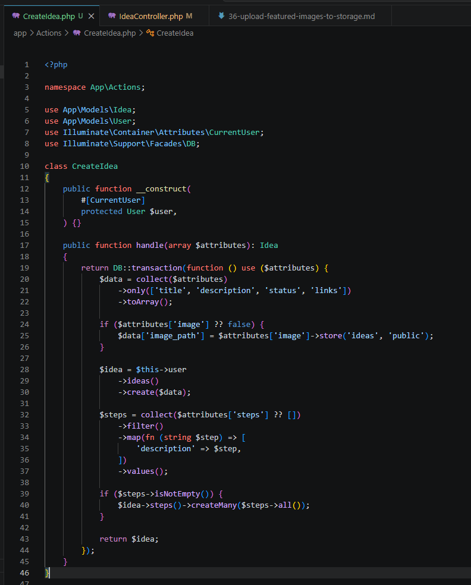
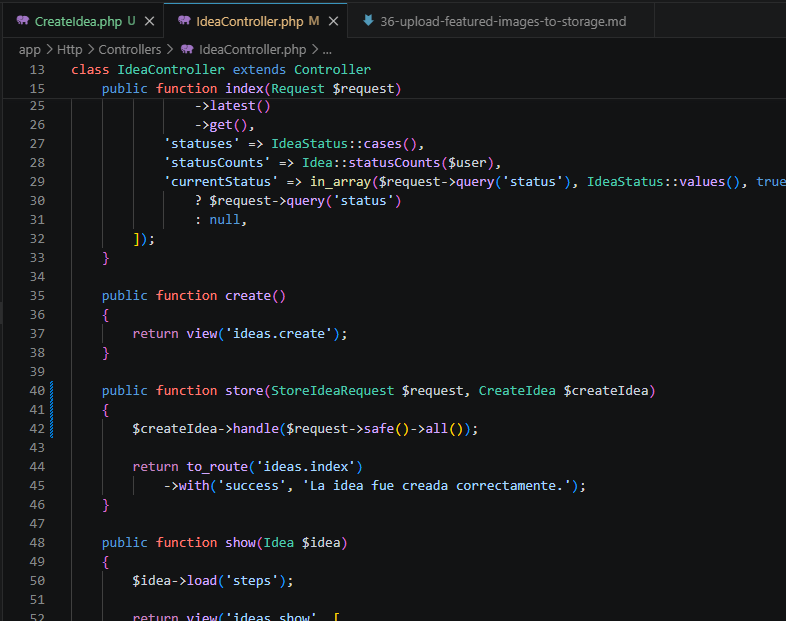
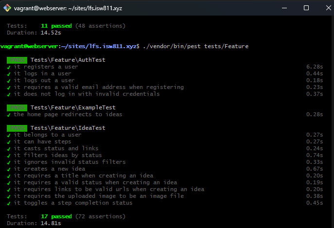

[<- Regresar](../entregable03.md)

# Episodio 37: Action Classes

## Módulo 4: Final Project

## Resumen

En este episodio se refactorizó la creación de ideas utilizando una action class.

Antes de este capítulo, el método `store` del `IdeaController` tenía varias responsabilidades: crear la idea, guardar la imagen destacada, crear los pasos accionables y redirigir al usuario. Aunque funcionaba correctamente, el controlador estaba empezando a acumular demasiada lógica.

Para mejorar la organización del código, se creó una clase dedicada llamada `CreateIdea`, encargada exclusivamente de manejar el proceso de creación de una idea.

Con este cambio, el controlador queda más simple y la lógica de creación puede reutilizarse desde otros lugares de la aplicación.

---

## Comandos utilizados

Para crear el archivo de documentación se utilizó:

```bash
cd ~/ISW811/VMs/webserver/sites/lfs.isw811.xyz
touch docs/final-project/37-action-classes.md
```

Para entrar a la máquina virtual se utilizó:

```bash
cd ~/ISW811/VMs/webserver
vagrant ssh
```

Dentro de Debian se ingresó al proyecto:

```bash
cd ~/sites/lfs.isw811.xyz
```

Para crear la carpeta de actions y el archivo de la action class se utilizó:

```bash
mkdir -p app/Actions
touch app/Actions/CreateIdea.php
```

Para formatear el código se utilizó:

```bash
composer run format
```

Para compilar los assets con Vite en modo build se utilizó:

```bash
rm -f public/hot
npm run build
php artisan optimize:clear
php artisan view:clear
```

Para ejecutar las pruebas del archivo de ideas se utilizó:

```bash
./vendor/bin/pest tests/Feature/IdeaTest.php
```

También se ejecutaron todas las pruebas Feature:

```bash
./vendor/bin/pest tests/Feature
```

---

## Archivos modificados o creados

Los archivos principales trabajados durante este episodio fueron:

- `app/Actions/CreateIdea.php`
- `app/Http/Controllers/IdeaController.php`
- `docs/final-project/37-action-classes.md`

También se agregaron las siguientes capturas como evidencia:

- `docs/img/37-action-class-code.png`
- `docs/img/37-action-class-controller.png`
- `docs/img/37-action-class-tests-passing.png`

---

## Problema antes de la refactorización

Antes de crear la action class, el método `store` del controlador tenía demasiada lógica.

El controlador se encargaba de:

1. Crear la idea.
2. Excluir campos que no pertenecían directamente a la tabla `ideas`.
3. Crear los pasos accionables.
4. Guardar la imagen destacada.
5. Actualizar el campo `image_path`.
6. Redirigir al usuario.

Aunque el flujo funcionaba, esta lógica no era fácil de reutilizar desde otra parte de la aplicación.

---

## Creación de la action class

Se creó una nueva carpeta dentro de `app`:

```text
app/Actions
```

Dentro de esa carpeta se creó el archivo:

```text
app/Actions/CreateIdea.php
```

Esta clase representa una acción concreta de la aplicación: crear una idea.

```php
<?php

namespace App\Actions;

use App\Models\Idea;
use App\Models\User;
use Illuminate\Container\Attributes\CurrentUser;
use Illuminate\Support\Facades\DB;

class CreateIdea
{
    public function __construct(
        #[CurrentUser]
        protected User $user,
    ) {}

    public function handle(array $attributes): Idea
    {
        return DB::transaction(function () use ($attributes) {
            $data = collect($attributes)
                ->only(['title', 'description', 'status', 'links'])
                ->toArray();

            if ($attributes['image'] ?? false) {
                $data['image_path'] = $attributes['image']->store('ideas', 'public');
            }

            $idea = $this->user
                ->ideas()
                ->create($data);

            $steps = collect($attributes['steps'] ?? [])
                ->filter()
                ->map(fn (string $step) => [
                    'description' => $step,
                ])
                ->values();

            if ($steps->isNotEmpty()) {
                $idea->steps()->createMany($steps->all());
            }

            return $idea;
        });
    }
}
```

---

## Inyección del usuario actual

La clase `CreateIdea` necesita saber qué usuario está creando la idea.

Para eso se utilizó el atributo `CurrentUser` de Laravel:

```php
#[CurrentUser]
protected User $user,
```

Esto permite que Laravel inyecte automáticamente el usuario autenticado cuando resuelve la clase desde el contenedor.

Gracias a esto, el método `handle` no necesita recibir manualmente el usuario desde el controlador.

---

## Método `handle`

La action class utiliza un método llamado `handle`.

```php
public function handle(array $attributes): Idea
```

Este método recibe los datos validados de la idea y se encarga de ejecutar todo el proceso de creación.

El uso de un método `handle` ayuda a que la clase tenga una responsabilidad clara y fácil de entender.

---

## Preparación de los datos

Dentro de la action class se preparan únicamente los campos que pertenecen directamente a la tabla `ideas`.

```php
$data = collect($attributes)
    ->only(['title', 'description', 'status', 'links'])
    ->toArray();
```

Esto evita guardar campos como `steps` o `image` directamente en la tabla `ideas`.

El campo `steps` pertenece a la tabla `steps`.

El campo `image` representa el archivo subido, no una columna directa de la tabla `ideas`.

---

## Guardado de la imagen destacada

Si el usuario sube una imagen, la action class la guarda en el disco público dentro de la carpeta `ideas`.

```php
if ($attributes['image'] ?? false) {
    $data['image_path'] = $attributes['image']->store('ideas', 'public');
}
```

La ruta generada se agrega al arreglo `$data` antes de crear la idea.

De esta manera, la idea se crea una sola vez con su `image_path` ya incluido.

Esto mejora el flujo anterior, donde primero se creaba la idea y luego se hacía una actualización adicional para guardar la ruta de la imagen.

---

## Creación de la idea

La idea se crea usando la relación del usuario autenticado.

```php
$idea = $this->user
    ->ideas()
    ->create($data);
```

Esto garantiza que la idea quede asociada correctamente al usuario que la creó.

---

## Creación de pasos accionables

Después de crear la idea, la action class revisa si se enviaron pasos accionables.

```php
$steps = collect($attributes['steps'] ?? [])
    ->filter()
    ->map(fn (string $step) => [
        'description' => $step,
    ])
    ->values();
```

Cada paso se transforma en un arreglo con la clave `description`, que corresponde a la columna de la tabla `steps`.

Luego, si existen pasos, se crean usando la relación de la idea.

```php
if ($steps->isNotEmpty()) {
    $idea->steps()->createMany($steps->all());
}
```

---

## Uso de transacciones

La creación de la idea se envolvió dentro de una transacción de base de datos.

```php
return DB::transaction(function () use ($attributes) {
    ...
});
```

Esto es importante porque el proceso involucra varias operaciones:

- Guardar la imagen.
- Crear la idea.
- Crear los pasos accionables.

Si alguna operación falla, Laravel puede revertir las operaciones de base de datos para evitar que la información quede en un estado inconsistente.

---

## Controlador antes de la refactorización

Antes del cambio, el método `store` del `IdeaController` contenía toda la lógica de creación.

El controlador sabía demasiado sobre cómo construir una idea, cómo guardar pasos y cómo guardar imágenes.

Esto hacía que el método fuera menos limpio y más difícil de mantener.

---

## Controlador después de la refactorización

Después de crear la action class, el método `store` quedó mucho más simple.

```php
public function store(StoreIdeaRequest $request, CreateIdea $createIdea)
{
    $createIdea->handle($request->safe()->all());

    return to_route('ideas.index')
        ->with('success', 'La idea fue creada correctamente.');
}
```

Ahora el controlador solo se encarga de:

1. Recibir el request validado.
2. Delegar la creación a `CreateIdea`.
3. Redirigir al usuario con un mensaje de éxito.

La lógica real de creación ya no está dentro del controlador.

---

## Inyección de la action class en el controlador

Laravel puede inyectar automáticamente la clase `CreateIdea` en el método `store`.

```php
public function store(StoreIdeaRequest $request, CreateIdea $createIdea)
```

Esto funciona porque Laravel resuelve la clase desde su contenedor de servicios.

Luego se llama al método `handle`:

```php
$createIdea->handle($request->safe()->all());
```

El método recibe todos los datos validados del formulario.

---

## Imports del controlador

Se agregó el import de la action class en `IdeaController`.

```php
use App\Actions\CreateIdea;
```

También se limpiaron imports que ya no eran necesarios.

El controlador quedó más ordenado y con menos responsabilidades.

---

## Beneficios de usar action classes

Este cambio aporta varios beneficios al proyecto:

1. El controlador queda más limpio.
2. La lógica de creación queda centralizada.
3. La acción puede reutilizarse desde otros lugares.
4. El código es más fácil de probar.
5. El flujo de creación queda más organizado.
6. La aplicación queda mejor preparada para crecer.

---

## Pruebas automatizadas

No fue necesario crear pruebas nuevas para este capítulo, porque ya existía una prueba que valida la creación completa de una idea.

La prueba existente confirma que se pueda crear una idea con:

- Título.
- Descripción.
- Estado.
- Enlaces.
- Pasos accionables.
- Imagen destacada.

Después de la refactorización, se ejecutó nuevamente:

```bash
./vendor/bin/pest tests/Feature/IdeaTest.php
```

Las pruebas pasaron correctamente, confirmando que mover la lógica a la action class no rompió el comportamiento existente.

También se ejecutó:

```bash
./vendor/bin/pest tests/Feature
```

para validar el resto de pruebas Feature del proyecto.

---

## Uso de `npm run build`

Para este capítulo se continuó usando `npm run build` en lugar de `npm run dev`, con el objetivo de trabajar más rápido.

El flujo utilizado fue:

```bash
rm -f public/hot
npm run build
php artisan optimize:clear
php artisan view:clear
```

Como este capítulo fue principalmente una refactorización de PHP, no requería Vite corriendo constantemente en modo desarrollo.

---

## Evidencia

Como evidencia de este episodio se agregaron capturas de la action class, del controlador refactorizado y de las pruebas pasando.







---

## Comentarios personales

Este capítulo fue importante porque ayudó a mejorar la estructura interna del proyecto.

Aunque visualmente la aplicación funciona igual, internamente el código quedó más limpio. El controlador ya no concentra toda la lógica de creación y ahora existe una clase específica para manejar esa acción.

Este tipo de refactorización es útil porque permite que la aplicación sea más mantenible conforme se agregan nuevas funcionalidades.