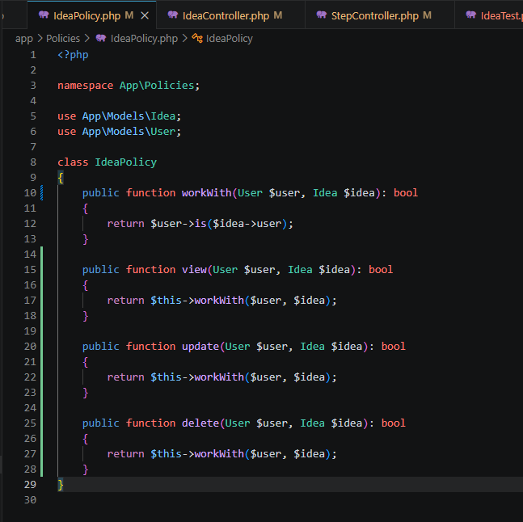
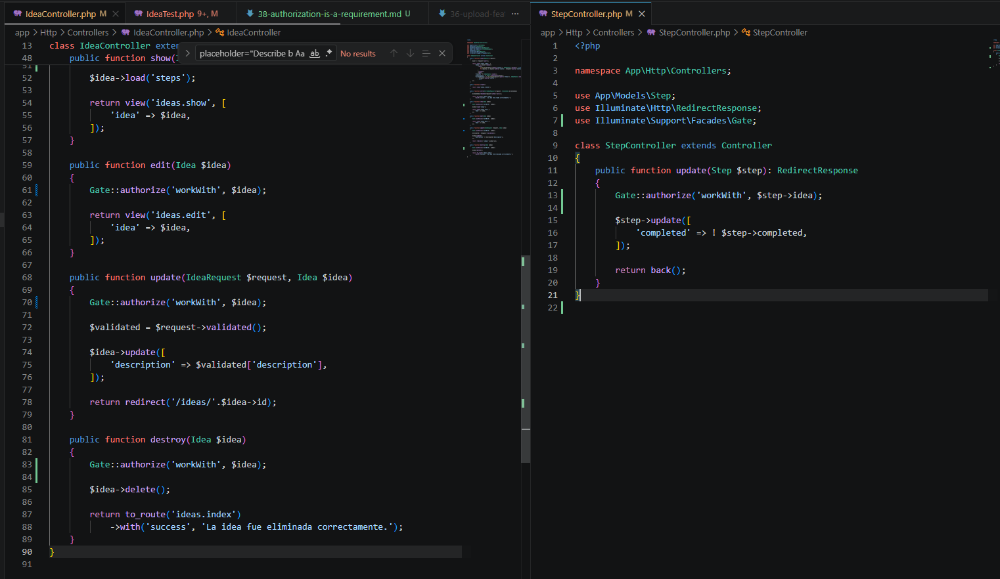
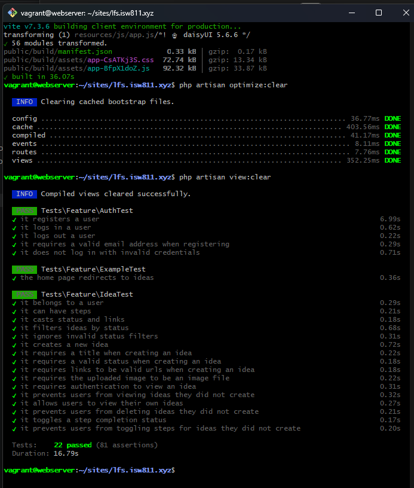

[<- Regresar](../entregable03.md)

# Episodio 38: Authorization Is A Requirement

## Módulo 4: Final Project

## Resumen

En este episodio se agregó autorización al proyecto para proteger las ideas de cada usuario.

Antes de este capítulo, un usuario autenticado podía intentar acceder directamente a una idea que no le pertenecía mediante la URL. También podía intentar eliminar una idea o modificar pasos accionables asociados a ideas de otro usuario.

Para corregir esto, se utilizó una policy de Laravel y llamadas a `Gate::authorize()` dentro de los controladores.

Con este cambio, cada usuario solo puede trabajar con sus propias ideas.

---

## Comandos utilizados

Para crear el archivo de documentación se utilizó:

```bash
cd ~/ISW811/VMs/webserver/sites/lfs.isw811.xyz
touch docs/final-project/38-authorization-is-a-requirement.md
```

Para entrar a la máquina virtual se utilizó:

```bash
cd ~/ISW811/VMs/webserver
vagrant ssh
```

Dentro de Debian se ingresó al proyecto:

```bash
cd ~/sites/lfs.isw811.xyz
```

Para formatear el código se utilizó:

```bash
composer run format
```

Para compilar los assets con Vite en modo build se utilizó:

```bash
rm -f public/hot
npm run build
php artisan optimize:clear
php artisan view:clear
```

Para ejecutar las pruebas del archivo de ideas se utilizó:

```bash
./vendor/bin/pest tests/Feature/IdeaTest.php
```

También se ejecutaron todas las pruebas Feature:

```bash
./vendor/bin/pest tests/Feature
```

---

## Archivos modificados

Los archivos principales trabajados durante este episodio fueron:

- `app/Policies/IdeaPolicy.php`
- `app/Http/Controllers/IdeaController.php`
- `app/Http/Controllers/StepController.php`
- `tests/Feature/IdeaTest.php`
- `docs/final-project/38-authorization-is-a-requirement.md`

También se agregaron las siguientes capturas como evidencia:

- `docs/img/38-idea-policy-code.png`
- `docs/img/38-authorization-controller-code.png`
- `docs/img/38-authorization-tests-passing.png`

---

## Problema de autorización

El problema principal era que la aplicación ya requería autenticación, pero eso no era suficiente.

Una persona autenticada podía intentar visitar directamente una URL como:

```text
/ideas/1
```

Si esa idea existía, podía verla aunque no fuera suya.

Esto representa un problema de seguridad porque autenticación y autorización no son lo mismo.

La autenticación confirma quién es el usuario.

La autorización confirma si ese usuario tiene permiso para realizar una acción específica.

---

## Policy de ideas

Se actualizó la policy:

```text
app/Policies/IdeaPolicy.php
```

La policy contiene la regla central para determinar si un usuario puede trabajar con una idea.

```php
<?php

namespace App\Policies;

use App\Models\Idea;
use App\Models\User;

class IdeaPolicy
{
    public function workWith(User $user, Idea $idea): bool
    {
        return $user->is($idea->user);
    }

    public function view(User $user, Idea $idea): bool
    {
        return $this->workWith($user, $idea);
    }

    public function update(User $user, Idea $idea): bool
    {
        return $this->workWith($user, $idea);
    }

    public function delete(User $user, Idea $idea): bool
    {
        return $this->workWith($user, $idea);
    }
}
```

---

## Método `workWith`

Se creó el método `workWith` para representar una regla general.

```php
public function workWith(User $user, Idea $idea): bool
{
    return $user->is($idea->user);
}
```

Este método compara el usuario autenticado con el usuario dueño de la idea.

Si ambos son el mismo usuario, la acción está permitida.

Si son usuarios diferentes, Laravel devuelve una respuesta `403 Forbidden`.

---

## Métodos `view`, `update` y `delete`

También se agregaron los métodos `view`, `update` y `delete`.

```php
public function view(User $user, Idea $idea): bool
{
    return $this->workWith($user, $idea);
}

public function update(User $user, Idea $idea): bool
{
    return $this->workWith($user, $idea);
}

public function delete(User $user, Idea $idea): bool
{
    return $this->workWith($user, $idea);
}
```

Estos métodos reutilizan la misma regla de `workWith`, porque en este proyecto la autorización para ver, editar o eliminar una idea depende de la misma condición: que la idea pertenezca al usuario actual.

---

## Autorización en `IdeaController`

Se actualizó el controlador:

```text
app/Http/Controllers/IdeaController.php
```

En la acción `show`, se agregó autorización antes de mostrar la idea.

```php
public function show(Idea $idea)
{
    Gate::authorize('workWith', $idea);

    $idea->load('steps');

    return view('ideas.show', [
        'idea' => $idea,
    ]);
}
```

Con esto, un usuario ya no puede ver una idea que no le pertenece.

---

## Autorización al editar una idea

En el método `edit`, también se agregó la validación de permisos.

```php
public function edit(Idea $idea)
{
    Gate::authorize('workWith', $idea);

    return view('ideas.edit', [
        'idea' => $idea,
    ]);
}
```

Esto evita que un usuario pueda abrir una pantalla de edición para una idea ajena.

---

## Autorización al actualizar una idea

En el método `update`, se agregó la misma autorización.

```php
public function update(IdeaRequest $request, Idea $idea)
{
    Gate::authorize('workWith', $idea);

    $validated = $request->validated();

    $idea->update([
        'description' => $validated['description'],
    ]);

    return redirect('/ideas/' . $idea->id);
}
```

De esta forma, aunque alguien intente enviar manualmente una solicitud `PUT` o `PATCH`, Laravel bloqueará la acción si la idea no pertenece al usuario autenticado.

---

## Autorización al eliminar una idea

También se protegió el método `destroy`.

```php
public function destroy(Idea $idea)
{
    Gate::authorize('workWith', $idea);

    $idea->delete();

    return to_route('ideas.index')
        ->with('success', 'La idea fue eliminada correctamente.');
}
```

Esto evita que un usuario pueda eliminar ideas ajenas enviando una solicitud `DELETE` directamente.

---

## Autorización en `StepController`

Además de proteger las ideas, también se protegieron los pasos accionables.

Se actualizó:

```text
app/Http/Controllers/StepController.php
```

El método `update` ahora verifica que el paso pertenezca a una idea del usuario autenticado.

```php
<?php

namespace App\Http\Controllers;

use App\Models\Step;
use Illuminate\Http\RedirectResponse;
use Illuminate\Support\Facades\Gate;

class StepController extends Controller
{
    public function update(Step $step): RedirectResponse
    {
        Gate::authorize('workWith', $step->idea);

        $step->update([
            'completed' => ! $step->completed,
        ]);

        return back();
    }
}
```

El paso no pertenece directamente al usuario, pero sí pertenece a una idea.

Por eso la autorización se realiza sobre:

```php
$step->idea
```

Si la idea asociada al paso pertenece al usuario autenticado, puede cambiar el estado del paso.

Si no le pertenece, se bloquea la acción.

---

## Pruebas de autenticación

Se agregó una prueba para confirmar que un usuario no autenticado no pueda ver una idea.

```php
it('requires authentication to view an idea', function () {
    $idea = Idea::factory()->create();

    $this
        ->get(route('ideas.show', $idea))
        ->assertRedirect(route('login'));
});
```

Esta prueba confirma que primero se requiere iniciar sesión.

---

## Prueba para impedir ver ideas ajenas

Se agregó una prueba para confirmar que un usuario autenticado no pueda ver una idea que pertenece a otro usuario.

```php
it('prevents users from viewing ideas they did not create', function () {
    $user = User::factory()->create();

    $idea = Idea::factory()->create([
        'title' => 'Idea privada de otro usuario',
    ]);

    $this
        ->actingAs($user)
        ->get(route('ideas.show', $idea))
        ->assertForbidden();
});
```

La respuesta esperada es:

```text
403 Forbidden
```

---

## Prueba para permitir ver ideas propias

También se agregó una prueba positiva.

```php
it('allows users to view their own ideas', function () {
    $user = User::factory()->create();

    $idea = Idea::factory()
        ->for($user)
        ->create([
            'title' => 'Idea autorizada',
        ]);

    $this
        ->actingAs($user)
        ->get(route('ideas.show', $idea))
        ->assertOk()
        ->assertSee('Idea autorizada');
});
```

Esta prueba confirma que el usuario sí puede ver sus propias ideas.

---

## Prueba para impedir eliminar ideas ajenas

Se agregó una prueba para confirmar que un usuario no pueda eliminar una idea que no creó.

```php
it('prevents users from deleting ideas they did not create', function () {
    $user = User::factory()->create();

    $idea = Idea::factory()->create();

    $this
        ->actingAs($user)
        ->delete(route('ideas.destroy', $idea))
        ->assertForbidden();

    $this->assertDatabaseHas('ideas', [
        'id' => $idea->id,
    ]);
});
```

Además de esperar una respuesta `403`, se verifica que la idea siga existiendo en la base de datos.

---

## Prueba para impedir modificar pasos ajenos

También se agregó una prueba para evitar que un usuario pueda marcar como completado un paso de una idea que no le pertenece.

```php
it('prevents users from toggling steps for ideas they did not create', function () {
    $user = User::factory()->create();

    $idea = Idea::factory()->create();

    $step = $idea->steps()->create([
        'description' => 'Paso privado',
        'completed' => false,
    ]);

    $this
        ->actingAs($user)
        ->from(route('ideas.index'))
        ->patch(route('steps.update', $step))
        ->assertForbidden();

    expect($step->refresh()->completed)->toBeFalse();
});
```

Esta prueba confirma que el paso no cambia su estado si el usuario no tiene permiso.

---

## Resultado de las pruebas

Después de implementar la policy y las autorizaciones en los controladores, se ejecutó:

```bash
./vendor/bin/pest tests/Feature/IdeaTest.php
```

Las pruebas pasaron correctamente.

También se ejecutó:

```bash
./vendor/bin/pest tests/Feature
```

para confirmar que el resto de pruebas Feature continuaran funcionando.

---

## Uso de `npm run build`

Para este capítulo se continuó utilizando `npm run build` en lugar de `npm run dev`, ya que los cambios principales fueron de backend y pruebas.

El flujo utilizado fue:

```bash
rm -f public/hot
npm run build
php artisan optimize:clear
php artisan view:clear
```

Esto permitió compilar los assets sin mantener Vite corriendo constantemente.

---

## Evidencia

Como evidencia de este episodio se agregaron capturas de la policy, del controlador con autorización y de las pruebas pasando.







---

## Comentarios personales

Este capítulo fue importante porque reforzó la seguridad de la aplicación.

La autenticación por sí sola no era suficiente. Aunque un usuario estuviera conectado, era necesario confirmar que tuviera permiso para trabajar con una idea específica.

Con la policy y las verificaciones usando `Gate::authorize()`, la aplicación ahora protege mejor los datos de cada usuario y evita accesos directos no autorizados mediante URLs o solicitudes manuales.