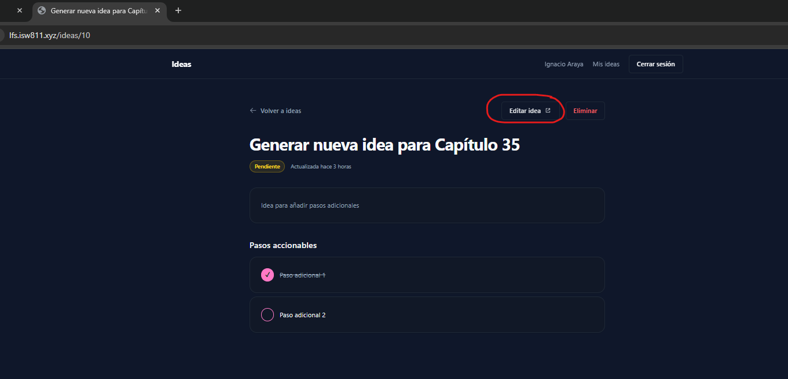
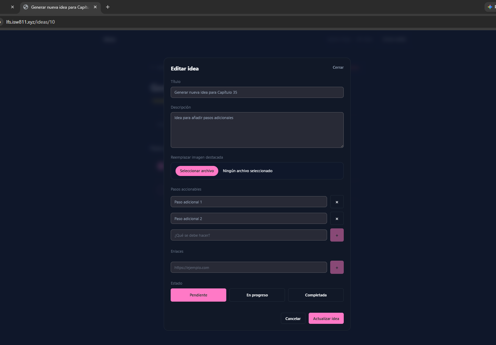
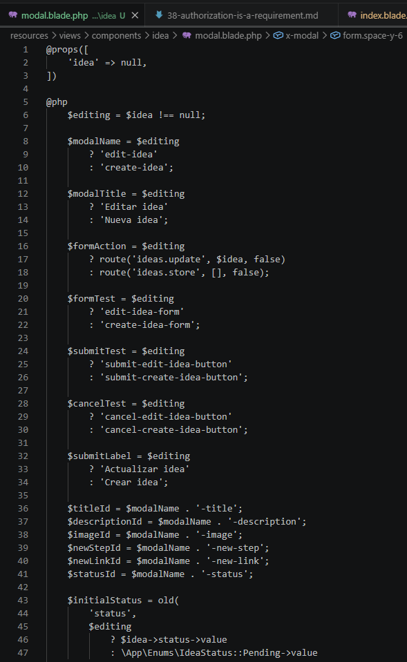
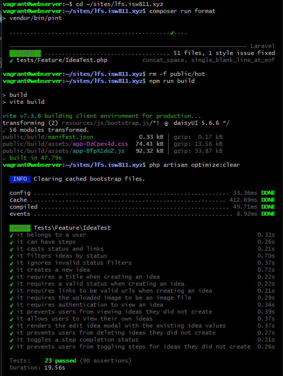

[<- Regresar](../entregable03.md)

# Episodio 39: The Edit Idea Modal

## Módulo 4: Final Project

## Resumen

En este episodio se implementó un modal para editar ideas existentes.

Antes de este capítulo, el modal para crear ideas estaba escrito directamente dentro de la vista `resources/views/ideas/index.blade.php`. Esto significaba que el formulario solo estaba disponible en el listado de ideas y no podía reutilizarse fácilmente desde la página individual.

Para solucionar este problema, el formulario completo se extrajo a un componente Blade reutilizable llamado `idea.modal`.

El componente puede trabajar en dos modos:

- Creación de una nueva idea.
- Edición de una idea existente.

Cuando recibe una instancia de `Idea`, el componente reconoce que debe funcionar en modo edición, cambia el título del modal, utiliza la ruta de actualización, agrega el método `PATCH` y carga los valores existentes de la idea.

---

## Comandos utilizados

Para crear el archivo de documentación se utilizó:

```bash
cd ~/ISW811/VMs/webserver/sites/lfs.isw811.xyz
touch docs/final-project/39-the-edit-idea-modal.md
```

Para entrar a la máquina virtual se utilizó:

```bash
cd ~/ISW811/VMs/webserver
vagrant ssh
```

Dentro de la máquina virtual se ingresó al proyecto:

```bash
cd ~/sites/lfs.isw811.xyz
```

Para crear el nuevo componente se utilizaron los siguientes comandos:

```bash
mkdir -p resources/views/components/idea
touch resources/views/components/idea/modal.blade.php
```

Para formatear el código se utilizó:

```bash
composer run format
```

Para compilar los assets con Vite en modo build se utilizó:

```bash
rm -f public/hot
npm run build
php artisan optimize:clear
php artisan view:clear
```

Para ejecutar las pruebas relacionadas con ideas se utilizó:

```bash
./vendor/bin/pest tests/Feature/IdeaTest.php
```

También se ejecutaron todas las pruebas Feature:

```bash
./vendor/bin/pest tests/Feature
```

---

## Archivos modificados o creados

Los archivos principales trabajados durante este episodio fueron:

- `resources/views/components/idea/modal.blade.php`
- `resources/views/ideas/index.blade.php`
- `resources/views/ideas/show.blade.php`
- `tests/Feature/IdeaTest.php`
- `docs/final-project/39-the-edit-idea-modal.md`

También se agregaron las siguientes capturas como evidencia:

- `docs/img/39-edit-idea-button.png`
- `docs/img/39-edit-idea-modal.png`
- `docs/img/39-edit-idea-modal-code.png`
- `docs/img/39-edit-idea-tests-passing.png`

---

## Problema antes de la refactorización

Antes de este episodio, el formulario para crear ideas estaba escrito directamente dentro de:

```text
resources/views/ideas/index.blade.php
```

Esto provocaba que el modal solo existiera en la página principal de ideas.

Aunque desde la vista individual se podía mostrar un botón llamado **Editar idea**, ese botón no podía abrir el formulario porque el modal no existía dentro de esa página.

Para poder reutilizar el mismo formulario, fue necesario extraerlo a un componente independiente.

---

## Componente reutilizable para ideas

Se creó el archivo:

```text
resources/views/components/idea/modal.blade.php
```

El componente recibe opcionalmente una idea:

```blade
@props([
    'idea' => null,
])
```

Cuando no recibe una idea, funciona como formulario de creación.

Cuando recibe una instancia de `Idea`, funciona como formulario de edición.

---

## Detección del modo de edición

El componente utiliza la variable `$editing` para determinar si está creando o editando.

```blade
@php
    $editing = $idea !== null;
@endphp
```

Si `$idea` contiene una instancia, `$editing` será verdadero.

Esta condición se utiliza en el resto del componente para cambiar dinámicamente el nombre del modal, el título, la ruta, el método HTTP y el texto del botón principal.

---

## Nombre dinámico del modal

El modal utiliza nombres diferentes según el modo activo.

```blade
$modalName = $editing
    ? 'edit-idea'
    : 'create-idea';
```

Cuando se crea una idea, el nombre utilizado es:

```text
create-idea
```

Cuando se edita una idea, el nombre utilizado es:

```text
edit-idea
```

Esto permite abrir cada modal mediante eventos de AlpineJS.

---

## Título dinámico

El título también cambia dependiendo del modo.

```blade
$modalTitle = $editing
    ? 'Editar idea'
    : 'Nueva idea';
```

El mismo componente puede mostrar **Nueva idea** en el listado y **Editar idea** en la página individual.

---

## Acción dinámica del formulario

La ruta del formulario se determina automáticamente.

```blade
$formAction = $editing
    ? route('ideas.update', $idea, false)
    : route('ideas.store', [], false);
```

En modo creación, el formulario utiliza:

```text
POST /ideas
```

En modo edición, utiliza:

```text
PATCH /ideas/{idea}
```

La opción `false` permite generar una ruta relativa y mantener el formulario dentro del mismo dominio utilizado por la aplicación.

---

## Método HTTP para edición

Todos los formularios incluyen el token CSRF:

```blade
@csrf
```

Cuando el componente está en modo edición, también agrega:

```blade
@if ($editing)
    @method('PATCH')
@endif
```

Esto permite que Laravel interprete la solicitud como una actualización.

---

## Valores iniciales del formulario

El formulario carga valores diferentes según el modo.

Para el título se utilizó:

```blade
value="{{ old('title', $idea?->title) }}"
```

Para la descripción:

```blade
{{ old('description', $idea?->description) }}
```

El operador `?->` permite acceder al valor de la idea únicamente cuando existe.

En modo creación, los campos permanecen vacíos.

En modo edición, los campos muestran la información actual.

---

## Estado inicial

El estado de la idea también se precarga dinámicamente.

```blade
$initialStatus = old(
    'status',
    $editing
        ? $idea->status->value
        : \App\Enums\IdeaStatus::Pending->value
);
```

Para una idea nueva, el estado inicial es `pending`.

Para una idea existente, se carga el estado guardado en la base de datos.

Este valor se utiliza dentro de AlpineJS:

```blade
x-data="{
    status: @js($initialStatus),
    newStep: '',
    steps: @js($initialSteps),
    newLink: '',
    links: @js($initialLinks),
}"
```

---

## Carga de pasos existentes

Los pasos accionables se cargan usando la relación de la idea.

```blade
$initialSteps = old(
    'steps',
    $editing
        ? $idea->steps->pluck('description')->values()->all()
        : []
);
```

En modo edición se extraen las descripciones de los pasos y se convierten en un arreglo para AlpineJS.

Esto permite que los pasos existentes aparezcan inmediatamente dentro del modal.

---

## Carga de enlaces existentes

Los enlaces también se cargan dentro del arreglo administrado por AlpineJS.

```blade
$initialLinks = old(
    'links',
    $editing
        ? collect($idea->links ?? [])->values()->all()
        : []
);
```

Si la idea tiene enlaces, estos aparecen como campos dentro del modal.

Si no tiene enlaces, AlpineJS recibe un arreglo vacío.

---

## Imagen destacada actual

Cuando la idea tiene una imagen destacada, el modal muestra una vista previa.

```blade
@if ($editing && $idea->image_path)
    <div class="overflow-hidden rounded-xl border border-border">
        image_path) }}"
            alt="Imagen destacada actual de {{ $idea->title }}"
            class="h-40 w-full object-cover"
        >
    </div>

    <p class="text-xs text-muted">
        Selecciona otra imagen solamente si deseas reemplazar la actual.
    </p>
@endif
```

El input para archivos continúa disponible para seleccionar una imagen nueva.

La funcionalidad completa para reemplazar la imagen se implementará junto con la actualización de la idea en el siguiente capítulo.

---

## Textos dinámicos de los botones

El botón principal cambia según el modo.

```blade
$submitLabel = $editing
    ? 'Actualizar idea'
    : 'Crear idea';
```

En el formulario se utiliza:

```blade
<button
    type="submit"
    class="button"
    data-test="{{ $submitTest }}"
>
    {{ $submitLabel }}
</button>
```

También se utilizan valores `data-test` diferentes para facilitar las pruebas.

En creación:

```text
submit-create-idea-button
```

En edición:

```text
submit-edit-idea-button
```

---

## Uso del componente en el listado

Después de extraer el formulario, se eliminó el código extenso que estaba dentro de:

```text
resources/views/ideas/index.blade.php
```

En su lugar se agregó:

```blade
<x-idea.modal />
```

Como no se envía ninguna idea, el componente funciona en modo creación.

El botón principal abre el modal mediante AlpineJS:

```blade
<x-card
    as="button"
    x-data
    x-on:click="$dispatch('open-modal', 'create-idea')"
    data-test="create-idea-button"
>
```

---

## Botón de edición

En la vista individual se reemplazó el enlace anterior por un botón funcional.

```blade
<button
    type="button"
    x-data
    x-on:click="$dispatch('open-modal', 'edit-idea')"
    data-test="edit-idea-button"
    class="button button-outline inline-flex items-center gap-2"
>
    Editar idea

    <x-icons.external-link />
</button>
```

Al presionar el botón, AlpineJS emite el evento:

```text
open-modal
```

con el nombre:

```text
edit-idea
```

---

## Uso del componente en la vista individual

Al final de la página individual se agregó:

```blade
<x-idea.modal :idea="$idea" />
```

En este caso sí se envía la idea actual.

Por eso el componente entra en modo edición y precarga sus datos.

---

## Conservación de la imagen en la vista individual

La vista `show.blade.php` también conserva la imagen destacada en la parte superior.

```blade
@if ($idea->image_path)
    <div class="overflow-hidden rounded-2xl border border-border">
        image_path) }}"
            alt="Imagen destacada de {{ $idea->title }}"
            class="h-auto w-full object-cover"
        >
    </div>
@endif
```

Esto permite visualizar la imagen tanto en la página como dentro del modal de edición.

---

## Prueba automatizada del modal de edición

Se agregó una prueba para verificar que la página individual renderice correctamente el modal.

```php
it('renders the edit idea modal with the existing idea values', function () {
    $user = User::factory()->create();

    $idea = Idea::factory()
        ->for($user)
        ->create([
            'title' => 'Idea que será editada',
            'description' => 'Descripción original de la idea.',
            'status' => IdeaStatus::InProgress,
            'links' => [
                'https://laravel.com',
            ],
        ]);

    $idea->steps()->create([
        'description' => 'Paso existente',
        'completed' => false,
    ]);

    $response = $this
        ->actingAs($user)
        ->get(route('ideas.show', $idea));

    $response
        ->assertOk()
        ->assertSee(
            'data-test="edit-idea-button"',
            false
        )
        ->assertSee(
            'data-test="edit-idea-form"',
            false
        )
        ->assertSee(
            'action="' . route('ideas.update', $idea, false) . '"',
            false
        )
        ->assertSee(
            'value="Idea que será editada"',
            false
        )
        ->assertSee('Descripción original de la idea.')
        ->assertSee('Paso existente')
        ->assertSee('https://laravel.com')
        ->assertSee('Actualizar idea');
});
```

---

## Elementos validados por la prueba

La prueba confirma que la página contiene:

- El botón `edit-idea-button`.
- El formulario `edit-idea-form`.
- La ruta de actualización correspondiente.
- El título de la idea.
- La descripción actual.
- Los pasos existentes.
- Los enlaces actuales.
- El botón **Actualizar idea**.

Esto permite verificar el renderizado del formulario sin depender de una prueba visual manual.

---

## Alcance del capítulo

En este episodio se trabajó la presentación y reutilización del modal.

El formulario ya apunta hacia la ruta:

```text
ideas.update
```

Sin embargo, la lógica completa para actualizar:

- Título.
- Descripción.
- Estado.
- Enlaces.
- Pasos accionables.
- Imagen destacada.

se completará en el capítulo 40.

---

## Prueba manual en el navegador

La funcionalidad se probó desde:

```text
http://lfs.isw811.xyz/ideas
```

El flujo realizado fue:

1. Iniciar sesión.
2. Abrir una idea propia.
3. Verificar que apareciera el botón **Editar idea**.
4. Presionar el botón.
5. Confirmar que el modal se abriera.
6. Verificar el título precargado.
7. Verificar la descripción precargada.
8. Confirmar que aparecieran los pasos existentes.
9. Confirmar que aparecieran los enlaces existentes.
10. Verificar el estado seleccionado.
11. Confirmar que apareciera la imagen actual cuando existiera.
12. Verificar el botón **Actualizar idea**.

---

## Uso de `npm run build`

Para este capítulo se continuó utilizando `npm run build`.

El flujo utilizado fue:

```bash
rm -f public/hot
npm run build
php artisan optimize:clear
php artisan view:clear
```

Esto permitió compilar los cambios de AlpineJS y Tailwind sin mantener Vite ejecutándose en modo desarrollo.

---

## Evidencia

Como evidencia del episodio se agregaron capturas del botón, el modal abierto, el componente reutilizable y las pruebas pasando.









---

## Comentarios personales

Este capítulo fue importante porque permitió reutilizar el mismo formulario para dos operaciones relacionadas.

En lugar de mantener un formulario diferente para crear y otro para editar, se creó un único componente capaz de adaptarse según los datos recibidos.

Esto reduce duplicación, facilita el mantenimiento del proyecto y deja preparada la aplicación para implementar la actualización completa de ideas en el siguiente capítulo.