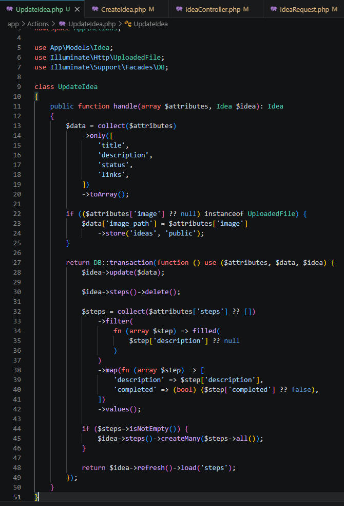
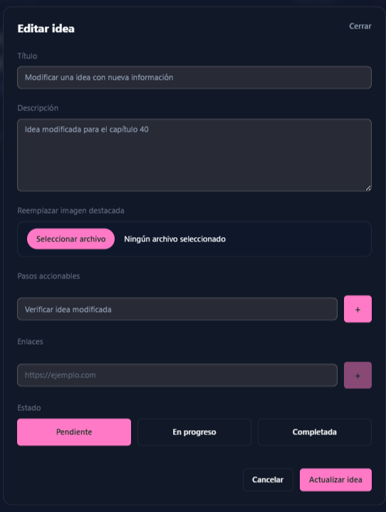
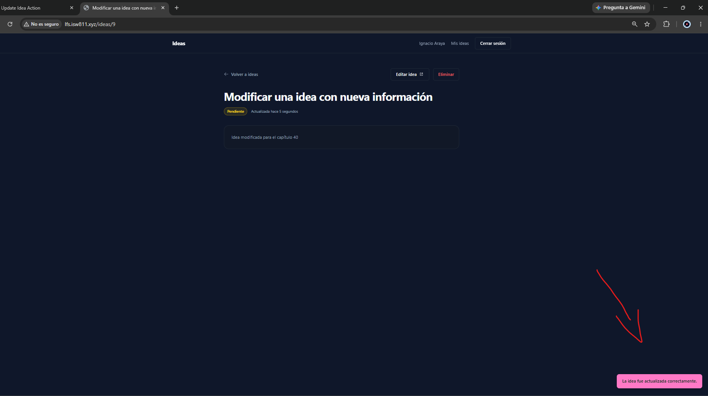
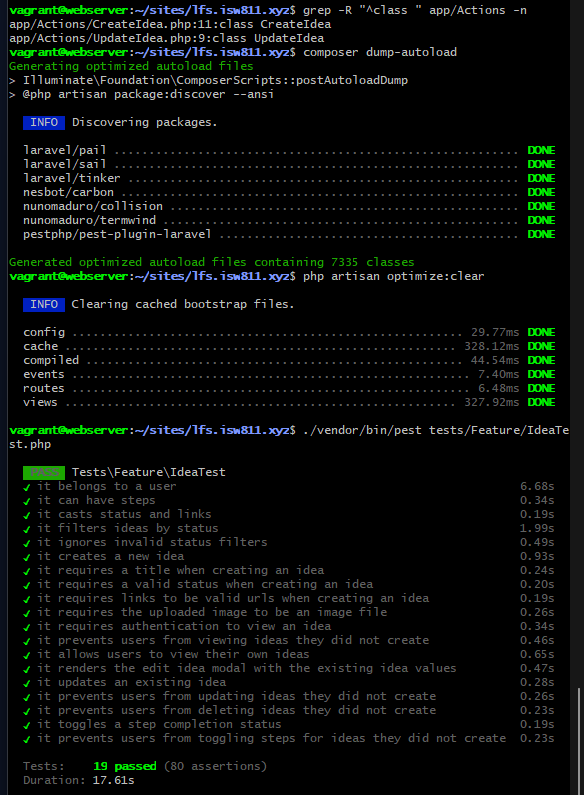

[<- Regresar](../entregable03.md)

# Episodio 40: Update Idea Action

## Módulo 4: Final Project

## Resumen

En este episodio se implementó la actualización completa de una idea existente.

El modal creado en el episodio anterior ya mostraba los valores actuales de la idea, pero todavía era necesario procesar la solicitud enviada por el formulario y guardar los cambios en la base de datos.

Para mantener el controlador pequeño y separar responsabilidades, se creó una nueva action class llamada `UpdateIdea`.

Esta clase se encarga de:

- Actualizar el título.
- Actualizar la descripción.
- Cambiar el estado.
- Sincronizar los enlaces.
- Guardar una nueva imagen destacada cuando se proporciona.
- Eliminar y reconstruir los pasos accionables.
- Mantener el estado completado o pendiente de cada paso.
- Ejecutar la operación dentro de una transacción de base de datos.

También fue necesario modificar el formulario reutilizable y la creación de ideas, porque los pasos dejaron de enviarse como textos simples y comenzaron a enviarse como objetos que contienen una descripción y un estado de completado.

---

## Comandos utilizados

Para entrar a la máquina virtual se utilizó:

```bash
cd ~/ISW811/VMs/webserver
vagrant ssh
```

Dentro de la máquina virtual se ingresó al proyecto:

```bash
cd ~/sites/lfs.isw811.xyz
```

Para crear la nueva action se utilizó:

```bash
touch app/Actions/UpdateIdea.php
```

Para crear el archivo de documentación se utilizó:

```bash
touch docs/final-project/40-update-idea-action.md
```

Para formatear únicamente los archivos PHP relacionados con este capítulo se utilizó:

```bash
./vendor/bin/pint \
app/Actions/CreateIdea.php \
app/Actions/UpdateIdea.php \
app/Http/Controllers/IdeaController.php \
app/Http/Requests/IdeaRequest.php \
app/Http/Requests/StoreIdeaRequest.php \
tests/Feature/IdeaTest.php
```

Para compilar los assets se utilizó:

```bash
rm -f public/hot
npm run build
php artisan optimize:clear
php artisan view:clear
```

Para ejecutar las pruebas del módulo de ideas se utilizó:

```bash
./vendor/bin/pest tests/Feature/IdeaTest.php
```

También se ejecutaron todas las pruebas Feature:

```bash
./vendor/bin/pest tests/Feature
```

---

## Archivos creados o modificados

Los archivos principales trabajados durante este episodio fueron:

- `app/Actions/CreateIdea.php`
- `app/Actions/UpdateIdea.php`
- `app/Http/Controllers/IdeaController.php`
- `app/Http/Requests/IdeaRequest.php`
- `app/Http/Requests/StoreIdeaRequest.php`
- `resources/views/components/idea/modal.blade.php`
- `tests/Feature/IdeaTest.php`
- `docs/final-project/40-update-idea-action.md`

También se agregaron las siguientes capturas:

- `docs/img/40-update-idea-action-code.png`
- `docs/img/40-update-idea-form.png`
- `docs/img/40-updated-idea-browser.png`
- `docs/img/40-update-idea-tests-passing.png`

---

## Creación de `UpdateIdea`

Se creó la action class:

```text
app/Actions/UpdateIdea.php
```

Su método principal recibe dos argumentos:

```php
public function handle(array $attributes, Idea $idea): Idea
```

El primer argumento contiene los datos validados del formulario.

El segundo argumento contiene la idea que debe actualizarse.

No es necesario inyectar el usuario autenticado en esta action, porque el propietario ya está relacionado con la instancia de `Idea` y la autorización se ejecuta previamente en el controlador.

---

## Preparación de los datos permitidos

La action selecciona únicamente los atributos que pueden actualizarse directamente en la tabla de ideas:

```php
$data = collect($attributes)
    ->only([
        'title',
        'description',
        'status',
        'links',
    ])
    ->toArray();
```

Esto evita enviar accidentalmente otros datos del formulario al método `update()` del modelo.

Los pasos y la imagen requieren un tratamiento separado.

---

## Actualización de la imagen destacada

Cuando la solicitud incluye una imagen válida, se guarda en el disco público:

```php
if (($attributes['image'] ?? null) instanceof UploadedFile) {
    $data['image_path'] = $attributes['image']
        ->store('ideas', 'public');
}
```

El uso de `instanceof UploadedFile` permite confirmar que el valor recibido corresponde realmente a un archivo cargado.

Cuando no se selecciona una imagen nueva, `image_path` no se incluye en el arreglo de actualización y la imagen existente permanece sin cambios.

En el alcance actual se actualiza la ruta de la imagen cuando se carga otra, pero el archivo físico anterior no se elimina automáticamente del almacenamiento.

---

## Transacción de base de datos

La actualización se realiza dentro de una transacción:

```php
return DB::transaction(function () use ($attributes, $data, $idea) {
    // Actualización de la idea y sus pasos.
});
```

La transacción permite tratar la actualización de la idea y la sincronización de los pasos como una sola operación.

Si ocurre una excepción durante el proceso, Laravel puede revertir los cambios realizados dentro de la transacción.

---

## Actualización de la idea

Dentro de la transacción se ejecuta:

```php
$idea->update($data);
```

Esto actualiza los siguientes campos cuando están presentes:

- `title`
- `description`
- `status`
- `links`
- `image_path`

El campo `image_path` solamente se incluye cuando se selecciona una imagen nueva.

---

## Sincronización de pasos accionables

Actualizar los pasos es diferente a crearlos por primera vez.

Durante una actualización pueden ocurrir varias situaciones:

- El usuario puede eliminar un paso.
- Puede modificar la descripción de un paso.
- Puede agregar un paso nuevo.
- Puede conservar un paso completado.
- Puede conservar un paso pendiente.

Para simplificar la sincronización, el formulario se considera la fuente de verdad.

Primero se eliminan los pasos existentes:

```php
$idea->steps()->delete();
```

Luego se preparan los pasos recibidos:

```php
$steps = collect($attributes['steps'] ?? [])
    ->filter(
        fn (array $step) => filled(
            $step['description'] ?? null
        )
    )
    ->map(fn (array $step) => [
        'description' => $step['description'],
        'completed' => (bool) ($step['completed'] ?? false),
    ])
    ->values();
```

Finalmente, se vuelven a crear:

```php
if ($steps->isNotEmpty()) {
    $idea->steps()->createMany($steps->all());
}
```

Esta estrategia elimina los pasos que ya no aparecen en el formulario y crea nuevamente los que sí fueron enviados.

---

## Conservación del estado completado

Cada paso ahora contiene dos propiedades:

```text
description
completed
```

Por ejemplo:

```php
[
    'description' => 'Publicar el proyecto',
    'completed' => true,
]
```

El campo `completed` se convierte explícitamente a booleano:

```php
'completed' => (bool) ($step['completed'] ?? false),
```

Esto permite conservar correctamente si un paso estaba marcado como completado o pendiente.

---

## Retorno de la idea actualizada

Después de actualizar la idea y reconstruir los pasos, la action devuelve el modelo actualizado:

```php
return $idea->refresh()->load('steps');
```

`refresh()` vuelve a consultar la información de la idea desde la base de datos.

`load('steps')` carga nuevamente su relación de pasos.

---

## Actualización del controlador

Se agregó la nueva action al controlador:

```php
use App\Actions\UpdateIdea;
```

El método `update` ahora recibe la action mediante inyección de dependencias:

```php
public function update(
    IdeaRequest $request,
    Idea $idea,
    UpdateIdea $updateIdea
)
```

Antes de actualizar, se mantiene la autorización:

```php
Gate::authorize('workWith', $idea);
```

Luego el controlador delega el trabajo:

```php
$updateIdea->handle(
    $request->safe()->all(),
    $idea
);
```

Esto mantiene al controlador encargado únicamente de coordinar la solicitud, autorización, action y respuesta.

---

## Redirección después de actualizar

Cuando la actualización termina correctamente, el usuario regresa a la página individual de la idea:

```php
return to_route('ideas.show', $idea)
    ->with(
        'success',
        'La idea fue actualizada correctamente.'
    );
```

Esto permite comprobar inmediatamente los nuevos datos guardados.

---

## Validación de la actualización

Se actualizó:

```text
app/Http/Requests/IdeaRequest.php
```

Ahora el request valida todos los campos enviados por el modal:

```php
'title' => [
    'required',
    'string',
    'max:255',
],
'description' => [
    'nullable',
    'string',
],
'status' => [
    'required',
    Rule::in(IdeaStatus::values()),
],
'image' => [
    'nullable',
    'image',
    'max:5120',
],
```

También se validan los enlaces:

```php
'links' => [
    'nullable',
    'array',
],
'links.*' => [
    'required',
    'url',
    'max:255',
],
```

---

## Nueva estructura de validación para los pasos

Anteriormente, cada paso era solamente un texto.

Ahora `steps` es un arreglo de objetos:

```php
'steps' => [
    'nullable',
    'array',
],
'steps.*' => [
    'array',
],
'steps.*.description' => [
    'required',
    'string',
    'max:255',
],
'steps.*.completed' => [
    'required',
    'boolean',
],
```

Cada elemento debe contener una descripción y un valor booleano para indicar si está completado.

---

## Actualización de `StoreIdeaRequest`

El formulario para crear y editar ideas utiliza el mismo componente.

Por esta razón, cuando el modal comenzó a enviar pasos con la nueva estructura, también fue necesario actualizar:

```text
app/Http/Requests/StoreIdeaRequest.php
```

La creación de ideas ahora recibe pasos con esta forma:

```php
[
    [
        'description' => 'Investigar opciones',
        'completed' => false,
    ],
    [
        'description' => 'Comparar alternativas',
        'completed' => false,
    ],
]
```

Esto mantiene consistencia entre las operaciones de creación y actualización.

---

## Actualización de `CreateIdea`

La action:

```text
app/Actions/CreateIdea.php
```

también fue adaptada para procesar la nueva estructura.

Los pasos ahora se transforman así:

```php
$steps = collect($attributes['steps'] ?? [])
    ->filter(
        fn (array $step) => filled(
            $step['description'] ?? null
        )
    )
    ->map(fn (array $step) => [
        'description' => $step['description'],
        'completed' => (bool) ($step['completed'] ?? false),
    ])
    ->values();
```

Esto evita que la refactorización del modal rompa la creación de ideas.

---

## Estructura de pasos en AlpineJS

El componente:

```text
resources/views/components/idea/modal.blade.php
```

se modificó para administrar los pasos como objetos.

Los pasos existentes se transforman incluyendo:

```php
[
    'id' => $step->id,
    'description' => $step->description,
    'completed' => $step->completed,
]
```

También se genera una propiedad interna `_key` para que AlpineJS pueda identificar correctamente cada elemento dentro de `x-for`.

---

## Agregar un paso nuevo

Se agregó el método `addStep()` dentro de `x-data`:

```javascript
addStep() {
    const description = this.newStep.trim();

    if (! description) {
        return;
    }

    this.steps.push({
        _key: `${Date.now()}-${Math.random()}`,
        description: description,
        completed: false,
    });

    this.newStep = '';
},
```

Los pasos nuevos se crean inicialmente con:

```text
completed: false
```

También reciben una clave temporal para evitar colisiones al renderizar múltiples elementos.

---

## Campos enviados por cada paso

Cada paso incluye un campo para la descripción:

```blade
<input
    type="text"
    x-model="step.description"
    x-bind:name="`steps[${index}][description]`"
>
```

También incluye un campo oculto para el estado:

```blade
<input
    type="hidden"
    x-bind:name="`steps[${index}][completed]`"
    x-bind:value="step.completed ? 1 : 0"
>
```

Laravel recibe una estructura similar a:

```php
'steps' => [
    [
        'description' => 'Publicar el proyecto',
        'completed' => '1',
    ],
]
```

La validación booleana acepta los valores enviados y la action los convierte a `bool`.

---

## Acciones separadas para crear y actualizar

Durante el episodio se compararon las clases:

```text
CreateIdea
UpdateIdea
```

Aunque ambas procesan atributos, imágenes y pasos, sus responsabilidades son diferentes.

`CreateIdea`:

- Requiere al usuario autenticado.
- Crea una idea nueva.
- Agrega los pasos por primera vez.

`UpdateIdea`:

- Recibe una idea existente.
- Actualiza sus campos.
- Elimina los pasos anteriores.
- Reconstruye los pasos enviados por el formulario.

Unificar ambas acciones requeriría múltiples condiciones para distinguir entre creación y actualización.

Por claridad, se mantuvieron como clases independientes.

---

## Prueba de actualización

Se agregó una prueba para comprobar la actualización completa de una idea.

La prueba crea una idea con:

- Título original.
- Descripción original.
- Estado pendiente.
- Un enlace existente.
- Dos pasos existentes.

Después envía una solicitud `PATCH` con:

- Un título nuevo.
- Una descripción nueva.
- Estado completado.
- Enlaces nuevos.
- Dos pasos nuevos o modificados.
- Una nueva imagen destacada.

La respuesta debe redirigir a:

```text
ideas.show
```

También debe contener el mensaje:

```text
La idea fue actualizada correctamente.
```

---

## Verificación de los datos actualizados

La prueba confirma que se modificaron:

```php
expect($idea->title)
    ->toBe('Título actualizado')
    ->and($idea->description)
    ->toBe('Descripción actualizada de la idea.')
    ->and($idea->status)
    ->toBe(IdeaStatus::Completed);
```

También verifica los enlaces:

```php
expect($idea->links->getArrayCopy())
    ->toBe([
        'https://laravel.com',
        'https://laracasts.com',
    ]);
```

La nueva imagen se comprueba con:

```php
Storage::disk('public')
    ->assertExists($idea->image_path);
```

---

## Verificación de los pasos sincronizados

La prueba espera que la idea tenga exactamente dos pasos después de actualizarse:

```php
expect($idea->steps)
    ->toHaveCount(2)
    ->and($idea->steps->pluck('description')->all())
    ->toBe([
        'Paso actualizado y completado',
        'Paso nuevo pendiente',
    ])
    ->and($idea->steps->pluck('completed')->all())
    ->toBe([
        true,
        false,
    ]);
```

También se confirma que uno de los pasos anteriores ya no exista:

```php
$this->assertDatabaseMissing('steps', [
    'idea_id' => $idea->id,
    'description' => 'Paso anterior eliminado',
]);
```

---

## Prueba de autorización

Se agregó una prueba para comprobar que un usuario no pueda actualizar una idea de otra persona:

```php
it('prevents users from updating ideas they did not create', function () {
    $user = User::factory()->create();

    $idea = Idea::factory()->create([
        'title' => 'Idea de otro usuario',
    ]);

    $this
        ->actingAs($user)
        ->patch(route('ideas.update', $idea), [
            'title' => 'Intento de actualización',
            'description' => 'Esta actualización no debe permitirse.',
            'status' => IdeaStatus::Pending->value,
            'links' => [],
            'steps' => [],
        ])
        ->assertForbidden();

    expect($idea->refresh()->title)
        ->toBe('Idea de otro usuario');
});
```

La prueba espera una respuesta:

```text
403 Forbidden
```

También confirma que el título original no haya cambiado.

---

## Problema encontrado con las action classes

Durante la implementación ocurrió un error de declaración duplicada de clases.

PHP mostró inicialmente:

```text
Cannot declare class App\Actions\UpdateIdea, because the name is already in use
```

Al revisar los archivos se encontró que `CreateIdea.php` contenía accidentalmente la declaración:

```php
class UpdateIdea
```

Después se detectó el caso contrario: `UpdateIdea.php` contenía:

```php
class CreateIdea
```

Esto provocó además una advertencia de PSR-4:

```text
Class App\Actions\CreateIdea located in ./app/Actions/UpdateIdea.php
does not comply with psr-4 autoloading standard
```

La solución fue verificar que cada archivo declarara la clase correspondiente:

```text
app/Actions/CreateIdea.php  -> class CreateIdea
app/Actions/UpdateIdea.php  -> class UpdateIdea
```

La comprobación se realizó con:

```bash
grep -R "^class " app/Actions -n
```

Después se regeneró el autoload:

```bash
composer dump-autoload
```

Finalmente se limpiaron los archivos temporales y se ejecutaron nuevamente las pruebas:

```bash
php artisan optimize:clear
./vendor/bin/pest tests/Feature/IdeaTest.php
```

---

## Prueba manual

La actualización se probó desde:

```text
http://lfs.isw811.xyz/ideas
```

El procedimiento fue:

1. Iniciar sesión.
2. Abrir una idea propia.
3. Presionar **Editar idea**.
4. Cambiar el título.
5. Cambiar la descripción.
6. Seleccionar otro estado.
7. Editar o eliminar pasos existentes.
8. Agregar un paso nuevo.
9. Agregar o eliminar enlaces.
10. Seleccionar una imagen nueva.
11. Presionar **Actualizar idea**.
12. Confirmar que la aplicación regresara a la misma idea.
13. Verificar que apareciera el mensaje de éxito.
14. Confirmar que los nuevos datos se mostraran correctamente.

---

## Resultado de las pruebas

Después de corregir las action classes y completar la lógica de actualización, se ejecutó:

```bash
./vendor/bin/pest tests/Feature/IdeaTest.php
```

Las pruebas relacionadas con ideas finalizaron correctamente.

También se ejecutó:

```bash
./vendor/bin/pest tests/Feature
```

para verificar que los cambios no afectaran las demás funciones del proyecto.

---

## Uso de `npm run build`

Se continuó utilizando:

```bash
npm run build
```

El flujo completo fue:

```bash
rm -f public/hot
npm run build
php artisan optimize:clear
php artisan view:clear
```

Esto permitió compilar los cambios del modal y AlpineJS sin mantener Vite ejecutándose en modo desarrollo.

---

## Evidencia

Como evidencia del episodio se agregaron capturas de la nueva action, el formulario modificado, la idea actualizada y las pruebas pasando.









---

## Comentarios personales

Este episodio fue uno de los más completos del proyecto porque combinó Laravel, AlpineJS, validación, relaciones, archivos, autorización, transacciones y pruebas.

La creación de una action independiente permitió mantener el controlador organizado y concentrar la lógica de actualización en una clase específica.

También fue importante adaptar el formulario para que los pasos incluyeran su descripción y estado. Esto permitió conservar correctamente los pasos completados durante una actualización.

Aunque eliminar y reconstruir todos los pasos no conserva sus identificadores originales, ofrece una solución clara y sencilla para mantener sincronizada la información enviada por el formulario.