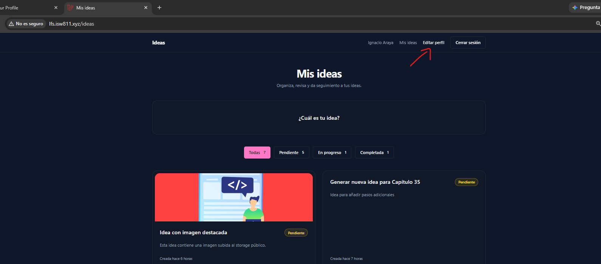
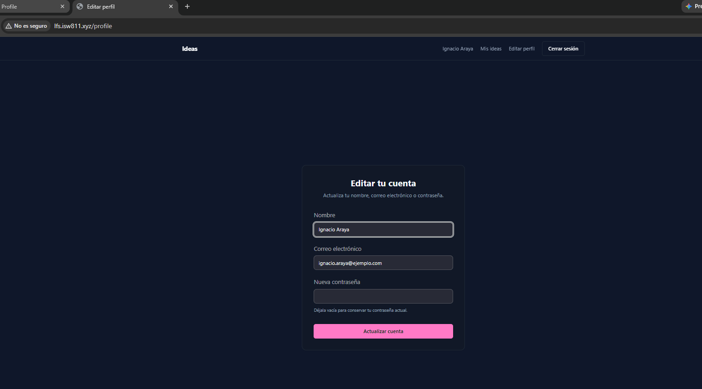
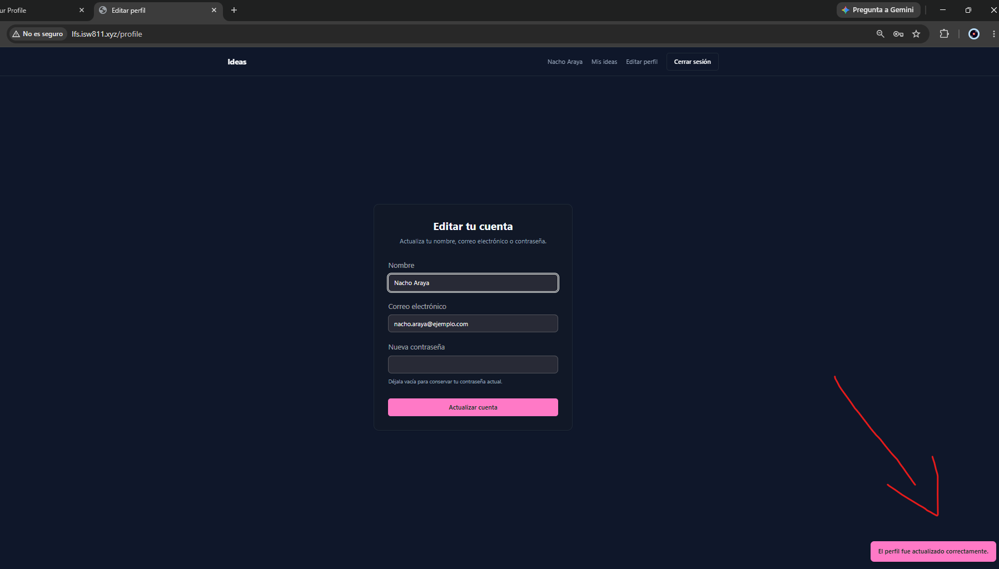
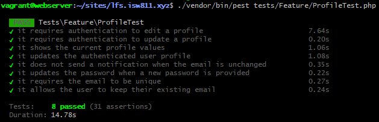

[<- Regresar](../entregable03.md)

# Episodio 41: Edit Your Profile

## Módulo 4: Final Project

## Resumen

En este episodio se implementó la funcionalidad para que un usuario autenticado pueda editar la información de su perfil.

Antes de este capítulo, los usuarios podían registrarse e iniciar sesión, pero no existía una sección para modificar posteriormente los datos de su cuenta.

Para solucionar esto, se agregó un enlace **Editar perfil** en la navegación y se creó una página protegida desde la cual se puede actualizar:

- El nombre.
- El correo electrónico.
- La contraseña.

La contraseña es opcional durante la actualización. Cuando el usuario deja el campo vacío, se conserva la contraseña actual.

También se implementó una notificación de seguridad. Si el usuario cambia su correo electrónico, se envía una notificación al correo anterior para informarle sobre el cambio.

Finalmente, se agregaron pruebas automatizadas para verificar la autenticación, los valores iniciales del formulario, la actualización del perfil, la validación del correo único, la contraseña opcional y la notificación al correo anterior.

---

## Comandos utilizados

Para entrar a la máquina virtual se utilizó:

```bash
cd ~/ISW811/VMs/webserver
vagrant ssh
```

Dentro de la máquina virtual se ingresó al proyecto:

```bash
cd ~/sites/lfs.isw811.xyz
```

Para crear el controlador se utilizó:

```bash
php artisan make:controller ProfileController
```

Para crear la notificación se utilizó:

```bash
php artisan make:notification EmailChanged
```

Para crear la carpeta y la vista del perfil se utilizaron:

```bash
mkdir -p resources/views/profile
touch resources/views/profile/edit.blade.php
```

Para crear el archivo de pruebas se utilizó:

```bash
touch tests/Feature/ProfileTest.php
```

Para crear esta documentación se utilizó:

```bash
touch docs/final-project/41-edit-your-profile.md
```

---

## Archivos creados o modificados

Los archivos principales trabajados durante este episodio fueron:

- `app/Http/Controllers/ProfileController.php`
- `app/Notifications/EmailChanged.php`
- `resources/views/components/layout/nav.blade.php`
- `resources/views/profile/edit.blade.php`
- `routes/web.php`
- `tests/Feature/ProfileTest.php`
- `docs/final-project/41-edit-your-profile.md`

También se agregaron las siguientes capturas:

- `docs/img/41-edit-profile-navigation.png`
- `docs/img/41-edit-profile-form.png`
- `docs/img/41-profile-updated.png`
- `docs/img/41-profile-tests-passing.png`

El modelo `app/Models/User.php` no necesitó modificaciones porque ya utilizaba el trait `Notifiable`, permitía la asignación de `name`, `email` y `password`, y configuraba la contraseña con el cast `hashed`.

---

## Enlace para editar el perfil

Se actualizó el componente de navegación:

```text
resources/views/components/layout/nav.blade.php
```

Dentro de la sección que se muestra únicamente a usuarios autenticados, se agregó:

```blade
<a
    href="{{ route('profile.edit') }}"
    class="text-sm text-muted hover:text-foreground"
    data-test="edit-profile-link"
>
    Editar perfil
</a>
```

El enlace utiliza una ruta nombrada en lugar de una dirección escrita manualmente.

Esto permite modificar la URL de la página en el futuro sin tener que cambiar cada enlace individualmente.

---

## Rutas del perfil

Se importó el controlador en:

```text
routes/web.php
```

mediante:

```php
use App\Http\Controllers\ProfileController;
```

Dentro del grupo protegido por el middleware `auth`, se agregaron dos rutas:

```php
Route::get('/profile', [ProfileController::class, 'edit'])
    ->name('profile.edit');

Route::patch('/profile', [ProfileController::class, 'update'])
    ->name('profile.update');
```

La primera ruta muestra el formulario.

La segunda procesa la actualización.

Al estar dentro del middleware `auth`, solamente los usuarios que hayan iniciado sesión pueden acceder a estas operaciones.

---

## Controlador del perfil

Se creó:

```text
app/Http/Controllers/ProfileController.php
```

El controlador contiene dos métodos:

```text
edit
update
```

El método `edit` se encarga de mostrar el formulario.

El método `update` valida los datos, actualiza la cuenta y envía la notificación cuando cambia el correo electrónico.

---

## Método `edit`

El método recibe la solicitud actual y obtiene al usuario autenticado:

```php
public function edit(Request $request): View
{
    return view('profile.edit', [
        'user' => $request->user(),
    ]);
}
```

El usuario se envía a la vista para precargar el nombre y el correo electrónico actuales.

---

## Vista para editar el perfil

Se creó:

```text
resources/views/profile/edit.blade.php
```

La vista utiliza los componentes visuales que ya existían en el proyecto:

```blade
<x-layout title="Editar perfil">
    <x-forms.card
        title="Editar tu cuenta"
        description="Actualiza tu nombre, correo electrónico o contraseña."
    >
```

El formulario envía una solicitud `PATCH` hacia la ruta de actualización:

```blade
<form
    method="POST"
    action="{{ route('profile.update') }}"
    class="space-y-5"
    data-test="edit-profile-form"
>
    @csrf
    @method('PATCH')
```

El token CSRF protege el formulario y `@method('PATCH')` permite que Laravel interprete la solicitud como una actualización.

---

## Valores iniciales del formulario

El campo de nombre utiliza:

```blade
value="{{ old('name', $user->name) }}"
```

El campo de correo utiliza:

```blade
value="{{ old('email', $user->email) }}"
```

Cuando el formulario se abre por primera vez, muestra los valores almacenados en la base de datos.

Si ocurre un error de validación, Laravel utiliza los valores enviados anteriormente mediante `old()`.

---

## Contraseña opcional

El formulario contiene un campo llamado **Nueva contraseña**:

```blade
<input
    id="password"
    name="password"
    type="password"
    autocomplete="new-password"
    class="input w-full"
    data-test="profile-password-input"
>
```

También se muestra una indicación:

```text
Déjala vacía para conservar tu contraseña actual.
```

La contraseña nunca se muestra precargada por razones de seguridad.

Cuando el campo permanece vacío, el controlador no modifica la contraseña almacenada.

---

## Validación del perfil

El método `update` valida los datos directamente desde el controlador.

El nombre se valida de esta forma:

```php
'name' => [
    'required',
    'string',
    'max:255',
],
```

El correo electrónico debe ser válido y único:

```php
'email' => [
    'required',
    'email',
    'max:255',
    Rule::unique('users', 'email')->ignore($user->id),
],
```

El método `ignore($user->id)` permite que el usuario mantenga su correo actual sin provocar un error de duplicación.

Sin esta excepción, la regla encontraría el propio registro del usuario y consideraría que el correo ya está ocupado.

---

## Validación de la contraseña

La contraseña utiliza:

```php
'password' => [
    'nullable',
    Password::defaults(),
],
```

`nullable` permite enviar el campo vacío.

`Password::defaults()` aplica las reglas predeterminadas de contraseña configuradas por Laravel.

---

## Actualización de nombre y correo

Después de validar la solicitud, se obtiene el correo anterior:

```php
$originalEmail = $user->email;
```

Luego se prepara el arreglo principal de actualización:

```php
$data = [
    'name' => $validated['name'],
    'email' => $validated['email'],
];
```

Estos dos valores siempre forman parte de la actualización.

---

## Actualización condicional de la contraseña

La contraseña solo se agrega al arreglo cuando contiene un valor:

```php
if (filled($validated['password'] ?? null)) {
    $data['password'] = $validated['password'];
}
```

Después se actualiza el usuario:

```php
$user->update($data);
```

El modelo `User` tiene configurado:

```php
'password' => 'hashed',
```

Por esta razón, Laravel cifra automáticamente la nueva contraseña antes de almacenarla.

No es necesario ejecutar `Hash::make()` manualmente dentro del controlador.

---

## Notificación por cambio de correo

Cambiar una dirección de correo es una operación importante para la seguridad de una cuenta.

Cuando el correo anterior y el nuevo son diferentes, se envía una notificación:

```php
if ($originalEmail !== $user->email) {
    Notification::route('mail', $originalEmail)
        ->notify(new EmailChanged(
            user: $user,
            originalEmail: $originalEmail,
        ));
}
```

No se utiliza directamente:

```php
$user->notify(...)
```

porque después de actualizar el modelo, esa instrucción enviaría el correo al nuevo email.

En este caso se necesita notificar específicamente al correo anterior.

Por eso se utiliza una notificación bajo demanda con:

```php
Notification::route('mail', $originalEmail)
```

---

## Clase `EmailChanged`

Se creó:

```text
app/Notifications/EmailChanged.php
```

La notificación recibe al usuario actualizado y su correo anterior:

```php
public function __construct(
    public User $user,
    public string $originalEmail,
) {}
```

El canal utilizado es correo electrónico:

```php
public function via(object $notifiable): array
{
    return ['mail'];
}
```

---

## Contenido de la notificación

El método `toMail` construye el mensaje:

```php
public function toMail(object $notifiable): MailMessage
{
    return (new MailMessage)
        ->subject('El correo electrónico de tu cuenta fue actualizado')
        ->greeting('Hola, ' . $this->user->name)
        ->line('El correo electrónico asociado con tu cuenta fue actualizado.')
        ->line('Nuevo correo electrónico: ' . $this->user->email)
        ->line('Si realizaste este cambio, no necesitas hacer nada.')
        ->line('Si no reconoces este cambio, contacta al soporte lo antes posible.');
}
```

El mensaje informa:

- Que el correo fue modificado.
- Cuál es la nueva dirección.
- Que no se requiere ninguna acción si el cambio fue legítimo.
- Que se debe contactar al soporte si el usuario no reconoce el cambio.

---

## Mensaje después de actualizar

Cuando la operación termina correctamente, el controlador redirige nuevamente al formulario:

```php
return to_route('profile.edit')
    ->with(
        'success',
        'El perfil fue actualizado correctamente.'
    );
```

El componente global de mensajes muestra la confirmación al usuario.

---

## Prueba de autenticación para editar

Se agregó una prueba para confirmar que una persona no autenticada no pueda abrir el formulario:

```php
it('requires authentication to edit a profile', function () {
    $this
        ->get(route('profile.edit'))
        ->assertRedirect(route('login'));
});
```

La respuesta esperada es una redirección hacia la página de inicio de sesión.

---

## Prueba de autenticación para actualizar

También se protegió la solicitud `PATCH`:

```php
it('requires authentication to update a profile', function () {
    $this
        ->patch(route('profile.update'), [
            'name' => 'Usuario no autenticado',
            'email' => 'guest@example.com',
        ])
        ->assertRedirect(route('login'));
});
```

Esto evita que una persona sin sesión intente modificar cuentas mediante una solicitud manual.

---

## Prueba de valores iniciales

La prueba del formulario crea un usuario con datos conocidos:

```php
$user = User::factory()->create([
    'name' => 'Nombre original',
    'email' => 'original@example.com',
]);
```

Después verifica que la respuesta contenga:

```text
data-test="edit-profile-form"
value="Nombre original"
value="original@example.com"
Actualizar cuenta
```

Esto confirma que el formulario carga correctamente la información del usuario autenticado.

---

## Prueba de actualización

La prueba principal modifica el nombre y el correo:

```php
$response = $this
    ->actingAs($user)
    ->patch(route('profile.update'), [
        'name' => 'Nombre actualizado',
        'email' => 'actualizado@example.com',
        'password' => '',
    ]);
```

Después verifica la redirección y el mensaje:

```php
$response
    ->assertRedirect(route('profile.edit'))
    ->assertSessionHas(
        'success',
        'El perfil fue actualizado correctamente.'
    );
```

También confirma que el nombre y el correo hayan cambiado en la base de datos.

---

## Conservación de la contraseña

Antes de actualizar se guarda la contraseña cifrada actual:

```php
$originalPassword = $user->password;
```

Después de enviar el campo vacío, se verifica:

```php
expect($user->password)
    ->toBe($originalPassword);
```

Esto demuestra que el controlador no sobrescribe la contraseña con un valor vacío o nulo.

---

## Prueba de la notificación

Las pruebas utilizan:

```php
Notification::fake();
```

Esto impide el envío de correos reales y permite inspeccionar las notificaciones generadas.

La notificación bajo demanda se comprueba mediante:

```php
Notification::assertSentOnDemand(
    EmailChanged::class,
    function (
        EmailChanged $notification,
        array $channels,
        object $notifiable
    ) use ($originalEmail, $user) {
        return in_array('mail', $channels, true)
            && $notifiable->routeNotificationFor('mail') === $originalEmail
            && $notification->user->is($user)
            && $notification->originalEmail === $originalEmail;
    }
);
```

Esta prueba verifica:

- Que se utilice el canal `mail`.
- Que la notificación se dirija al correo anterior.
- Que la notificación contenga al usuario correcto.
- Que conserve la dirección original.

---

## Correo sin cambios

También se agregó una prueba para confirmar que no se envíe una notificación cuando el correo permanece igual:

```php
Notification::assertNothingSent();
```

Cambiar únicamente el nombre no debe generar una alerta de seguridad relacionada con el correo.

---

## Actualización de contraseña

Otra prueba envía una contraseña nueva:

```php
'password' => 'NewSecurePassword123!',
```

Después se utiliza:

```php
Hash::check(
    'NewSecurePassword123!',
    $user->refresh()->password
)
```

Esto confirma que la nueva contraseña fue almacenada correctamente y que Laravel la cifró.

---

## Validación del correo único

Se crean dos usuarios con correos diferentes.

Luego el primer usuario intenta utilizar el correo del segundo.

La prueba espera:

```php
->assertSessionHasErrors('email');
```

También confirma que el correo original permanezca sin cambios en la base de datos.

---

## Conservación del correo actual

Se agregó una prueba específica para comprobar que la regla de correo único permita conservar la dirección actual.

Esto funciona gracias a:

```php
Rule::unique('users', 'email')->ignore($user->id)
```

El usuario puede modificar su nombre sin tener que cambiar el correo electrónico.

---

## Problema encontrado con el namespace

Durante la ejecución de las pruebas se presentó el error:

```text
Class "app\Notifications\EmailChanged" not found
```

La carpeta física del proyecto es:

```text
app/
```

en minúscula, lo cual es correcto.

Sin embargo, el namespace PSR-4 utilizado por Laravel es:

```php
App\
```

con la letra `A` en mayúscula.

Por esta razón, el archivo físico permanece en:

```text
app/Notifications/EmailChanged.php
```

pero dentro del código debe declarar:

```php
namespace App\Notifications;
```

El controlador también debe importar la clase con:

```php
use App\Notifications\EmailChanged;
```

No debe utilizar:

```php
use app\Notifications\EmailChanged;
```

Linux diferencia entre mayúsculas y minúsculas, por lo que `app` y `App` no representan el mismo namespace.

Después de corregirlo se regeneró el autoload:

```bash
composer dump-autoload
```

Luego se limpiaron los archivos temporales:

```bash
php artisan optimize:clear
```

Finalmente, las pruebas se ejecutaron nuevamente. :contentReference[oaicite:1]{index=1}

---

## Formateo del código

Se utilizó Pint únicamente sobre los archivos PHP relacionados con este episodio:

```bash
./vendor/bin/pint \
app/Http/Controllers/ProfileController.php \
app/Notifications/EmailChanged.php \
routes/web.php \
tests/Feature/ProfileTest.php
```

Esto evitó aplicar cambios de formato innecesarios sobre otros archivos pendientes del proyecto.

---

## Compilación de assets

Como se modificaron la navegación y una vista Blade, se ejecutó:

```bash
rm -f public/hot
npm run build
php artisan optimize:clear
php artisan view:clear
```

Se continuó utilizando `npm run build` en lugar de mantener Vite ejecutándose en modo desarrollo.

---

## Verificación de las rutas

Las rutas del perfil se comprobaron mediante:

```bash
php artisan route:list --name=profile
```

El resultado incluyó las rutas:

```text
GET|HEAD   profile   profile.edit
PATCH      profile   profile.update
```

---

## Prueba manual

La funcionalidad se probó desde:

```text
http://lfs.isw811.xyz/ideas
```

El procedimiento fue:

1. Iniciar sesión.
2. Confirmar que apareciera **Editar perfil** en la navegación.
3. Abrir el formulario.
4. Verificar que el nombre estuviera precargado.
5. Verificar que el correo estuviera precargado.
6. Cambiar el nombre.
7. Mantener la contraseña vacía.
8. Presionar **Actualizar cuenta**.
9. Confirmar el mensaje de éxito.
10. Verificar que el nuevo nombre apareciera en la navegación.
11. Probar la actualización del correo electrónico.
12. Confirmar mediante pruebas que la notificación se dirigiera al correo anterior.

---

## Resultado de las pruebas

Se ejecutaron las pruebas específicas del perfil:

```bash
./vendor/bin/pest tests/Feature/ProfileTest.php
```

Las pruebas confirmaron:

- Protección por autenticación.
- Renderizado del formulario.
- Valores iniciales correctos.
- Actualización del nombre.
- Actualización del correo.
- Conservación de la contraseña cuando el campo queda vacío.
- Actualización de una contraseña nueva.
- Validación del correo único.
- Conservación del correo actual.
- Envío de la notificación al correo anterior.
- Ausencia de notificaciones cuando el correo no cambia.

También se ejecutaron todas las pruebas Feature:

```bash
./vendor/bin/pest tests/Feature
```

---

## Evidencia

Como evidencia del episodio se agregaron capturas de la navegación, el formulario, la actualización y las pruebas.









---

## Comentarios personales

Este episodio agregó una función importante para la administración de cuentas.

La implementación permitió reutilizar los componentes visuales existentes y mantener la página protegida mediante el middleware de autenticación.

También fue importante tratar la contraseña como un campo opcional para evitar sobrescribirla accidentalmente con un valor vacío.

La notificación al correo anterior agrega una medida de seguridad adicional, ya que permite advertir al propietario de la cuenta cuando se modifica una credencial importante.

Finalmente, el problema con el namespace permitió reforzar la diferencia entre la ruta física `app/` y el namespace PHP `App\`, especialmente al trabajar en sistemas Linux sensibles a mayúsculas y minúsculas.