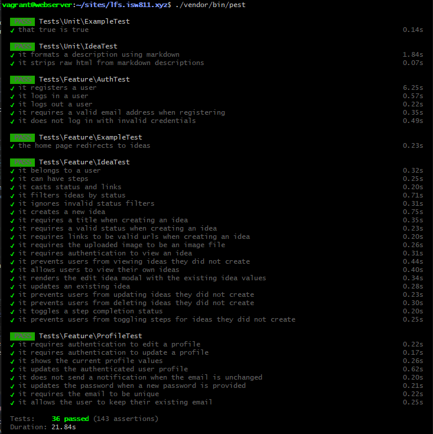
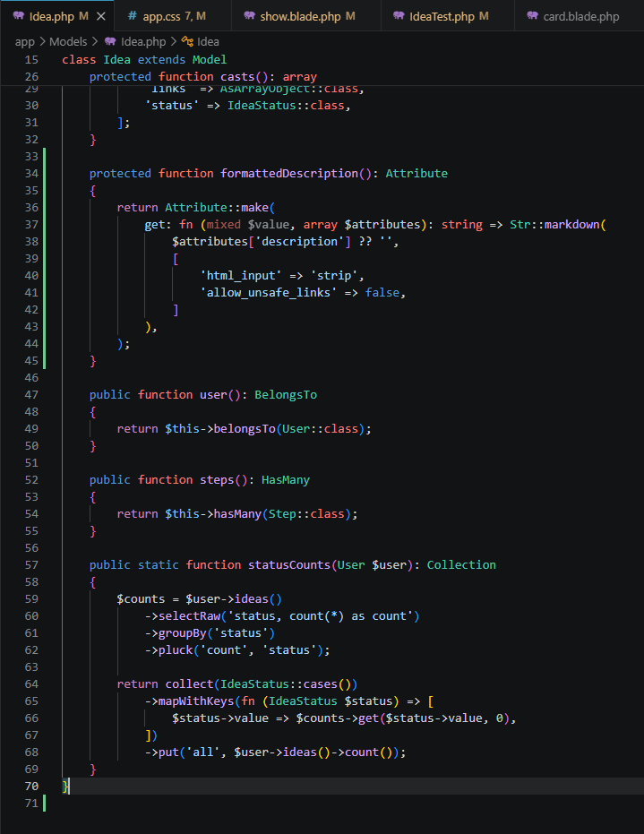
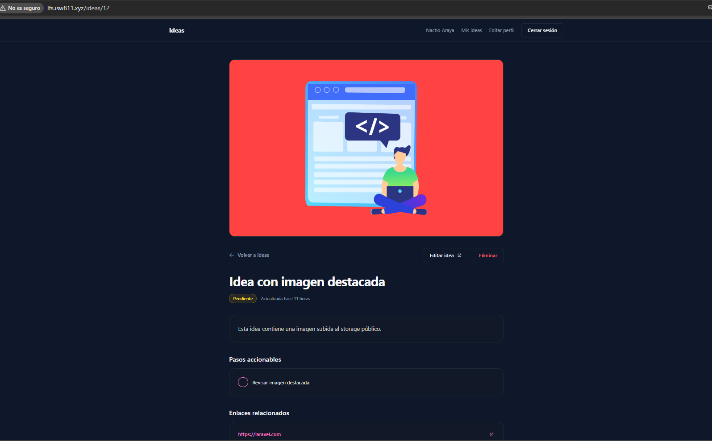
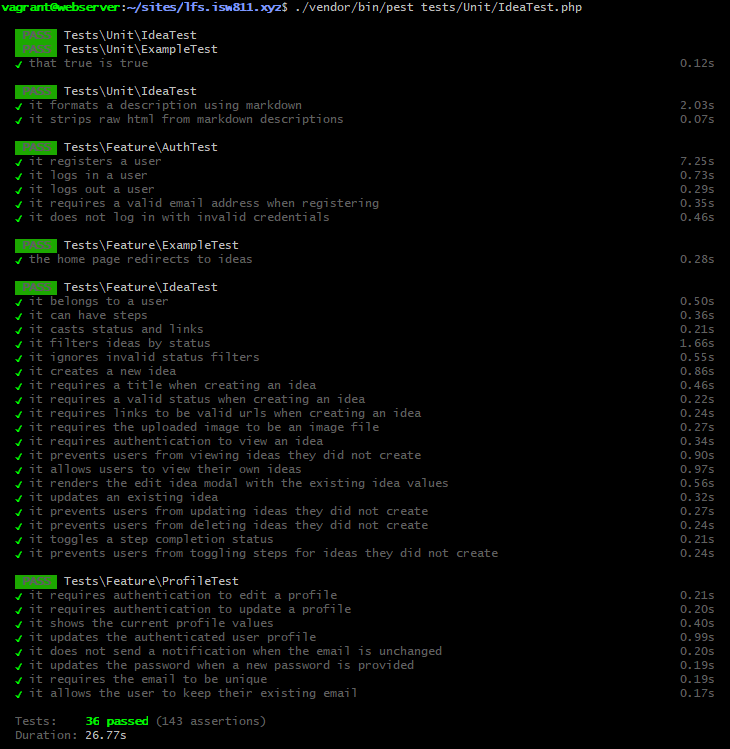

[<- Regresar](../entregable03.md)

# Episodio 42: Deploy And Then Implement A Feature Request

## Módulo 4: Final Project

## Resumen

En este episodio se realizó una revisión general del proyecto antes de finalizar su desarrollo y se implementó una nueva solicitud de funcionalidad.

Primero se ejecutó la suite completa de pruebas para detectar errores pendientes. La mayoría de las pruebas funcionaron correctamente, pero las pruebas ubicadas en `tests/Unit/IdeaTest.php` fallaron porque utilizaban factories, relaciones y base de datos sin iniciar completamente el entorno de Laravel.

Estas pruebas ya estaban cubiertas dentro de `tests/Feature/IdeaTest.php`, por lo que el archivo Unit fue reorganizado para contener pruebas verdaderamente unitarias.

Después se implementó soporte para Markdown en las descripciones de las ideas.

La nueva funcionalidad permite escribir contenido como:

- Encabezados.
- Texto en negrita.
- Enlaces.
- Listas.
- Párrafos.

Laravel convierte el Markdown en HTML mediante un accessor del modelo `Idea`.

También se instaló el plugin Typography de Tailwind CSS para aplicar estilos visuales apropiados al contenido generado.

Finalmente, se ejecutaron nuevamente las pruebas y se verificó manualmente el resultado en el navegador.

---

## Objetivos del episodio

Los objetivos principales fueron:

- Ejecutar toda la suite de pruebas.
- Identificar y corregir pruebas mal ubicadas.
- Mantener las pruebas de relaciones dentro de Feature tests.
- Crear un accessor para formatear Markdown.
- Proteger el contenido contra HTML inseguro.
- Incorporar el plugin Typography de Tailwind.
- Mostrar la descripción formateada en la vista individual.
- Agregar pruebas unitarias para la nueva funcionalidad.
- Compilar nuevamente los assets.
- Preparar los cambios para su publicación en GitHub.

---

## Comandos utilizados

Para entrar a la máquina virtual se utilizó:

```bash
cd ~/ISW811/VMs/webserver
vagrant ssh
```

Dentro de la máquina virtual se ingresó al proyecto:

```bash
cd ~/sites/lfs.isw811.xyz
```

Antes de implementar la solicitud se ejecutó la suite completa:

```bash
./vendor/bin/pest
```

Para instalar el plugin Typography se utilizó:

```bash
npm install --save-dev @tailwindcss/typography
```

Para formatear únicamente los archivos PHP relacionados con este episodio se utilizó:

```bash
./vendor/bin/pint \
app/Models/Idea.php \
tests/Unit/IdeaTest.php
```

Para compilar los assets se utilizó:

```bash
rm -f public/hot
npm run build
php artisan optimize:clear
php artisan view:clear
```

Para ejecutar las pruebas unitarias relacionadas con Markdown se utilizó:

```bash
./vendor/bin/pest tests/Unit/IdeaTest.php
```

Finalmente, se ejecutó nuevamente toda la suite:

```bash
./vendor/bin/pest
```

---

## Archivos creados o modificados

Los archivos principales trabajados durante este episodio fueron:

- `app/Models/Idea.php`
- `resources/css/app.css`
- `resources/views/ideas/show.blade.php`
- `tests/Unit/IdeaTest.php`
- `package.json`
- `package-lock.json`
- `docs/final-project/42-deploy-and-implement-feature-request.md`

También se agregaron las siguientes capturas:

- `docs/img/42-full-test-suite-passing.png`
- `docs/img/42-markdown-description-code.png`
- `docs/img/42-markdown-description-browser.png`
- `docs/img/42-feature-request-tests-passing.png`

---

## Revisión inicial de las pruebas

Antes de agregar la nueva funcionalidad se ejecutó:

```bash
./vendor/bin/pest
```

Las pruebas Feature relacionadas con autenticación, ideas y perfil funcionaron correctamente.

Sin embargo, las pruebas de:

```text
tests/Unit/IdeaTest.php
```

presentaron el error:

```text
A facade root has not been set.
```

Las pruebas que fallaban eran:

```text
it belongs to a user
it can have steps
it casts status and links
```

---

## Causa de los errores Unit

Las pruebas utilizaban instrucciones como:

```php
Idea::factory()->create();
```

Una factory necesita que Laravel inicialice:

- El contenedor de servicios.
- Las facades.
- La conexión a la base de datos.
- El entorno de pruebas de la aplicación.

Las pruebas de la carpeta `tests/Unit` no necesariamente inician todo ese entorno.

Por eso las factories no podían utilizar correctamente las facades de Laravel.

---

## Diferencia entre pruebas Unit y Feature

Una prueba Unit debe evaluar una unidad pequeña de código sin depender de la base de datos o de una solicitud HTTP.

Por ejemplo:

```php
$idea = new Idea([
    'description' => '**Texto importante**',
]);
```

Una prueba Feature sí puede utilizar:

```php
Idea::factory()->create();
```

porque ejecuta el entorno completo de Laravel.

Las pruebas de relaciones, casts y base de datos ya existían en:

```text
tests/Feature/IdeaTest.php
```

Por eso no se perdió cobertura al retirar esas pruebas duplicadas del archivo Unit.

---

## Nueva solicitud de funcionalidad

La nueva solicitud consistió en permitir que las descripciones de las ideas aceptaran Markdown.

Antes de este cambio, una descripción como:

```markdown
# Proyecto importante

Esta descripción tiene **texto destacado**.

- Primera tarea
- Segunda tarea
```

se mostraba como texto sin formato.

Después de implementar la nueva funcionalidad, Laravel transforma ese contenido en HTML y el navegador lo muestra como:

- Un encabezado.
- Un párrafo.
- Texto en negrita.
- Una lista con viñetas.

---

## Accessor para la descripción formateada

Se actualizó:

```text
app/Models/Idea.php
```

Se importaron las clases:

```php
use Illuminate\Database\Eloquent\Casts\Attribute;
use Illuminate\Support\Str;
```

Después se creó el accessor:

```php
protected function formattedDescription(): Attribute
{
    return Attribute::make(
        get: fn (mixed $value, array $attributes): string => Str::markdown(
            $attributes['description'] ?? '',
            [
                'html_input' => 'strip',
                'allow_unsafe_links' => false,
            ]
        ),
    );
}
```

Laravel convierte automáticamente el nombre del método:

```text
formattedDescription
```

en la propiedad:

```text
formatted_description
```

Por esta razón, la vista puede utilizar:

```php
$idea->formatted_description
```

---

## Uso de `Attribute`

El método devuelve una instancia de:

```php
Illuminate\Database\Eloquent\Casts\Attribute
```

Esto permite crear una propiedad calculada en el modelo.

La propiedad no necesita una columna adicional en la base de datos.

La descripción original continúa almacenándose en:

```text
description
```

La propiedad:

```text
formatted_description
```

se calcula cuando se solicita.

---

## Conversión de Markdown

La conversión se realiza mediante:

```php
Str::markdown(...)
```

Laravel recibe el texto original y lo transforma en HTML.

Por ejemplo:

```markdown
**texto importante**
```

se convierte en:

```html
<strong>texto importante</strong>
```

Un enlace como:

```markdown
[Laravel](https://laravel.com)
```

se convierte en:

```html
<a href="https://laravel.com">Laravel</a>
```

---

## Opciones de seguridad

El accessor utiliza las siguientes opciones:

```php
[
    'html_input' => 'strip',
    'allow_unsafe_links' => false,
]
```

La opción:

```text
html_input => strip
```

elimina etiquetas HTML introducidas directamente por el usuario.

Por ejemplo:

```html
<script>alert('XSS')</script>
```

no será renderizado como un script ejecutable.

La opción:

```text
allow_unsafe_links => false
```

bloquea enlaces considerados inseguros.

Estas configuraciones son importantes porque la vista necesita mostrar el HTML generado sin escaparlo nuevamente.

---

## Instalación de Tailwind Typography

Para dar formato visual al contenido Markdown se instaló:

```bash
npm install --save-dev @tailwindcss/typography
```

Este comando modificó automáticamente:

```text
package.json
package-lock.json
```

El paquete fue agregado como una dependencia de desarrollo porque se utiliza durante la compilación de los estilos.

---

## Registro del plugin

Se actualizó:

```text
resources/css/app.css
```

y se agregó:

```css
@plugin "@tailwindcss/typography";
```

El plugin proporciona clases como:

```text
prose
prose-invert
prose-a:text-primary
```

Estas clases aplican estilos predeterminados a:

- Encabezados.
- Párrafos.
- Listas.
- Enlaces.
- Código.
- Citas.
- Otros elementos HTML generados desde Markdown.

---

## Presentación en tema oscuro

La aplicación utiliza un diseño oscuro.

Por eso se empleó:

```text
prose-invert
```

Sin esta clase, Typography utilizaría colores diseñados principalmente para un fondo claro.

El contenido se muestra mediante:

```blade
<div
    class="prose prose-invert max-w-none prose-a:text-primary prose-a:no-underline hover:prose-a:underline"
    data-test="formatted-idea-description"
>
```

La clase:

```text
max-w-none
```

evita que Typography aplique una anchura máxima demasiado reducida dentro de la tarjeta.

Los enlaces utilizan el color principal del proyecto:

```text
prose-a:text-primary
```

---

## Actualización de la vista individual

Se actualizó:

```text
resources/views/ideas/show.blade.php
```

Antes se mostraba la descripción utilizando:

```blade
{{ $idea->description }}
```

Esta sintaxis escapa cualquier HTML.

Después del cambio se utiliza:

```blade
{!! $idea->formatted_description !!}
```

Las llaves con signos de exclamación indican a Blade que el contenido debe renderizarse como HTML.

Esto es necesario porque el accessor ya genera elementos como:

```html
<h1>
<strong>
<a>
<ul>
<li>
```

La salida se considera segura dentro de esta implementación porque `Str::markdown()` fue configurado para eliminar HTML ingresado manualmente y bloquear enlaces inseguros.

---

## Componente Card

El componente:

```text
resources/views/components/card.blade.php
```

fue revisado para confirmar qué etiqueta HTML genera.

Cuando no recibe un atributo `href`, el componente utiliza:

```html
<section>
```

Por esta razón, no fue necesario modificarlo ni agregar:

```blade
as="div"
```

El contenido Markdown no se encuentra dentro de un enlace.

---

## Prueba unitaria del formato Markdown

Se reemplazaron las pruebas Unit anteriores por una prueba enfocada en el nuevo accessor.

La prueba crea una instancia en memoria:

```php
$idea = new Idea([
    'description' => <<<'MARKDOWN'
# Solicitud de funcionalidad

Esta descripción contiene **texto importante** y un [enlace](https://laravel.com).

- Primer elemento
- Segundo elemento
MARKDOWN,
]);
```

No se utiliza:

```php
Idea::factory()
```

ni se guarda información en la base de datos.

Esto convierte la prueba en una prueba realmente unitaria.

---

## Elementos verificados por la prueba

La prueba comprueba que la descripción generada contenga:

```php
<h1>Solicitud de funcionalidad</h1>
```

También verifica:

```php
<strong>texto importante</strong>
```

El enlace esperado es:

```php
<a href="https://laravel.com">enlace</a>
```

Finalmente, confirma que los elementos de la lista se hayan generado:

```php
<li>Primer elemento</li>
<li>Segundo elemento</li>
```

---

## Prueba de seguridad

También se agregó una prueba para confirmar que se elimine HTML escrito directamente.

La idea se crea con:

```php
$idea = new Idea([
    'description' => 'Texto seguro <script>alert("XSS")</script>',
]);
```

La prueba confirma que el resultado conserve:

```text
Texto seguro
```

pero no contenga:

```html
<script>
```

Esto valida la opción:

```php
'html_input' => 'strip'
```

---

## Prueba manual en el navegador

Para comprobar la funcionalidad se editó una idea existente y se utilizó una descripción similar a:

```markdown
# Solicitud de funcionalidad

Esta descripción contiene **texto importante** y un [enlace a Laravel](https://laravel.com).

## Tareas pendientes

- Preparar la implementación
- Ejecutar las pruebas
- Publicar los cambios
```

Después se presionó:

```text
Actualizar idea
```

La vista individual mostró correctamente:

- El encabezado principal.
- El encabezado secundario.
- El texto en negrita.
- El enlace.
- La lista con viñetas.
- Los espacios entre párrafos.

---

## Compilación de assets

Después de instalar Typography y modificar `app.css`, se ejecutó:

```bash
rm -f public/hot
npm run build
php artisan optimize:clear
php artisan view:clear
```

`npm run build` generó nuevamente los archivos de producción de Vite con las clases del plugin Typography.

---

## Resultado de las pruebas

Primero se ejecutaron las pruebas unitarias:

```bash
./vendor/bin/pest tests/Unit/IdeaTest.php
```

Las pruebas del accessor y de seguridad finalizaron correctamente.

Después se ejecutó toda la suite:

```bash
./vendor/bin/pest
```

Las pruebas Unit y Feature finalizaron correctamente.

Esto confirmó que la incorporación de Markdown no afectó:

- El registro.
- El inicio de sesión.
- El cierre de sesión.
- La creación de ideas.
- La actualización de ideas.
- La autorización.
- Los pasos accionables.
- La edición del perfil.
- Las notificaciones.

---

## Despliegue mostrado en el curso

En el episodio original se utiliza Laravel Forge para desplegar el proyecto automáticamente después de hacer un push a GitHub.

El flujo mostrado consiste en:

1. Ejecutar las pruebas localmente.
2. Crear un commit.
3. Hacer push hacia GitHub.
4. Permitir que Forge detecte el cambio.
5. Ejecutar el script de despliegue.
6. Instalar dependencias.
7. Compilar assets.
8. Ejecutar migraciones.
9. Publicar la nueva versión.

---

## Despliegue del proyecto universitario

En este proyecto la aplicación se desarrolló y validó dentro de una máquina virtual administrada con Vagrant.

El entorno utilizado fue:

```text
http://lfs.isw811.xyz
```

Los cambios también fueron publicados en el repositorio de GitHub mediante:

```bash
git push origin main
```

No se documenta un despliegue real mediante Laravel Forge a menos que exista un servidor de producción configurado específicamente para el proyecto.

El push a GitHub conserva el código actualizado y permite demostrar el flujo de publicación del proyecto.

---

## Consideración de SQLite y MySQL

En el episodio original se presenta un problema de despliegue causado por diferencias entre SQLite y MySQL.

Una migración compatible con SQLite puede no comportarse exactamente igual en MySQL.

Esto demuestra la importancia de:

- Probar el motor de base de datos utilizado en producción.
- Revisar las migraciones antes del despliegue.
- Mantener correctamente las variables del archivo `.env`.
- No asumir que todos los motores aplican las mismas reglas.

En el entorno local de este proyecto se continuó utilizando la configuración definida para la máquina virtual.

---

## Evidencia

Como evidencia del episodio se agregaron capturas de la suite completa, el accessor, el navegador y las pruebas unitarias.









---

## Comentarios personales

Este episodio permitió revisar la estabilidad general de la aplicación antes de finalizar el proyecto.

La ejecución completa de las pruebas permitió detectar que algunas pruebas etiquetadas como Unit realmente dependían de factories y base de datos.

Mover esa responsabilidad a las pruebas Feature y mantener en Unit únicamente el accessor de Markdown mejoró la organización de la suite.

La nueva funcionalidad también demostró cómo una solicitud aparentemente pequeña puede involucrar diferentes partes del proyecto:

- Modelo.
- Accessors.
- Seguridad.
- Blade.
- Tailwind CSS.
- Dependencias de npm.
- Compilación.
- Pruebas.

El soporte para Markdown mejora la experiencia del usuario porque permite escribir descripciones más estructuradas y fáciles de leer.

Además, las pruebas proporcionan seguridad para publicar cambios futuros sin afectar funcionalidades existentes.