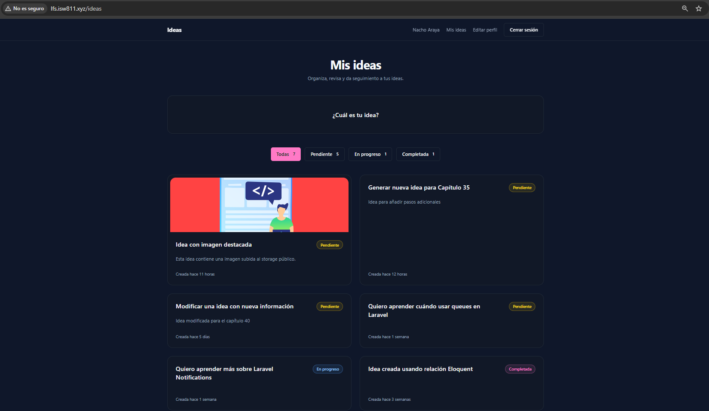
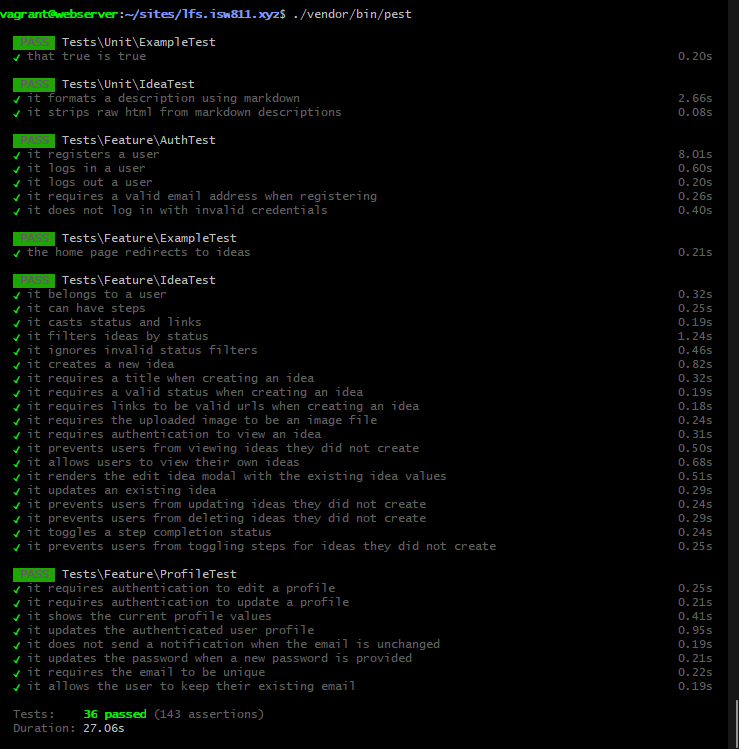
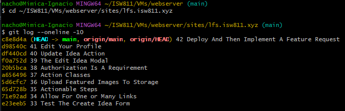

[<- Regresar](../entregable03.md)

# Episodio 43: Where To Go From Here

## Módulo 4: Final Project

## Resumen

Este episodio representa el cierre del curso Laravel From Scratch y del proyecto final de administración de ideas.

A diferencia de los capítulos anteriores, en este episodio no se implementó una nueva funcionalidad ni se modificaron archivos de código.

El objetivo fue revisar el resultado final de la aplicación, ejecutar las últimas verificaciones y reflexionar sobre posibles caminos para continuar aprendiendo y mejorando el proyecto.

A lo largo del curso se construyó una aplicación completa que incluye:

- Registro de usuarios.
- Inicio y cierre de sesión.
- Autenticación.
- Autorización mediante policies.
- Creación de ideas.
- Edición de ideas.
- Eliminación de ideas.
- Estados para las ideas.
- Filtrado por estado.
- Imágenes destacadas.
- Enlaces relacionados.
- Pasos accionables.
- Actualización del estado de los pasos.
- Formularios reutilizables.
- Modales con AlpineJS.
- Action classes.
- Validación mediante Form Requests.
- Edición del perfil.
- Notificaciones por cambio de correo.
- Soporte para Markdown.
- Pruebas Unit y Feature.
- Compilación de assets con Vite.
- Versionamiento mediante Git y GitHub.

El proyecto final demuestra la integración de diferentes herramientas de Laravel dentro de una aplicación funcional.

---

## Objetivos del episodio

Los objetivos de este episodio fueron:

- Confirmar que la aplicación estuviera terminada.
- Ejecutar una última compilación de los assets.
- Limpiar las cachés de Laravel.
- Ejecutar toda la suite de pruebas.
- Verificar la aplicación final en el navegador.
- Revisar el historial reciente de Git.
- Documentar los conocimientos adquiridos.
- Identificar posibles mejoras futuras.
- Definir tecnologías que pueden estudiarse después del curso.
- Crear el último commit del proyecto.

---

## Comandos utilizados

Para entrar a la máquina virtual se utilizó:

```bash
cd ~/ISW811/VMs/webserver
vagrant ssh
```

Dentro de la máquina virtual se ingresó al proyecto:

```bash
cd ~/sites/lfs.isw811.xyz
```

Para eliminar cualquier referencia al servidor de desarrollo de Vite se utilizó:

```bash
rm -f public/hot
```

Para generar los assets finales se ejecutó:

```bash
npm run build
```

Para limpiar las cachés de Laravel se utilizaron:

```bash
php artisan optimize:clear
php artisan view:clear
```

Para ejecutar la suite completa de pruebas se utilizó:

```bash
./vendor/bin/pest
```

Para revisar el historial reciente del repositorio se utilizó desde Git Bash:

```bash
cd ~/ISW811/VMs/webserver/sites/lfs.isw811.xyz
git log --oneline -10
```

---

## Archivos creados

Este episodio no requirió modificaciones en controladores, modelos, vistas, rutas o pruebas.

Solamente se agregó la documentación final:

```text
docs/final-project/43-where-to-go-from-here.md
```

También se agregaron las siguientes capturas:

```text
docs/img/43-final-application.png
docs/img/43-final-test-suite.png
docs/img/43-final-git-history.png
```

---

## Verificación final de la aplicación

Antes de cerrar el proyecto se realizó una compilación final mediante:

```bash
npm run build
```

Esto permitió confirmar que:

- Vite podía procesar correctamente los archivos del proyecto.
- Tailwind CSS podía generar los estilos.
- El plugin Typography estaba disponible.
- Los componentes Blade utilizados por la aplicación eran detectados.
- Los archivos JavaScript y CSS de producción podían generarse sin errores.

También se eliminaron las cachés mediante:

```bash
php artisan optimize:clear
php artisan view:clear
```

Esto permitió comprobar la aplicación utilizando versiones actualizadas de las rutas, configuraciones y vistas.

---

## Ejecución final de las pruebas

Se ejecutó la suite completa mediante:

```bash
./vendor/bin/pest
```

Las pruebas permitieron verificar las principales áreas del proyecto.

### Autenticación

Se comprobó:

- Registro de usuarios.
- Validación del correo durante el registro.
- Inicio de sesión.
- Rechazo de credenciales incorrectas.
- Cierre de sesión.
- Protección de páginas privadas.

### Ideas

Se comprobó:

- Relación entre una idea y su usuario.
- Relación entre una idea y sus pasos.
- Conversión del estado a un enum.
- Conversión de enlaces.
- Filtrado por estado.
- Creación de ideas.
- Validación de campos.
- Carga de imágenes.
- Renderizado del modal de edición.
- Actualización de ideas.
- Eliminación de ideas.
- Autorización de propietarios.
- Protección frente a usuarios ajenos.

### Pasos accionables

Se comprobó:

- Creación de pasos.
- Estado inicial pendiente.
- Cambio entre completado y pendiente.
- Protección de pasos pertenecientes a otros usuarios.
- Sincronización de pasos durante una actualización.

### Perfil

Se comprobó:

- Protección mediante autenticación.
- Carga de los valores actuales.
- Actualización del nombre.
- Actualización del correo.
- Conservación de la contraseña cuando el campo está vacío.
- Actualización de una nueva contraseña.
- Validación del correo único.
- Notificación al correo anterior cuando cambia la dirección.

### Markdown

Se comprobó:

- Conversión de Markdown a HTML.
- Encabezados.
- Texto en negrita.
- Enlaces.
- Listas.
- Eliminación de HTML ingresado directamente.
- Protección frente a contenido potencialmente inseguro.

La ejecución final de la suite brindó confianza de que las funciones principales continuaban trabajando correctamente al finalizar el proyecto.

---

## Estado final de la aplicación

La aplicación final permite que una persona cree una cuenta e inicie sesión para administrar sus propias ideas.

Cada usuario tiene acceso únicamente a la información que le pertenece.

Una idea puede contener:

- Título.
- Descripción.
- Estado.
- Imagen destacada.
- Enlaces relacionados.
- Pasos accionables.

La descripción permite utilizar Markdown para estructurar mejor el contenido.

Los pasos pueden marcarse como completados o pendientes.

El usuario también puede modificar su perfil y actualizar su contraseña.

---

## Autenticación y autorización

Uno de los aprendizajes más importantes del proyecto fue comprender la diferencia entre autenticación y autorización.

La autenticación responde a la pregunta:

```text
¿Quién es el usuario?
```

La autorización responde a:

```text
¿Tiene este usuario permiso para realizar esta acción?
```

El middleware `auth` protege las rutas privadas.

La policy de ideas evita que una persona pueda:

- Ver ideas ajenas.
- Editar ideas ajenas.
- Eliminar ideas ajenas.
- Modificar pasos pertenecientes a ideas ajenas.

Esta separación permite construir aplicaciones más seguras.

---

## Organización de la lógica

La aplicación utiliza diferentes capas para separar responsabilidades.

### Controladores

Los controladores coordinan:

- Solicitudes.
- Autorización.
- Validación.
- Actions.
- Respuestas y redirecciones.

### Form Requests

Los Form Requests contienen las reglas de validación para crear y actualizar ideas.

### Action classes

Las clases:

```text
CreateIdea
UpdateIdea
```

contienen la lógica principal de creación y actualización.

Esto evita colocar toda la lógica dentro de los controladores.

### Modelos

Los modelos administran:

- Relaciones.
- Casts.
- Accessors.
- Consultas relacionadas con la información.

### Vistas y componentes

Blade permite construir componentes reutilizables para:

- Layout.
- Navegación.
- Formularios.
- Campos.
- Errores.
- Tarjetas.
- Modales.
- Estados.

---

## Uso de AlpineJS

AlpineJS se utilizó para agregar interactividad sin convertir la aplicación en una SPA completa.

Entre sus responsabilidades estuvieron:

- Abrir y cerrar modales.
- Administrar el estado seleccionado.
- Agregar enlaces.
- Eliminar enlaces.
- Agregar pasos accionables.
- Eliminar pasos.
- Preparar los nombres dinámicos enviados por el formulario.

Esto permitió mantener el renderizado principal del lado del servidor mientras se agregaban comportamientos interactivos en el navegador.

---

## Pruebas automatizadas

Las pruebas fueron una parte importante del proyecto.

Las pruebas Feature comprobaron la integración de:

- HTTP.
- Base de datos.
- Rutas.
- Controladores.
- Policies.
- Vistas.
- Sesiones.
- Notificaciones.

Las pruebas Unit se utilizaron para comprobar comportamientos aislados como el accessor de Markdown.

Las pruebas brindan seguridad para modificar el código en el futuro.

Cuando una refactorización rompe un comportamiento existente, la suite puede detectarlo antes de publicar los cambios.

---

## Versionamiento con Git

Cada episodio se registró mediante un commit independiente.

Esto permitió conservar un historial progresivo del desarrollo.

Entre los capítulos finales se encuentran:

```text
38 Authorization Is A Requirement
39 The Edit Idea Modal
40 Update Idea Action
41 Edit Your Profile
42 Deploy And Then Implement A Feature Request
43 Where To Go From Here
```

Mantener commits separados facilita:

- Revisar los cambios de cada episodio.
- Identificar cuándo se agregó una función.
- Revertir cambios específicos.
- Comprender la evolución del proyecto.
- Presentar evidencia del trabajo realizado.

---

## Posibles mejoras futuras

Aunque la aplicación está funcional, existen muchas posibilidades para continuar desarrollándola.

### Equipos de trabajo

Se podría permitir que varios usuarios pertenezcan a un mismo equipo.

Esto requeriría agregar:

- Modelo `Team`.
- Tabla intermedia entre usuarios y equipos.
- Roles dentro del equipo.
- Invitaciones.
- Cambio entre equipos.
- Ideas pertenecientes a un equipo.

---

## Ideas compartidas

Actualmente una idea pertenece a un único usuario.

Una mejora futura sería permitir compartir ideas con otras personas.

Por ejemplo, un colaborador podría tener permiso para:

- Ver una idea.
- Comentar.
- Agregar pasos.
- Marcar pasos como completados.

Sin embargo, podría no tener permiso para:

- Eliminar la idea.
- Cambiar el propietario.
- Modificar la configuración principal.

Esto permitiría practicar autorización más avanzada.

---

## Roles y permisos

La aplicación podría utilizar diferentes roles:

- Administrador.
- Propietario.
- Editor.
- Colaborador.
- Lector.

Cada rol tendría permisos específicos.

Esto permitiría ampliar la policy y utilizar gates adicionales.

---

## Comentarios

Se podría agregar una sección de comentarios para cada idea.

Cada comentario podría contener:

- Usuario.
- Contenido.
- Fecha.
- Edición.
- Eliminación.
- Respuestas.

También podrían agregarse notificaciones cuando otra persona comenta.

---

## Historial de cambios

Otra posible mejora sería registrar las modificaciones realizadas sobre una idea.

El historial podría mostrar:

- Cambio de título.
- Cambio de descripción.
- Cambio de estado.
- Pasos agregados.
- Pasos eliminados.
- Enlaces modificados.
- Usuario que realizó el cambio.
- Fecha de la modificación.

Esto podría implementarse mediante eventos, observers o un sistema de auditoría.

---

## Recuperación de contraseña

La aplicación permite actualizar la contraseña desde el perfil, pero todavía podría agregarse un flujo de recuperación.

Este incluiría:

- Solicitud de restablecimiento.
- Envío de correo.
- Token temporal.
- Formulario para establecer una contraseña nueva.
- Expiración del token.

Laravel incluye herramientas para implementar este proceso.

---

## Verificación de correo electrónico

También se podría implementar la verificación del correo.

El usuario recibiría un mensaje después del registro y tendría que confirmar su dirección.

Algunas funciones podrían permanecer bloqueadas hasta completar la verificación.

---

## Seguridad adicional para el perfil

En un proyecto de producción podrían solicitarse medidas adicionales antes de actualizar datos sensibles.

Por ejemplo:

- Confirmar la contraseña actual.
- Volver a autenticar al usuario.
- Enviar una notificación al correo nuevo.
- Permitir revertir un cambio de correo.
- Cerrar otras sesiones activas.

---

## Administración de imágenes

Actualmente se puede guardar y reemplazar una imagen destacada.

Una mejora futura sería eliminar el archivo anterior cuando se carga una imagen nueva.

También podría agregarse:

- Eliminación manual de la imagen.
- Redimensionamiento.
- Compresión.
- Diferentes tamaños.
- Validación de dimensiones.
- Almacenamiento en servicios externos.

---

## Búsqueda y paginación

Cuando la cantidad de ideas aumente, se podría implementar:

- Búsqueda por título.
- Búsqueda en descripciones.
- Filtrado por fecha.
- Ordenamiento.
- Paginación.
- Filtros combinados.
- Etiquetas o categorías.

Esto mejoraría el rendimiento y la experiencia del usuario.

---

## Laravel Livewire

Una de las recomendaciones para continuar aprendiendo es Laravel Livewire.

Livewire permite construir interfaces interactivas utilizando principalmente PHP.

Podría utilizarse para reemplazar o complementar partes de AlpineJS como:

- Modales.
- Formularios dinámicos.
- Filtros.
- Búsquedas.
- Pasos accionables.
- Actualizaciones sin recargar la página.

Livewire mantiene una integración cercana con Blade y Laravel.

---

## Vue y React

Para proyectos con una interfaz más compleja, también se puede estudiar:

- Vue.
- React.

Estas herramientas permiten construir interfaces basadas en componentes JavaScript.

Pueden comunicarse con Laravel mediante:

- APIs.
- JSON.
- Laravel Sanctum.
- Inertia.js.

---

## Inertia.js

Inertia.js permite construir aplicaciones con una experiencia similar a una SPA sin abandonar completamente el modelo tradicional de Laravel.

La aplicación puede continuar utilizando:

- Rutas de Laravel.
- Controladores.
- Policies.
- Validación.
- Sesiones.
- Autenticación.

Mientras la interfaz se construye con Vue, React o Svelte.

Inertia puede ser un siguiente paso adecuado después de aprender Blade y AlpineJS.

---

## Despliegue en producción

El proyecto fue desarrollado dentro de una máquina virtual Vagrant y publicado en GitHub.

Como siguiente paso se podría desplegar en:

- Laravel Forge.
- Laravel Cloud.
- Servidor VPS.
- Servicios compatibles con PHP.
- Contenedores Docker.

Un entorno de producción debería incluir:

- Variables de entorno seguras.
- Base de datos de producción.
- HTTPS.
- Backups.
- Logs.
- Colas.
- Cron.
- Optimización de Laravel.
- Monitoreo.

---

## Aprendizajes principales

Durante el desarrollo del proyecto se practicaron conocimientos de:

### PHP

- Clases.
- Namespaces.
- Tipado.
- Enums.
- Closures.
- Colecciones.
- Atributos.
- Promoción de propiedades.

### Laravel

- Routing.
- Controllers.
- Middleware.
- Authentication.
- Authorization.
- Policies.
- Models.
- Relationships.
- Factories.
- Migrations.
- Validation.
- Form Requests.
- Notifications.
- Storage.
- Blade.
- Components.
- Accessors.
- Action classes.
- Testing.

### Frontend

- HTML.
- Tailwind CSS.
- DaisyUI.
- AlpineJS.
- Vite.
- Formularios dinámicos.
- Modales.
- Markdown.
- Typography.

### Herramientas

- Composer.
- npm.
- Git.
- GitHub.
- Vagrant.
- VirtualBox.
- Bash.
- Pest.
- Pint.

---

## Reflexión personal

Completar este proyecto permitió pasar de ejemplos aislados a una aplicación completa.

Cada capítulo agregó una función que dependía de los conocimientos anteriores.

El proyecto comenzó con una estructura básica y progresivamente incorporó autenticación, relaciones, autorización, archivos, formularios dinámicos, pruebas y administración de perfiles.

Uno de los aprendizajes más importantes fue comprender que una aplicación no está formada únicamente por controladores y vistas.

También requiere:

- Organización.
- Validación.
- Seguridad.
- Pruebas.
- Manejo de errores.
- Versionamiento.
- Documentación.
- Mantenimiento.

El proyecto final representa una base sólida para continuar estudiando Laravel y desarrollar aplicaciones con requerimientos más avanzados.

---

## Evidencia

Como evidencia final se agregaron capturas de la aplicación terminada, la suite completa de pruebas y el historial de Git.







---

## Conclusión

El curso Laravel From Scratch fue completado junto con el proyecto final de administración de ideas.

La aplicación permite gestionar información de manera segura, organizada y comprobada mediante pruebas automatizadas.

El final del curso no representa el final del aprendizaje.

A partir de esta base es posible continuar desarrollando nuevas funciones, estudiar otras herramientas del ecosistema Laravel y construir proyectos con requerimientos cada vez más completos.