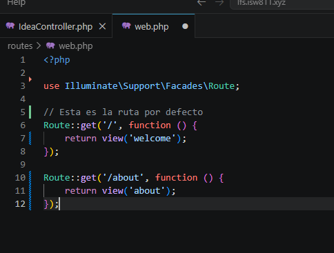

[<- Regresar](../entregable01.md)

# Episodio 03: Routing 101

## Módulo 1: The Fundamentals

## Resumen

En este episodio se trabajó el concepto básico de rutas en Laravel. Las rutas permiten definir qué debe responder la aplicación cuando el usuario visita una URL específica en el navegador.

En Laravel, las rutas web principales se definen en el archivo:

```text
routes/web.php
```

Durante este episodio se trabajó con la ruta principal `/` y se agregó una nueva ruta `/about`. También se modificó la vista inicial `welcome.blade.php` y se creó una nueva vista llamada `about.blade.php`.

---

## Comandos utilizados

Para trabajar en el proyecto se utilizó la carpeta oficial del proyecto Laravel:

```bash
cd ~/ISW811/VMs/webserver/sites/lfs.isw811.xyz
```

También se abrió el proyecto en Visual Studio Code:

```bash
code .
```

Para revisar el estado del repositorio antes y después de los cambios se utilizó:

```bash
git status
```

Después de aplicar los cambios del episodio, se registró el avance en Git con:

```bash
git add .
git commit -m "Complete Routing 101 episode"
```

---

## Archivos modificados o creados

Los archivos principales trabajados en este episodio fueron:

* `routes/web.php`
* `resources/views/welcome.blade.php`
* `resources/views/about.blade.php`
* `docs/the-fundamentals/03-routing-101.md`

---

## Desarrollo del episodio

Para crear rutas en Laravel se utiliza el archivo `routes/web.php`. En este archivo se definen las rutas que responderán a las solicitudes del navegador.

La ruta principal del proyecto quedó definida de la siguiente forma:

```php
Route::get('/', function () {
    return view('welcome');
});
```

Esta ruta indica que cuando el usuario visita la URL principal del sitio, Laravel debe cargar la vista:

```text
resources/views/welcome.blade.php
```

También se agregó una ruta adicional para la página `about`:

```php
Route::get('/about', function () {
    return view('about');
});
```

Esta ruta permite que al visitar:

```text
/about
```

Laravel cargue la vista:

```text
resources/views/about.blade.php
```

---

## Modificación de la vista principal

Se modificó el archivo `welcome.blade.php` para utilizar una estructura HTML básica. En esta vista se agregó un título, un párrafo y un enlace hacia la página `/about`.

Ejemplo de la estructura utilizada:

```html
<!DOCTYPE html>
<html lang="en">
<head>
    <meta charset="UTF-8">
    <meta name="viewport" content="width=device-width, initial-scale=1.0">
    <title>Welcome</title>
</head>
<body>
    <h1>Bienvenido</h1>

    <p>
        Lorem ipsum dolor sit amet consectetur adipisicing elit.
        Quos sint ipsa placeat quibusdam cum, corrupti, iste itaque,
        vitae enim eaque possimus laboriosam expedita debitis ducimus
        culpa dolores voluptatibus. Incidunt, voluptas?
    </p>

    <a href="/about">Acerca de nosotros</a>
</body>
</html>
```

El enlace:

```html
<a href="/about">Acerca de nosotros</a>
```

permite navegar desde la página principal hacia la nueva ruta `/about`.

---

## Creación de la vista About

También se creó el archivo:

```text
resources/views/about.blade.php
```

Esta vista fue utilizada para comprobar que la ruta `/about` funcionaba correctamente y que Laravel podía cargar una segunda página desde el navegador.

---

## Evidencia

Como evidencia de este episodio se puede observar que el archivo `routes/web.php` contiene las rutas `/` y `/about`, y que existen las vistas correspondientes en la carpeta `resources/views`.

Cuando se agreguen capturas para el entregable, se puede incluir una imagen de la página principal y otra de la página `/about`, por ejemplo:



---

## Problemas encontrados y solución

No se presentaron errores graves durante este episodio. El aspecto principal fue comprender que cada ruta debe retornar una vista existente. Por ejemplo, si la ruta retorna:

```php
return view('about');
```

debe existir el archivo:

```text
resources/views/about.blade.php
```

De lo contrario, Laravel mostraría un error indicando que la vista no fue encontrada.

---

## Comentarios personales

Este episodio permitió comprender cómo Laravel conecta una URL con una vista. También fue útil para identificar que el archivo `routes/web.php` funciona como punto de entrada para definir las páginas principales de la aplicación web.

Además, se reforzó el uso básico de Git para guardar el avance del episodio mediante un commit específico.
