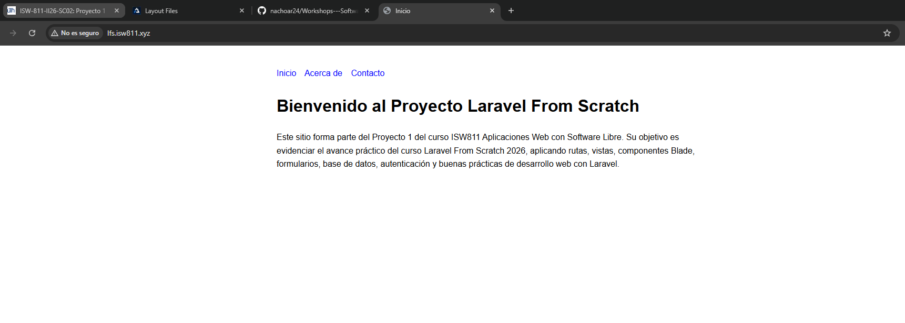
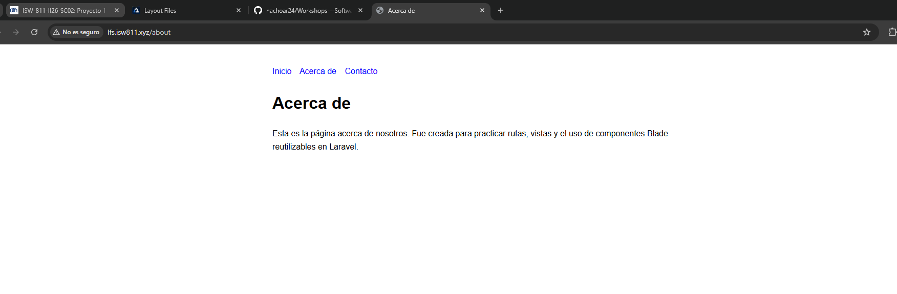
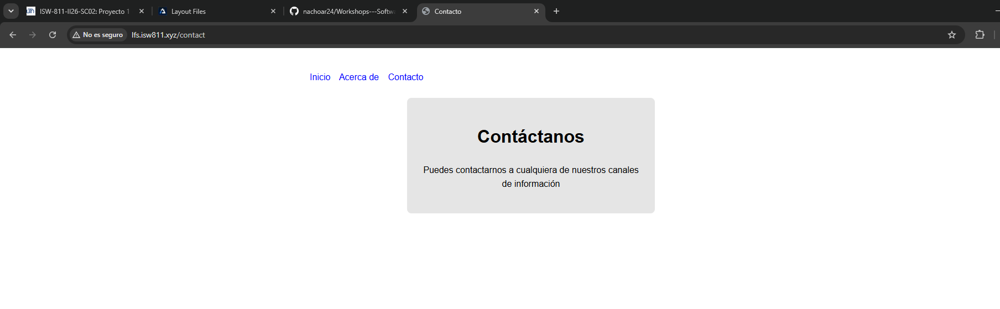

[<- Regresar](../entregable01.md)

# Episodio 04: Layout Files

## Módulo 1: The Fundamentals

## Resumen

En este episodio se trabajó el uso de archivos de layout y componentes Blade en Laravel. El objetivo principal fue reducir la duplicación de código HTML entre varias vistas y crear una estructura reutilizable para las páginas del proyecto.

Antes de este episodio, cada vista podía tener su propia estructura completa de HTML. Esto genera duplicación porque elementos como el `DOCTYPE`, la etiqueta `head`, el menú de navegación y la estructura general del documento se repiten en varias páginas.

Para solucionar esto, se creó un componente Blade llamado `layout`, el cual contiene la estructura común del sitio. Luego, cada página utiliza este componente y solamente define su contenido específico.

También se creó una página de contacto y un componente adicional llamado `card`, utilizado para practicar el uso de atributos en componentes Blade.

---

## Comandos utilizados

Para trabajar en el proyecto se abrió la carpeta oficial:

```bash
cd ~/ISW811/VMs/webserver/sites/lfs.isw811.xyz
code .
```

Para probar el proyecto dentro de la máquina virtual se utilizaron los siguientes comandos:

```bash
cd ~/ISW811/VMs/webserver
vagrant up
vagrant ssh
```

Dentro de Debian:

```bash
cd ~/sites/lfs.isw811.xyz
php artisan view:clear
php artisan route:list
```

Para guardar el avance en Git se utilizaron comandos como:

```bash
git status
git add .
git commit -m "04 Layout Files"
```

---

## Archivos modificados o creados

Los archivos trabajados durante este episodio fueron:

* `routes/web.php`
* `resources/views/welcome.blade.php`
* `resources/views/about.blade.php`
* `resources/views/contact.blade.php`
* `resources/views/components/layout.blade.php`
* `resources/views/components/card.blade.php`
* `docs/the-fundamentals/04-layout-files.md`

---

## Creación de la página de contacto

Primero se creó una nueva vista para la página de contacto:

```text
resources/views/contact.blade.php
```

Esta página se utilizó para practicar una tercera ruta dentro de la aplicación y para comprobar que el menú de navegación funcionara en varias páginas.

La vista de contacto contiene un título y un texto temporal que representa el espacio donde más adelante podría colocarse un formulario:

```blade
<x-layout title="Contacto">
    <x-card class="max-w-400">
        <h1>Contacto</h1>

        <p>
            Espacio reservado para el formulario de contacto.
        </p>
    </x-card>
</x-layout>
```

---

## Uso de `Route::view`

En este episodio también se simplificaron las rutas usando `Route::view`. Esta forma es útil cuando una ruta solamente necesita cargar una vista sin ejecutar lógica adicional.

El archivo `routes/web.php` quedó organizado de forma similar a la siguiente:

```php
<?php

use Illuminate\Support\Facades\Route;

Route::view('/', 'welcome');

Route::view('/about', 'about');

Route::view('/contact', 'contact');
```

Esto permite que Laravel cargue directamente las vistas `welcome`, `about` y `contact` cuando el usuario visita las rutas correspondientes.

---

## Creación del componente `layout`

Para evitar repetir la estructura HTML en cada vista, se creó el componente:

```text
resources/views/components/layout.blade.php
```

Este componente contiene la estructura base del documento HTML, el menú de navegación y el espacio donde se insertará el contenido específico de cada página.

El contenido dinámico se inserta mediante la variable especial:

```blade
{{ $slot }}
```

El componente quedó configurado con una estructura general de HTML, estilos básicos y navegación compartida:

```blade
@props(['title' => 'Laravel From Scratch'])

<!DOCTYPE html>
<html lang="es">
<head>
    <meta charset="UTF-8">
    <meta name="viewport" content="width=device-width, initial-scale=1.0">
    <title>{{ $title }}</title>

    <style>
        body {
            font-family: Arial, sans-serif;
            max-width: 800px;
            margin: 40px auto;
            line-height: 1.6;
        }

        nav {
            margin-bottom: 24px;
        }

        nav a {
            color: blue;
            margin-right: 12px;
            text-decoration: none;
        }

        .card {
            background: #e5e5e5;
            padding: 24px;
            text-align: center;
            border-radius: 8px;
        }

        .max-w-400 {
            max-width: 400px;
            margin: 0 auto;
        }
    </style>
</head>
<body>
    <nav>
        <a href="/">Inicio</a>
        <a href="/about">Acerca de</a>
        <a href="/contact">Contacto</a>
    </nav>

    <main>
        {{ $slot }}
    </main>
</body>
</html>
```

---

## Uso de props en componentes Blade

El componente `layout` recibe una propiedad llamada `title`, definida con la directiva:

```blade
@props(['title' => 'Laravel From Scratch'])
```

Esto permite que cada vista defina su propio título de página:

```blade
<x-layout title="Inicio">
    <h1>Bienvenido</h1>
</x-layout>
```

En el layout, ese valor se imprime dentro de la etiqueta `title`:

```blade
<title>{{ $title }}</title>
```

De esta forma, cada página puede tener un título diferente sin duplicar toda la estructura HTML.

---

## Uso del componente `card`

También se creó un segundo componente llamado:

```text
resources/views/components/card.blade.php
```

Este componente se utilizó para envolver contenido dentro de una tarjeta visual reutilizable:

```blade
<div {{ $attributes->merge(['class' => 'card']) }}>
    {{ $slot }}
</div>
```

La variable `$attributes` permite recibir atributos HTML enviados desde la vista. En este caso, se utilizó el método `merge()` para combinar la clase base `card` con otras clases adicionales, como `max-w-400`.

Ejemplo de uso:

```blade
<x-card class="max-w-400">
    <h1>Contacto</h1>

    <p>
        Espacio reservado para el formulario de contacto.
    </p>
</x-card>
```

Esto permitió aplicar estilos reutilizables y, al mismo tiempo, agregar clases adicionales desde la vista que utiliza el componente.

---

## Evidencia

Como evidencia de este episodio se incluyeron capturas donde se observa que las rutas `/`, `/about` y `/contact` funcionan correctamente y comparten el mismo layout con navegación.







---

## Problemas encontrados y solución

No se presentaron errores graves durante este episodio. El principal punto de atención fue comprender que el componente `layout` debe ubicarse dentro de:

```text
resources/views/components/
```

para poder utilizarlo con la sintaxis:

```blade
<x-layout>
    Contenido de la página
</x-layout>
```

También fue importante comprender que el contenido propio de cada página se inserta en el layout mediante:

```blade
{{ $slot }}
```

---

## Comentarios personales

Este episodio permitió comprender la importancia de evitar duplicación en las vistas. El uso de componentes Blade ayuda a mantener una estructura más limpia, organizada y fácil de mantener.

También fue útil aprender la diferencia entre props y atributos en componentes Blade. Las props permiten enviar datos específicos al componente, mientras que los atributos pueden utilizarse para pasar clases, identificadores u otros valores HTML.
