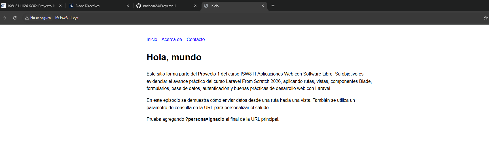
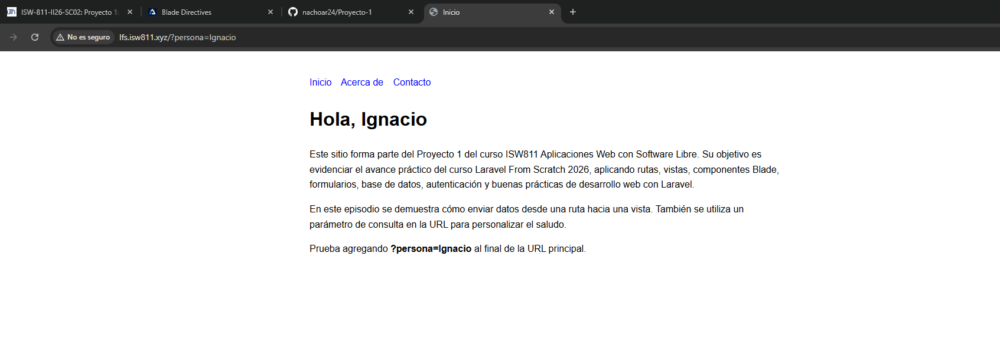

[<- Regresar](../entregable01.md)

# Episodio 05: Pass Data to Views

## Módulo 1: The Fundamentals

## Resumen

En este episodio se trabajó el paso de datos desde una ruta hacia una vista en Laravel. Hasta este punto, las rutas solamente cargaban vistas simples. Sin embargo, en muchas situaciones una vista necesita recibir información dinámica para mostrarla al usuario.

Laravel permite enviar datos a una vista mediante un arreglo asociativo. Cada llave del arreglo se convierte en una variable disponible dentro del archivo Blade.

También se practicó la lectura de parámetros enviados por la URL mediante query string. En este caso, se utilizó un parámetro llamado `persona` para personalizar el saludo de la página principal.

---

## Comandos utilizados

Para trabajar en el proyecto se abrió la carpeta oficial:

```bash
cd ~/ISW811/VMs/webserver/sites/lfs.isw811.xyz
code .
```

Para limpiar las vistas compiladas y probar los cambios se utilizó:

```bash
cd ~/ISW811/VMs/webserver
vagrant ssh
```

Dentro de Debian:

```bash
cd ~/sites/lfs.isw811.xyz
php artisan view:clear
```

Para revisar los cambios antes del commit se utilizó:

```bash
git status
```

Para guardar el avance del episodio se utilizaron comandos como:

```bash
git add routes/web.php resources/views/welcome.blade.php docs/the-fundamentals/05-pass-data-to-views.md docs/img/05-pass-data-to-views-default.png docs/img/05-pass-data-to-views-query-string.png
git commit -m "05 Pass Data to Views"
```

---

## Archivos modificados o creados

Los archivos principales trabajados durante este episodio fueron:

* `routes/web.php`
* `resources/views/welcome.blade.php`
* `docs/the-fundamentals/05-pass-data-to-views.md`

---

## Paso de datos desde la ruta hacia la vista

En el archivo `routes/web.php`, la ruta principal se modificó para enviar datos hacia la vista `welcome`.

El código utilizado fue el siguiente:

```php
Route::get('/', function () {
    return view('welcome', [
        'saludo' => 'Hola',
        'persona' => request('persona', 'mundo'),
    ]);
});
```

En este caso, se envían dos valores a la vista:

* `saludo`
* `persona`

Cada llave del arreglo queda disponible como una variable dentro del archivo Blade. Por ejemplo, la llave `saludo` puede utilizarse como `$saludo`, y la llave `persona` puede utilizarse como `$persona`.

---

## Lectura de datos desde la URL

También se utilizó la función `request()` para leer un valor enviado mediante la URL.

```php
'persona' => request('persona', 'mundo')
```

Esto significa que Laravel buscará un parámetro llamado `persona` en la URL. Por ejemplo:

```text
http://lfs.isw811.xyz/?persona=Ignacio
```

Cuando se visita esa URL, el valor `Ignacio` se envía hacia la vista y se muestra en pantalla.

Si no se envía ningún valor en la URL, Laravel utiliza el valor por defecto:

```text
mundo
```

Por eso, al visitar solamente:

```text
http://lfs.isw811.xyz
```

la página muestra:

```text
Hola, mundo
```

---

## Uso de variables en Blade

En el archivo `resources/views/welcome.blade.php`, las variables enviadas desde la ruta se muestran utilizando la sintaxis de Blade:

```blade
<h1>{{ $saludo }}, {{ $persona }}</h1>
```

La sintaxis `{{ }}` permite imprimir datos de forma segura dentro de una vista Blade.

---

## Seguridad al imprimir datos

Un punto importante del episodio fue comprender que Blade escapa automáticamente los datos impresos con `{{ }}`. Esto ayuda a prevenir problemas de seguridad como la ejecución de código HTML o JavaScript no deseado.

Por ejemplo, si una persona intenta enviar código mediante la URL, Blade no lo ejecuta como código, sino que lo muestra como texto escapado.

La forma segura de imprimir datos es:

```blade
{{ $persona }}
```

Laravel también permite imprimir contenido sin escapar usando:

```blade
{!! $persona !!}
```

Sin embargo, esta forma debe evitarse cuando el dato viene de una entrada del usuario, porque podría generar vulnerabilidades de seguridad.

---

## Evidencia

Como evidencia de este episodio se agregaron capturas donde se observa la página principal recibiendo datos desde la ruta y desde la URL.





---

## Problemas encontrados y solución

No se presentaron errores graves durante este episodio. El punto principal fue comprender que las variables enviadas desde la ruta deben coincidir con los nombres utilizados dentro de la vista.

Por ejemplo, si en la ruta se envía:

```php
'persona' => 'Ignacio'
```

en la vista debe utilizarse:

```blade
{{ $persona }}
```

Si el nombre de la variable no coincide, Laravel mostrará un error indicando que la variable no está definida.

---

## Comentarios personales

Este episodio permitió comprender cómo una vista puede mostrar información dinámica enviada desde una ruta. También fue útil practicar el uso de parámetros en la URL y entender la importancia de imprimir datos de forma segura usando la sintaxis de Blade.
