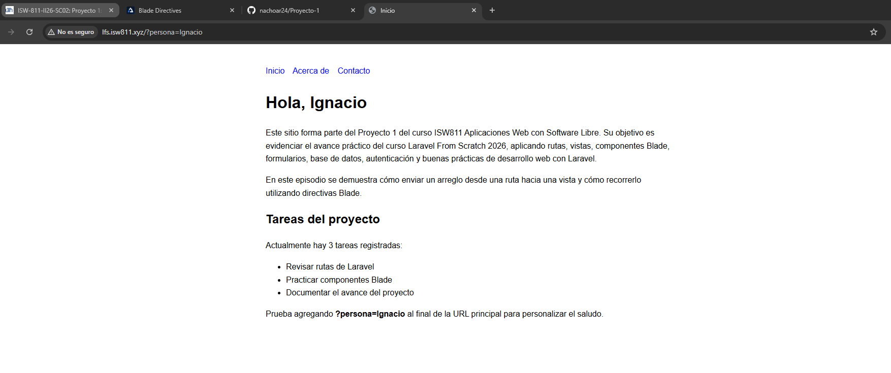

[<- Regresar](../entregable01.md)

# Episodio 06: Blade Directives

## Módulo 1: The Fundamentals

## Resumen

En este episodio se trabajó el uso de directivas Blade en Laravel. Las directivas Blade permiten escribir estructuras comunes de PHP de una forma más limpia y legible dentro de las vistas.

Durante el episodio se practicó el envío de un arreglo desde una ruta hacia una vista y luego se recorrió ese arreglo usando directivas como `@if`, `@forelse`, `@empty` y `@endforelse`.

También se revisó el uso de herramientas de depuración como `@dump` y `@dd`, las cuales permiten inspeccionar datos durante el desarrollo.

---

## Comandos utilizados

Para abrir el proyecto se utilizó:

```bash
cd ~/ISW811/VMs/webserver/sites/lfs.isw811.xyz
code .
```

Para limpiar las vistas compiladas y probar los cambios dentro de la máquina virtual se utilizó:

```bash
cd ~/ISW811/VMs/webserver
vagrant ssh
```

Dentro de Debian:

```bash
cd ~/sites/lfs.isw811.xyz
php artisan view:clear
```

Para revisar y guardar el avance en Git se utilizaron comandos como:

```bash
git status
git add routes/web.php resources/views/welcome.blade.php docs/the-fundamentals/06-blade-directives.md docs/img/06-blade-directives-tareas.png
git commit -m "06 Blade Directives"
```

---

## Archivos modificados o creados

Los archivos principales trabajados durante este episodio fueron:

* `routes/web.php`
* `resources/views/welcome.blade.php`
* `docs/the-fundamentals/06-blade-directives.md`

---

## Paso de arreglos hacia una vista

En el archivo `routes/web.php` se agregó un arreglo llamado `tareas`, el cual se envía hacia la vista `welcome`.

```php
Route::get('/', function () {
    return view('welcome', [
        'saludo' => 'Hola',
        'persona' => request('persona', 'mundo'),
        'tareas' => [
            'Revisar rutas de Laravel',
            'Practicar componentes Blade',
            'Documentar el avance del proyecto',
        ],
    ]);
});
```

Cada llave del arreglo enviado a la vista queda disponible como una variable Blade. En este caso, la llave `tareas` queda disponible como:

```blade
$tareas
```

---

## Uso de `@if`

La directiva `@if` permite ejecutar una condición dentro de una vista Blade.

En este episodio se utilizó para validar si existen tareas registradas:

```blade
@if (count($tareas) > 0)
    <p>Actualmente hay {{ count($tareas) }} tareas registradas:</p>
@endif
```

Esto permite mostrar un mensaje solamente cuando el arreglo contiene elementos.

---

## Uso de `@forelse`

La directiva `@forelse` permite recorrer un arreglo y, al mismo tiempo, definir qué se debe mostrar si el arreglo está vacío.

```blade
<ul>
    @forelse ($tareas as $tarea)
        <li>{{ $tarea }}</li>
    @empty
        <li>No hay tareas activas por el momento.</li>
    @endforelse
</ul>
```

Esta directiva es útil porque combina el comportamiento de un ciclo `foreach` con una validación para arreglos vacíos.

---

## Uso de `@dump` y `@dd`

Laravel también ofrece directivas útiles para depuración.

La directiva `@dump` permite mostrar el contenido de una variable sin detener la ejecución de la página:

```blade
@dump($tareas)
```

La directiva `@dd` significa dump and die. Muestra el contenido de una variable y detiene la ejecución:

```blade
@dd($tareas)
```

Estas directivas son útiles durante el desarrollo, pero no deben dejarse activas en la versión final de una vista, especialmente `@dd`, porque detiene la carga completa de la página.

---

## Seguridad al imprimir datos

Blade permite imprimir datos de forma segura utilizando dobles llaves:

```blade
{{ $tarea }}
```

Esta sintaxis escapa automáticamente el contenido para evitar que código HTML o JavaScript malicioso se ejecute en el navegador.

---

## Evidencia

Como evidencia de este episodio se agregó una captura donde se observa la página de inicio mostrando el listado de tareas enviado desde la ruta hacia la vista.



---

## Problemas encontrados y solución

No se presentaron errores graves durante este episodio. El principal punto de atención fue comprender que no se puede imprimir directamente un arreglo usando `{{ $tareas }}`, ya que Blade intenta convertirlo en texto y eso genera un error.

La solución fue recorrer el arreglo usando directivas Blade como `@forelse`.

---

## Comentarios personales

Este episodio permitió comprender cómo Blade facilita la escritura de estructuras comunes como condiciones y ciclos dentro de las vistas. También fue útil aprender que Laravel ofrece herramientas de depuración como `@dump` y `@dd`, pero que estas deben utilizarse únicamente durante el desarrollo.
