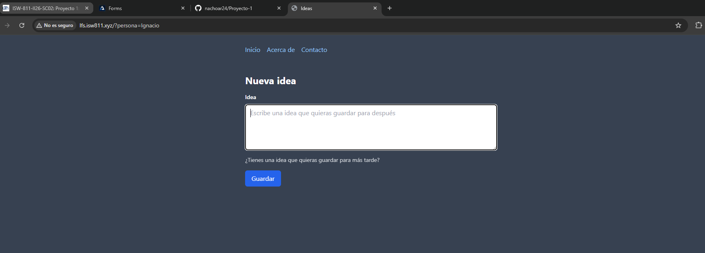
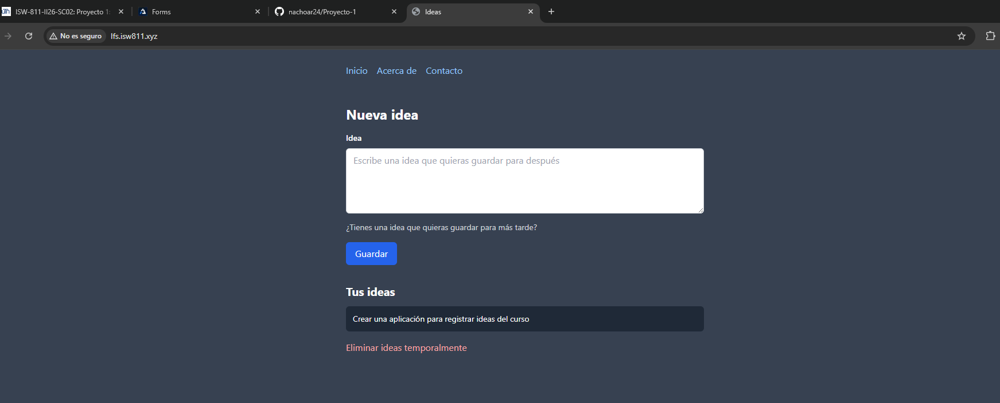
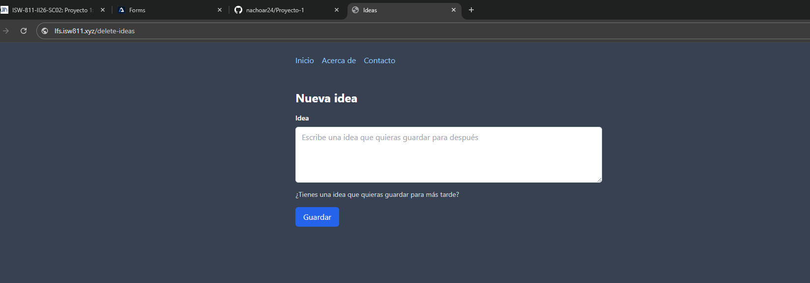

[<- Regresar](../entregable01.md)

# Episodio 07: Forms

## Módulo 1: The Fundamentals

## Resumen

En este episodio se trabajó el manejo básico de formularios en Laravel. El objetivo principal fue comprender cómo recibir datos enviados por el usuario, procesarlos desde una ruta, almacenarlos temporalmente y redirigir al usuario después de completar la acción.

Para este ejercicio se inició la construcción de un pequeño cuaderno digital de ideas. La página principal ahora muestra un formulario donde el usuario puede escribir una idea y guardarla. Las ideas se almacenan temporalmente en la sesión del navegador.

También se aplicó la protección CSRF de Laravel mediante la directiva `@csrf`, la cual permite proteger formularios contra solicitudes no autorizadas.

---

## Comandos utilizados

Para abrir el proyecto se utilizó:

```bash
cd ~/ISW811/VMs/webserver/sites/lfs.isw811.xyz
code .
```

Para limpiar las vistas compiladas y probar los cambios dentro de la máquina virtual se utilizó:

```bash
cd ~/ISW811/VMs/webserver
vagrant ssh
```

Dentro de Debian:

```bash
cd ~/sites/lfs.isw811.xyz
php artisan view:clear
```

Para revisar y guardar el avance en Git se utilizaron comandos como:

```bash
git status
git add routes/web.php resources/views/ideas.blade.php resources/views/components/layout.blade.php docs/the-fundamentals/07-forms.md docs/img/07-forms-formulario.png docs/img/07-forms-idea-guardada.png docs/img/07-forms-ideas-eliminadas.png
git commit -m "07 Forms"
```

---

## Archivos modificados o creados

Los archivos principales trabajados durante este episodio fueron:

* `routes/web.php`
* `resources/views/ideas.blade.php`
* `resources/views/components/layout.blade.php`
* `docs/the-fundamentals/07-forms.md`

---

## Creación de la vista de ideas

En este episodio la vista principal del proyecto se enfocó en el registro de ideas. Para esto, la vista inicial fue renombrada y utilizada como:

```text
resources/views/ideas.blade.php
```

Esta vista contiene un formulario con un campo `textarea`, donde el usuario puede escribir una idea para guardarla temporalmente.

---

## Creación del formulario

El formulario fue creado con el método `POST` y apunta a la ruta `/ideas`:

```blade
<form method="POST" action="/ideas">
    @csrf

    <textarea
        id="idea"
        name="idea"
        rows="4"
        placeholder="Escribe una idea que quieras guardar para después"
    ></textarea>

    <button type="submit">
        Guardar
    </button>
</form>
```

El atributo `method="POST"` indica que el formulario enviará datos al servidor. El atributo `action="/ideas"` indica la ruta que recibirá esos datos.

---

## Uso de CSRF

Laravel protege los formularios `POST` mediante tokens CSRF. Si un formulario no incluye este token, Laravel puede responder con un error `419 Page Expired`.

Para agregar el token CSRF al formulario se utilizó la directiva:

```blade
@csrf
```

Esta directiva genera automáticamente un campo oculto con el token de seguridad necesario para validar la solicitud.

---

## Recepción de datos del formulario

En el archivo `routes/web.php`, se creó una ruta `POST` para recibir la idea enviada desde el formulario:

```php
Route::post('/ideas', function () {
    $idea = request('idea');

    session()->push('ideas', $idea);

    return redirect('/');
});
```

La función `request('idea')` permite obtener el valor enviado desde el campo del formulario llamado `idea`.

---

## Almacenamiento temporal en sesión

Como en este punto del curso todavía no se ha implementado una base de datos para las ideas, se utilizó la sesión del navegador para almacenar los datos temporalmente.

```php
session()->push('ideas', $idea);
```

Esto agrega la nueva idea a un arreglo llamado `ideas` dentro de la sesión.

Luego, cuando el usuario visita la página principal, se recuperan las ideas desde la sesión:

```php
Route::get('/', function () {
    return view('ideas', [
        'ideas' => session()->get('ideas', []),
    ]);
});
```

Si no existen ideas en la sesión, se utiliza un arreglo vacío como valor por defecto.

---

## Redirección después de guardar

Después de guardar la idea en la sesión, la ruta redirige al usuario de vuelta a la página principal:

```php
return redirect('/');
```

Esto evita que el usuario permanezca en una pantalla en blanco después de enviar el formulario.

---

## Listado de ideas

En la vista `ideas.blade.php`, las ideas se muestran solamente si existen elementos guardados:

```blade
@if (count($ideas) > 0)
    <section>
        <h2>Tus ideas</h2>

        <ul>
            @foreach ($ideas as $idea)
                <li>{{ $idea }}</li>
            @endforeach
        </ul>
    </section>
@endif
```

De esta forma, el encabezado y la lista de ideas solo aparecen cuando hay datos almacenados.

---

## Ruta temporal para eliminar ideas

También se agregó una ruta temporal para limpiar las ideas guardadas en la sesión:

```php
Route::get('/delete-ideas', function () {
    session()->forget('ideas');

    return redirect('/');
});
```

Esta ruta permite borrar rápidamente las ideas durante las pruebas. Sin embargo, se reconoce que esta no es la forma ideal de eliminar información, ya que una acción destructiva no debería realizarse mediante una solicitud `GET`. Esta solución se utiliza solamente de forma temporal mientras se estudian los métodos HTTP adecuados.

---

## Evidencia

Como evidencia de este episodio se agregaron capturas donde se observa el formulario de ideas, una idea guardada y la limpieza temporal de ideas.







---

## Problemas encontrados y solución

Durante este episodio se explicó que si se envía un formulario `POST` sin incluir la directiva `@csrf`, Laravel puede devolver un error `419 Page Expired`.

La solución fue agregar la directiva `@csrf` dentro del formulario para incluir automáticamente el token de seguridad.

También se comprendió que después de procesar una solicitud `POST`, es recomendable redirigir al usuario a otra página para evitar una pantalla en blanco o reenvíos accidentales del formulario.

---

## Comentarios personales

Este episodio permitió comprender cómo Laravel recibe y procesa información enviada por el usuario desde un formulario. También fue importante entender el papel de CSRF en la seguridad de los formularios y el uso temporal de sesiones para almacenar datos antes de trabajar con base de datos.

Además, se reforzó el flujo básico de una aplicación web: mostrar un formulario, recibir datos, procesarlos, guardar información temporalmente y redirigir al usuario.
