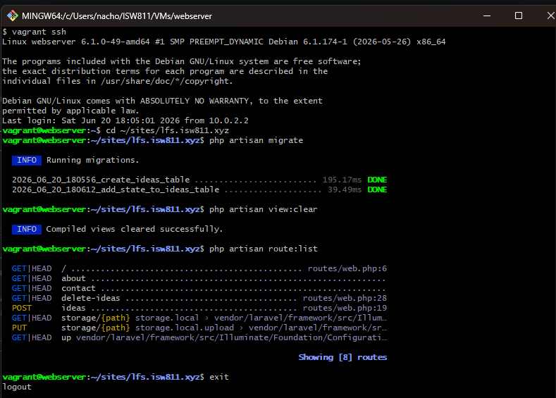
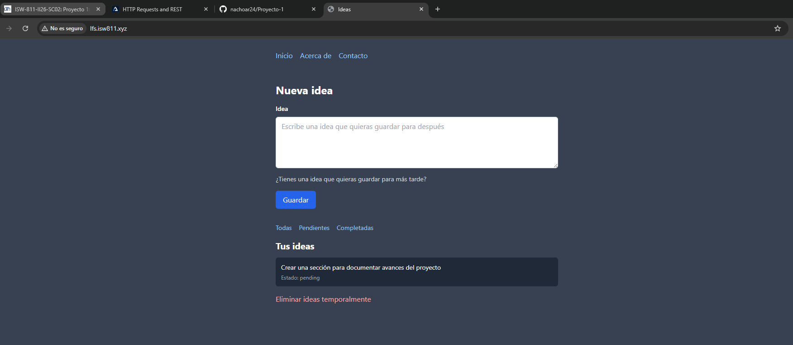
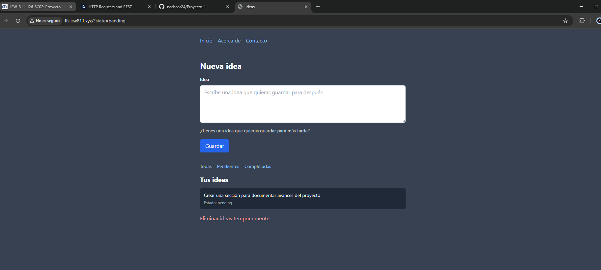

[<- Regresar](../entregable01.md)

# Episodio 08: Databases, Migrations, and Eloquent

## Módulo 1: The Fundamentals

## Resumen

En este episodio se trabajó el uso de bases de datos en Laravel mediante migraciones, modelos y Eloquent ORM. El objetivo principal fue reemplazar el almacenamiento temporal en sesión por almacenamiento persistente en una base de datos.

En el episodio anterior, las ideas se guardaban temporalmente en la sesión del navegador. En este episodio, las ideas pasan a guardarse en una tabla llamada `ideas` dentro de la base de datos del proyecto.

Aunque en el video se explica el uso de SQLite como base de datos local, en este proyecto se utilizó MariaDB, ya que el entorno de trabajo del curso fue configurado previamente con Apache, PHP, MariaDB y una base de datos llamada `lfs`.

---

## Comandos utilizados

Para ingresar a la máquina virtual se utilizaron los siguientes comandos:

```bash
cd ~/ISW811/VMs/webserver
vagrant ssh
```

Dentro de Debian se ingresó al proyecto Laravel:

```bash
cd ~/sites/lfs.isw811.xyz
```

Se crearon las migraciones y el modelo con los siguientes comandos:

```bash
php artisan make:migration create_ideas_table
php artisan make:migration add_state_to_ideas_table --table=ideas
php artisan make:model Idea
```

Luego se ejecutaron las migraciones:

```bash
php artisan migrate
```

También se limpiaron las vistas compiladas para probar los cambios:

```bash
php artisan view:clear
```

Para revisar las rutas disponibles se utilizó:

```bash
php artisan route:list
```

Para guardar el avance en Git se utilizaron comandos como:

```bash
git status
git add .
git commit -m "08 Databases Migrations and Eloquent"
```

---

## Archivos modificados o creados

Los archivos principales trabajados durante este episodio fueron:

* `routes/web.php`
* `resources/views/ideas.blade.php`
* `app/Models/Idea.php`
* `database/migrations/xxxx_xx_xx_xxxxxx_create_ideas_table.php`
* `database/migrations/xxxx_xx_xx_xxxxxx_add_state_to_ideas_table.php`
* `docs/the-fundamentals/08-databases-migrations-and-eloquent.md`

---

## Creación de la tabla `ideas`

Se creó una migración para definir la estructura de la tabla `ideas`.

```php
Schema::create('ideas', function (Blueprint $table) {
    $table->id();
    $table->text('description');
    $table->timestamps();
});
```

Esta tabla almacena la descripción de cada idea y las marcas de tiempo `created_at` y `updated_at`.

---

## Agregar estado a las ideas

También se creó una segunda migración para agregar una columna `state` a la tabla `ideas`.

```php
Schema::table('ideas', function (Blueprint $table) {
    $table->string('state')->default('pending')->after('description');
});
```

Esta columna permite identificar el estado de una idea. En este avance, las ideas nuevas se guardan con el estado `pending`.

---

## Modelo Eloquent `Idea`

Para interactuar con la tabla `ideas` desde Laravel, se creó el modelo:

```text
app/Models/Idea.php
```

El modelo quedó configurado de la siguiente forma:

```php
<?php

namespace App\Models;

use Illuminate\Database\Eloquent\Model;

class Idea extends Model
{
    protected $guarded = [];
}
```

Este modelo representa una fila de la tabla `ideas` y permite utilizar métodos de Eloquent como `all()`, `query()`, `where()` y `create()`.

---

## Obtener ideas desde la base de datos

En el archivo `routes/web.php`, la ruta principal fue modificada para leer ideas desde la base de datos utilizando Eloquent.

```php
Route::get('/', function () {
    $ideas = Idea::query()
        ->when(request('state'), function ($query, $state) {
            $query->where('state', $state);
        })
        ->latest()
        ->get();

    return view('ideas', [
        'ideas' => $ideas,
    ]);
});
```

La consulta obtiene las ideas guardadas en la base de datos y permite filtrar por estado si se recibe el parámetro `state` desde la URL.

---

## Guardar ideas con Eloquent

La ruta `POST /ideas` se actualizó para guardar la idea directamente en la base de datos.

```php
Route::post('/ideas', function () {
    Idea::create([
        'description' => request('idea'),
        'state' => 'pending',
    ]);

    return redirect('/');
});
```

La función `request('idea')` obtiene el texto enviado desde el formulario, y `Idea::create()` inserta un nuevo registro en la tabla `ideas`.

---

## Filtro por estado

También se agregó la posibilidad de filtrar ideas por estado usando query string.

Por ejemplo:

```text
http://lfs.isw811.xyz/?state=pending
```

La parte encargada de aplicar el filtro es:

```php
->when(request('state'), function ($query, $state) {
    $query->where('state', $state);
})
```

Esto significa que si el usuario envía un parámetro `state`, Laravel aplicará un filtro sobre la columna `state`.

---

## Actualización de la vista `ideas`

La vista `ideas.blade.php` fue actualizada porque las ideas ya no son simples cadenas de texto guardadas en sesión. Ahora cada idea es un objeto Eloquent con propiedades como `description` y `state`.

Por eso, para mostrar la descripción se utiliza:

```blade
{{ $idea->description }}
```

Y para mostrar el estado:

```blade
{{ $idea->state }}
```

---

## Evidencia

Como evidencia de este episodio se agregaron capturas donde se observa la ejecución de migraciones, una idea guardada en la base de datos y el filtro por estado pendiente.







---

## Problemas encontrados y solución

No se presentaron errores graves durante este episodio. El punto principal fue adaptar el contenido del video al entorno del proyecto, ya que el video utiliza SQLite, mientras que este proyecto utiliza MariaDB.

La solución fue mantener la configuración existente de MariaDB y ejecutar las migraciones sobre la base de datos `lfs`, la cual ya estaba configurada en el archivo `.env`.

También fue necesario modificar la vista, porque las ideas dejaron de ser textos simples en sesión y pasaron a ser objetos Eloquent provenientes de la base de datos.

---

## Comentarios personales

Este episodio permitió comprender la importancia de las migraciones como una forma de versionar la estructura de la base de datos. También ayudó a entender el papel de Eloquent ORM para trabajar con tablas de base de datos mediante modelos de Laravel.

Además, se observó la diferencia entre guardar información temporalmente en sesión y persistirla correctamente en una base de datos.
