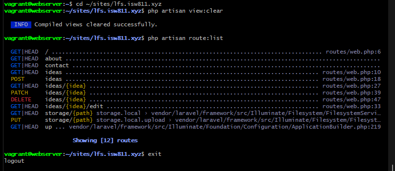
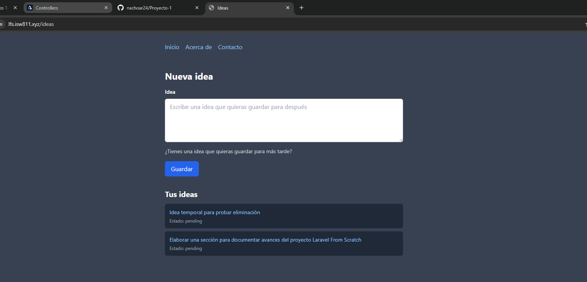
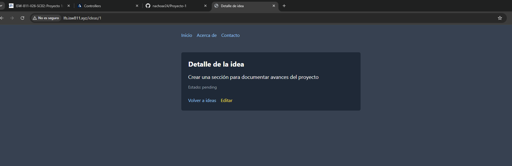
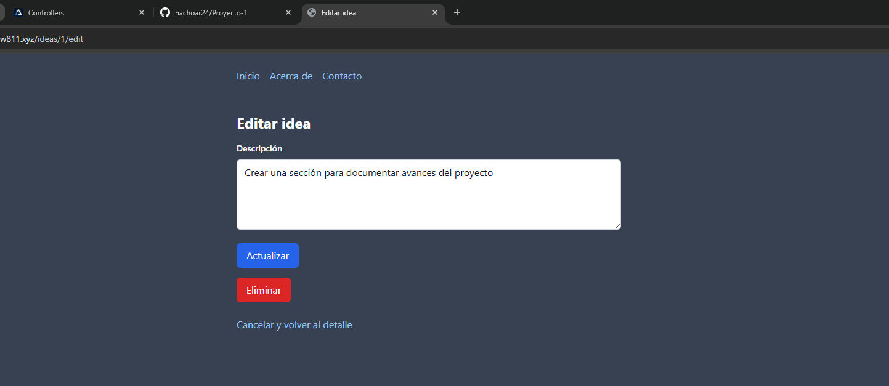
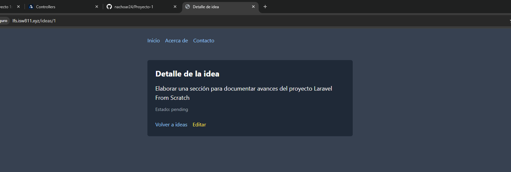
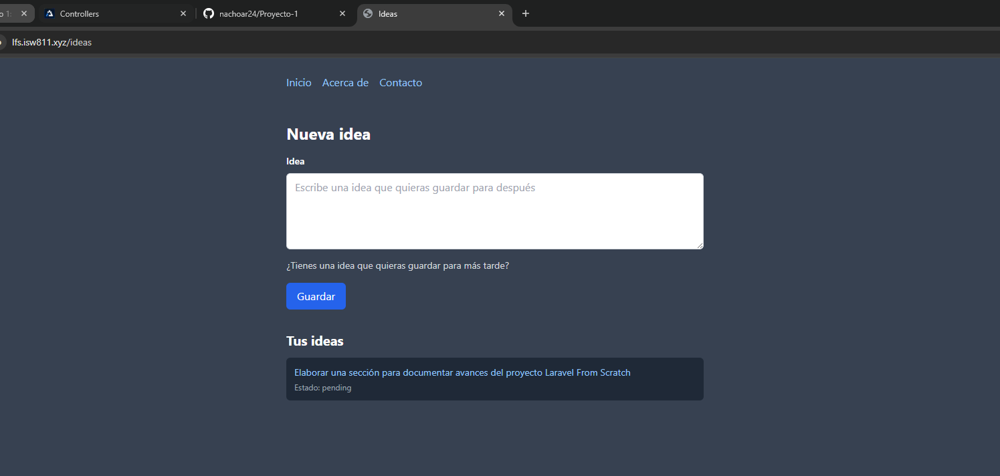

[<- Regresar](../entregable01.md)

# Episodio 09: HTTP Requests and REST

## Módulo 1: The Fundamentals

## Resumen

En este episodio se trabajó el uso de solicitudes HTTP y convenciones REST en Laravel. El objetivo principal fue organizar las rutas de ideas siguiendo acciones comunes utilizadas en aplicaciones web: listar, mostrar, editar, actualizar y eliminar recursos.

Hasta este punto, la aplicación permitía registrar ideas y mostrarlas en pantalla. En este episodio se reorganizó la estructura para que las ideas funcionen como un recurso. Esto permitió trabajar con rutas como `GET /ideas`, `POST /ideas`, `GET /ideas/{idea}`, `GET /ideas/{idea}/edit`, `PATCH /ideas/{idea}` y `DELETE /ideas/{idea}`.

También se practicó el uso de route model binding, lo cual permite que Laravel obtenga automáticamente una instancia del modelo `Idea` a partir del identificador recibido en la URL.

---

## Comandos utilizados

Para abrir el proyecto se utilizó:

```bash
cd ~/ISW811/VMs/webserver/sites/lfs.isw811.xyz
code .
```

Para limpiar las vistas compiladas y revisar las rutas dentro de la máquina virtual se utilizó:

```bash
cd ~/ISW811/VMs/webserver
vagrant ssh
```

Dentro de Debian:

```bash
cd ~/sites/lfs.isw811.xyz
php artisan view:clear
php artisan route:list
```

Para revisar y guardar el avance en Git se utilizaron comandos como:

```bash
git status
git add .
git commit -m "09 HTTP Requests and REST"
```

---

## Archivos modificados o creados

Los archivos principales trabajados durante este episodio fueron:

* `routes/web.php`
* `resources/views/components/layout.blade.php`
* `resources/views/ideas/index.blade.php`
* `resources/views/ideas/show.blade.php`
* `resources/views/ideas/edit.blade.php`
* `docs/the-fundamentals/09-http-requests-and-rest.md`

---

## Organización REST del recurso ideas

En este episodio se organizaron las rutas relacionadas con ideas siguiendo una convención REST básica.

```php
Route::get('/ideas', function () {
    $ideas = Idea::latest()->get();

    return view('ideas.index', [
        'ideas' => $ideas,
    ]);
});

Route::post('/ideas', function () {
    Idea::create([
        'description' => request('description'),
        'state' => 'pending',
    ]);

    return redirect('/ideas');
});
```

La ruta `GET /ideas` se utiliza para listar todas las ideas, mientras que `POST /ideas` se utiliza para guardar una nueva idea.

---

## Mostrar una idea individual

Para mostrar una idea individual se creó la ruta:

```php
Route::get('/ideas/{idea}', function (Idea $idea) {
    return view('ideas.show', [
        'idea' => $idea,
    ]);
});
```

Esta ruta permite visitar una URL como:

```text
http://lfs.isw811.xyz/ideas/1
```

y mostrar el detalle de una sola idea.

---

## Route model binding

Laravel permite usar route model binding para obtener automáticamente un modelo a partir del parámetro de la ruta.

En lugar de recibir solamente un ID y buscar manualmente la idea con `Idea::find($id)`, se puede escribir:

```php
Route::get('/ideas/{idea}', function (Idea $idea) {
    return view('ideas.show', [
        'idea' => $idea,
    ]);
});
```

Laravel interpreta el parámetro `{idea}`, busca el registro correspondiente en la tabla `ideas` y entrega directamente una instancia del modelo `Idea`.

Si no encuentra un registro con ese identificador, Laravel devuelve automáticamente una respuesta `404 Not Found`.

---

## Vista index

La vista principal del recurso ideas se movió a:

```text
resources/views/ideas/index.blade.php
```

Esta vista muestra el formulario para crear ideas y el listado de ideas existentes. Cada idea del listado funciona como un enlace hacia su página de detalle.

```blade
<a href="/ideas/{{ $idea->id }}" class="text-blue-300 hover:underline">
    {{ $idea->description }}
</a>
```

---

## Vista show

Se creó la vista:

```text
resources/views/ideas/show.blade.php
```

Esta vista muestra el detalle de una sola idea, incluyendo su descripción, estado y un enlace para editarla.

```blade
<p class="text-lg">
    {{ $idea->description }}
</p>

<a href="/ideas/{{ $idea->id }}/edit">
    Editar
</a>
```

---

## Vista edit

Se creó la vista:

```text
resources/views/ideas/edit.blade.php
```

Esta vista contiene un formulario para editar la descripción de una idea existente.

```blade
<form method="POST" action="/ideas/{{ $idea->id }}">
    @csrf
    @method('PATCH')

    <textarea name="description">{{ $idea->description }}</textarea>

    <button type="submit">
        Actualizar
    </button>
</form>
```

Aunque el formulario HTML utiliza `POST`, Laravel permite indicar que realmente se desea procesar como una solicitud `PATCH` usando:

```blade
@method('PATCH')
```

---

## Actualizar una idea

Para actualizar una idea se creó una ruta `PATCH`:

```php
Route::patch('/ideas/{idea}', function (Idea $idea) {
    $idea->update([
        'description' => request('description'),
    ]);

    return redirect('/ideas/' . $idea->id);
});
```

Esta ruta recibe la idea mediante route model binding, actualiza su descripción y redirige nuevamente a la vista de detalle.

---

## Eliminar una idea

Para eliminar una idea se creó una ruta `DELETE`:

```php
Route::delete('/ideas/{idea}', function (Idea $idea) {
    $idea->delete();

    return redirect('/ideas');
});
```

En la vista de edición se agregó un formulario separado para eliminar la idea:

```blade
<form method="POST" action="/ideas/{{ $idea->id }}">
    @csrf
    @method('DELETE')

    <button type="submit">
        Eliminar
    </button>
</form>
```

Esto permite enviar una solicitud `DELETE` a Laravel, aunque el navegador solo soporte formularios `GET` y `POST` de forma nativa.

---

## Relación entre HTTP, REST y CRUD

Durante este episodio se reforzó la relación básica entre métodos HTTP y operaciones CRUD:

* `GET` se utiliza para leer información.
* `POST` se utiliza para crear un nuevo recurso.
* `PATCH` se utiliza para actualizar un recurso existente.
* `DELETE` se utiliza para eliminar un recurso.

Aunque REST es un concepto más amplio, esta relación ayuda a comprender cómo organizar rutas de manera clara y convencional.

---

## Evidencia

Como evidencia de este episodio se agregaron capturas donde se observa la lista de rutas REST, el listado de ideas, la vista de detalle, la edición, la actualización y la eliminación de una idea.













---

## Problemas encontrados y solución

No se presentaron errores graves durante este episodio. Un punto importante fue comprender que los navegadores solo soportan formularios `GET` y `POST` de forma nativa.

Para poder enviar solicitudes `PATCH` y `DELETE`, Laravel utiliza method spoofing mediante la directiva:

```blade
@method('PATCH')
```

o:

```blade
@method('DELETE')
```

También fue importante comprender que al usar route model binding, el nombre del parámetro de la ruta debe coincidir con el nombre del argumento recibido en la función.

Por ejemplo:

```php
Route::get('/ideas/{idea}', function (Idea $idea) {
    //
});
```

---

## Comentarios personales

Este episodio permitió comprender mejor cómo Laravel organiza las acciones principales sobre un recurso. También fue útil ver cómo los métodos HTTP se relacionan con operaciones comunes como crear, leer, actualizar y eliminar datos.

El uso de route model binding simplifica el código porque evita buscar manualmente los registros por ID y permite que Laravel maneje automáticamente los casos donde el recurso no existe.
