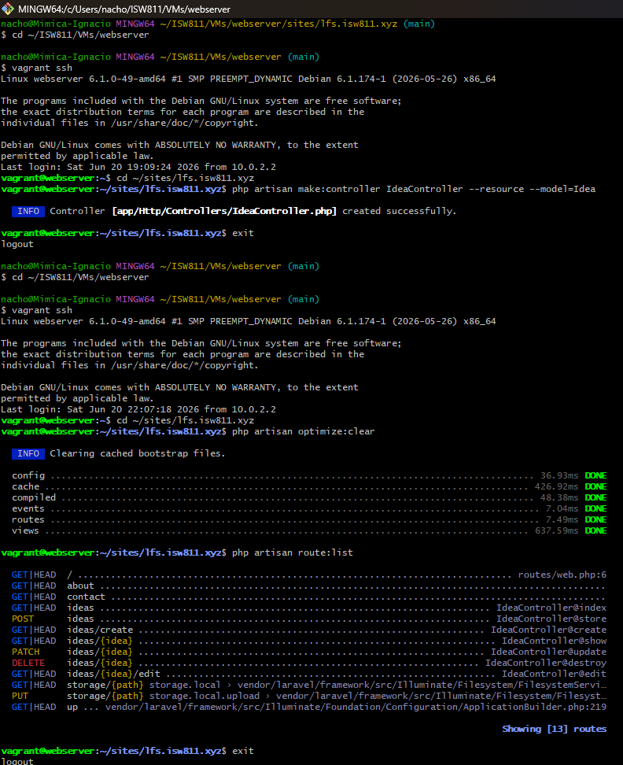
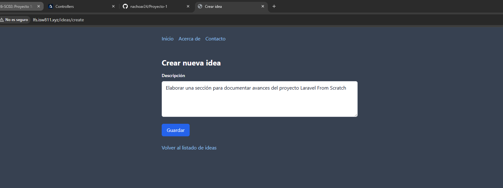
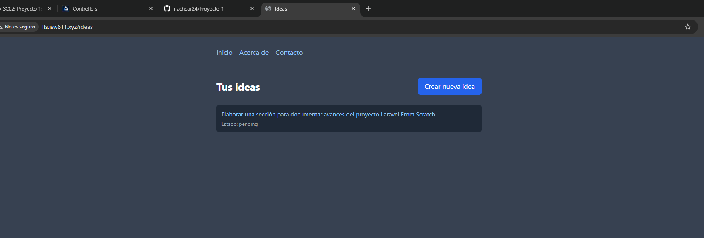
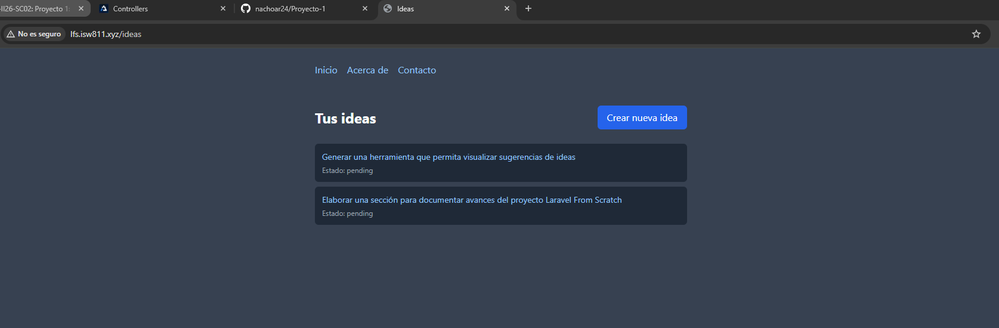

[<- Regresar](../entregable01.md)

# Episodio 10: Controllers

## Módulo 1: The Fundamentals

## Resumen

En este episodio se trabajó el uso de controladores en Laravel. El objetivo principal fue mover la lógica de las rutas hacia una clase dedicada llamada `IdeaController`.

Hasta este punto, la lógica para listar, crear, mostrar, editar, actualizar y eliminar ideas estaba escrita directamente dentro del archivo `routes/web.php` mediante funciones anónimas. Aunque esto funciona para ejemplos pequeños, puede volverse difícil de mantener cuando la aplicación crece.

Para organizar mejor el código, se creó un controlador de recurso. Este controlador contiene métodos específicos para cada acción principal del recurso `ideas`: `index`, `create`, `store`, `show`, `edit`, `update` y `destroy`.

También se agregó la acción `create`, que muestra un formulario separado para crear una nueva idea desde la ruta `/ideas/create`.

---

## Comandos utilizados

Para crear el controlador dentro de la máquina virtual se utilizaron los siguientes comandos:

```bash
cd ~/ISW811/VMs/webserver
vagrant ssh
```

Dentro de Debian:

```bash
cd ~/sites/lfs.isw811.xyz
php artisan make:controller IdeaController --resource --model=Idea
```

Para limpiar caché y revisar las rutas se utilizaron:

```bash
php artisan optimize:clear
php artisan route:list
```

Para revisar y guardar el avance en Git se utilizaron comandos como:

```bash
git status
git add .
git commit -m "10 Controllers"
```

---

## Archivos modificados o creados

Los archivos principales trabajados durante este episodio fueron:

* `routes/web.php`
* `app/Http/Controllers/IdeaController.php`
* `resources/views/ideas/index.blade.php`
* `resources/views/ideas/create.blade.php`
* `docs/the-fundamentals/10-controllers.md`

---

## Creación del controlador

Se creó un controlador de recurso llamado `IdeaController` utilizando Artisan:

```bash
php artisan make:controller IdeaController --resource --model=Idea
```

Este comando generó el archivo:

```text
app/Http/Controllers/IdeaController.php
```

El controlador contiene las acciones principales para trabajar con el recurso `ideas`.

---

## Acciones resourceful

El controlador quedó organizado con las siguientes acciones:

```text
index   - Muestra el listado de ideas.
create  - Muestra el formulario para crear una nueva idea.
store   - Guarda una nueva idea en la base de datos.
show    - Muestra el detalle de una idea específica.
edit    - Muestra el formulario para editar una idea existente.
update  - Actualiza una idea existente.
destroy - Elimina una idea existente.
```

Estas acciones siguen una convención común en Laravel para trabajar con recursos.

---

## Movimiento de lógica desde rutas hacia controlador

Antes de este episodio, el archivo `routes/web.php` contenía funciones anónimas con la lógica de cada acción.

Después del cambio, las rutas apuntan hacia métodos del controlador:

```php
Route::get('/ideas', [IdeaController::class, 'index']);

Route::get('/ideas/create', [IdeaController::class, 'create']);

Route::post('/ideas', [IdeaController::class, 'store']);

Route::get('/ideas/{idea}', [IdeaController::class, 'show']);

Route::get('/ideas/{idea}/edit', [IdeaController::class, 'edit']);

Route::patch('/ideas/{idea}', [IdeaController::class, 'update']);

Route::delete('/ideas/{idea}', [IdeaController::class, 'destroy']);
```

Esto permite que `routes/web.php` sea más claro y que la lógica principal se concentre en el controlador.

---

## Acción index

La acción `index` obtiene todas las ideas desde la base de datos y carga la vista `ideas.index`.

```php
public function index()
{
    $ideas = Idea::latest()->get();

    return view('ideas.index', [
        'ideas' => $ideas,
    ]);
}
```

---

## Acción create

La acción `create` muestra el formulario para crear una nueva idea.

```php
public function create()
{
    return view('ideas.create');
}
```

Esta acción se accede mediante la ruta:

```text
/ideas/create
```

---

## Acción store

La acción `store` recibe los datos enviados desde el formulario y guarda una nueva idea en la base de datos.

```php
public function store(Request $request)
{
    Idea::create([
        'description' => $request->input('description'),
        'state' => 'pending',
    ]);

    return redirect('/ideas');
}
```

---

## Acción show

La acción `show` muestra el detalle de una sola idea. Laravel entrega la idea automáticamente mediante route model binding.

```php
public function show(Idea $idea)
{
    return view('ideas.show', [
        'idea' => $idea,
    ]);
}
```

---

## Acción edit

La acción `edit` carga el formulario para editar una idea existente.

```php
public function edit(Idea $idea)
{
    return view('ideas.edit', [
        'idea' => $idea,
    ]);
}
```

---

## Acción update

La acción `update` actualiza la descripción de una idea existente.

```php
public function update(Request $request, Idea $idea)
{
    $idea->update([
        'description' => $request->input('description'),
    ]);

    return redirect('/ideas/' . $idea->id);
}
```

---

## Acción destroy

La acción `destroy` elimina una idea y redirige al listado principal.

```php
public function destroy(Idea $idea)
{
    $idea->delete();

    return redirect('/ideas');
}
```

---

## Vista create

Se creó la vista:

```text
resources/views/ideas/create.blade.php
```

Esta vista contiene el formulario para crear una nueva idea. Al enviarse, realiza una solicitud `POST` hacia `/ideas`, que es procesada por el método `store` del controlador.

---

## Evidencia

Como evidencia de este episodio se agregaron capturas donde se observa la lista de rutas asociadas al controlador, la vista de creación, el listado de ideas y una idea creada desde la nueva acción `create`.









---

## Problemas encontrados y solución

No se presentaron errores graves durante este episodio. El punto principal fue respetar el orden de las rutas, especialmente colocando `/ideas/create` antes de `/ideas/{idea}`.

Esto es importante porque si `/ideas/{idea}` se coloca antes, Laravel podría interpretar la palabra `create` como si fuera el identificador de una idea.

También fue importante importar correctamente el controlador en `routes/web.php`:

```php
use App\Http\Controllers\IdeaController;
```

---

## Comentarios personales

Este episodio permitió comprender por qué los controladores ayudan a organizar mejor una aplicación Laravel. Al mover la lógica desde `routes/web.php` hacia `IdeaController`, el proyecto queda más limpio y más fácil de mantener.

También fue útil conocer las siete acciones resourceful que suelen utilizarse al trabajar con recursos: `index`, `create`, `store`, `show`, `edit`, `update` y `destroy`.
