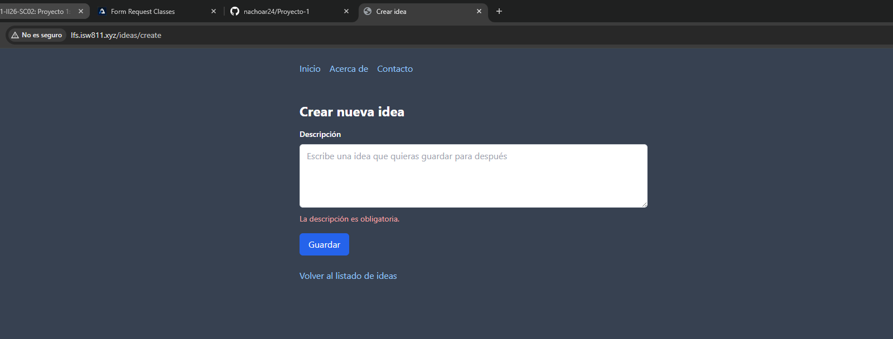
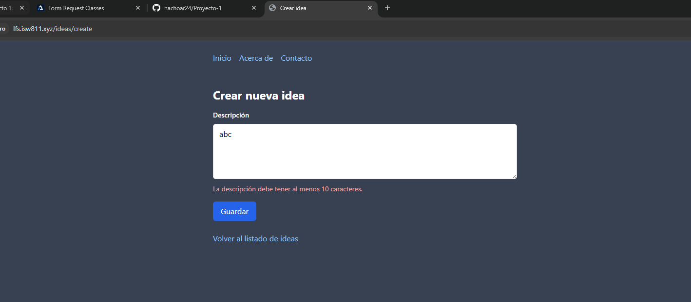
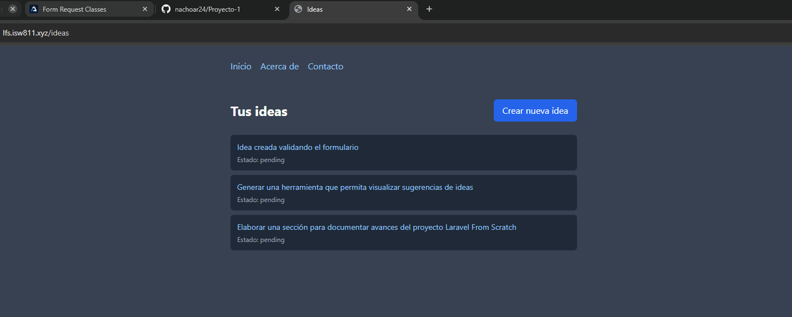
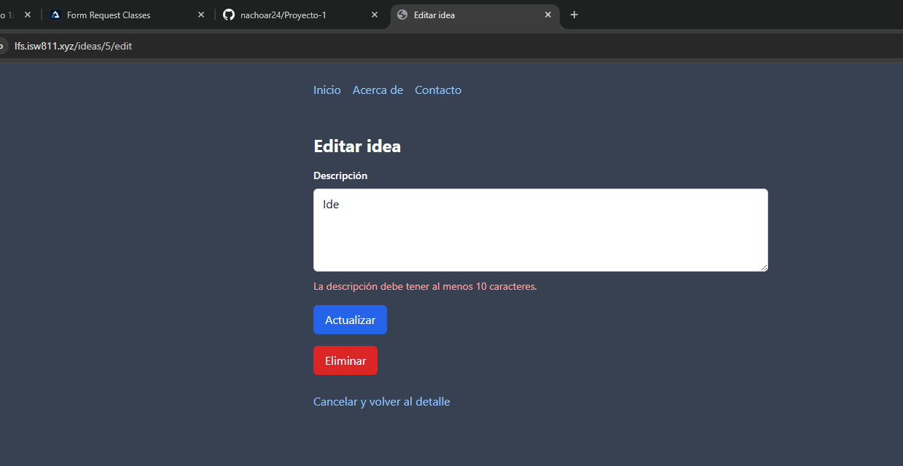

[<- Regresar](../entregable01.md)

# Episodio 11: Request Validation

## Módulo 1: The Fundamentals

## Resumen

En este episodio se trabajó la validación de solicitudes en Laravel. El objetivo principal fue evitar que el usuario pueda guardar o actualizar una idea vacía o demasiado corta.

Hasta este punto, el proyecto ya permitía listar, crear, ver, editar, actualizar y eliminar ideas usando rutas REST, controladores, vistas Blade, formularios, base de datos, migraciones y Eloquent. En este episodio, esas funcionalidades se mantuvieron y se agregó validación sobre el campo `description`.

La validación se aplicó tanto al crear una nueva idea como al actualizar una idea existente. También se mostró cómo presentar mensajes de error en la vista y cómo reutilizar ese código mediante un componente Blade.

---

## Comandos utilizados

Para limpiar caché y revisar las rutas se utilizaron los siguientes comandos dentro de la máquina virtual:

```bash
cd ~/ISW811/VMs/webserver
vagrant ssh
```

Dentro de Debian:

```bash
cd ~/sites/lfs.isw811.xyz
php artisan optimize:clear
php artisan view:clear
php artisan route:list
```

Para revisar y guardar el avance en Git se utilizaron comandos como:

```bash
git status
git add .
git commit -m "11 Request Validation"
```

---

## Archivos modificados o creados

Los archivos principales trabajados durante este episodio fueron:

* `app/Http/Controllers/IdeaController.php`
* `resources/views/ideas/create.blade.php`
* `resources/views/ideas/edit.blade.php`
* `resources/views/components/forms/error.blade.php`
* `docs/the-fundamentals/11-request-validation.md`

---

## Validación en el controlador

La validación se agregó en el controlador `IdeaController`, específicamente en las acciones `store` y `update`.

La acción `store` valida los datos antes de crear una nueva idea:

```php
public function store(Request $request)
{
    $validated = $request->validate([
        'description' => ['required', 'min:10'],
    ], [
        'description.required' => 'La descripción es obligatoria.',
        'description.min' => 'La descripción debe tener al menos :min caracteres.',
    ]);

    Idea::create([
        'description' => $validated['description'],
        'state' => 'pending',
    ]);

    return redirect('/ideas');
}
```

La acción `update` valida los datos antes de actualizar una idea existente:

```php
public function update(Request $request, Idea $idea)
{
    $validated = $request->validate([
        'description' => ['required', 'min:10'],
    ], [
        'description.required' => 'La descripción es obligatoria.',
        'description.min' => 'La descripción debe tener al menos :min caracteres.',
    ]);

    $idea->update([
        'description' => $validated['description'],
    ]);

    return redirect('/ideas/' . $idea->id);
}
```

---

## Reglas aplicadas

Para el campo `description` se utilizaron dos reglas:

```php
'description' => ['required', 'min:10']
```

La regla `required` indica que el campo no puede quedar vacío.

La regla `min:10` indica que el texto debe tener al menos 10 caracteres.

---

## Redirección automática cuando falla la validación

Cuando la validación falla, Laravel no continúa ejecutando el resto del método. En lugar de eso, redirige automáticamente al usuario de regreso al formulario anterior y guarda los errores temporalmente en la sesión.

Esto evita que se intente ejecutar una consulta SQL con datos inválidos.

---

## Mostrar errores de validación

Para mostrar los errores de validación se creó un componente Blade reutilizable:

```text
resources/views/components/forms/error.blade.php
```

El componente contiene:

```blade
@props(['name'])

@error($name)
    <p class="mt-1 text-sm text-red-300">
        {{ $message }}
    </p>
@enderror
```

Este componente recibe el nombre del campo y muestra el mensaje correspondiente si existe un error de validación.

---

## Uso del componente en formularios

El componente se utiliza en los formularios de creación y edición de ideas de la siguiente manera:

```blade
<x-forms.error name="description" />
```

Esto permite evitar duplicar la misma lógica de error en diferentes formularios.

---

## Mantener datos ingresados con `old`

En la vista de creación se utilizó:

```blade
{{ old('description') }}
```

Esto permite que, si la validación falla, el formulario conserve el texto que el usuario había escrito.

En la vista de edición se utilizó:

```blade
{{ old('description', $idea->description) }}
```

Esto permite mostrar el valor anterior ingresado por el usuario si la validación falla, o la descripción actual de la idea si no hay errores.

---

## Evidencia

Como evidencia de este episodio se agregaron capturas donde se observa la validación de un campo vacío, la validación de un texto demasiado corto, una creación exitosa y un error de validación al editar una idea.









Opcionalmente, también se agregó una captura del componente reutilizable de errores.

---

## Problemas encontrados y solución

Antes de agregar validación, era posible enviar el formulario vacío. Esto provocaba que Laravel intentara guardar una idea con `description` nulo, generando un error de base de datos.

La solución fue validar la solicitud antes de ejecutar la operación de creación o actualización. Si los datos no cumplen las reglas, Laravel redirige automáticamente al formulario y muestra los errores correspondientes.

También se creó un componente Blade para evitar duplicar el código de mensajes de error en los formularios.

---

## Comentarios personales

Este episodio permitió comprender la importancia de validar los datos antes de guardarlos o actualizarlos en la base de datos. También reforzó el uso de componentes Blade para reutilizar partes comunes de la interfaz.

La funcionalidad del proyecto continúa evolucionando de forma acumulativa, ya que se mantiene el flujo completo de ideas y se agrega una nueva capa de seguridad y control sobre los datos ingresados por el usuario.
