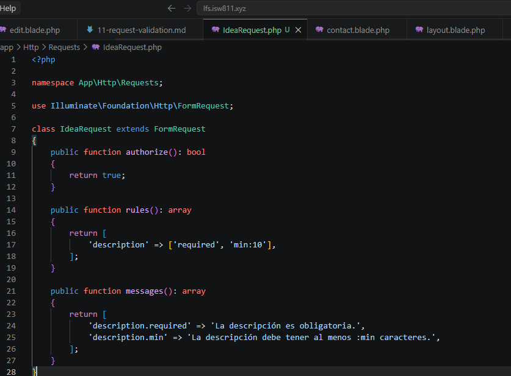
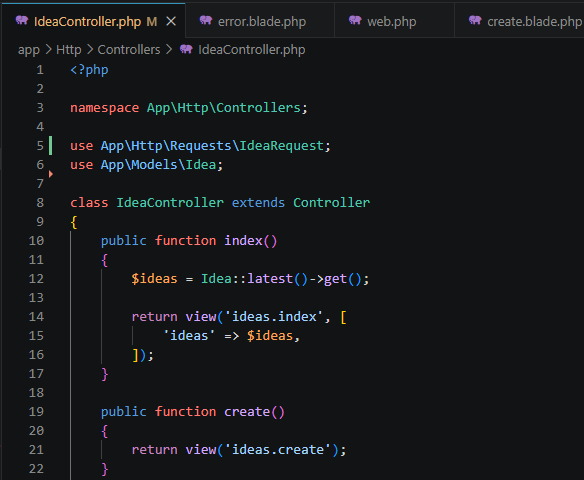
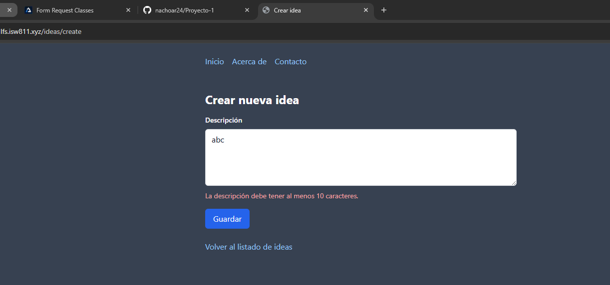
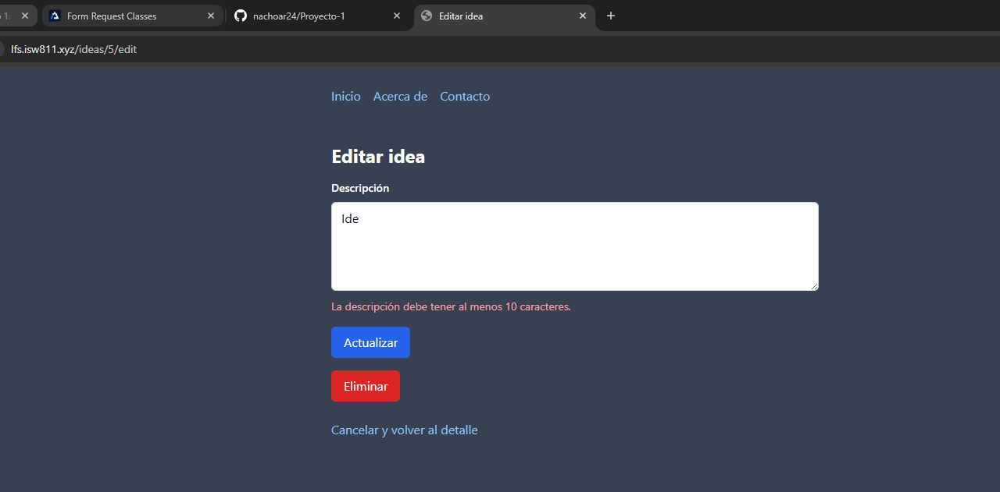
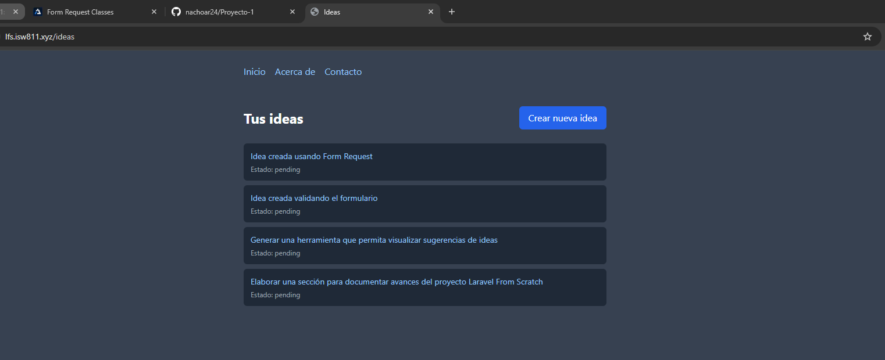

[<- Regresar](../entregable01.md)

# Episodio 12: Form Request Classes

## Módulo 1: The Fundamentals

## Resumen

En este episodio se trabajó el uso de Form Request Classes en Laravel. El objetivo principal fue mover las reglas de validación fuera del controlador hacia una clase dedicada.

Hasta este punto, el proyecto ya permitía listar, crear, ver, editar, actualizar y eliminar ideas. Además, en el episodio anterior se agregó validación directamente dentro del controlador. En este episodio, esa validación se reorganizó usando una clase llamada `IdeaRequest`.

La funcionalidad del proyecto se mantiene de forma acumulativa. Las ideas siguen validándose al crearse y actualizarse, pero ahora las reglas y mensajes de validación se administran desde una clase separada.

---

## Comandos utilizados

Para crear la clase Form Request se ingresó a la máquina virtual:

```bash
cd ~/ISW811/VMs/webserver
vagrant ssh
```

Dentro de Debian se ejecutó:

```bash
cd ~/sites/lfs.isw811.xyz
php artisan make:request IdeaRequest
```

Para limpiar caché y revisar las rutas se utilizaron:

```bash
php artisan optimize:clear
php artisan view:clear
php artisan route:list
```

Para revisar y guardar el avance en Git se utilizaron comandos como:

```bash
git status
git add .
git commit -m "12 Form Request Classes"
```

---

## Archivos modificados o creados

Los archivos principales trabajados durante este episodio fueron:

* `app/Http/Requests/IdeaRequest.php`
* `app/Http/Controllers/IdeaController.php`
* `docs/the-fundamentals/12-form-request-classes.md`

---

## Creación de la clase `IdeaRequest`

Se creó una clase Form Request con el comando:

```bash
php artisan make:request IdeaRequest
```

Este comando generó el archivo:

```text
app/Http/Requests/IdeaRequest.php
```

Esta clase se utiliza para centralizar la validación del formulario de ideas.

---

## Método `authorize`

La clase `IdeaRequest` incluye el método `authorize`, el cual permite definir si el usuario está autorizado para realizar la solicitud.

```php
public function authorize(): bool
{
    return true;
}
```

En este momento del proyecto todavía no se ha implementado autenticación o autorización, por lo que se devuelve `true` para permitir que cualquier usuario pueda crear o actualizar ideas.

Si este método devolviera `false`, Laravel respondería con un error `403`.

---

## Método `rules`

Las reglas de validación se definieron en el método `rules`.

```php
public function rules(): array
{
    return [
        'description' => ['required', 'min:10'],
    ];
}
```

Estas reglas indican que el campo `description` es obligatorio y debe tener al menos 10 caracteres.

---

## Método `messages`

También se agregó el método `messages` para personalizar los mensajes de error.

```php
public function messages(): array
{
    return [
        'description.required' => 'La descripción es obligatoria.',
        'description.min' => 'La descripción debe tener al menos :min caracteres.',
    ];
}
```

Esto permite mostrar mensajes claros y en español cuando la validación falla.

---

## Uso del Form Request en el controlador

El controlador `IdeaController` fue actualizado para usar `IdeaRequest` en las acciones `store` y `update`.

```php
use App\Http\Requests\IdeaRequest;
```

En la acción `store` se utiliza:

```php
public function store(IdeaRequest $request)
{
    $validated = $request->validated();

    Idea::create([
        'description' => $validated['description'],
        'state' => 'pending',
    ]);

    return redirect('/ideas');
}
```

En la acción `update` se utiliza:

```php
public function update(IdeaRequest $request, Idea $idea)
{
    $validated = $request->validated();

    $idea->update([
        'description' => $validated['description'],
    ]);

    return redirect('/ideas/' . $idea->id);
}
```

Laravel ejecuta automáticamente la validación antes de entrar al cuerpo del método. Si la validación falla, Laravel redirige al usuario de regreso al formulario y muestra los errores correspondientes.

---

## Diferencia con la validación en el controlador

Antes de este episodio, las reglas de validación estaban escritas directamente en `IdeaController`.

Después del cambio, el controlador queda más limpio porque la validación vive en una clase dedicada.

Ambas formas son válidas en Laravel. La decisión depende de la organización del proyecto y de si se desea mantener la lógica de validación dentro del controlador o separada en una clase propia.

---

## Validación compartida para crear y actualizar

En este proyecto se utilizó una sola clase `IdeaRequest` para las acciones `store` y `update`, porque las reglas son iguales para ambos casos.

Si en el futuro las reglas fueran diferentes, se podrían crear clases separadas, por ejemplo:

```text
StoreIdeaRequest
UpdateIdeaRequest
```

---

## Evidencia

Como evidencia de este episodio se agregaron capturas donde se observa la clase `IdeaRequest`, el controlador usando la clase de request, errores de validación en creación y edición, y una creación exitosa.











---

## Problemas encontrados y solución

Un punto importante fue recordar que el método `authorize` debe devolver `true`. Si queda en `false`, Laravel no ejecuta la validación y devuelve un error `403`, indicando que la acción no está autorizada.

También fue necesario importar correctamente la clase `IdeaRequest` dentro del controlador:

```php
use App\Http\Requests\IdeaRequest;
```

Con esto, Laravel puede inyectar la clase en los métodos `store` y `update`.

---

## Comentarios personales

Este episodio permitió comprender cómo Laravel permite separar la validación en una clase dedicada. Esto ayuda a mantener el controlador más limpio y facilita la reutilización de reglas cuando varios métodos comparten la misma validación.

La aplicación continúa evolucionando de forma acumulativa, ya que se mantienen las funcionalidades anteriores y se mejora la organización interna del código.
