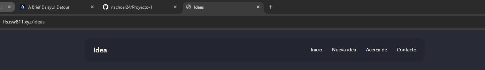
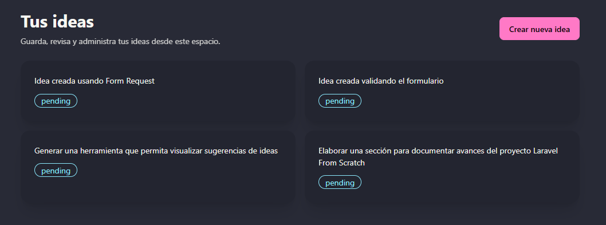
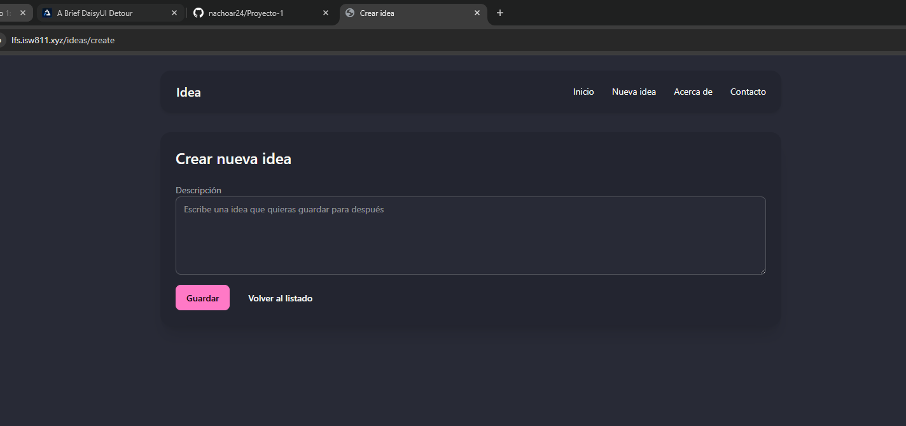
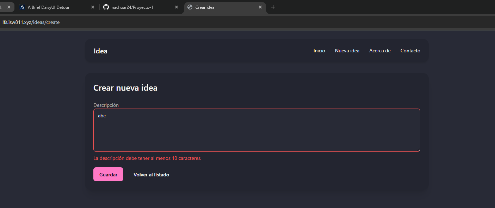
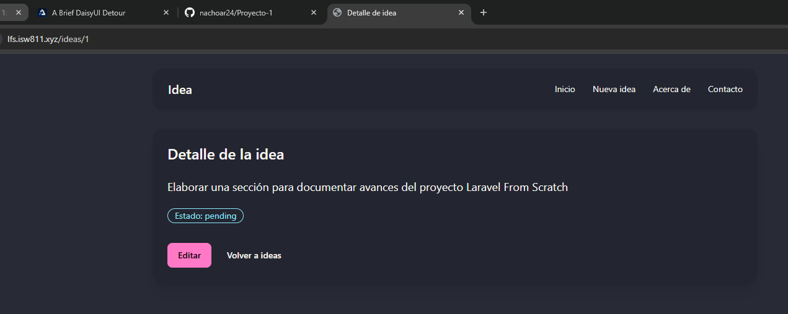
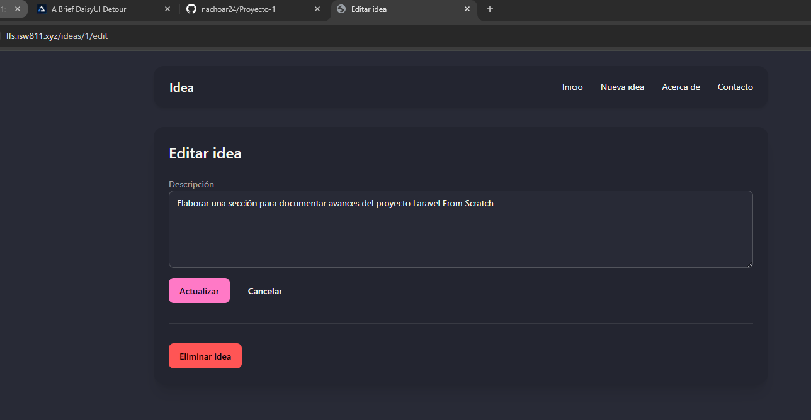

[<- Regresar](../entregable01.md)

# Episodio 13: A Brief DaisyUI Detour

## Módulo 1: The Fundamentals

## Resumen

En este episodio se realizó una mejora visual de la aplicación utilizando DaisyUI. El objetivo principal fue hacer que la interfaz se vea más organizada y profesional sin cambiar la lógica principal del proyecto.

Hasta este punto, la aplicación ya permitía listar, crear, ver, editar, actualizar y eliminar ideas. También contaba con validación, controladores, rutas REST, migraciones, base de datos y Eloquent. En este episodio se mantuvieron todas esas funcionalidades y se mejoró la presentación visual de la aplicación.

Se agregó DaisyUI mediante CDN, se actualizó el layout principal, se creó un componente de navegación y se creó un componente reutilizable para mostrar ideas como tarjetas.

---

## Comandos utilizados

Para limpiar caché y revisar las rutas se utilizaron los siguientes comandos dentro de la máquina virtual:

```bash
cd ~/ISW811/VMs/webserver
vagrant ssh
```

Dentro de Debian:

```bash
cd ~/sites/lfs.isw811.xyz
php artisan optimize:clear
php artisan view:clear
php artisan route:list
```

Para revisar y guardar el avance en Git se utilizaron comandos como:

```bash
git status
git add .
git commit -m "13 A Brief DaisyUI Detour"
```

---

## Archivos modificados o creados

Los archivos principales trabajados durante este episodio fueron:

* `resources/views/components/layout.blade.php`
* `resources/views/components/nav.blade.php`
* `resources/views/components/idea-card.blade.php`
* `resources/views/components/forms/error.blade.php`
* `resources/views/ideas/index.blade.php`
* `resources/views/ideas/create.blade.php`
* `resources/views/ideas/show.blade.php`
* `resources/views/ideas/edit.blade.php`
* `docs/the-fundamentals/13-a-brief-daisyui-detour.md`

---

## Agregar DaisyUI

Se agregó DaisyUI en el archivo principal de layout:

```text
resources/views/components/layout.blade.php
```

Dentro del `<head>` se incluyeron los enlaces necesarios para cargar DaisyUI, sus temas y Tailwind desde CDN:

```blade
<link href="https://cdn.jsdelivr.net/npm/daisyui@5" rel="stylesheet" type="text/css" />
<link href="https://cdn.jsdelivr.net/npm/daisyui@5/themes.css" rel="stylesheet" type="text/css" />
<script src="https://cdn.jsdelivr.net/npm/@tailwindcss/browser@4"></script>
```

También se configuró un tema usando el atributo `data-theme`:

```blade
<html lang="es" data-theme="dracula">
```

---

## Actualización del layout

El layout principal fue actualizado para utilizar clases de DaisyUI y Tailwind. También se movió la navegación a un componente separado.

```blade
<body class="min-h-screen bg-base-100 text-base-content">
    <div class="mx-auto max-w-5xl p-6">
        <x-nav />

        <main class="mt-8">
            {{ $slot }}
        </main>
    </div>
</body>
```

Esto permite mantener una estructura común para todas las páginas y evita repetir código de navegación.

---

## Componente de navegación

Se creó el componente:

```text
resources/views/components/nav.blade.php
```

Este componente contiene la barra de navegación principal de la aplicación.

```blade
<div class="navbar rounded-box bg-base-200 shadow-md">
    <div class="navbar-start">
        <a href="/ideas" class="btn btn-ghost text-xl">
            Idea
        </a>
    </div>

    <div class="navbar-end">
        <ul class="menu menu-horizontal gap-1 px-1">
            <li><a href="/ideas">Inicio</a></li>
            <li><a href="/ideas/create">Nueva idea</a></li>
            <li><a href="/about">Acerca de</a></li>
            <li><a href="/contact">Contacto</a></li>
        </ul>
    </div>
</div>
```

Con esto, la navegación queda centralizada y puede reutilizarse en todas las vistas que utilizan el layout.

---

## Componente de tarjeta de idea

Se creó el componente:

```text
resources/views/components/idea-card.blade.php
```

Este componente permite mostrar cada idea como una tarjeta reutilizable.

```blade
@props(['href' => '#'])

<a href="{{ $href }}" {{ $attributes->merge(['class' => 'card bg-base-200 shadow-xl transition hover:bg-base-300']) }}>
    <div class="card-body">
        {{ $slot }}
    </div>
</a>
```

Luego se utilizó en la vista `ideas.index` para mostrar el listado de ideas:

```blade
<x-idea-card href="/ideas/{{ $idea->id }}">
    <div class="flex flex-col gap-3">
        <p>
            {{ $idea->description }}
        </p>

        <div>
            <span class="badge badge-outline badge-info">
                {{ $idea->state }}
            </span>
        </div>
    </div>
</x-idea-card>
```

---

## Mejoras en el listado de ideas

La vista:

```text
resources/views/ideas/index.blade.php
```

fue actualizada para mostrar las ideas en una cuadrícula de tarjetas.

También se agregó un botón principal para crear una nueva idea:

```blade
<a href="/ideas/create" class="btn btn-primary">
    Crear nueva idea
</a>
```

Esto mejora la experiencia del usuario y hace que la página principal sea más clara.

---

## Mejoras en formularios

Las vistas de creación y edición fueron actualizadas para utilizar clases de DaisyUI como:

```text
card
card-body
textarea
textarea-bordered
btn
btn-primary
btn-error
btn-ghost
```

También se mantuvo la validación agregada en episodios anteriores. Si el campo `description` no cumple las reglas, el textarea muestra un estilo de error:

```blade
class="textarea textarea-bordered w-full @error('description') textarea-error @enderror"
```

---

## Actualización del componente de error

El componente de error de formulario también fue actualizado para utilizar el color de error de DaisyUI:

```blade
@props(['name'])

@error($name)
    <p class="mt-2 text-sm text-error">
        {{ $message }}
    </p>
@enderror
```

Esto mantiene los mensajes de validación consistentes con el estilo visual del sitio.

---

## Evidencia

Como evidencia de este episodio se agregaron capturas donde se observa la navegación con DaisyUI, las tarjetas de ideas, el formulario de creación, la validación visual, la vista de detalle y la vista de edición.













---

## Problemas encontrados y solución

No se presentaron errores graves durante este episodio. El principal punto de atención fue mantener las funcionalidades anteriores mientras se modificaba la interfaz visual.

También fue importante limpiar la caché de vistas después de actualizar componentes Blade y el layout principal.

---

## Comentarios personales

Este episodio permitió mejorar la apariencia del proyecto sin modificar la lógica principal de la aplicación. DaisyUI facilitó la creación de una interfaz más limpia usando clases como `navbar`, `card`, `btn`, `textarea` y `badge`.

La aplicación continúa evolucionando de forma acumulativa, ya que conserva las funcionalidades de rutas REST, controladores, validación, base de datos y CRUD, mientras mejora su presentación visual.
